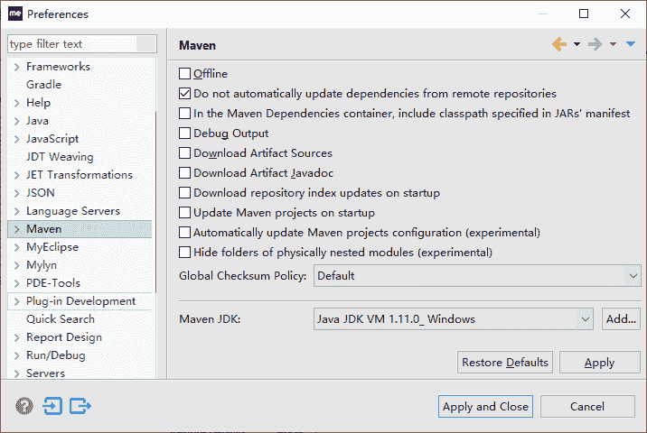
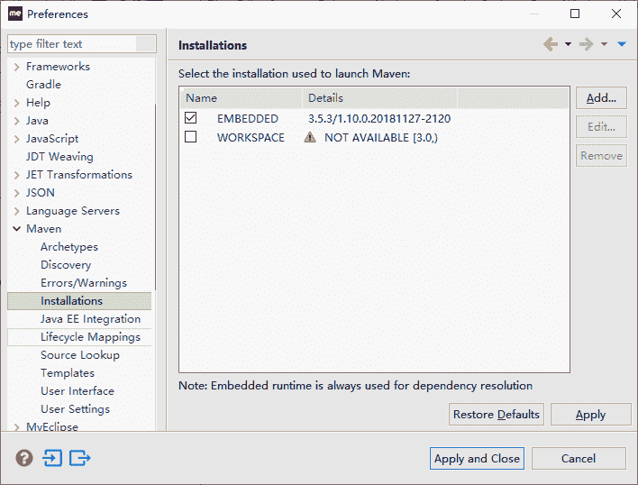
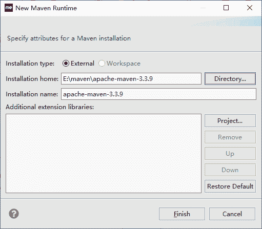
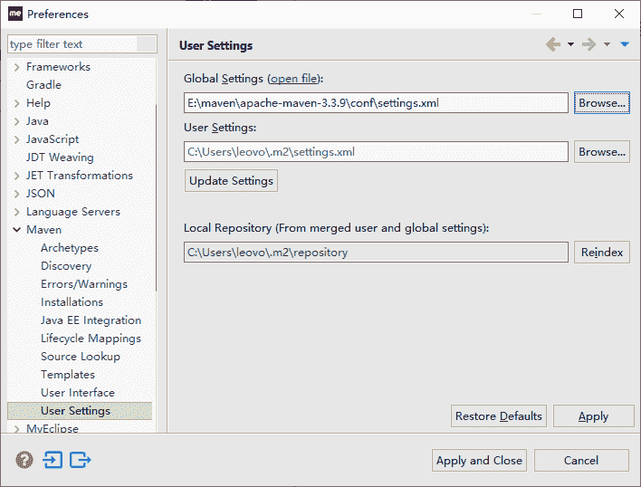
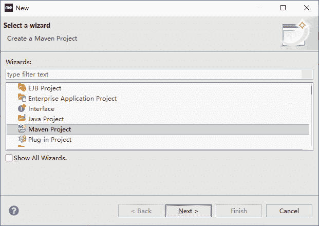
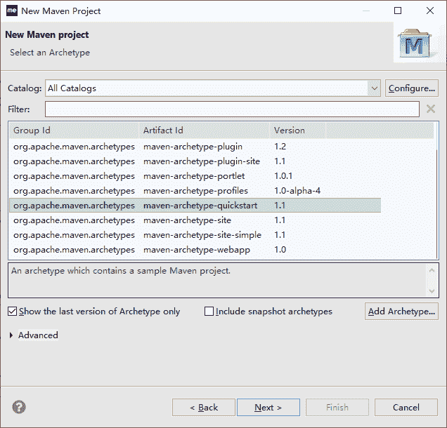
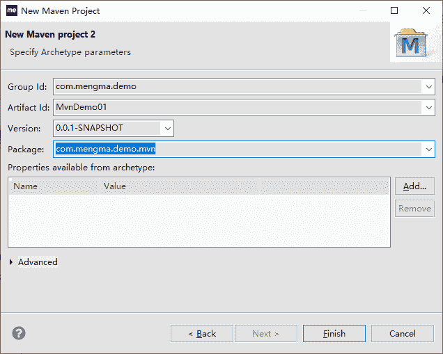
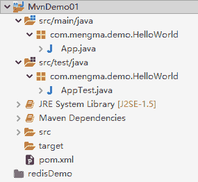

# 使用 MyEclipse 建立 maven 项目

> 原文：[`c.biancheng.net/view/4733.html`](http://c.biancheng.net/view/4733.html)

前面用手动方式写出了一个 HelloWorld，可是太麻烦。命令不好记。用 MyEclipse 编代码多好呀，哪里出现问题，哪里就提示错误；对于不记得的 API，也能随时提供帮助。

所以能不能将对 Maven 的操作同 MyEclipse 结合起来，在 MyEclipse 上用图形化界面和菜单式命令，协作完成对 Maven 的操作呢？

有需求就有市场，有市场就有人解决，而且 MyEclipse 本身就是一个开源工具，能很好地集成第三方的插件。

有了这些前提，M2Eclipse 就出来了。启动 MyEcplise，单击菜单栏中的 Window→Preferences 选项，打开 Preferences 窗口，如图 1 所示。

图 1  Preferences-Maven
该版本的 MyEclipse 里内置了 Maven，也就是 M2Eclipse 插件，就没必要再下载 M2Eclipse 插件，只要进行配置就可以使用 Maven 了。使用 MyEcplise 创建 Maven 步骤如下：

1）展开 Maven 选项，选中其中的 Installations，显示如图 2 所示。

图 2  Maven-Installations
右边显示的是当前 MyEclipse 内置的 Maven。为了整合前面安装的最新 Maven，继续下面的步骤。

2）单击图 2 右边的 Add 按钮，弹出 New Maven Runtime 窗口，选择安装的 Maven，如图 3 所示。

图 3  设置 Maven 安装 Home 目录
在 Installation home 后面选择以前安装的 Maven 目录，单击 Finish 按钮，回到 Preferences 窗口，并且选中刚添加的 Maven。保险起见，单击 Preferences 窗口中的 Apply 按钮，保存刚才的操作。

3）选中 Preferences 中 Maven 里面的 User Settings，如图 4 所示。

图 4  设置 Maven 用户环境
在 Global Settings 框中选择 settings.xml。在 User Settings 框中选择登录用户目录下的 settings.xml。一般会默认显示，如果不正常，请手动选择。

单击 Apply and close 按钮完成设置。

4）选择 MyEclipse 中的 File→New→Others 命令。

图 5  选择创建 Maven 工程
5）选择 Maven Project，单击 Next 按钮，打开 New Maven Project 窗口，继续单击 Next 按钮，出现如图 6 所示界面。

图 6  选择 Archetype
列表中显示的是当前常用的 Archetype 插件的 groupId、artifactId 和版本号。Archetype 插件是用来创建工程的。

选择 1.1 版本的 quickstart 插件，单击 Next 按钮，出现下一个窗口，如图 7 所示。在窗口中输入新创建工程的 groupId、artifactId、packageName，并选择版本。

图 7  Maven 工程坐标单击 Finish 按钮，创建一个新的 Maven 项目，如图 8 所示。

图 8  新建 Maven 结构
这样就可以分别在 src/main/java 中和 src/test/java 中添加自己的 Java 源代码和测试代码了。

这里直接将上次手动编写的 HelloWorld.java 和 TestHelloWorld.java 复制过来，同时把 pom.xml 中 JUnit 的版本改成 4.7（默认生成的是 3.8.1）。

到现在为止，MyEcplise 完成了 Maven 项目的创建和相关代码的编写工作。