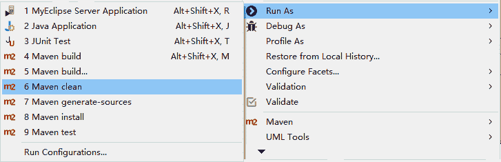
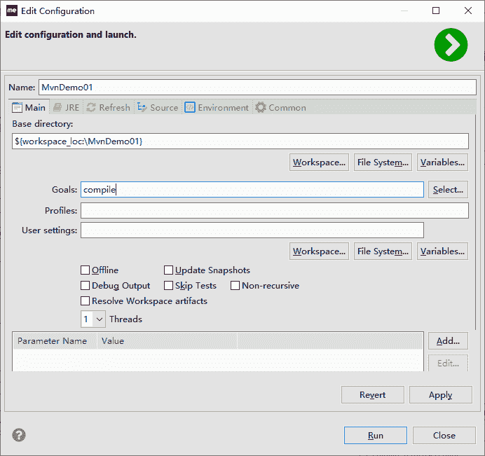

# 使用 MyEcplise 构建 Maven 项目

> 原文：[`c.biancheng.net/view/4739.html`](http://c.biancheng.net/view/4739.html)

现在工程创建好，相关的代码也写好了，接下来就是程序员的惯例：清理旧操作、编译源代码、运行测试案例、打包安装。

以前的操作是用 mvn clean→compile→test→install 命令实现的，现在在 MyEclipse 中，单击命令选项就行。

右击左边的“工程”，选择 Run As→Maven clean→test→install 命令，如图 1 所示，就可以完成该工程清理、测试和打包安装工作。

图 1  构建 Maven 项目
当然，这里面缺少一个编译（compile）的选项，不过这也是正常的。MyEclipse 一般都是自动编译的，而且在运行 test 之前，它都会把所有代码重新编译一遍。

如果一定要明确做编译的动作也是可以的。选择 Run As 后面的 Maven build… 命令（注意，是后面带“…”的命令），弹出如图 2 所示界面，在 Goals 后面的输入框中输入“compile”命令，单击 Run 按钮，就会执行编译操作。

图 2  Maven build…界面
到现在为止，项目构建相关的动作都做完了。这比以前手动使用 mvn 命令方便了很多。