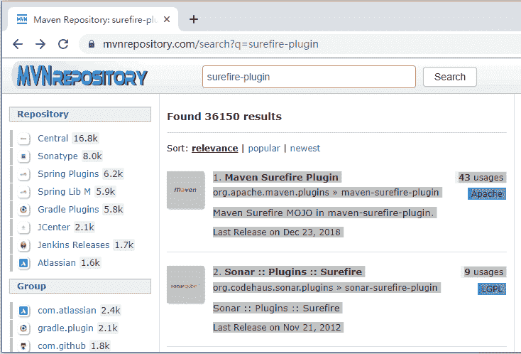
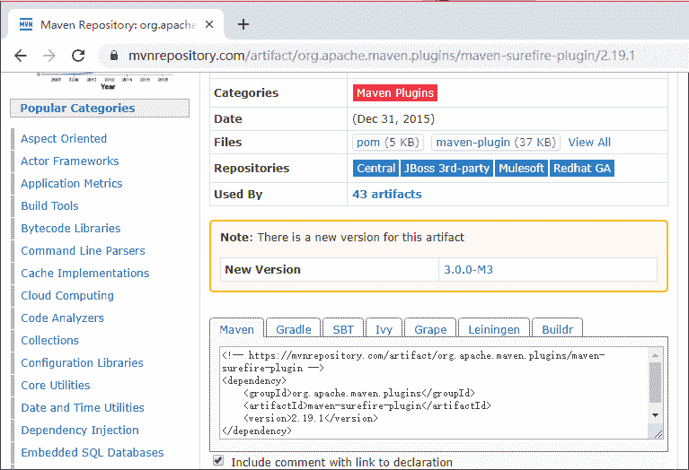

# Maven 基于 M2Eclipse 生成站点和报告

> 原文：[`c.biancheng.net/view/4740.html`](http://c.biancheng.net/view/4740.html)

前面介绍了基于 MyEclipse+M2Eclipse 完成工程的基本构建，接下来介绍怎样生成相关的文档和报告。

之前用的是 mvn 命令，后面指定插件的坐标（没有自定，mvn 自动找仓库中最新的）告知 mvn 做什么事。那么在 MyEclipse+M2Eclipse 环境下，是通过什么方式告诉 Maven 使用哪些插件做哪些事情呢？

靠的是 pom.xml 骨架文件。要做的就是在 pom.xml 文件中，按它的语法要求指定相关的插件坐标，Maven 在运行的时候，自动调用插件完成对应的任务。

这里要先了解一下常用的插件有哪些，以及怎样确定它们的坐标，这样才好在 pom.xml 中描述，如表 1 所示。

表 1 常用的插件

| 插件名称 | 用途 | 来源 |
| maven-clean-plugin | 清理项目 | Apache |
| maven-compile-plugin | 编译项目 | Apache |
| maven-deploy-pligin | 发布项目 | Apache |
| maven-site-plugin | 生成站点 | Apache |
| maven-surefire-plugin | 运行测试 | Apache |
| maven-jar-plugin | 构建 jar 项目 | Apache |
| maven-javadoc-plugin | 生成 javadoc 文件 | Apache |
| maven-surefire-report-plugin | 生成测试报告 | Apache |

接下来在工程里面体验运行测试、生成 javadoc、生成站点和测试报告插件的使用。

## 运行测试

在 Maven Repository（仓库）中找到 surefire 插件的坐标。

用浏览器打开 [`mvnrepository.com/`](http://mvnrepository.com/)，在 Search 输入框中输入“surefire-plugin”，单击 Search 按钮，如图 1 所示。


图 1  中央仓库查询 surefire 插件
单击 maven-surefire-plugin，查看它的所有版本信息。单击想使用的版本（这里使用 2.19.1），会显示该版本的 groupId、artifactId 等坐标信息，如图 2 所示。


图 2  surefire 插件的坐标页面
在 pom.xml 中添加 surefire 插件描述。

在 MyEclipse 中打开 pom.xml 文件，在 pom.xml 后面添加一个 build 标签，里面添加 surefire 插件的描述信息，具体内容如下所示，被粗体显示的为新添加的内容。

```

<project xmlns="http://maven.apache.org/POM/4.0.0"
    xmlns:xsi="http://www.w3.org/2001/XMLSchema-instance"
    xsi:schemaLocation="http://maven.apache.org/POM/4.0.0 http://maven.apache.org/xsd/maven-4.0.0.xsd">
    <modelVersion>4.0.0</modelVersion>

    <groupId>com.mengma.demo</groupId>
    <artifactId>HelloWorld</artifactId>
    <version>0.0.1-SNAPSHOT</version>
    <packaging>jar</packaging>

    <name>HelloWorld</name>
    <url>http://maven.apache.org</url>

    <properties>
        <project.build.sourceEncoding>UTF-8</project.build.sourceEncoding>
    </properties>

    <dependencies>
        <dependency>
            <groupId>junit</groupId>
            <artifactId>junit</artifactId>
            <version>4.7</version>
            <scope>test</scope>
        </dependency>
    </dependencies>
    <build>
        <plugins>
            <plugin>
                <groupId>org.apache.maven.plugins</groupId>
                <artifactId>maven-surefire-plugin</artifactId>
                <version>2.19.1</version>
                <configuration>
                    <!-- 设置包含的测试类 -->
                    <includes>
                        <include>****</include>
                    </includes>
                    <!-- 设置不进行测试类 -->
                    <excludes>
                        <exclude>Test *</exclude>
                    </excludes>
                    <!-- 跳过测试阶段，测试类写的有问题也会出错，一般不推荐 -->
                    <!-- <skip>true</skip> -->
                </configuration>
            </plugin>
        </plugins>
    </build>
</project>
```

上面内容 26-46 行就是 surefire-plugin 的描述。具体的描述方式和说明上面有注释。

启动 Maven，运行 test。

右击“工程”，选择 Run As→Maven test 命令，Maven 会自动启动插件进行编译和测试。如果是第一次运行测试，在控制台会发现如下下载信息，说明 Maven 将用到之前配置的 surefire-plugin 运行测试。

[INFO]---maven-surefire-plugin:2.19.1:test (default-test) @MvnBookTP02 ---
[INFO] Downloading: https://repo.maven.apache.org/maven2/org/apache/maven/
surefire/maven-surefire-common/2.19.1/maven-surefire-common-2.19.1.pom

## 生成 javadoc API 帮助文档

查找合适版本的坐标。

在 mvnrepository.com 中，类似查找 surefire-plugin 的方式，输入“javadoc-plugin”查询，找到自己需要的版本坐标信息。

将 javadoc-plugin 添加到 pom.xml。

在 pom.xml 的 plugins 标签之间添加如下内容。

```

<plugin>
    <groupId>org.apache.maven.plugins</groupId>
    <artifactId>maven-javadoc-plugin</artifactId>
    <version>2.7</version>
    <configuration>
        <aggregate>true</aggregate>
    </configuration>
    <executions>
        <execution>
            <id>attach-javadocs</id>
            <glals>
                <gola>jar</gola>
            </glals>
            <!-- 执行 maven test 的时候运行插件 -->
            <phase>test</phase>
        </execution>
    </executions>
</plugin>
```

这里面除了 javadoc-plugin 的坐标信息外，还有其他配置信息。中间被粗体显示的信息的意思是：当选择 Run As→Maven test 命令时，执行 javadoc 插件，生成 doc 帮助文档。

运行 javadoc-plugin 插件，查看 doc ap 文档。

右击“工程”，选择 Run As→Maven test 命令，Maven 会自动调用插件生成 API 文档。在工程的 target 目录下会自动产生一个 apidocs 目录，里面就是生成的 API 文档。

前面介绍了 2 个插件的坐标查找和配置方法，接下来是生成站点和测试报告。

## 生成站点

```

<!-- 构建项目站点报告插件 -->
<plugin>
    <groupId>org.apache.maven.plugins</groupId>
    <artifactId>maven-site-plugin</artifactId>
    <version>3.0-beta-3</version>
    <configuration>
        <!-- 配置站点国际化 -->
        <locales>zh_CN</locales>
        <!-- 输出编码 -->
        <outputEncoding>GBK</outputEncoding>
    </configuration>
</plugin>
```

## 测试报告

```

<!-- 单元测试报告 html -->
<plugin>
    <groupId>org.apache.maven.plugins</groupId>
    <artifactId>maven-surefire-report-plugin</artifactId>
    <version>2.12.2</version>
    <configuration>
        <showSuccess>true</showSuccess>
    </configuration>
    <executions>
        <execution>
            <id> test-report</id>
            <phase>test</phase>
        </execution>
    </executions>
</plugin>
<!--测试覆盖率的报告 -->
<plugin>
    <groupId>org.codehaus.mojo</groupId>
    <artifactId>cobertura-maven-plugin</artifactId>
    <version>2.5.1</version>
    <configuration>
        <formats>
            <format>html</format>
            <format>xml</format>
        </formats>
    </configuration>
    <executions>
        <execution>
            <id>cobertura-report</id>
            <goals>
                <goal>cobertura</goal>
            </goals>
            <phase>test</phase>
        </execution>
    </executions>
</plugin>
```