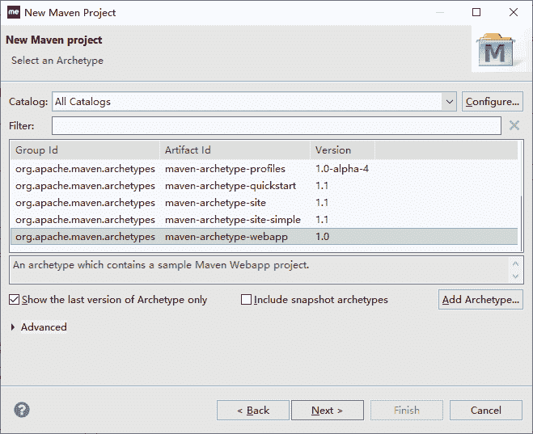
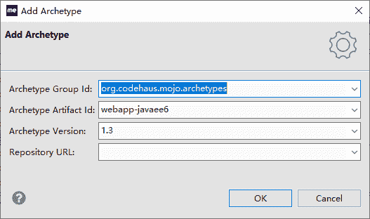
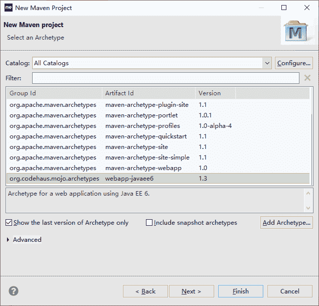
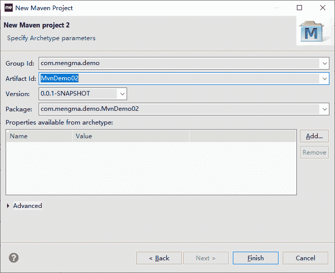
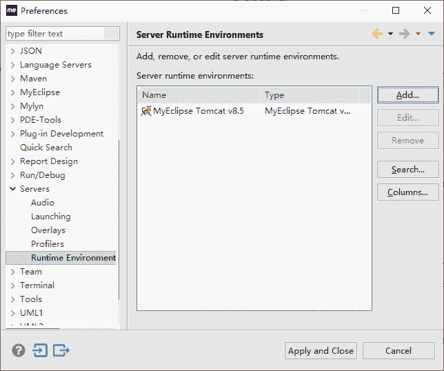
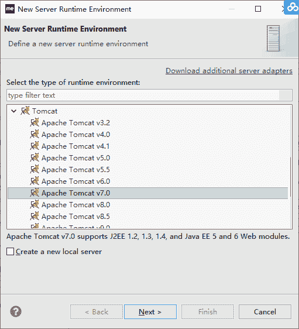
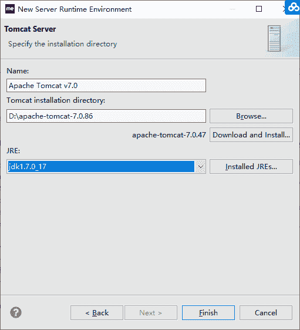
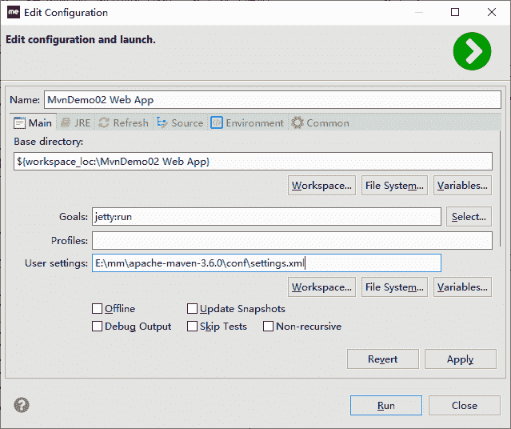

# 使用 Maven 开发 Web 应用详细步骤

> 原文：[`c.biancheng.net/view/4788.html`](http://c.biancheng.net/view/4788.html)

目前的 Java 程序员最常要面对的是 Java Web 应用。所以本节的主要内容针对的是最基本的 JSP/Servlet Web 应用。

## 开发 Web 应用的思路

一切还是以实际案例进行，不过分两步。

1\. 实现一个简单的 JSP/Servlet。

*   搭建创建 Web 应用工程的环境。
*   创建 Web 应用工程。
*   Web 应用工程的目录结构。
*   结合 Web 服务器，发布 Web 应用。
*   体验 Web 应用的开发和发布测试过程。

2\. 实现经典的 MVC 版本的用户 CRUD。

*   熟练第 1 步中的几个方面。
*   结合典型的业务逻辑，实现 CRUD。

## 实现 Web 版 HelloWorld

安装配置 Web 应用的 Archetype Catalog，按照前面创建普通 Java 工程的步骤。

1）选择 File→New→Others 命令。选择 Create Maven Project 命令，单击“下一步”按钮。选中创建 Web 应用工程的 Archetype，如图 1 所示。


图 1  选择 Web Archetype
也可以选择其他类似的，创建 Web 应用的都可以，比如 maven-archetype-webapp 也可以。当然，也可以选择从网上找到坐标后的 Archetype 插件，再安装进去。

怎么安装新的 Archetype 呢？单击图中的 Add Archetype… 按钮，在出现的窗口中输入在网上找到的插件坐标信息，如图 2 所示。


图 2  添加 Archetype
单击 OK 按钮，MyEclipse 会自动下载该构件。重新打开创建工程的向导页面，就可以发现新增了刚刚添加的 Archetype 插件，如图 3 所示。


图 3  选择 webapp-javaee6 Archetype
2）点击“next”，在下一个界面中输入新创建的 Web 工程的坐标信息和包名，如图 4 所示。


图 4  Maven 项目坐标
3）单击 Finish 按钮，M2Eclipse 会自动创建一个 Web 工程 MvnDemo02。其在 src/main 目录下添加了 webapp 目录，里面有 Web 应用特有的 WEB-INF 目录，web.xml 和 index.jsp 等。

其中，webapp 目录和里面的文件以及结构在 Maven 中也是固定的。这样就创建好了 Web 应用工程。

## 编写样例代码

工程创建好了，下一步就是写测试代码了。接下来会写 3 个代码（2 个 jsp 和 1 个 servlet）。

index.jsp，里面显示输入框，能提交输入的内容，代码如下所示：

```

<%@page contentType="text/html" pageEncoding="UTF-8"%>
<html>
    <head>
        <meta http-equiv="Content-Type" content="text/html; charset=UTF-8">
        <title>Index JSP</title>
    </head>
    <body>
        <form action="welcomeServlet" method="post">
           请输入问候人名:<input type='text' name="name"/><br/>
           <input type='submit' value='问候'/>
        </form>
    </body>
</html>
```

welcome.jsp，显示问候信息，代码如下所示：

```

<%@page contentType="text/html" pageEncoding="UTF-8"%>
<html>
    <head>
        <meta http-equiv="Content-Type" content="text/html; charset=UTF-8">
        <title>Welcome JSP</title>
    </head>
    <body>
        问候信息：${welcome }
    </body>
</html>
```

welcomeServlet，接收 index.jsp 发过来的名称，生成问候信息，转给 welcome.jsp 显示。

```

import java.io.IOException;
import javax.servlet.ServletException;
import javax.servlet.http.HttpServlet;
import javax.servlet.http.HttpServletRequest;
import javax.servlet.http.HttpServletResponse;

/**
* Servlet implementation class WelcomeServlet
*/
public class WelcomeServlet extends HttpServlet {
    private static final long serialVersionUID = 1L;

    /**
     * @see HttpServlet#service(HttpServletRequest request, HttpServletResponse
     *      response)
     */
    protected void service(HttpServletRequest request, HttpServletResponse response)
            throws ServletException, IOException {
        request.setCharacterEncoding("UTF-8");
        String name = request.getParameter("name");
        String welcome = "Hello," + name;
        request.setAttribute("welcome", welcome);
        request.getRequestDispatcher("/index.jsp").forward(request, response);
    }
}
```

当然，除了编写代码外，还需要配置 web.xml，servlet 的，web.xml 代码如下所示：

```

<?xml version="1.0" encoding="UTF-8"?>
<web-app xmlns:xsi="http://www.w3.org/2001/XMLSchema-instance"
    xmlns="http://java.sun.com/xml/ns/javaee"
    xsi:schemaLocation="http://java.sun.com/xml/ns/javaee
        http://java.sun.com/xml/ns/javaee/web-app_2_5.xsd"
    version="2.5">
    <display-name>MvnDemo02</display-name>
    <session-config>
        <session-timeout>30</session-timeout>
    </session-config>
    <welcome-file-list>
        <welcome-file>index.jsp</welcome-file>
    </welcome-file-list>
    <servlet>
        <description></description>
        <display-name>WelcomeServlet</display-name>
        <servlet-name>WelcomeServlet</servlet-name>
        <servlet-class>com.mengma.demo.MvnDemo02.WelcomeServlet</servlet-class>
    </servlet>
    <servlet-mapping>
        <servlet-name>WelcomeServlet</servlet-name>
        <url-pattern>/WelcomeServlet</url-pattern>
    </servlet-mapping>
</web-app>
```

## 构建 Web 项目

前期的构建过程同前面基本的 Java 工程一样，根据自己的需要，在 pom.xml 中配置好对应功能的插件，再运行对应的图形化菜单命令就可以了，在这里不做重复说明。

一个 Web 应用构建好后，不只是编译打包安装就可以了，还需要将它发布到 Web 服务器中进行测试调试才行。这里主要介绍两种发布到 Tomcat 7 服务器启动测试的方式。在项目开发过程中可以根据自己的需要，选择其中一种。

#### 1\. 使用 Maven 的 Jetty 插件部署 Web

在 pom.xml 中添加 Jetty 插件的坐标信息，内容如下：

```

<plugin>
    <groupId>org.mortbay.jetty</groupId>
    <artifactId>maven-jetty-plugin</artifactId>
    <version>6.1.26</version>
    <configuration>
        <webAppSourceDirectory>${basedir}/src/main/webapp</webAppSourceDirectory>
    </configuration>
</plugin>
```

在 MyEclipse 中配置 Web 服务器运行环境。

选择 MyEclipse 菜单 Window→Preferences 命令，打开 Preferences 窗口，选中左边树 Server→Runtime Environment，如图 5 所示。


图 5  MyEclipse 的 Web 服务器
单击右边的 Add… 按钮，弹出一个选择服务器的窗口。选中窗口中的 Apache Tomcat v 7.0 服务器，如图 6 所示。


图 6  添加 Tomcat 7.0
单击 Next 按钮，进入选择 Tomat Server 配置页面，选择 Tomcat 的安装目录和 JRE 运行环境（JDK），如图 7 所示。


图 7  添加 Tomcat 的 Java home
单击 Finish 和 Apply and Close 按钮，关闭所有配置窗口，完成 MyEclipse 中的 Web Server 配置。

右击“工程”，选择 Run As→Maven build 命令，打开自定义 launch 窗口，在 Goals 中输入启动的插件名和目标“jetty:run”，如图 8 所示。


图 8  运行 jetty
单击 Run 按钮运行一次后，以后每次都可以在 Run As→Maven build 命令中选择重复运行。

服务器启动了，接下来打开浏览器，输入：

http://localhost:8080/MvnDemo02/index.jsp

这样就可以访问第一个页面了。

#### 2\. 使用 cargo-maven2-plugin 插件部署 Web

使用 cargo 插件相对简单，只需在 pom.xml 中进行配置，指定部署应用所需要的信息，再运行 Run As→Maven install 命令，cargo 插件自动会把打成 war 包的应用，发布到指定 Web 服务器的发布目录下。

接下来要做的是启动 Web 服务器，按以前的方式打开浏览器浏览页面。

Gargo 在 pom.xml 中的插件配置如下所示。

```

<project xmlns="http://maven.apache.org/POM/4.0.0"
    xmlns:xsi="http://www.w3.org/2001/XMLSchema-instance"
    xsi:schemaLocation="http://maven.apache.org/POM/4.0.0
    http://maven.apache.org/xsd/maven-4.0.0.xsd">
    <modelVersion>4.0.0</modelVersion>

    <groupId>cn.com.mvnbook.demo</groupId>
    <artifactId>MvnDemo02</artifactId>
    <version>0.0.1-SNAPSHOT</version>
    <packaging>war</packaging>

    <name>MvnDemo02 Web App</name>

    <properties>
        <endorsed.dir>${project.build.directory}/endorsed</endorsed.dir>
        <project.build.sourceEncoding>UTF-8</project.build.sourceEncoding>
    </properties>

    <dependencies>
        <dependency>
            <groupId>javax</groupId>
            <artifactId>javaee-web-api</artifactId>
            <version>6.0</version>
            <scope>provided</scope>
        </dependency>

        <dependency>
            <groupId>junit</groupId>
            <artifactId>junit</artifactId>
            <version>4.8.1</version>
            <scope>test</scope>
        </dependency>
    </dependencies>

    <build>
        <plugins>
            <plugin>
                <groupId>org.mortbay.jetty</groupId>
                <artifactId>maven-jetty-plugin</artifactId>
                <version>6.1.26</version>
                <configuration>
                    <webAppSourceDirectory>${basedir}/src/main/webapp</webAppSourceDirectory>
                </configuration>
            </plugin>
            <plugin>
                <!-- 指定插件名称及版本号 -->
                <groupId>org.codehaus.cargo</groupId>
                <artifactId>cargo-maven2-plugin</artifactId>
                <version>1.4.8</version>
                <configuration>
                    <!--是否说明，操作 start、stop 等后续操作必须等前面操作完成才能继续 -->
                    <wait>true</wait>
                    <!-- 容器的配置 -->
                    <container>
                        <!-- 指定 tomcat 版本 -->
                        <containerId>tomcat7x</containerId>
                        <!-- 指定类型：standalone, installed 等 -->
                        <type>installed</type>
                        <!-- 指定 Tomcat 的位置，即 catalina.home -->
                        <home>C:\work\servers\apache-tomcat-7.0.69</home>
                    </container>
                    <!-- 具体的配置 -->
                    <configuration>
                        <!-- 类型，existing:存在 -->
                        <type>existing</type>
                        <!-- Tomcat 的位置，即 catalina.home -->
                        <home>C:\work\servers\apache-tomcat-7.0.69</home>
                    </configuration>
                    <deployables>    <!-- 部署设置 -->
                        <deployable>    <!-- 部署的 War 包名等 -->
                            <groupId>cn.com.mvnbook.demo</groupId>
                            <artifactId>MvnDemo02</artifactId>
                            <type>war</type>
                            <properties>
                                <context>MvnDemo02</context>   <!-- 部署路径 -->
                            </properties>
                        </deployable>
                    </deployables>
                    <deployer>        <!-- 部署配置 -->
                        <type>installed</type>        <!-- 类型 -->
                    </deployer>
                </configuration>
                <executions>
                    <!-- 执行的动作 -->
                    <execution>
                        <id>verify-deployer</id>
                        <phase>install</phase>      <!-- 解析 install -->
                        <goals>
                            <goal>deployer-deploy</goal>
                        </goals>
                    </execution>
                    <execution>
                        <id>clean-deployer</id>
                        <phase>clean</phase>
                        <goals>
                            <goal>deployer-undeploy</goal>
                        </goals>
                    </execution>
                </executions>
            </plugin>

            <plugin>
                <groupId>org.apache.maven.plugins</groupId>
                <artifactId>maven-compiler-plugin</artifactId>
                <version>2.3.2</version>
                <configuration>
                    <source>1.6</source>
                    <target>1.6</target>
                    <compilerArguments>
                        <endorseddirs>${endorsed.dir}</endorseddirs>
                    </compilerArguments>
                </configuration>
            </plugin>
            <plugin>
                <groupId>org.apache.maven.plugins</groupId>
                <artifactId>maven-war-plugin</artifactId>
                <version>2.1</version>
                <configuration>
                    <failOnMissingWebXml>false</failOnMissingWebXml>
                </configuration>
            </plugin>
            <plugin>
                <groupId>org.apache.maven.plugins</groupId>
                <artifactId>maven-dependency-plugin</artifactId>
                <version>2.1</version>
                <executions>
                    <execution>
                        <phase>validate</phase>
                        <goals>
                            <goal>copy</goal>
                        </goals>
                        <configuration>
                            <outputDirectory>${endorsed.dir}</outputDirectory>
                            <silent>true</silent>
                            <artifactItems>
                                <artifactItem>
                                    <groupId>javax</groupId>
                                    <artifactId>javaee-endorsed-api</artifactId>
                                    <version>6.0</version>
                                    <type>jar</type>
                                </artifactItem>
                            </artifactItems>
                        </configuration>
                    </execution>
                </executions>
            </plugin>
        </plugins>
        <finalName>MvnDemo02</finalName>
    </build>
</project>
```

右击“工程”，选择 Run As→Maven install 命令后，就可以在 Tomcat 7 的发布目录下发现 MvnDemo02.war，启动后它就能自动发布并且能被访问。

## 测试

不管前面哪种方式，启动服务器后，打开浏览器，输入 http://localhost:8080/MvnDemo02/index.jsp 链接后，就可以进行测试了。