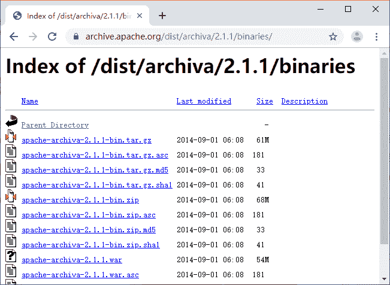
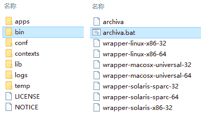
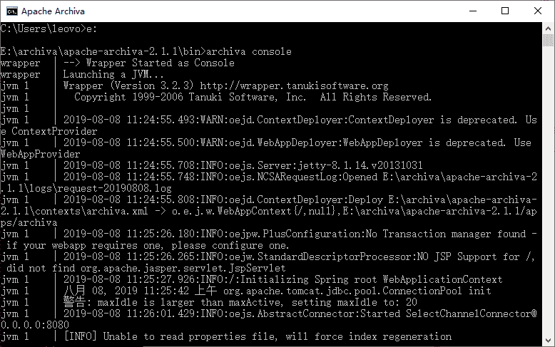
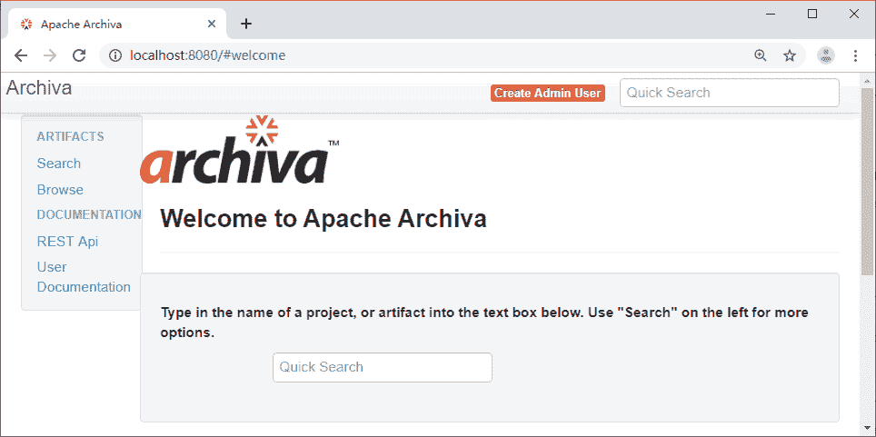
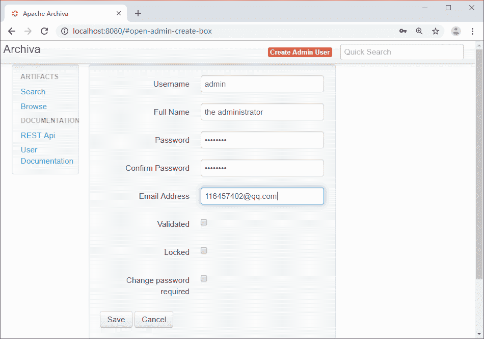
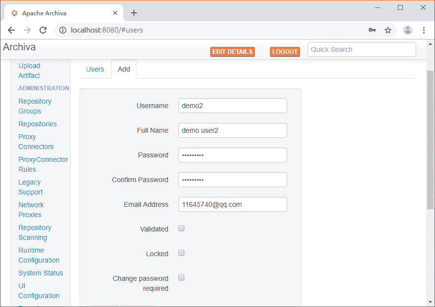
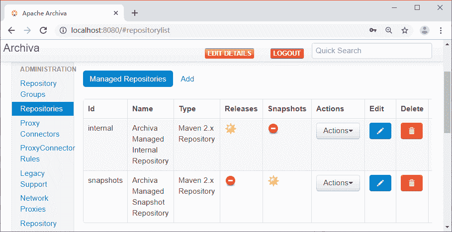
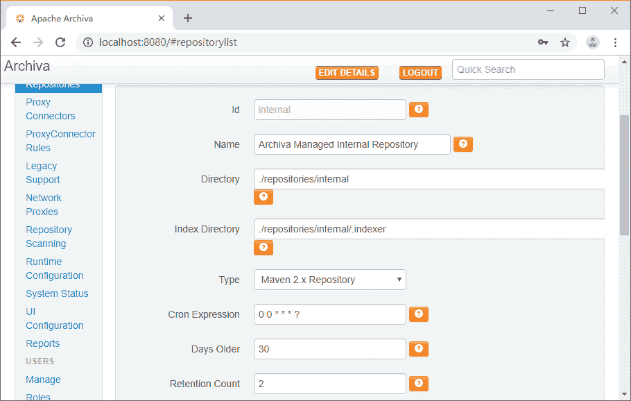
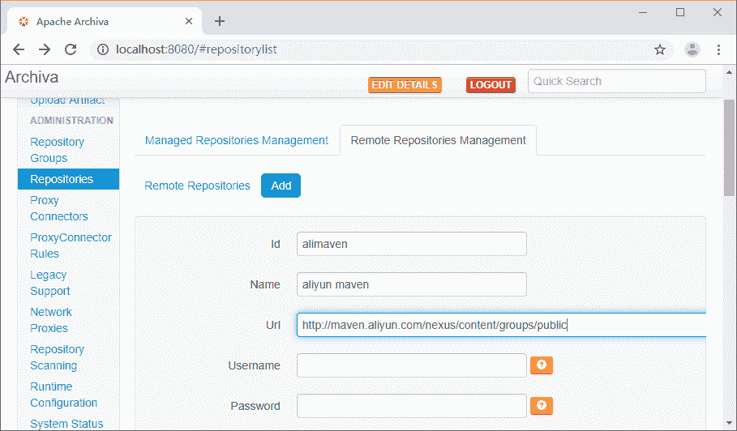
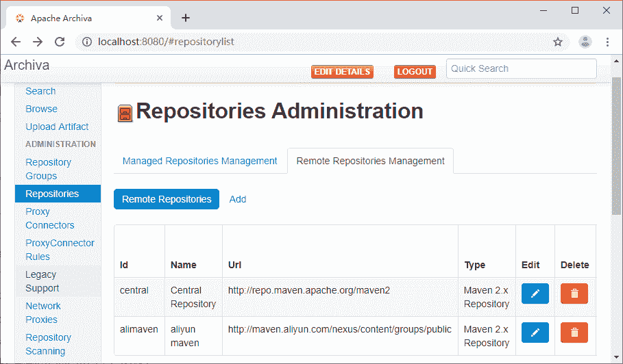

# Apache 基金会的 Archiva 服务器的搭建步骤

> 原文：[`c.biancheng.net/view/4864.html`](http://c.biancheng.net/view/4864.html)

在以前的案例开发过程中，曾强烈要求同外网保存连接，为什么呢？

因为一旦开发需要的依赖在本地环境中不存在，Maven 会自动到网上的资源仓库中查找，并且下载。基于这种情况，需要在公司搭建一台服务器。程序员需要构件时，先看本地有没有，若是没有，再找公司服务器要，公司服务器要是没有，再从外网下载。

下载后，先在公司服务器保存，再在程序员本地计算机保存。这样就可以在公司内网重复使用下载的构件，从而减少对外网的依赖。

目前常用的搭建 Maven 私服的服务器有 3 台：Apache 基金会的 Archiva、JFrog 的 Artifactory 和 Sonatype 的 Nexus。

作为刚入门的初学者，就不要考虑它们有什么区别了。接下来介绍 Apache 基金会的 Archiva 服务器的搭建方法。

Apache 基金会的 Archiva 服务器的搭建步骤如下：

#### 1. 下载 Archiva

下载链接 [`archiva.apache.org/download.cgi`](http://archiva.apache.org/download.cgi)，下载页面如下所示。

图 1  下载页面
 有三种内容下载：一个是 tar.gz 包；另一个是 war 包；还有一个是 source 源代码。这里下载的是 tar.gz 包：apache-archiva-2.2.1-bin.tar.gz。该版本里面包含自己的 Web 服务器，直接解压，作为独立 Web 服务器启动。

#### 2. 启动服务器

用压缩工具解压压缩文件，结果如图 2 所示。

图 2  Archiva 目录结构
bin 目录下有个 archiva.bat 文件，该文件是在 Windows 操作系统下的服务启动程序。

安装配置好 JDK（1.7 以上）。打开 CMD 窗口，切换到 archiva.bat 所在的目录，输入`archiva console`命令，按 Enter 键启动 Archiva 服务器，如图 3 所示。

图 3  Archiva 服务器启动提示
最后显示当前的 Web 请求端口是 8080。

#### 3. 初始化和配置 Archiva 服务器

在浏览器中输入 http://localhost:8080，打开页面，如图 4 所示

图 4  Archiva 首页
单击右上角的 Create Admin User 按钮，在显示的页面上输入管理员的用户名和密码，单击 Save 按钮创建，如图 5 所示。

图 5  创建 Admin 用户
选择页面左边的 Manage，单击 Add 按钮，在输入框中输入要添加的用户信息，如图 6 所示。单击 Save 按钮，创建一个新的用户。根据项目团队的需要，可以给每个开发人员创建访问私服的用户名和密码。

图 6  添加普通用户
选择页面左边的 Repositories 菜单，页面会显示本地仓库和远程仓库的配置，如图 7 所示。

图 7  管理仓库
单击图 7 上的 Add 按钮，添加一个本地仓库位置，具体填写的信息，参考已有的配置就行。当然，也可以修改现在有的，比如 Id 为 internal 的本地仓库，单击 Edit 图标，会显示如图 8 所示界面。

图 8  修改本地仓库
Id 在开发人员客户端进行配置的时候需要使用，Directory 是仓库保存构件的路径。

Archiva 安装好后，有个默认的远程仓库，链接是 [`repo.maven.apache.org/maven2`](https://repo.maven.apache.org/maven2)。当然也可以去发现其他的远程仓库，再配置到私服里面来。需要的时候，Archiva 会自动从这些私服中寻找需要的构件。比如现在配置一个阿里云的远程仓库。

单击当前页面中 Remote Repositories Management 的 Add 按钮，输入阿里云仓库的信息，如图 9 所示。

图 9  添加远程仓库
后面还有几个输入框，这里介绍关键信息。

*   Id 可以随便输入，输入后不能再修改，需要唯一。
*   Name 是名称，随意输入。
*   Url 是远程仓库的链接。
*   Username 和 Password 是链接远程仓库的用户名和密码，有些仓库提供共享访问，比如现在配置的就不需要输入，否则要获得用户名和密码才行。

单击 Save 按钮，出现如图 10 所示界面，其中就有刚刚添加上去的 alimaven。

图 10  仓库显示页面
由于篇幅有限，请点击《Maven 私服的配置和使用》教程继续阅读。