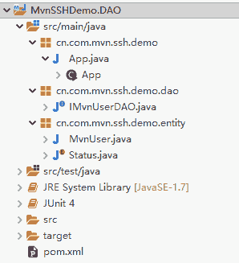
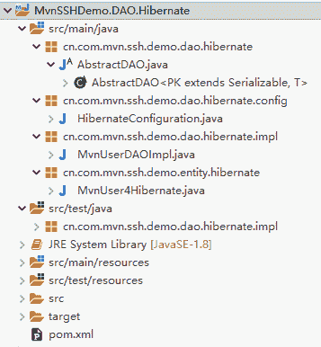
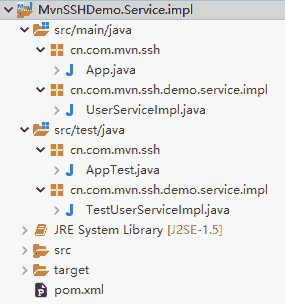

# Maven 搭建 SSH（Struts2+Spring+Hibernate）框架入门教程（附带实例）

> 原文：[`c.biancheng.net/view/4891.html`](http://c.biancheng.net/view/4891.html)

前面介绍了基于 Archiva 的私服搭建工作，现在全项目组就可以在私服下共用 Maven 开发环境了。

接下来在 Maven 环境下，基于 Struts2+Spring4.2+Hibernate4.1 框架，体验 Web 应用的开发过程。

为了展现 Maven 开发的优势，将按如下步骤进行。

1.  创建三个 POM 工程，定义好 Hibernate、Spring 和 Struts 的基本依赖。
2.  创建 Service 和 DAO 层的接口模块。
3.  创建 Service 和 DAO 层的实现模块。
4.  创建基于 Struts 的 Web 模块。
5.  整合前面的所有模块，形成一个完整的 SSH 项目。
6.  完善相关的文档插件的配置，进行安装和测试。

## 创建公共 POM 模块

#### 1\. 创建 Hibernate 的公共 POM 模块

基于 MyEclipse 的 maven-archetype-quickstart 创建 Maven 工程（同前面创建基本的 Maven 工程一样）。因为用的是公共 POM 模块，这里不需要写代码，只需将 Hibernate 和相关的依赖配置在 pom.xml 中，并且在 pom.xml 中将 packaging 方式设置成 pom，表示是一个公共的父 pom。代码如下：

```

<project xmlns="http://maven.apache.org/POM/4.0.0"
    xmlns:xsi="http://www.w3.org/2001/XMLSchema-instance"
    xsi:schemaLocation="http://maven.apache.org/POM/4.0.0 http://maven.apache.org/xsd/maven-4.0.0.xsd">
    <modelVersion>4.0.0</modelVersion>

    <groupId>cn.com.mvn.ssh.pom</groupId>
    <artifactId>Hibernate4MySQLPOM</artifactId>
    <version>0.0.1-SNAPSHOT</version>
    <packaging>pom</packaging>

    <name>Hibernate4MySQLPOM</name>
    <url>http://maven.apache.org</url>
    <properties>
        <project.build.sourceEncoding>UTF-8</project.build.sourceEncoding>
    </properties>
    <dependencies>
        <dependency>
            <groupId>junit</groupId>
            <artifactId>junit</artifactId>
            <version>4.7</version>
            <scope>test</scope>
        </dependency>
        <!--hibernate -->
        <dependency>
            <groupId>org.hibernate</groupId>
            <artifactId>hibernate-core</artifactId>
            <version>${project.build.hibernate.version}</version>
        </dependency>
        <dependency>
            <groupId>org.hibernate</groupId>
            <artifactId>hibernate-ehcache</artifactId>
            <version>${project.build.hibernate.version}</version>
        </dependency>
        <dependency>
            <groupId>org.hibernate.javax.persistence</groupId>
            <artifactId>hibernate-jpa-2.0-api</artifactId>
            <version>1.0.0.Final</version>
        </dependency>
        <dependency>
            <groupId>mysql</groupId>
            <artifactId>mysql-connector-java</artifactId>
            <version>5.1.34</version>
        </dependency>
    </dependencies>
    <distributionManagement>
        <repository>
            <id>archivaServer</id>
            <url>http://localhost:8080/repository/internal</url>
        </repository>
        <snapshotRepository>
            <id>archivaServer</id>
            <url>http://localhost:8080/repository/snapshots</url>
        </snapshotRepository>
    </distributionManagement>
</project>
```

注意 pom.xml 中的第 9 行，＜packaging＞pom＜/packaging＞表示当前的 pom 是一个独立的 pom 父模块，可以独立安装到仓库中，被其他工程继承使用。

同时注意最后的 distributionManagement 配置，该配置可以让工程以构件的形式发布到指定的私服。

右击“工程”，选择 Run As→Maven install 命令，就可以把当前 pom 安装到前面搭建好 Archiva 私服。安装后，可以在 Archiva 管理界面的 Browse 导航页中，看到 Hibernate4MySQLPOM 构件。

#### 2\. 创建 Spring 的公共 POM 模块

同前面 Hibernate 的 POM 创建一样，可以创建基于 Spring 的 POM 公共构件模块。具体工程创建就不演示了，直接复制到 pom.xml 中。

```

<project xmlns="http://maven.apache.org/POM/4.0.0"
    xmlns:xsi="http://www.w3.org/2001/XMLSchema-instance"
    xsi:schemaLocation="http://maven.apache.org/POM/4.0.0 http://maven.apache.org/xsd/maven-4.0.0.xsd">
    <modelVersion>4.0.0</modelVersion>

    <groupId>cn.com.mvn.pom</groupId>
    <artifactId>SpringPOM</artifactId>
    <version>0.0.1-SNAPSHOT</version>
    <packaging>pom</packaging>

    <name>SpringPOM</name>
    <url>http://maven.apache.org</url>

    <properties>
        <project.build.sourceEncoding>UTF-8</project.build.sourceEncoding>
        <!-- 3.2.16.RELEASE,3.1.4.RELEASE -->
        <project.build.spring.version>4.2.7.RELEASE
        </project.build.spring.version>
    </properties>

    <dependencies>
        <dependency>
            <groupId>junit</groupId>
            <artifactId>junit</artifactId>
            <version>4.7</version>
            <scope>test</scope>
        </dependency>
        <!-- spring -->
        <dependency>
            <groupId>org.springframework</groupId>
            <artifactId>spring-core</artifactId>
            <version>${project.build.spring.version}</version>
        </dependency>

        <dependency>
            <groupId>org.springframework</groupId>
            <artifactId>spring-aop</artifactId>
            <version>${project.build.spring.version}</version>
        </dependency>
        <dependency>
            <groupId>org.springframework</groupId>
            <artifactId>spring-beans</artifactId>
            <version>${project.build.spring.version}</version>
        </dependency>
        <dependency>
            <groupId>org.springframework</groupId>
            <artifactId>spring-context</artifactId>
            <version>${project.build.spring.version}</version>
        </dependency>
        <dependency>
            <groupId>org.springframework</groupId>
            <artifactId>spring-context-support</artifactId>
            <version>${project.build.spring.version}</version>
        </dependency>
        <dependency>
            <groupId>org.springframework</groupId>
            <artifactId>spring-web</artifactId>
            <version>${project.build.spring.version}</version>
        </dependency>
        <dependency>
            <groupId>org.springframework</groupId>
            <artifactId>spring-webmvc</artifactId>
            <version>${project.build.spring.version}</version>
        </dependency>
        <!-- https://mvnrepository.com/artifact/org.springframework/spring-aspects -->
        <dependency>
            <groupId>org.springframework</groupId>
            <artifactId>spring-aspects</artifactId>
            <version>${project.build.spring.version}</version>
        </dependency>
        <dependency>
            <groupId>org.springframework</groupId>
            <artifactId>spring-orm</artifactId>
            <version>${project.build.spring.version}</version>
        </dependency>
        <dependency>
            <groupId>org.hibernate</groupId>
            <artifactId>hibernate-validator</artifactId>
            <version>5.0.0.Final</version>
        </dependency>
    </dependencies>
    <distributionManagement>
        <repository>
            <id>archivaServer</id>
            <url>http://localhost:8080/repository/internal</url>
        </repository>
        <snapshotRepository>
            <id>archivaServer</id>
            <url>http://localhost:8080/repository/snapshots</url>
        </snapshotRepository>
    </distributionManagement>
</project>
```

同样注意粗体提示部分。右击“工程”，选择 Run As→Maven install 命令，安装 POM 构件。

#### 3\. 创建 Struts 的公共 POM 模块

重复前面的流程，直接复制 pom.xml 代码和安装 pom 后的管理界面。需要注意，在 pom.xml 中，除了 Struts 的依赖之外，还有 jsp/servlet 的依赖和 Struts 同 Spring 集成的插件依赖。

pom.xml 内容如下：

```

<project xmlns="http://maven.apache.org/POM/4.0.0"
    xmlns:xsi="http://www.w3.org/2001/XMLSchema-instance"
    xsi:schemaLocation="http://maven.apache.org/POM/4.0.0 http://maven.apache.org/xsd/maven-4.0.0.xsd">
    <modelVersion>4.0.0</modelVersion>

    <groupId>cn.com.mvn.pom</groupId>
    <artifactId>StrutsPOM</artifactId>
    <version>0.0.1-SNAPSHOT</version>
    <packaging>pom</packaging>

    <name>StrutsPOM</name>
    <url>http://maven.apache.org</url>

    <properties>
        <project.build.sourceEncoding>UTF-8</project.build.sourceEncoding>
    </properties>

    <dependencies>
        <!-- jsp servlet -->
        <dependency>
            <groupId>javax.servlet</groupId>
            <artifactId>servlet-api</artifactId>
            <version>2.5</version>
            <scope>provided</scope>
        </dependency>
        <dependency>
            <groupId>javax.servlet.jsp</groupId>
            <artifactId>jsp-api</artifactId>
            <version>2.1</version>
            <scope>provided</scope>
        </dependency>
        <dependency>
            <groupId>javax.servlet</groupId>
            <artifactId>jstl</artifactId>
            <version>1.2</version>
        </dependency>
        <!-- struts2 -->
        <!-- https://mvnrepository.com/artifact/org.apache.struts/struts2-core -->
        <dependency>
            <groupId>org.apache.struts</groupId>
            <artifactId>struts2-core</artifactId>
            <version>2.3.16</version>
        </dependency>
        <!-- https://mvnrepository.com/artifact/org.apache.struts/struts2-spring-plugin -->

        <dependency>
            <groupId>org.apache.struts</groupId>
            <artifactId>struts2-spring-plugin</artifactId>
            <version>2.3.4.1</version>
        </dependency>
        <dependency>
            <groupId>junit</groupId>
            <artifactId>junit</artifactId>
            <version>4.7</version>
            <scope>test</scope>
        </dependency>
    </dependencies>
    <distributionManagement>
        <repository>
            <id>archivaServer</id>
            <url>http://localhost:8080/repository/internal</url>
        </repository>
        <snapshotRepository>
            <id>archivaServer</id>
            <url>http://localhost:8080/repository/snapshots</url>
        </snapshotRepository>
    </distributionManagement>
</project>
```

## 实现 Hibernate DAO 模块

在实际项目中，一般会使用面向接口编程，从而实现调用者和被调用者的完全解耦，方便项目的团队开发和后期的扩展。鉴于这样的考虑，Hibernate 持久层的实现分两步进行：第 1 步定义公共 DAO 接口和类；第 2 步基于 Hibernate 完成 DAO 接口的实现。详细介绍如下。

#### 1\. 定义公共 DAO 接口和类

创建一个普通的 Maven 工程：MvnSSHDemo.DAO。目录结构如图 1 所示。


图 1  DAO 项目结构
pom.xml 内容如下：

```

<project xmlns="http://maven.apache.org/POM/4.0.0"
    xmlns:xsi="http://www.w3.org/2001/XMLSchema-instance"
    xsi:schemaLocation="http://maven.apache.org/POM/4.0.0 http://maven.apache.org/xsd/maven-4.0.0.xsd">
    <modelVersion>4.0.0</modelVersion>

    <groupId>cn.com.mvn.ssh.demo</groupId>
    <artifactId>MvnSSHDemo.DAO</artifactId>
    <version>0.0.1-SNAPSHOT</version>
    <packaging>jar</packaging>

    <name>MvnSSHDemo.DAO</name>
    <url>http://maven.apache.org</url>

    <properties>
        <project.build.sourceEncoding>UTF-8</project.build.sourceEncoding>
    </properties>

    <dependencies>
        <dependency>
            <groupId>junit</groupId>
            <artifactId>junit</artifactId>
            <version>4.7</version>
            <scope>test</scope>
        </dependency>
    </dependencies>
    <distributionManagement>
        <repository>
            <id>archivaServer</id>
            <url>http://localhost:8080/repository/internal</url>
        </repository>
        <snapshotRepository>
            <id>archivaServer</id>
            <url>http://localhost:8080/repository/snapshots</url>
        </snapshotRepository>
    </distributionManagement>
</project>
```

这里有两类代码：一类是实体类（MvnUser），另一类是实体 DAO 接口（IMvnUserDAO）。因为 MvnUser 里面有个状态（status）属性，定义了一个枚举状态类（Status）。具体内容如下。

1）Status.java 代码如下所示：

```

package cn.com.mvn.ssh.demo.entity;

public enum Status {
    ACTIVE("Active"), INACTIVE("Inactive"), DELETED("Deleted"), LOCKED("Locked");

    private String status;

    private Status(final String status) {
        this.status = status;
    }

    public String getStatus() {
        return status;
    }

    public void setStatus(String status) {
        this.status = status;
    }

    public String toString() {
        return this.status;
    }
}
```

2）MvnUser.java 如下所示：

```

package cn.com.mvn.ssh.demo.entity;

public class MvnUser {
    private int urId;
    private String urUserName;
    private String urPassword;
    private int urAge;
    private String urStatus = Status.ACTIVE.getStatus();// Active

    public int getUrId() {
        return urId;
    }

    public void setUrId(int urId) {
        this.urId = urId;
    }

    public String getUrUserName() {
        return urUserName;
    }

    public void setUrUserName(String urUserName) {
        this.urUserName = urUserName;
    }

    public String getUrPassword() {
        return urPassword;
    }

    public void setUrPassword(String urPassword) {
        this.urPassword = urPassword;
    }

    public int getUrAge() {
        return urAge;
    }

    public void setUrAge(int urAge) {
        this.urAge = urAge;
    }

    public String getUrStatus() {
        return urStatus;
    }

    public void setUrStatus(String urStatus) {
        this.urStatus = urStatus;
    }
}
```

3）IMvnUserDAO.java 代码如下所示：

```

package cn.com.mvn.ssh.demo.dao;

import java.util.List;
import cn.com.mvn.ssh.demo.entity.MvnUser;

/**
* MvnUser 实体对象的持久层代码，封装了对 MvnUser 实体对象的 CRUD 方法
*
* @author Noble
* @version 1.0
*/
public interface IMvnUserDAO {
    /**
     * 在数据库中，添加一个新的 MvnUser 对象
     *
     * @param user 需要添加的用户实体对象，该对象需要有用户名、密码、年龄和状态属性
     *
     * @return void
     * @throws RuntimeException 添加失败或出现其它意外
     */
    public void addUser(MvnUser user);

    /**
     * 更新 MvnUser 对象。该对象中需要设置年龄、状态和 id 属性，属性和状态是要更新的新值，id 为条件
     *
     * @param user 需要更新的 MvnUser 对象
     *
     * @return void
     * @throws RuntimeException 更新失败或出现其它意外
     */
    public void update(MvnUser user);

    /**
     * 删除 MvnUser 对象，该对象中需要有要删除对象的 id 属性，id 属性为删除条件
     *
     * @param user 要删除的 MvnUser 对象
     *
     * @return void
     * @throws RuntimeException 删除失败或出现其它意外
     */
    public void deleteUser(MvnUser user);

    /**
     * 根据 id 查询对应的 MvnUser 对象
     *
     * @param id 要查询的 MvnUser 对象的 id
     * @return MvnUser id 对应的 MvnUser 对象，如果没有对象，返回 null
     * @throws RuntimeException 出现意外情况
     */
    public MvnUser findUserById(int id);

    /**
     * 根据用户名查询对应的 MvnUser 对象
     *
     * @param userName 要查询的 MvnUser 对象的用户名
     * @return MvnUser 用户对应的 MvnUser 对象，如果没有对象，返回 null
     * @throws RuntimeException 出现意外情况
     */
    public MvnUser findUserByUserName(String userName);

    /**
     * 查找数据库中所有的用户对象，以 List 集合的形式返回
     *
     * @return List<MvnUser> 所有用户对象的集合
     * @throws RuntimeException 出现意外情况
     */
    public List<MvnUser> findUsers();
}
```

右击“工程”，选择 Run As→Maven install 命令，MyEclipse 会自动将工程代码编译打包。如果没有错误，最后会以构件的形式安装在本地仓库中。结果如图 5 所示。

为了方便公司其他开发人员使用，接下来将该项目以构件的形式发布到前面搭建好的私服。为了使发布成功，请按前面的私服介绍搭建并启动私服，同时在当前工程的 pom.xml 中，添加 distributionManagement 配置，详细参考前面的 pom.xml。具体操作和效果图如下所示。

右击“工程”，选择 Run As→Maven build… 命令。

在 Goals 中输入 deploy，单击 Run 按钮。

#### 2\. 基于 Hibernate 完成 DAO 接口的实现

团队商量确定好接口，接下来就是对接口的实现和基于接口上的开发工作了。因为有共同的接口，所以这两个工作可以同步进行。这种现象同计算机配件一样（硬盘、内存、CPU、显卡等），事先定义好标准（插口），不同厂商就可以按同样的标准各自生产，然后顺利组装在一起，不用管是哪个厂家、在哪里、用哪条流水线生产的。

接下来介绍 DAO 接口的实现，分以下 4 步进行。

#### 1）创建工程，添加相关依赖

这个步骤比较简单，创建工程的方式同以前一样，具体创建过程不重复，项目结构如图 2 所示。


图 2  Hibernate DAO 项目结构注意如下：

① 因为前面创建了公共的 Hibernate POM 工程，里面有描述好了 Hibernate 相关的依赖（目的是让所有开发人员重用，不再重复编写），并且以构件的形式安装发布好了。这里要体现的是怎样继承前面定义好的 pom。

② 同样地，因为新工程里面要实现 MvnSSHDemo.DAO 中定义的接口，并且用到里面定义的公共类，而且根据前面的介绍，MvnSSHDemo.DAO，也以构件的形式安装发布到私服中了。在这里，要介绍一下怎样在自己的工程里面设置团队内部发布的构件。

这两点注意事项主要体现在 pom.xml 中，pom.xml 内容如下：

```

<?xml version="1.0" encoding="UTF-8"?>
<project
    xsi:schemaLocation="http://maven.apache.org/POM/4.0.0 http://maven.apache.org/xsd/maven-4.0.0.xsd"
    xmlns="http://maven.apache.org/POM/4.0.0"
    xmlns:xsi="http://www.w3.org/2001/XMLSchema-instance">
    <modelVersion>4.0.0</modelVersion>
    <parent>
        <groupId>cn.com.mvn.pom</groupId>
        <artifactId>Hibernate4MySQLPOM</artifactId>
        <version>0.0.1-SNAPSHOT</version>
    </parent>
    <groupId>cn.com.mvn.ssh.demo.dao.hibernate</groupId>
    <artifactId>MvnSSHDemo.DAO.Hibernate</artifactId>
    <name>MvnSSHDemo.DAO.Hibernate</name>
    <url>http://maven.apache.org</url>
    <properties>
        <project.build.sourceEncoding>UTF-8</project.build.sourceEncoding>
    </properties>
    <dependencies>
        <dependency>
            <groupId>cn.com.mvn.ssh.demo</groupId>
            <artifactId>MvnSSHDemo.DAO</artifactId>
            <version>0.0.1-SNAPSHOT</version>
        </dependency>
        <dependency>
            <groupId>cn.com.mvn.pom</groupId>
            <artifactId>SpringPOM</artifactId>
            <version>0.0.1-SNAPSHOT</version>
            <type>pom</type>
        </dependency>
    </dependencies>
    <distributionManagement>
        <repository>
            <id>archivaServer</id>
            <url>http://localhost:8080/repository/internal</url>
        </repository>
        <snapshotRepository>
            <id>archivaServer</id>
            <url>http://localhost:8080/repository/snapshots</url>
        </snapshotRepository>
    </distributionManagement>
</project>
```

其中 7~11 行，它描述的是当前的 pom.xml，继承了 Hibernate4-MySQLPOM 构件中定义的 pom 内容，其中 groupId、artifactId 和 version 共同形成构件的坐标。

当 pom 需要继承别人定义好的 pom 时，只需要使用如上 parent 配置指定就行。不过这里的继承同 Java 中继承一样，只能单继承，而且只能继承 packaging 类型为 pom 的构件（这点可以看 Hibernate4MySQLPOM 中的 pom.xml 文件，里面的 packaging 是 pom）。

20~30 行，描述的是两个依赖。第 1 个依赖是前面定义的 DAO 接口和公共类的构件依赖。通过查看代码，其实同使用从网上找的其他依赖一样。

第 2 个虽然也是使用前面定义的 Spring 的公共 pom 依赖，但是有点不同，里面包含了一个<type>pom</type>，这个元素指定的是依赖的 packaging 类型。

依赖的 packaging 类型默认是 jar（前面所有 pom.xml 中没有指定 type 的情况），如果 pom 引用的依赖是 pom 类型，就需要在 dependency 中添加 type 元素，指定是类型 pom，形同这里用到的第 2 个依赖，否则构建的时候会报错。

#### 2）编写实现代码

基于 Hibernate 的 DAO 实现代码主要有如下几个类。

① MvnUser4Hibernate.java，该类继承了 MvnUser 类，里面用注解描述了实体信息，代码如下所示。

```

package cn.com.mvn.ssh.demo.entity.hibernate;

import javax.persistence.Column;
import javax.persistence.Entity;
import javax.persistence.GeneratedValue;
import javax.persistence.GenerationType;
import javax.persistence.Id;
import javax.persistence.Table;

import cn.com.mvn.ssh.demo.entity.MvnUser;

@Entity
@Table(catalog = "mvn_db", name = "mvn_user")
public class MvnUser4Hibernate extends MvnUser {
    @Id
    @GeneratedValue(strategy = GenerationType.IDENTITY)
    @Column(name = "ur_id")
    public int getUrId() {
        // TODO Auto-generated method stub
        return super.getUrId();
    }

    @Column(name = "ur_user_name", length = 20, unique = true, nullable = false)
    public String getUrUserName() {
        // TODO Auto-generated method stub
        return super.getUrUserName();
    }

    @Column(name = "ur_password", length = 10, nullable = false)
    public String getUrPassword() {
        // TODO Auto-generated method stub
        return super.getUrPassword();
    }

    @Column(name = "ur_age")
    public int getUrAge() {
        // TODO Auto-generated method stub
        return super.getUrAge();
    }

    @Column(name = "ur_status", length = 20, nullable = true)
    public String getUrStatus() {
        // TODO Auto-generated method stub
        return super.getUrStatus();
    }
}
```

② AbstractDAO.java，该类定义了实体的公共持久化方法，所有的 DAO 实现类就继承它，代码如下所示。

```

package cn.com.mvn.ssh.demo.dao.hibernate;

import java.io.Serializable;
import java.lang.reflect.ParameterizedType;
import java.util.List;

import org.hibernate.Criteria;
import org.hibernate.Session;
import org.hibernate.SessionFactory;
import org.springframework.beans.factory.annotation.Autowired;

import cn.com.mvn.ssh.demo.entity.MvnUser;
import cn.com.mvn.ssh.demo.entity.hibernate.MvnUser4Hibernate;

public abstract class AbstractDAO<PK extends Serializable, T> {

    private final Class<T> persistentClass;

    @SuppressWarnings("unchecked")
    public AbstractDAO() {
        this.persistentClass = (Class<T>) ((ParameterizedType) this.getClass().getGenericSuperclass())
                .getActualTypeArguments()[1];
    }

    @Autowired
    private SessionFactory sessionFactory;

    protected Session getSession() {
        return sessionFactory.getCurrentSession();
    }

    @SuppressWarnings("unchecked")
    public T getByKey(PK key) {
        return (T) getSession().get(persistentClass, key);
    }

    public void persist(T entity) {
        getSession().persist(entity);
    }

    public void delete(T entity) {
        getSession().delete(entity);
    }

    public void update(T entity) {
        getSession().merge(entity);
    }

    public List<T> findAll() {
        Criteria cri = this.createEntityCriteria();
        cri.setResultTransformer(Criteria.DISTINCT_ROOT_ENTITY);// 消除重复对象
        return cri.list();
    }

    protected Criteria createEntityCriteria() {
        return getSession().createCriteria(persistentClass);
    }
}
```

③ MvnUserDAOImpl.java，该类实现了 MvnUser 实体类的所有持久化方法，代码如下所示。

```

package cn.com.mvn.ssh.demo.dao.hibernate.impl;

import java.util.List;

import org.hibernate.Criteria;
import org.hibernate.criterion.Restrictions;
import org.springframework.stereotype.Repository;
import org.springframework.transaction.annotation.Transactional;

import cn.com.mvn.ssh.demo.dao.IMvnUserDAO;
import cn.com.mvn.ssh.demo.dao.hibernate.AbstractDAO;
import cn.com.mvn.ssh.demo.entity.MvnUser;
import cn.com.mvn.ssh.demo.entity.hibernate.MvnUser4Hibernate;

@Repository("userDAO")
@Transactional // 标记使用事务，为了方便 DAO 设置，是临时的，正式事务应该设置在服务层
public class MvnUserDAOImpl extends AbstractDAO<Integer, MvnUser4Hibernate> implements IMvnUserDAO {

    public void addUser(MvnUser user) {
        MvnUser4Hibernate u = this.convertToMvnUser4Hibernate(user);
        super.persist(u);
    }

    public void update(MvnUser user) {
        MvnUser4Hibernate u = this.convertToMvnUser4Hibernate(user);
        super.update(u);
    }

    public void deleteUser(MvnUser user) {
        MvnUser4Hibernate u = this.convertToMvnUser4Hibernate(user);
        super.delete(u);
    }

    public MvnUser findUserById(int id) {
        return super.getByKey(id);
    }

    public MvnUser findUserByUserName(String userName) {
        Criteria criteria = super.createEntityCriteria();
        criteria.add(Restrictions.eq("urUserName", userName));
        return (MvnUser) criteria.uniqueResult();
    }

    public List<MvnUser> findUsers() {
        Criteria criteria = super.createEntityCriteria();
        return criteria.list();
    }

    private MvnUser4Hibernate convertToMvnUser4Hibernate(MvnUser user) {
        MvnUser4Hibernate u = (MvnUser4Hibernate) this.findUserById(user.getUrId());
        // 这里不要轻易 new 一个同已经存在的一样的对象，否则会抛
        // org.hibernate.NonUniqueObjectException:
        // a different object with the same identifier value was
        // already associated withthe session 异常
        if (u == null) {
            u = new MvnUser4Hibernate();
            u.setUrId(user.getUrId());
        }
        u.setUrAge(user.getUrAge());
        u.setUrPassword(user.getUrPassword());
        u.setUrStatus(user.getUrStatus());
        u.setUrUserName(user.getUrUserName());
        return u;
    }
}
```

④ HibernateConfiguration.java，Hibernate 的配置类，描述 Hibernate 的配置信息，代替 hibernate.cfg.xml，代码如下所示。

```

package cn.com.mvn.ssh.demo.dao.hibernate.config;

import java.util.Properties;
import javax.sql.DataSource;
import org.hibernate.SessionFactory;
import org.springframework.beans.factory.annotation.Autowired;
import org.springframework.context.annotation.Bean;
import org.springframework.context.annotation.ComponentScan;
import org.springframework.context.annotation.Configuration;
import org.springframework.context.annotation.PropertySource;
import org.springframework.core.env.Environment;
import org.springframework.jdbc.datasource.DriverManagerDataSource;
import org.springframework.orm.hibernate4.HibernateTransactionManager;
import org.springframework.orm.hibernate4.LocalSessionFactoryBean;
import org.springframework.transaction.annotation.EnableTransactionManagement;

//配置类
@Configuration
@EnableTransactionManagement // 要支持事务管理
@ComponentScan({ "cn.com.mvn.ssh.demo.dao.hibernate.config" })
@PropertySource(value = { "classpath:db.properties" }) // 自动读入的属性文件
public class HibernateConfiguration {
    // 自动注入 Spring 的环境对象(上下文)
    @Autowired
    private Environment environment;

    // 创建一个 SessionFactory
    @Bean(name = "sessionFactory")
    public LocalSessionFactoryBean sessionFactory() {
        LocalSessionFactoryBean sessionFactory = new LocalSessionFactoryBean();
        // 数据源
        sessionFactory.setDataSource(dataSource());
        // 指定数据实体类的包
        sessionFactory.setPackagesToScan(new String[] { "cn.com.mvn.ssh.demo.entity.hibernate" });
        // hibernate 的属性信息
        sessionFactory.setHibernateProperties(hibernateProperties());
        return sessionFactory;
    }

    // 初始化数据源对象
    @Bean(name = "dataSource") // 将当前方法返回的对象，当成普通 Bean 对象，放入 IOC 容器中
    public DataSource dataSource() {
        DriverManagerDataSource dataSource = new DriverManagerDataSource();
        // 设置连接数据库的四要素
        dataSource.setDriverClassName(environment.getRequiredProperty("jdbc.driverClassName"));
        dataSource.setUrl(environment.getRequiredProperty("jdbc.url"));
        dataSource.setUsername(environment.getRequiredProperty("jdbc.username"));
        dataSource.setPassword(environment.getRequiredProperty("jdbc.password"));
        return dataSource;
    }

    // 将 Hibernate 除连接数据库之外的配置，封装到 Properties
    private Properties hibernateProperties() {
        Properties properties = new Properties();
        properties.put("hibernate.dialect", environment.getRequiredProperty("hibernate.dialect"));
        properties.put("hibernate.show_sql", environment.getRequiredProperty("hibernate.show_sql"));
        properties.put("hibernate.format_sql", environment.getRequiredProperty("hibernate.format_sql"));
        properties.put("hibernate.hbm2ddl.auto", environment.getRequiredProperty("hibernate.hbm2ddl.auto"));
        return properties;
    }

    @Bean
    @Autowired
    public HibernateTransactionManager transactionManager(SessionFactory s) {
        HibernateTransactionManager txManager = new HibernateTransactionManager();
        txManager.setSessionFactory(s);
        return txManager;
    }
}
```

⑤ db.properties，描述数据库连接信息和 Hibernate 的一些配置信息，代码如下所示。

jdbc.username=root
jdbc.password=root
jdbc.url=jdbc:mysql://localhost:3306/mvn_db
jdbc.driverClassName=com.mysql.jdbc.Driver
hibernate.dialect = org.hibernate.dialect.MySQLDialect
hibernate.show_sql = true
hibernate.format_sql = true
hibernate.hbm2ddl.auto = update

#### 3）编写测试代码

测试代码基于 JUnit，相对比较简单，只有一个类，针对 MvnUserDAOImpl.java 进行测试，另外还有一个 Spring 的配置文件 applicationContext.xml。

需要注意的是，测试的所有代码和资源文件，都分别放在 src/test 目录下对应的子目录中。在 Maven 中具体文件的存放位置是固定的。测试代码和配置文件的内容如下所示。

① TestMvnUserDAOImpl.java 代码如下所示：

```

package cn.com.mvn.ssh.demo.dao.hibernate.impl;

import org.junit.After;
import org.junit.Before;
import org.junit.Test;
import org.springframework.context.ApplicationContext;
import org.springframework.context.support.ClassPathXmlApplicationContext;

import cn.com.mvn.ssh.demo.dao.IMvnUserDAO;
import cn.com.mvn.ssh.demo.entity.MvnUser;
import cn.com.mvn.ssh.demo.entity.Status;
import junit.framework.Assert;

public class TestMvnUserDAOImpl {
    private IMvnUserDAO userDAO;
    private ApplicationContext ctx = null;

    @Before
    public void init() {
        ctx = new ClassPathXmlApplicationContext("applicationContext.xml");
        userDAO = (IMvnUserDAO) this.ctx.getBean("userDAO");
        // userDAO = (IMvnUserDAO) this.ctx.getBean(MvnUserDAOImpl.class);
    }

    @Test
    public void testAddUser() {
        MvnUser user = new MvnUser();
        user.setUrAge(11);
        user.setUrPassword("11");
        user.setUrStatus(Status.ACTIVE.getStatus());
        user.setUrUserName("userName11");
        this.userDAO.addUser(user);

        MvnUser u = this.userDAO.findUserByUserName("userName11");
        Assert.assertTrue(u != null && u.getUrAge() == 11);
        this.userDAO.deleteUser(u);
    }

    @Test
    public void testFindUserById() {
        MvnUser user = this.userDAO.findUserById(1);
        Assert.assertEquals("zhangsan", user.getUrUserName());
    }

    @Test
    public void testUpdate() {
        MvnUser user = this.userDAO.findUserById(1);
        user.setUrAge(99);
        this.userDAO.update(user);
        user = this.userDAO.findUserById(1);
        Assert.assertEquals(99, user.getUrAge());
    }

    @After
    public void destory() {
        this.userDAO = null;
        this.ctx = null;
    }
}
```

② applicationContext.xml 代码如下所示。

```

<?xml version="1.0" encoding="UTF-8"?>
<beans xmlns="http://www.springframework.org/schema/beans"
    xmlns:xsi="http://www.w3.org/2001/XMLSchema-instance"
    xmlns:mvc="http://www.springframework.org/schema/mvc"
    xmlns:context="http://www.springframework.org/schema/context"
    xsi:schemaLocation="http://www.springframework.org/schema/beans
        http://www.springframework.org/schema/beans/spring-beans-4.0.xsd
        http://www.springframework.org/schema/mvc
        http://www.springframework.org/schema/mvc/spring-mvc-4.0.xsd
        http://www.springframework.org/schema/context
        http://www.springframework.org/schema/context/spring-context-4.0.xsd">
    <!--spring 自动扫描组件类的包，包括子包和子子包等 -->
    <context:component-scan
        base-package="cn.com.mvn.ssh.demo"></context:component-scan>
</beans>
```

#### 4）测试安装发布

右击“工程”，选择 Run As→Maven test 命令，Maven 会自动对 JUnit 写的测试代码进行测试，并且显示测试结果。

右击“工程”，选择 Run As→Maven install 命令，Maven 会自动将工程代码编译，运行完测试代码，通过后，打包成构件，发布到本地仓库。

右击“工程”，选择 Run As→Maven build… 命令，在弹出框的 Goals 输入框中输入 deploy，单击 Run 按钮，Maven 会自动将工程构件发布到指定的私服仓库。需要注意，一定要在 pom.xml 中配置 distributionManagement.

## 实现 Service 模块

同 DAO 层定义的接口类似，先将 Service 的接口定义好，并且发布成一个单独的构件，在自己的计算机上创建一个新的工程，继承 SpringPOM，集成 DAO 接口的依赖和 Service 接口的依赖，独立进行 Service 的实现代码编写和测试。

因为要对 Service 实现方法进行测试，编码的时候可以面向接口编程。测试的时候，肯定要基于 DAO 的实现才能操作数据库。所以在测试的时候还需要额外添加前面 Hibernate 的 DAO 实现依赖，不过该依赖的 score 是 test，即只在测试的时候有效。详细情况请注意接下来介绍的工程 pom.xml 中的备注。

下面按类似 Hibernate 的 DAO 实现的思路，介绍 Service 的实现模块。

#### 1）配置 pom.xml

同之前一样，创建一个 Maven 工程，工程目录结构如图 3 所示。


图 3  Maven Service 项目结构
根据本节开始的介绍，需要在 pom.xml 中做如下设置。

*   配置继承 SpringPOM 构件的信息（里面配置了 Spring 需要的依赖）。
*   添加 DAO 接口构件和 Service 接口构件的依赖。
*   添加 Hibernate DAO 实现构件的依赖，作用范围是 test。

请查看如下 pom.xml，注意加粗部分内容和注释，细心的读者会发现里面没有添加 DAO 接口的构件依赖，只添加 Service 接口的构件依赖，同前面介绍的第 2 点要求不符合。

原因是 Service 接口构件内部有配置好对应 DAO 接口构件的依赖，只要在这里配置 Service 接口构件的依赖，Maven 会在加载 Service 接口构件依赖的同时，自动地连带着将 Service 接口构件内部所需要的其他依赖加进来。

pom.xml 内容如下：

```

<project xmlns="http://maven.apache.org/POM/4.0.0"
    xmlns:xsi="http://www.w3.org/2001/XMLSchema-instance"
    xsi:schemaLocation="http://maven.apache.org/POM/4.0.0 http://maven.apache.org/xsd/maven-4.0.0.xsd">
    <modelVersion>4.0.0</modelVersion>
    <!--继承 SpringPOM 构件 -->
    <parent>
        <groupId>cn.com.mvn.pom</groupId>
        <artifactId>SpringPOM</artifactId>
        <version>0.0.1-SNAPSHOT</version>
    </parent>
    <groupId>cn.com.mvn.ssh.demo</groupId>
    <artifactId>MvnSSHDemo.Service.impl</artifactId>
    <packaging>jar</packaging>

    <name>MvnSSHDemo.Service.impl</name>
    <url>http://maven.apache.org</url>

    <properties>
        <project.build.sourceEncoding>UTF-8</project.build.sourceEncoding>
    </properties>

    <dependencies>
        <!--Service 接口构件依赖 -->
        <dependency>
            <groupId>cn.com.mvn.ssh.demo</groupId>
            <artifactId>MvnSSHDemo.Service</artifactId>
            <version>0.0.1-SNAPSHOT</version>
        </dependency>

        <!--Hibernate DAO 实现构件依赖 -->
        <dependency>
            <groupId>cn.com.mvn.ssh.demo.dao.hibernate</groupId>
            <artifactId>MvnSSHDemo.DAO.Hibernate</artifactId>
            <version>0.0.1-SNAPSHOT</version>
            <!--作用范围 -->
            <scope>test</scope>
        </dependency>
    </dependencies>
</project>
```

#### 2） 编写 Service 实现代码

Service 的实现代码相对比较简单，只是要有 Spring 容器管理相关的基础，因为里面用到 Spring 内部的组件注解、依赖注入注解和事务管理注解，详情请看代码和 Spring 相关的资料。

```

package cn.com.mvn.ssh.demo.service.impl;

import java.util.List;

import org.springframework.beans.factory.annotation.Autowired;
import org.springframework.beans.factory.annotation.Qualifier;
import org.springframework.stereotype.Service;
import org.springframework.transaction.annotation.Propagation;
import org.springframework.transaction.annotation.Transactional;

import cn.com.mvn.ssh.demo.dao.IMvnUserDAO;
import cn.com.mvn.ssh.demo.entity.MvnUser;
import cn.com.mvn.ssh.demo.service.IUserService;

@Service("userService") // 注册成服务组件
@Transactional // 要求启动事务
public class UserServiceImpl implements IUserService {
    @Autowired // 自动根据类型注入
    @Qualifier("userDAO") // 根据 name 注入
    private IMvnUserDAO userDAO;

    @Transactional(propagation = Propagation.REQUIRED) // 需要進行事务管理
    public void createUser(MvnUser user) {
        // 验证输入的用户是否为 null
        if (user == null) {
            throw new RuntimeException("创建的 user 不能为 null");
        }
        // 验证用户名是否有存在
        MvnUser u = this.userDAO.findUserByUserName(user.getUrUserName());
        if (u != null) {
            throw new RuntimeException(u.getUrUserName() + " 已经存在");
        }
        this.userDAO.addUser(user);
    }

    @Transactional(propagation = Propagation.REQUIRED) // 需要進行事务管理
    public void editUser(int age, String status, int id) {
        // 根据 id 找到以前的用户对象
        MvnUser user = this.userDAO.findUserById(id);
        // 判断用户是否存在，不存在抛异常，存在就更新
        if (user == null) {
            throw new RuntimeException("id 为" + id + "用户不存在");
        } else {
            user.setUrAge(age);
            user.setUrStatus(status);
            this.userDAO.update(user);
        }
    }

    @Transactional(propagation = Propagation.REQUIRED) // 需要進行事务管理
    public void deleteUser(int id) {
        // 根据 id 找到以前的用户对象
        MvnUser user = this.userDAO.findUserById(id);
        // 判断用户是否存在，不存在抛异常，存在就删除
        if (user == null) {
            throw new RuntimeException("id 为" + id + "用户不存在");
        } else {
            this.userDAO.deleteUser(user);
        }
    }

    @Transactional(readOnly = true) // 只读，不需要进行事务管理
    public MvnUser searchUser(int id) {
        MvnUser user = null;
        user = this.userDAO.findUserById(id);
        return user;
    }

    @Transactional(readOnly = true) // 只读，不需要进行事务管理
    public MvnUser searchUser(String userName) {
        MvnUser user = null;
        user = this.userDAO.findUserByUserName(userName);
        return user;
    }

    @Transactional(readOnly = true) // 只读，不需要进行事务管理
    public List<MvnUser> searchUsers() {
        List<MvnUser> userList = null;
        userList = this.userDAO.findUsers();
        return userList;
    }
}
```

#### 3）编写 Service 的测试案例代码和必需的配置资源文件

因为测试代码的测试环境是依赖 Spring 容器的，所以测试部分的内容除了有针对 UserServiceImpl.java 的测试案例类之外，还需要配置一个 applicationContext.xml。而且还要注意，不管是测试类还是测试资源，都需要放在 src/test 的对应子目录下。

① TestUserServiceImpl.java 代码如下所示：

```

package cn.com.mvn.ssh.demo.service.impl;

import java.util.List;

import org.junit.After;
import org.junit.Before;
import org.junit.Test;
import org.springframework.context.ApplicationContext;
import org.springframework.context.support.ClassPathXmlApplicationContext;

import cn.com.mvn.ssh.demo.entity.MvnUser;
import cn.com.mvn.ssh.demo.entity.Status;
import cn.com.mvn.ssh.demo.service.IUserService;
import junit.framework.Assert;

public class TestUserServiceImpl {
    private IUserService userService;
    private ApplicationContext ctx = null;

    @Before
    public void init() {
        this.ctx = new ClassPathXmlApplicationContext("applicationContext.xml");
        this.userService = (IUserService) ctx.getBean("userService");
    }

    @Test
    public void testCreateUser() {
        MvnUser user = new MvnUser();
        user.setUrAge(11);
        user.setUrPassword("11");
        user.setUrStatus(Status.ACTIVE.getStatus());
        user.setUrUserName("service1");
        this.userService.createUser(user);
        MvnUser u = this.userService.searchUser("service1");
        boolean bool = u != null && u.getUrAge() == 11 && u.getUrStatus().equals(Status.ACTIVE.getStatus());
        Assert.assertTrue(bool);
        // 删除用户
        this.userService.deleteUser(u.getUrId());
    }

    @Test
    public void testEditUser() {
        MvnUser user = new MvnUser();
        user.setUrAge(11);
        user.setUrPassword("11");
        user.setUrStatus(Status.ACTIVE.getStatus());
        user.setUrUserName("service1");
        this.userService.createUser(user);
        MvnUser u = this.userService.searchUser("service1");
        this.userService.editUser(88, Status.INACTIVE.getStatus(), u.getUrId());
        u = this.userService.searchUser("service1");
        Assert.assertTrue(u.getUrAge() == 88 && u.getUrStatus().equals(Status.INACTIVE.getStatus()));
        this.userService.deleteUser(u.getUrId());
    }

    @Test
    public void testDeleteUser() {
        MvnUser user = new MvnUser();
        user.setUrAge(11);
        user.setUrPassword("11");
        user.setUrStatus(Status.ACTIVE.getStatus());
        user.setUrUserName("service1");
        this.userService.createUser(user);
        MvnUser u = this.userService.searchUser("service1");
        this.userService.deleteUser(u.getUrId());
        MvnUser u2 = this.userService.searchUser(u.getUrId());
        Assert.assertTrue(u != null && u2 == null);
    }

    @Test
    public void testSearchUserById() {
        MvnUser user = this.userService.searchUser(1);
        Assert.assertNotNull(user);
    }

    @Test
    public void testSearchUserByUserName() {
        MvnUser user = this.userService.searchUser("zhangsan");
        Assert.assertNotNull(user);
    }

    @Test
    public void testSearchUsers() {
        List<MvnUser> userList = this.userService.searchUsers();
        Assert.assertTrue(userList != null && userList.size() > 0);
    }

    @After
    public void destory() {
        this.userService = null;
        this.ctx = null;
    }
}
```

2）applicationContext.xml 代码如下所示：

```

<?xml version="1.0" encoding="UTF-8"?>
<beans xmlns="http://www.springframework.org/schema/beans"
    xmlns:xsi="http://www.w3.org/2001/XMLSchema-instance"
    xmlns:mvc="http://www.springframework.org/schema/mvc"
    xmlns:context="http://www.springframework.org/schema/context"
    xsi:schemaLocation="http://www.springframework.org/schema/beans
        http://www.springframework.org/schema/beans/spring-beans-4.0.xsd
        http://www.springframework.org/schema/mvc
        http://www.springframework.org/schema/mvc/spring-mvc-4.0.xsd
        http://www.springframework.org/schema/context
        http://www.springframework.org/schema/context/spring-context-4.0.xsd">

    <context:component-scan base-package="cn.com.mvn.ssh.demo"/>
</beans>
```

#### 4\. 测试安装和发布

这里的测试安装和发布同 Hibernate DAO 实现里面的一样。右击“工程”，选择 Run As→Maven test 命令。

由于篇幅有限，请点击《Maven 搭建 SSH 框架（二）》继续阅读。