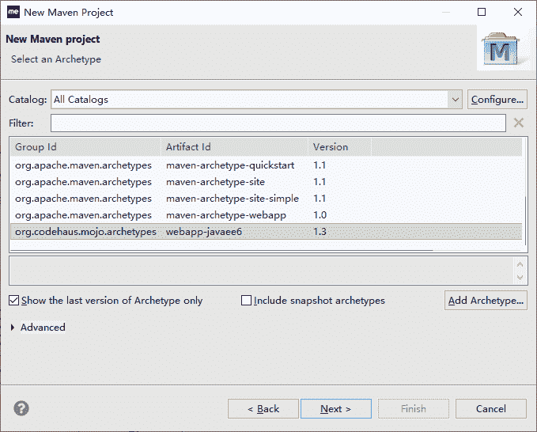
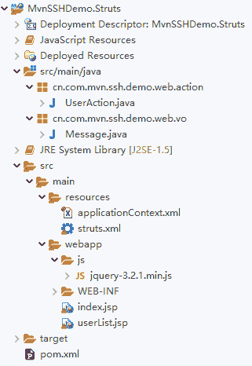
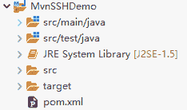

# Maven 搭建 SSH（Struts2+Spring+Hibernate）框架入门教程（二）

> 原文：[`c.biancheng.net/view/5169.html`](http://c.biancheng.net/view/5169.html)

前面《Maven 搭建 SSH 框架》教程中分别基于 Spring 和 Hibernate 实现了 Service 接口和 DAO 接口功能，接下来基于 Struts2 实现 Web 层功能。

## 实现 Struts2 Web 模块

根据前面的 Jsp/Servlet 实现，对需求的理解和 Struts2 开发的相关组件的了解（Struts2 需要单独参考其他资料），Struts2 Web 层的代码需要做以下工作。

#### 1）实现视图层代码（jsp）

视图层代码同以前用 Jsp/Servlet 开发的内容一样，有两个 jsp。

*   Index.jsp，首页框架 jsp。
*   userList.jsp，显示用户列表的 jsp。

#### 2）编写 Action 代码

UserAction.java，实现用户 CRUD 的所有控制逻辑代码。

#### 3）Spring 容器的配置文件

applicationContext.xml，配置 Spring 容器的初始化组件。

#### 4）编写 struts.xml 配置文件

完成 Struts 常量的配置和 Action 的配置。

#### 5）配置 web.xml

配置 Struts 的入口过滤器和 Spring 的初始化 Listener。

#### 1\. 创建 Web 工程

基于 webapp 的 Archetypes 创建 Web 工程，这里用的是 webapp-javaee6，如图 1 所示。


图 1  选择 webapp-javaee6 创建 Web 应用
单击 Next 按钮，在输入框中输入对应信息，单击 Finish 按钮，创建一个 Maven 的 Web 工程，仓库目录结构如图 2 所示。


图 2  Struts Web 工程结构

#### 2\. 配置依赖和插件

pom.xml 内容如下：

```

<project xmlns="http://maven.apache.org/POM/4.0.0"
    xmlns:xsi="http://www.w3.org/2001/XMLSchema-instance"
    xsi:schemaLocation="http://maven.apache.org/POM/4.0.0 http://maven.apache.org/xsd/maven-4.0.0.xsd">
    <modelVersion>4.0.0</modelVersion>
    <parent>
        <groupId>cn.com.mvn.pom</groupId>
        <artifactId>StrutsPOM</artifactId>
        <version>0.0.1-SNAPSHOT</version>
    </parent>
    <groupId>cn.com.mvn.ssh.demo</groupId>
    <artifactId>MvnSSHDemo.Struts</artifactId>
    <packaging>war</packaging>

    <name>MvnSSHDemo.Struts</name>
    <url>http://maven.apache.org</url>

    <dependencies>
        <!-- struts json 插件 -->
        <!-- https://mvnrepository.com/artifact/org.apache.struts/struts2-json-plugin -->
        <dependency>
            <groupId>org.apache.struts</groupId>
            <artifactId>struts2-json-plugin</artifactId>
            <version>2.3.28</version>
        </dependency>

        <dependency>
            <groupId>cn.com.mvn.ssh.demo.dao.hibernate</groupId>
            <artifactId>MvnSSHDemo.DAO.Hibernate</artifactId>
            <version>0.0.1-SNAPSHOT</version>
        </dependency>
        <dependency>
            <groupId>cn.com.mvn.ssh.demo</groupId>
            <artifactId>MvnSSHDemo.Service</artifactId>
            <version>0.0.1-SNAPSHOT</version>
        </dependency>
        <dependency>
            <groupId>cn.com.mvn.ssh.demo</groupId>
            <artifactId>MvnSSHDemo.Service.impl</artifactId>
            <version>0.0.1-SNAPSHOT</version>
        </dependency>
    </dependencies>

    <build>
        <plugins>
            <!-- <plugin> <groupId>org.mortbay.jetty</groupId> <artifactId>maven-jetty-plugin</artifactId>
                <version>6.1.26</version> <configuration> <webAppSourceDirectory>${basedir}/src/main/webapp</webAppSourceDirectory>
                </configuration> </plugin> -->
            <plugin>
                <!-- 指定插件名称及版本号 -->
                <groupId>org.codehaus.cargo</groupId>
                <artifactId>cargo-maven2-plugin</artifactId>
                <version>1.4.8</version>
                <configuration>
                    <wait>true</wait>       <!--是否说明，操作 start、stop 等后续操作必须等前面操作完成才能继续 -->
                    <container>               <!-- 容器的配置 -->
                        <containerId>tomcat7x</containerId>                     <!-- 指定 tomcat 版本 -->
                        <type>installed</type>                                  <!-- 指定类型：standalone, installed 等 -->
                        <home>C:\java\servers\apache-tomcat-7.0.69_64</home>    <!-- 指定 Tomcat 的位置，即 catalina.home -->
                    </container>
                    <configuration>           <!-- 具体的配置 -->
                        <type>existing</type>                                   <!-- 类型，existing:存在 -->
                        <home>C:\java\servers\apache-tomcat-7.0.69_64</home>    <!-- Tomcat 的位置，即 catalina.home -->
                    </configuration>
                    <deployables>     <!-- 部署设置 -->
                        <deployable>            <!-- 部署的 War 包名等 -->
                            <groupId>cn.com.mvn.ssh.demo</groupId>
                            <artifactId>MvnSSHDemo.Struts</artifactId>
                            <type>war</type>
                            <properties><!-- 部署路径 -->
                                <context>MvnSSHDemo</context>
                            </properties>
                        </deployable>
                    </deployables>
                    <deployer>        <!-- 部署配置 -->
                        <type>installed</type>                          <!-- 类型 -->
                    </deployer>
                </configuration>
                <executions>
                    <!-- 执行的动作 -->
                    <execution>
                        <id>verify-deployer</id>
                        <phase>install</phase>      <!-- 解析 install -->
                        <goals>
                            <goal>deployer-deploy</goal>
                        </goals>
                    </execution>
                    <execution>
                        <id>clean-deployer</id>
                        <phase>clean</phase>
                        <goals>
                            <goal>deployer-undeploy</goal>
                        </goals>
                    </execution>
                </executions>
            </plugin>
            <plugin>
                <groupId>org.apache.maven.plugins</groupId>
                <artifactId>maven-compiler-plugin</artifactId>
                <version>2.0.2</version>
                <configuration>
                    <source>1.5</source>
                    <target>1.5</target>
                </configuration>
            </plugin>
        </plugins>
    </build>
</project>
```

相对以前的工程，这里有如下几点不同。

*   当前是 webapp 工程，packaging 要设置成 war。
*   在操作过程中，添加、修改、删除的返回要用 JSON，所以这里需要集成 struts-json 依赖。
*   本工程用的不是 jetty 插件发布 Web 应用，用的是 cargo-maven2-plugin 插件，直接发布到指定 Tomcat 的 webapps 目录下。
*   cargo-maven2-plugin 插件的配置在文档中有对应的注释。这里强调要注意的地方是粗体显示部分。groupId 和 artifactId 是当前工程的对应值，context 是发布到 Web 服务器中的上下文路径名称。

#### 3\. 添加实现代码

#### 1）视图层代码文件内容如下。

```

<%@page contentType="text/html" pageEncoding="UTF-8"%>
<%@taglib uri="http://java.sun.com/jsp/jstl/core" prefix="c"%>
<html>
<head>
<meta http-equiv="Content-Type" content="text/html; charset=utf-8">
<title>测试用户 CRUD 操作</title>
<script type="text/javascript" src="js/jquery-3.2.1.min.js"></script>
<script type="text/javascript">
    $(document).ready(function() {
        // 页面加载完后，自动发 searchUsersServlet 请求，加载到 userListDiv 中显示
        $("#userListDiv").load("userAction!searchUsers.action");
    });
    // 新增 按钮事件触发函数
    function toAdd() {
        // 获取 addForm 中的请求信息
        var _data = $("#addForm").serialize();
        //alert(_data);
        // 发添加新用户的 Ajax 请求
        $.ajax({
            type : 'post',
            url : 'userAction!addUser.action',
            data : _data,
            success : function(msg) {
                alert(msg.message);
                // 更新最新的用户列表信息
                $("#userListDiv").load("userAction!searchUsers.action");
            }
        });
    }
    function toEdit() {
        var _data = $("#editForm").serialize();
        alert(_data);
        $.ajax({
            type : 'post',
            url : 'userAction!editUser.action',
            data : _data,
            success : function(msg) {
                alert(msg.message);
                $("#userListDiv").load("userAction!searchUsers.action");
            }
        });
    }

    function toDelete() {
        var chks = $("input[name='checkbox']:checked");
        if (chks.length == 0) {
            alert("请选择要删除的用户");
        } else if (chks.length > 1) {
            alert("一次只能删除一个用户");
        } else {
            var to = confirm("您确定要删除选中的用户?");
            if (to) {
                var _data = "id=" + chks.val();
                $.ajax({
                    type : 'post',
                    data : _data,
                    url : 'userAction!deleteUser.action',
                    success : function(msg) {
                        alert(msg);
                        $("#userListDiv").load("userAction!searchUsers.action");
                    }
                });
            }
        }
    }

    function toShowAdd() {
        $("#LayerAdd").show(1000);
    }
    function toShowEdit() {
        //alert($("input[name='checkbox']:checked").length);
        var chks = $("input[name='checkbox']:checked");
        if (chks.length == 0) {
            alert("请选择要编辑的用户");
        } else if (chks.length > 1) {
            alert("一次只能修改一个用户");
        } else {
            var _data = "id=" + chks.val();
            $.ajax({
                type : 'post',
                data : _data,
                url : 'userAction!searchUser.action?type=byId',
                dataType : 'json',
                success : function(msg) {
                    $("#editForm #id").val(msg.urId);
                    $("#editForm #userName").val(msg.urUserName);
                    $("#editForm #age").val(msg.urAge);
                    $("#editForm #status").val(msg.urStatus);
                    //alert($("#editForm #age").val());
                    $("#LayerEdit").show(1000);
                }
            });
        }

    }
    function toCloseAdd() {
        $("#LayerAdd").hide(1000);
    }
    function toCloseEdit() {
        $("#LayerEdit").hide(1000);
    }
</script>
<style type="text/css">
<!--
.STYLE2 {
    color: #000000
}

#LayerAdd {
    position: absolute;
    left: 113px;
    top: 183px;
    width: 434px;
    height: 193px;
    z-index: 1;
    background-color: #99FFFF;
    display: none;
}

#LayerEdit {
    position: absolute;
    left: 113px;
    top: 183px;
    width: 434px;
    height: 193px;
    z-index: 1;
    background-color: #99FFFF;
    display: none;
}
-->
</style>
</head>

<body>
    <div id="LayerAdd">
        <form name="addForm" name="addForm" id="addForm" method="post" action="">

            <table width="98%" border="0" align="center" cellpadding="0" cellspacing="0">
                <tr>
                    <td colspan="2" align="center">
                        <strong><BR>添加新用户<br></strong>
                    </td>
                </tr>
                <tr>
                    <td width="47%" align="right">用户名：</td>
                    <td width="53%">
                        <input name="user.urUserName" type="text" id="userName">
                    </td>
                </tr>
                <tr>
                    <td align="right">密码：</td>
                    <td>
                        <input name="user.urPassword" type="password" id="password">
                    </td>
                </tr>
                <tr>
                    <td align="right">年龄：</td>
                    <td>
                        <input name="user.urAge" type="text" id="age">
                    </td>
                </tr>
                <tr>
                    <td colspan="2">&nbsp;</td>
                </tr>
                <tr>
                    <td colspan="2" align="center">
                        <input type="button" name="Submit4" value="添加" onclick="toAdd()">
                        <input type="button" name="Submit5" value="关闭" onclick="toCloseAdd()">
                    </td>
                </tr>
            </table>
        </form>
    </div>

    <div id="LayerEdit">
        <form name="editForm" id="editForm" method="post" action="">
            <input type="hidden" name="id" id="id" />
            <table width="98%" border="0" align="center" cellpadding="0" cellspacing="0">
                <tr>
                    <td colspan="2" align="center">
                        <strong><br>修改用户信息<br></strong>
                    </td>
                </tr>
                <tr>
                    <td width="47%" align="right">用户名：</td>
                    <td width="53%">
                        <input name="userName" type="text" id="userName" readonly="readonly">
                    </td>
                </tr>
                <tr>
                    <td align="right">年龄：</td>
                    <td>
                        <input name="age" type="text" id="age">
                    </td>
                </tr>
                <tr>
                    <td align="right">状态：</td>
                    <td>
                        <select name="status" id="status">
                            <option value="Active">Active</option>
                            <option value="Inactive">Inactive</option>
                            <option value="Locked">Locked</option>
                            <option value="Deleted">Deleted</option>
                        </select>
                    </td>
                </tr>
                <tr>
                    <td colspan="2">&nbsp;</td>
                </tr>
                <tr>
                    <td colspan="2" align="center">
                        <input type="button" name="Submit4" value="修改" onclick="toEdit()">
                        <input type="button" name="Submit5" value="关闭" onclick="toCloseEdit()">
                    </td>
                </tr>
            </table>
        </form>
    </div>

    <p>&nbsp;</p>
    <p>测试用户 CRUD 页面</p>
    <table width="539" border="1">
        <tr>
            <td colspan="5" align="right">
                <input type="button" name="Submit" value="新增" onclick="toShowAdd()">
                <input type="submit" name="Submit2" value="修改" onclick="toShowEdit()">
                <input type="button" name="Submit3" value="删除" onclick="toDelete()">
            </td>
        </tr>
        <tr>
            <td>
                <div id="userListDiv"></div>
            </td>
        </tr>
    </table>
    <p>&nbsp;</p>
</body>
</html>
```

注：index.jsp 中的 JS 用到了 jQuery，要注意将 jQuery 的 JS 代码添加到应用中，并且用 script 应用到页面。index.jsp 中的添加函数、修改函数和删除函数从后台返回的是用 JSON 封装的提示信息。

#### 2）Action 

① Message.java 代码如下所示：

```

package cn.com.mvn.ssh.demo.web.vo;

public class Message {
    private String code;
    private String message;

    public Message(String message) {
        super();
        this.message = message;
    }

    public String getCode() {
        return code;
    }

    public void setCode(String code) {
        this.code = code;
    }

    public String getMessage() {
        return message;
    }

    public void setMessage(String message) {
        this.message = message;
    }
}
```

UserAction.java

```

package cn.com.mvn.ssh.demo.web.action;

import java.util.List;

import org.springframework.beans.factory.annotation.Autowired;
import org.springframework.beans.factory.annotation.Qualifier;
import org.springframework.stereotype.Controller;

import cn.com.mvn.ssh.demo.entity.MvnUser;
import cn.com.mvn.ssh.demo.service.IUserService;
import cn.com.mvn.ssh.demo.web.vo.Message;

@Controller("userAction")
public class UserAction {
    @Autowired
    @Qualifier("userService")
    private IUserService userService;

    private MvnUser user;
    private int id;
    private String userName;
    private String type;

    private String status;
    private int age;
    private Message message;

    // 新增用户的执行方法
    public String addUser() {
        String result = "addSuccess";
        message = new Message("添加成功");
        try {
            // 调用 service，创建用户
            userService.createUser(user);
        } catch (Exception e) {
            e.printStackTrace();
            message.setMessage("添加失败：" + e.getMessage());
        }
        return result;
    }

    // 删除用户的执行方法
    public String deleteUser() {
        String result = "deleteSuccess";
        message = new Message("删除成功");
        try {
            userService.deleteUser(id);
        } catch (Exception e) {
            e.printStackTrace();
            message.setMessage("删除失败:" + e.getMessage());
        }
        return result;
    }

    // 修改用户的执行方法
    public String editUser() {
        String result = "editSuccess";
        this.message = new Message("修改成功!");
        try {
            userService.editUser(age, status, id);
        } catch (Exception e) {
            e.printStackTrace();
            message.setMessage("修改失败:" + e.getMessage());
        }
        return result;
    }

    // 根据 id 或用户名查找单个用户的执行方法
    public String searchUser() {
        String result = "searchUserSeuccess";
        if ("byId".equals(type)) {
            user = this.userService.searchUser(id);
        } else {
            user = this.userService.searchUser(userName);
        }
        return result;
    }

    private List<MvnUser> userList;

    // 查询所有用户列表的执行方法
    public String searchUsers() {
        String result = "searchUsersSuccess";
        this.userList = this.userService.searchUsers();
        return result;
    }

    public List<MvnUser> getUserList() {
        return userList;
    }

    public void setUserList(List<MvnUser> userList) {
        this.userList = userList;
    }

    public MvnUser getUser() {
        return user;
    }

    public void setUser(MvnUser user) {
        this.user = user;
    }

    public int getId() {
        return id;
    }

    public void setId(int id) {
        this.id = id;
    }

    public String getUserName() {
        return userName;
    }

    public void setUserName(String userName) {
        this.userName = userName;
    }

    public String getType() {
        return type;
    }

    public void setType(String type) {
        this.type = type;
    }

    public String getStatus() {
        return status;
    }

    public void setStatus(String status) {
        this.status = status;
    }

    public int getAge() {
        return age;
    }

    public void setAge(int age) {
        this.age = age;
    }

    public Message getMessage() {
        return message;
    }

    public void setMessage(Message message) {
        this.message = message;
    }

}
```

3）applicationContext.xml。

```

<?xml version="1.0" encoding="UTF-8"?>
<beans xmlns="http://www.springframework.org/schema/beans"
    xmlns:xsi="http://www.w3.org/2001/XMLSchema-instance"
    xmlns:mvc="http://www.springframework.org/schema/mvc"
    xmlns:context="http://www.springframework.org/schema/context"
    xsi:schemaLocation="http://www.springframework.org/schema/beans
        http://www.springframework.org/schema/beans/spring-beans-4.0.xsd
        http://www.springframework.org/schema/mvc
        http://www.springframework.org/schema/mvc/spring-mvc-4.0.xsd
        http://www.springframework.org/schema/context
        http://www.springframework.org/schema/context/spring-context-4.0.xsd">

    <context:component-scan
        base-package="cn.com.mvn.ssh.demo" />
</beans>
```

4）struts.xml。

```

<?xml version="1.0" encoding="UTF-8" ?>
<!DOCTYPE struts PUBLIC "-//Apache Software Foundation//DTD Struts Configuration 2.1//EN" "http://struts.apache.org/dtds/struts-2.1.dtd">
<struts>
    <include file="struts-default.xml"></include>
    <include file="struts-plugin.xml"></include>
    <!-- 从 Spring 容器中获取 Action 对象 -->
    <constant name="struts.objectFactory" value="spring"></constant>
    <!-- 请求和 Action 方法的动态对应 -->
    <constant name="struts.enable.DynamicMethodInvocation"
        value="true" />
    <package name="t" namespace="/" extends="json-default">
        <action name="userAction" class="userAction">
            <result name="searchUsersSuccess">/userList.jsp</result>
            <result name="searchUserSeuccess" type="json">
                <param name="root">user</param>
            </result>
            <result name="editSuccess" type="json">
                <param name="root">message</param>
            </result>
            <result name="deleteSuccess" type="json">
                <param name="root">message</param>
            </result>
            <result name="addSuccess" type="json">
                <param name="root">message</param>
            </result>
        </action>
    </package>
</struts>
```

5）web.xml。

```

<?xml version="1.0" encoding="UTF-8"?>
<web-app version="2.5" xmlns="http://java.sun.com/xml/ns/javaee"
    xmlns:xsi="http://www.w3.org/2001/XMLSchema-instance"
    xsi:schemaLocation="http://java.sun.com/xml/ns/javaee http://java.sun.com/xml/ns/javaee/web-app_2_5.xsd">
    <display-name>MvnSSHDemo.Struts</display-name>
    <!-- 启动 Spring 容器 -->
    <listener>
        <listener-class>org.springframework.web.context.ContextLoaderListener</listener-class>
    </listener>
    <context-param>
        <param-name>contextConfigLocation</param-name>
        <param-value>/WEB-INF/classes/applicationContext.xml</param-value>
    </context-param>

    <!-- struts2 的总入口过滤器 -->
    <filter>
        <filter-name>struts2</filter-name>
        <filter-class>
            org.apache.struts2.dispatcher.ng.filter.StrutsPrepareAndExecuteFilter
        </filter-class>
    </filter>
    <filter-mapping>
        <filter-name>struts2</filter-name>
        <url-pattern>/*</url-pattern>
    </filter-mapping>
    <session-config>
        <session-timeout>
            30
        </session-timeout>
    </session-config>
    <welcome-file-list>
        <welcome-file>index.jsp</welcome-file>
    </welcome-file-list>
</web-app>
```

#### 4\. 安装发布测试

右击“工程”，选择 Run As→Maven install 命令。

Maven 会自动编译、测试代码，并且打成 war 包，将 war 包发布到指定的 Web 服务器的发布目录。接着就可以启动 Tomcat 服务器用浏览器进行测试了。浏览器操作过程同前面基于 Jsp/Servlet 开发的 Demo 一样。

## 整合成 SSH

按前面的操作，用户已经独立地实现了各自模块的功能，并且能将各自的功能封装成构件安装到本地仓库、发布到公司搭建的私服上面，供需要的地方当依赖构件使用。

这体现了模块化的思想，同时考虑到框架的依赖配置的共性，用户可以独立创建工程（POM），将每个独立框架的依赖配置都在公共 POM 工程中设置好。

其他要使用的工程只需继承它们就行了，不需要重复配置。比如，MvnSSHDemo.Struts 就是继承自 StrutsPOM。这体现了 Maven 开发过程中的继承运用思想。

但是，当测试 MvnSSHDemo.Struts 模块功能的时候，发现前面的依赖模块的实现需要修改，这时候就要对修改的模块工程进行独立的编译、测试、打包、安装和发布，然后再测试 MvnSSHDemo.Struts。

如果依赖的第三方模块很多，这样每次改动都需要对每个模块进行重复操作，很麻烦。

为了解决这个问题，Maven 里面有个“聚合”的概念。它能将一个个依赖的模块聚合成一个大项目（工程）。

下面创建一个项目，将 MvnSSHDemo 的相关模块都聚合到一起，同时操作，具体步骤如下。

#### 1\. 创建一个普通工程

聚合工程结构如图 3 所示。
图 3  聚合工程结构

#### 2\. 在 pom.xml 中配置每个模块

```

<project xmlns="http://maven.apache.org/POM/4.0.0"
    xmlns:xsi="http://www.w3.org/2001/XMLSchema-instance"
    xsi:schemaLocation="http://maven.apache.org/POM/4.0.0 http://maven.apache.org/xsd/maven-4.0.0.xsd">
    <modelVersion>4.0.0</modelVersion>

    <groupId>cn.com.mvn.ssh.demo</groupId>
    <artifactId>MvnSSHDemo</artifactId>
    <version>0.0.1-SNAPSHOT</version>
    <packaging>pom</packaging>

    <name>MvnSSHDemo</name>
    <url>http://maven.apache.org</url>
    <modules>
        <module>../MvnSSHDemo.DAO</module>
        <module>../MvnSSHDemo.DAO.Hibernate</module>
        <module>../MvnSSHDemo.Service</module>
        <module>../MvnSSHDemo.Service.impl</module>
        <module>../MvnSSHDemo.Struts</module>
    </modules>
    <properties>
        <project.build.sourceEncoding>UTF-8</project.build.sourceEncoding>
    </properties>

    <dependencies>

    </dependencies>
    <build>
        <plugins>

        </plugins>
    </build>
    <distributionManagement>
        <repository>
            <id>archivaServer</id>
            <url>http://localhost:8080/repository/internal</url>
        </repository>
        <snapshotRepository>
            <id>archivaServer</id>
            <url>http://localhost:8080/repository/snapshots</url>
        </snapshotRepository>
    </distributionManagement>
</project>
```

注：这个 pom.xml 中没有太多信息，注意第 13、15、17 和 19 行的配置，就是将相关的依赖工程以模块的形式聚合进来。

这些工程都需要在同一个工作空间下，才能用“../”类似的相对路径进行定位应用。

#### 3\. 构建

要对所有模块进行编译、测试、安装、发布的话，都可以直接右击 MvnSSHDemo 工程，选择 Run As→Maven clean→test→install→build.→build 等命令。

当选择 Maven install 命令后，Maven 会自动把整个工程打成 MvnSSHDemo.war 包，发布到 Tomcat 的 webapps 目录中。

同样，如果选择 Maven build… 命令，输入 deploy，单击 Run 按钮，在安装的 Archiva 私服上就可以浏览到所有的构件。

#### 4．测试

启动 Tomcat，就可以开始测试操作了，只是请注意：前面有搭建 Archiva 私服的，如果这个私服在开发的时候启动着，并且私服就搭建在自己的计算机上，请将它关闭后再启动测试应用的 Tomcat，或者修改测试应用 Tomcat 的端口，否则会出现端口冲突异常。因为 Archiva 也用 Tomcat 服务器，默认端口就是 8080 系列的。

至此，我们在 Maven 上面基于 SSH 完成了一个用户的 CRUD 功能，中间还体现了项目的模块思想、面向接口编程思想和 Maven 的继承、聚合思想。