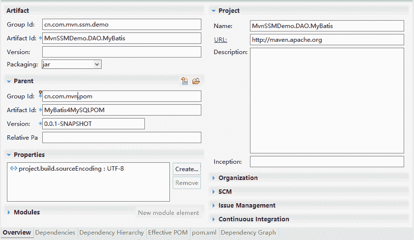

# Maven 搭建 SSM（SpringMVC+Spring+MyBatis）框架入门教程（超级详细）

> 原文：[`c.biancheng.net/view/4892.html`](http://c.biancheng.net/view/4892.html)

前面介绍了基于 Maven 使用 Struts+Spring+Hibernate（SSH）框架，模仿企业级应用的开发过程，实现了用户的 CRUD 功能。接下来再使用 SpringMVC+Spring+MyBatis（SSM）框架，同样模仿企业级应用的开发过程，实现用户的 CRUD 功能。

目的很明确，让用户能直接基于 SSH 和 SSM 两个流行框架进行项目开发，减少学习到使用之间的转换过程。

## 创建公共 POM

为了使公司项目有正常的沉淀和重用，先创建基于 SSM 框架开发的公共 POM 构件，以免以后项目和开发人员的重复搭建。

基于 SSM 框架，用户可以独立搭建 SpringMVC、Spring 和 MyBatis 三个基本的 POM 构件。其中，Spring 的 POM 在前面的样例中已经搭建好了，叫 SpringPOM 构件。本节主要介绍 SpringMVC 和 MyBatis 构件 POM。

#### 1\. SpringMVC POM

因为 SpringMVC 同 Spring 已经在 SpringPOM 配置好了，现在只需继承 SpringPOM。

另外，SpringMVC 封装的是 Web 层应用，底层使用的是 Jsp/Servlet 技术，所以在 SpringMVC POM 中需要加入 Jsp/Servlet 相关的依赖。

因为在用户 CRUD 样例中需要有 JSON 的响应，而且 JSON 的请求和响应在实际项目中也很普通，所以在 SpringMVC POM 中也添加了 JSON 的相关依赖。

pom.xml 的详细内容如下：

```

<project xmlns="http://maven.apache.org/POM/4.0.0"
    xmlns:xsi="http://www.w3.org/2001/XMLSchema-instance"
    xsi:schemaLocation="http://maven.apache.org/POM/4.0.0 http://maven.apache.org/xsd/maven-4.0.0.xsd">
    <modelVersion>4.0.0</modelVersion>

    <groupId>cn.com.mvn.pom</groupId>
    <artifactId>SpringPOM</artifactId>
    <version>0.0.1-SNAPSHOT</version>
    <packaging>pom</packaging>

    <name>SpringPOM</name>
    <url>http://maven.apache.org</url>

    <properties>
        <project.build.sourceEncoding>UTF-8</project.build.sourceEncoding>
        <!-- 3.2.16.RELEASE,3.1.4.RELEASE -->
        <project.build.spring.version>4.2.7.RELEASE
        </project.build.spring.version>
    </properties>

    <dependencies>
        <dependency>
            <groupId>junit</groupId>
            <artifactId>junit</artifactId>
            <version>4.7</version>
            <scope>test</scope>
        </dependency>
        <!-- spring -->
        <dependency>
            <groupId>org.springframework</groupId>
            <artifactId>spring-core</artifactId>
            <version>${project.build.spring.version}</version>
        </dependency>

        <dependency>
            <groupId>org.springframework</groupId>
            <artifactId>spring-aop</artifactId>
            <version>${project.build.spring.version}</version>
        </dependency>
        <dependency>
            <groupId>org.springframework</groupId>
            <artifactId>spring-beans</artifactId>
            <version>${project.build.spring.version}</version>
        </dependency>
        <dependency>
            <groupId>org.springframework</groupId>
            <artifactId>spring-context</artifactId>
            <version>${project.build.spring.version}</version>
        </dependency>
        <dependency>
            <groupId>org.springframework</groupId>
            <artifactId>spring-context-support</artifactId>
            <version>${project.build.spring.version}</version>
        </dependency>
        <dependency>
            <groupId>org.springframework</groupId>
            <artifactId>spring-web</artifactId>
            <version>${project.build.spring.version}</version>
        </dependency>
        <dependency>
            <groupId>org.springframework</groupId>
            <artifactId>spring-webmvc</artifactId>
            <version>${project.build.spring.version}</version>
        </dependency>
        <!-- https://mvnrepository.com/artifact/org.springframework/spring-aspects -->
        <dependency>
            <groupId>org.springframework</groupId>
            <artifactId>spring-aspects</artifactId>
            <version>${project.build.spring.version}</version>
        </dependency>
        <dependency>
            <groupId>org.springframework</groupId>
            <artifactId>spring-orm</artifactId>
            <version>${project.build.spring.version}</version>
        </dependency>
        <dependency>
            <groupId>org.hibernate</groupId>
            <artifactId>hibernate-validator</artifactId>
            <version>5.0.0.Final</version>
        </dependency>
    </dependencies>
    <distributionManagement>
        <repository>
            <id>archivaServer</id>
            <url>http://localhost:8080/repository/internal</url>
        </repository>
        <snapshotRepository>
            <id>archivaServer</id>
            <url>http://localhost:8080/repository/snapshots</url>
        </snapshotRepository>
    </distributionManagement>
</project>
```

#### 2\. MyBatis POM

考虑到 MyBatis 最终要同 Spring 集成，并且是基于 MySQL 数据库。在 MyBatis 的 POM 中需要定义如下关键的依赖。

*   MyBatis 构件。
*   MyBatis 同 Spring 集成的构件。
*   连接池构件。
*   MySQL 数据库驱动构件。

MyBatis4MySQLPOM 的 pom.xml 详细内容如下：

```

<project xmlns="http://maven.apache.org/POM/4.0.0"
    xmlns:xsi="http://www.w3.org/2001/XMLSchema-instance"
    xsi:schemaLocation="http://maven.apache.org/POM/4.0.0 http://maven.apache.org/xsd/maven-4.0.0.xsd">
    <modelVersion>4.0.0</modelVersion>

    <groupId>cn.com.mvn.pom</groupId>
    <artifactId>MyBatis4MySQLPOM</artifactId>
    <version>0.0.1-SNAPSHOT</version>
    <packaging>pom</packaging>

    <name>MyBatis4MySQLPOM</name>
    <url>http://maven.apache.org</url>

    <properties>
        <project.build.sourceEncoding>UTF-8</project.build.sourceEncoding>
        <!-- 3.6.5.Final,3.3.2.GA -->
        <project.build.mybatis.version>3.4.0</project.build.mybatis.version>
    </properties>

    <dependencies>
        <!-- MyBatis -->
        <dependency>
            <groupId>org.mybatis</groupId>
            <artifactId>mybatis</artifactId>
            <version>${project.build.mybatis.version}</version>
        </dependency>
        <!-- MyBatis 同 Spring 的集成构件 -->
        <dependency>
            <groupId>org.mybatis</groupId>
            <artifactId>mybatis-spring</artifactId>
            <version>1.3.0</version>
        </dependency>
        <dependency>
            <groupId>org.mybatis.generator</groupId>
            <artifactId>mybatis-generator-core</artifactId>
            <version>1.3.2</version>
        </dependency>
        <!-- Datasource 连接池 -->
        <dependency>
            <groupId>commons-dbcp</groupId>
            <artifactId>commons-dbcp</artifactId>
            <version>1.4</version>
        </dependency>
        <!-- MySQL 数据库驱动 -->
        <dependency>
            <groupId>mysql</groupId>
            <artifactId>mysql-connector-java</artifactId>
            <version>5.1.34</version>
        </dependency>
        <dependency>
            <groupId>junit</groupId>
            <artifactId>junit</artifactId>
            <version>4.7</version>
            <scope>test</scope>
        </dependency>
    </dependencies>
    <distributionManagement>
        <repository>
            <id>archivaServer</id>
            <url>http://localhost:8080/repository/internal</url>
        </repository>
        <snapshotRepository>
            <id>archivaServer</id>
            <url>http://localhost:8080/repository/snapshots</url>
        </snapshotRepository>
    </distributionManagement>
</project>
```

## 实现 MyBatis DAO 模块

因为它同 SSH 框架实现的用户 CRUD 功能一样，所以在 SSM 中，DAO 层的接口同 SSH 中的 DAO 层接口是一样的，这里就不再重新定义了，直接重用前面样例中创建的 MvnSSHDemo.DAO 构件。这里直接创建 MyBatis 的 DAO 实现部分工程，对 DAO 层接口基于 MyBatis 进行实现。

#### 1\. 创建 MvnSSMDemo.DAO.MyBatis 工程

MvnSSMDemo.DAO.MyBatis 的工程中，只需创建 Maven 的普通 Java 工程就行。

#### 2\. 编写 pom.xml

MvnSSMDemo.DAO.MyBatis 是基于 MyBatis 实现的，所以 pom 先继承 MyBatis4MySQLPOM，然后考虑到同 Spring 集成，并且实现的是 MvnSSHDemo.DAO 中定义的接口，所以需要添加 SpringPOM 和 MvnSSHDemo.DAO 的构件依赖。

注意，因为 SpringPOM 是 pom 构件，所以在应用它的依赖的时候，需要指定 type 为 pom，详细情况查看 pom.xml。

pom.xml 内容如下：

```

<project xmlns="http://maven.apache.org/POM/4.0.0"
    xmlns:xsi="http://www.w3.org/2001/XMLSchema-instance"
    xsi:schemaLocation="http://maven.apache.org/POM/4.0.0 http://maven.apache.org/xsd/maven-4.0.0.xsd">
    <modelVersion>4.0.0</modelVersion>
    <parent>
        <groupId>cn.com.mvn.pom</groupId>
        <artifactId>MyBatis4MySQLPOM</artifactId>
        <version>0.0.1-SNAPSHOT</version>
    </parent>
    <groupId>cn.com.mvn.ssm.demo</groupId>
    <artifactId>MvnSSMDemo.DAO.MyBatis</artifactId>
    <packaging>jar</packaging>

    <name>MvnSSMDemo.DAO.MyBatis</name>
    <url>http://maven.apache.org</url>

    <properties>
        <project.build.sourceEncoding>UTF-8</project.build.sourceEncoding>
    </properties>

    <dependencies>
        <!--SpringPOM 构件依赖 -->
        <dependency>
            <groupId>cn.com.mvn.pom</groupId>
            <artifactId>SpringPOM</artifactId>
            <version>0.0.1-SNAPSHOT</version>
            <type>pom</type>
        </dependency>
        <!--DAO 接口依赖 -->
        <dependency>
            <groupId>cn.com.mvn.ssh.demo</groupId>
            <artifactId>MvnSSHDemo.DAO</artifactId>
            <version>0.0.1-SNAPSHOT</version>
        </dependency>
    </dependencies>
    <distributionManagement>
        <repository>
            <id>archivaServer</id>
            <url>http://localhost:8080/repository/internal</url>
        </repository>
        <snapshotRepository>
            <id>archivaServer</id>
            <url>http://localhost:8080/repository/snapshots</url>
        </snapshotRepository>
    </distributionManagement>
</project>
```

#### 3\. 编写实现代码

基于 MyBatis 实现的 DAO 持久层，需要写以下代码。

MyBatisConfiguration.java，配置 MyBatis 的基本信息，包括数据库连接信息。

```

package cn.com.mvn.ssm.demo.dao.mybatis;

import java.io.IOException;
import java.util.Properties;

import javax.sql.DataSource;

import org.apache.commons.dbcp.BasicDataSource;
import org.apache.ibatis.io.Resources;
import org.mybatis.spring.SqlSessionFactoryBean;
import org.mybatis.spring.mapper.MapperScannerConfigurer;
import org.springframework.beans.factory.annotation.Autowire;
import org.springframework.context.annotation.Bean;
import org.springframework.context.annotation.ComponentScan;
import org.springframework.context.annotation.Configuration;
import org.springframework.core.io.Resource;
import org.springframework.core.io.support.PathMatchingResourcePatternResolver;
import org.springframework.core.io.support.ResourcePatternResolver;

@Configuration // 允许注解
@ComponentScan(basePackages = { "cn.com.mvn" }) // 注解类的基本包
public class MyBatisConfiguration {
    // 将方法结果按 Bean 管理，别的地方可以按类型进行装配
    @Bean(autowire = Autowire.BY_TYPE)
    public DataSource dataSource() {
        // 创建数据源
        BasicDataSource dataSource = new BasicDataSource();
        Properties prop = null;
        try {
            // 读资源文件中的数据库连接信息
            prop = Resources.getResourceAsProperties("db.properties");
            String driverClass = prop.getProperty("jdbc.driverClassName");
            String jdbcUrl = prop.getProperty("jdbc.url");
            String uname = prop.getProperty("jdbc.username");
            String password = prop.getProperty("jdbc.password");

            dataSource.setDriverClassName(driverClass);
            dataSource.setUrl(jdbcUrl);
            dataSource.setUsername(uname);
            dataSource.setPassword(password);
            dataSource.setRemoveAbandonedTimeout(60);
            dataSource.setRemoveAbandoned(true);
            dataSource.setLogAbandoned(false);
            dataSource.setMinIdle(10);
            dataSource.setMinEvictableIdleTimeMillis(30000);
            dataSource.setMaxWait(10);
            dataSource.setInitialSize(2);
            dataSource.setMaxActive(10);
            dataSource.setTimeBetweenEvictionRunsMillis(30000);
            dataSource.setValidationQuery("SELECT 1");
            dataSource.setTestOnReturn(false);
            dataSource.setTestOnBorrow(true);
            dataSource.setTestWhileIdle(true);
        } catch (IOException e) {
            e.printStackTrace();
        }
        return dataSource;

    }

    // 将返回结果对象定义成一个 name 为 sqlSessionFactory 的 bean
    @Bean(name = "sqlSessionFactory")
    public SqlSessionFactoryBean getSqlSesssionFactoryBean() {
        SqlSessionFactoryBean bean = new SqlSessionFactoryBean();
        bean.setDataSource(dataSource());
        /*
         * ClassPathResource re = new ClassPathResource("myBatisConfig.xml");
         * bean.setConfigLocation(re);
         */
        ResourcePatternResolver resolver = new PathMatchingResourcePatternResolver();
        Resource[] resources;
        try {
            // 设置 MyBatis 视图映射文件的路径
            resources = resolver.getResources("classpath:cn/com/mvn/ssm/demo/dao/mybatis/entity/*Mapper.xml");
            bean.setMapperLocations(resources);
        } catch (IOException e) {
            e.printStackTrace();
        }
        return bean;
    }

    // 创建 Mapper 和接口的绑定配置器 Bean，名称为 mapper
    @Bean(name = "mapper", autowire = Autowire.BY_NAME)
    public MapperScannerConfigurer getMapperScannerConfigurer() {
        MapperScannerConfigurer conf = new MapperScannerConfigurer();
        // 设置要绑定的接口基本包路径
        conf.setBasePackage("cn.com.mvn.ssm.demo.dao.mybatis.impl");
        // 设置连接数据库的 sqlSessionFactory
        conf.setSqlSessionFactoryBeanName("sqlSessionFactory");
        return conf;
    }
}
```

IMvnDAO4MyBatis.java，继承前面定义的 DAO 接口，完成 MyBatis 接口定义。

```

package cn.com.mvn.ssm.demo.dao.mybatis.impl;
import cn.com.mvnb.ssh.demo.dao.IMvnUserDAO;

public interface IMvnUserDAO4MyBatis extends IMvnUserDAO {

}
```

MvnUserMapper.xml，MvnUser 实体的映射文件。

```

<?xml version="1.0" encoding="UTF-8"?>
<!DOCTYPE mapper PUBLIC "-//mybatis.org//DTD Mapper 3.0//EN"
     "http://mybatis.org/dtd/mybatis-3-mapper.dtd">
<mapper
    namespace="cn.com.mvn.ssm.demo.dao.mybatis.impl.IMvnUserDAO4MyBatis">
    <resultMap type="cn.com.mvn.ssh.demo.entity.MvnUser"
        id="UserMap">
        <id column="ur_id" property="urId" />
        <result column="ur_user_name" property="urUserName" />
        <result column="ur_password" property="urPassword" />
        <result column="ur_age" property="urAge" />
        <result column="ur_status" property="urStatus" />
    </resultMap>
    <insert id="addUser" useGeneratedKeys="true" keyProperty="urId"
        parameterType="cn.com.mvn.ssh.demo.entity.MvnUser">
        insert into mvn_user
        (ur_user_name,ur_password,ur_age,ur_status)
        values
        (#{urUserName},#{urPassword},#{urAge},#{urStatus})
    </insert>
    <update id="update"
        parameterType="cn.com.mvn.ssh.demo.entity.MvnUser">
        update mvn_user set
        ur_age=#{urAge},ur_status=#{urStatus} where
        ur_id=#{urId}
    </update>
    <delete id="deleteUser"
        parameterType="cn.com.mvn.ssh.demo.entity.MvnUser">
        delete from mvn_user where ur_id=#{urId}
    </delete>
    <select id="findUserById" resultMap="UserMap"
        parameterType="int">
        select * from mvn_user where ur_id=#{id}
    </select>
    <select id="findUserByUserName" resultMap="UserMap"
        parameterType="java.lang.String">
        select * from mvn_user where ur_user_name=#{userName}
    </select>
    <select id="findUsers" resultMap="UserMap">
        select * from mvn_user order by ur_id
    </select>
</mapper>
```

db.properties，数据库连接信息配置文件。

jdbc.username=root
jdbc.password=root
jdbc.url=jdbc:mysql://localhost:3306/mvn_db
jdbc.driverClassName=com.mysql.jdbc.Driver

#### 4\. 编写测试代码

测试代码是 TestMvnUserDAOImp.java 类，里面基于 JUnit 对 DAO 接口中的每个方法做了测试。

为了完成它，同时避免 MyBatisDAO 集成到系统项目中的改动，添加了一个供 MvnUserDAOImpl 测试的服务类。里面不加业务逻辑，直接调用 DAO 接口中的方法，只是在类上面添加了事务管理。所以测试代码主要有以下几个部分。

1）IMvnUserService.java，临时测试用的服务层接口。

```

package cn.com.mvn.ssm.demo.mybatis.service;

import java.util.List;
import cn.com.mvn.ssh.demo.entity.MvnUser;

public interface IMvnUserService {
    /**
     * 在数据库中，添加一个新的 MvnUser 对象
     *
     * @param user 需要添加的用户实体对象，该对象需要有用户名、密码、年龄和状态属性
     *
     * @return void
     * @throws RuntimeException 添加失败或出现其它意外
     */
    public void addUser(MvnUser user);

    /**
     * 更新 MvnUser 对象。该对象中需要设置年龄、状态和 id 属性，属性和状态是要更新的新值，id 为条件
     *
     * @param user 需要更新的 MvnUser 对象
     *
     * @return void
     * @throws RuntimeException 更新失败或出现其它意外
     */
    public void update(MvnUser user);

    /**
     * 删除 MvnUser 对象，该对象中需要有要删除对象的 id 属性，id 属性为删除条件
     *
     * @param user 要删除的 MvnUser 对象
     *
     * @return void
     * @throws RuntimeException 删除失败或出现其它意外
     */
    public void deleteUser(MvnUser user);

    /**
     * 根据 id 查询对应的 MvnUser 对象
     *
     * @param id 要查询的 MvnUser 对象的 id
     * @return MvnUser id 对应的 MvnUser 对象，如果没有对象，返回 null
     * @throws RuntimeException 出现意外情况
     */
    public MvnUser findUserById(int id);

    /**
     * 根据用户名查询对应的 MvnUser 对象
     *
     * @param userName 要查询的 MvnUser 对象的用户名
     * @return MvnUser 用户对应的 MvnUser 对象，如果没有对象，返回 null
     * @throws RuntimeException 出现意外情况
     */
    public MvnUser findUserByUserName(String userName);

    /**
     * 查找数据库中所有的用户对象，以 List 集合的形式返回
     *
     * @return List<MvnUser> 所有用户对象的集合
     * @throws RuntimeException 出现意外情况
     */
    public List<MvnUser> findUsers();
}
```

2）MvnUserServiceImpl.java，临时测试的服务层实现类。

```

package cn.com.mvn.ssm.demo.mybatis.service.impl;

import java.util.List;

import org.springframework.beans.factory.annotation.Autowired;
import org.springframework.stereotype.Service;
import org.springframework.transaction.annotation.Transactional;

import cn.com.mvn.ssh.demo.dao.IMvnUserDAO;
import cn.com.mvn.ssh.demo.entity.MvnUser;
import cn.com.mvn.ssm.demo.mybatis.service.IMvnUserService;

@Service("userService")
@Transactional
public class MvnUserServiceImpl implements IMvnUserService {
    @Autowired
    private IMvnUserDAO userDAO;

    public void addUser(MvnUser user) {
        this.userDAO.addUser(user);
    }

    public void update(MvnUser user) {
        this.userDAO.update(user);
    }

    public void deleteUser(MvnUser user) {
        this.userDAO.deleteUser(user);
    }

    public MvnUser findUserById(int id) {
        return this.userDAO.findUserById(id);
    }

    public MvnUser findUserByUserName(String userName) {
        return this.userDAO.findUserByUserName(userName);
    }

    public List<MvnUser> findUsers() {
        return this.userDAO.findUsers();
    }
}
```

3）TestMvnUserDAOImpl.java，基于 JUnit 的单元测试类。

```

package cn.com.mvn.ssm.demo.dao.mybatis.impl;

import java.util.List;

import org.junit.After;
import org.junit.Before;
import org.junit.Test;
import org.springframework.context.ApplicationContext;
import org.springframework.context.support.ClassPathXmlApplicationContext;

import cn.com.mvn.ssh.demo.entity.MvnUser;
import cn.com.mvn.ssh.demo.entity.Status;
import cn.com.mvn.ssm.demo.mybatis.service.IMvnUserService;
import junit.framework.Assert;

public class TestMvnUserDAOImpl {
    private ApplicationContext ctx;
    private IMvnUserService userService;

    @Before
    public void init() {
        this.ctx = new ClassPathXmlApplicationContext("applicationContext.xml");
        this.userService = (IMvnUserService) ctx.getBean("userService");
    }

    @Test
    public void testAddUser() {
        MvnUser user = new MvnUser();
        user.setUrAge(11);
        user.setUrPassword("11");
        user.setUrStatus(Status.ACTIVE.getStatus());
        user.setUrUserName("myBatisUserName");
        this.userService.addUser(user);
        user = this.userService.findUserByUserName("myBatisUserName");
        Assert.assertTrue(user != null && user.getUrAge() == 11);
        this.userService.deleteUser(user);
    }

    @Test
    public void testDeleteUser() {
        MvnUser user = new MvnUser();
        user.setUrAge(11);
        user.setUrPassword("11");
        user.setUrStatus(Status.ACTIVE.getStatus());
        user.setUrUserName("myBatisUserName");
        this.userService.addUser(user);
        user = this.userService.findUserByUserName("myBatisUserName");
        this.userService.deleteUser(user);
        MvnUser u = this.userService.findUserByUserName("myBatisUserName");
        Assert.assertTrue(user != null && u == null);

    }

    @Test
    public void testFindUserById() {
        MvnUser user = this.userService.findUserById(1);
        Assert.assertEquals(user.getUrUserName(), "zhangsan");
    }

    @Test
    public void testFindByUserName() {
        MvnUser user = this.userService.findUserByUserName("zhangsan");
        Assert.assertEquals("123", user.getUrPassword());
    }

    @Test
    public void testFindUsers() {
        List<MvnUser> userList = this.userService.findUsers();
        Assert.assertTrue(userList.size() > 0);
    }

    @After
    public void destory() {
        this.userService = null;
        this.ctx = null;
    }
}
```

4）applicationContext.xml，测试的时候，Spring 的配置文件。

```

<?xml version="1.0" encoding="UTF-8"?>
<beans xmlns="http://www.springframework.org/schema/beans"
    xmlns:xsi="http://www.w3.org/2001/XMLSchema-instance"
    xmlns:mvc="http://www.springframework.org/schema/mvc"
    xmlns:context="http://www.springframework.org/schema/context"
    xsi:schemaLocation="http://www.springframework.org/schema/beans
        http://www.springframework.org/schema/beans/spring-beans-4.0.xsd
        http://www.springframework.org/schema/mvc
        http://www.springframework.org/schema/mvc/spring-mvc-4.0.xsd
        http://www.springframework.org/schema/context
        http://www.springframework.org/schema/context/spring-context-4.0.xsd">

    <context:component-scan base-package="cn.com.mvn" />
</beans>
```

#### 5\. 测试、安装和发布

同前面的类似。

## 实现 Spring 的 Service 层模块

SSM 中的 Service 层实现同 SSH 框架中的 Service 层实现一样。唯一不同的是 DAO 的注入只能用 @Autowired 根据类型注入，不能用 @Qualifier 根据名称注入。

因为前面 MyBatis DAO 的实现使用的是 MyBatis3 的新特征：接口和映射文件自动绑定，没有自己独立实现 DAO 类，更没有在 Spring 容器中配置 DAO Bean、指定 Bean 的名称。

MvnSSMDemo.Service.Impl 工程的实现步骤如下。

#### 1\. 创建 MvnSSMDemo.Service.Impl 工程

只需创建 Maven 的简单 Java 工程。

#### 2\. 编写 pom.xml 骨架文件

pom 内容主要体现在以下几个方面。

*   继承 SpringPOM 公共构件，避免重复配置对 Spring 相关构件的依赖。
*   添加 MvnSSHDemo.DAO 接口依赖和 MvnSSHDemo.Service 接口依赖。
*   为了方便测试，添加 MvnSSMDemo.DAO.MyBatis 依赖，scope 范围是 test。

pom.xml 的代码如下所示：

```

<project xmlns="http://maven.apache.org/POM/4.0.0"
    xmlns:xsi="http://www.w3.org/2001/XMLSchema-instance"
    xsi:schemaLocation="http://maven.apache.org/POM/4.0.0 http://maven.apache.org/xsd/maven-4.0.0.xsd">
    <modelVersion>4.0.0</modelVersion>
    <parent>
        <groupId>cn.com.mvn.pom</groupId>
        <artifactId>SpringPOM</artifactId>
        <version>0.0.1-SNAPSHOT</version>
    </parent>
    <groupId>cn.com.mvn.ssm.demo</groupId>
    <artifactId>MvnSSMDemo.Service.Impl</artifactId>
    <packaging>jar</packaging>

    <name>MvnSSMDemo.Service.Impl</name>
    <url>http://maven.apache.org</url>

    <properties>
        <project.build.sourceEncoding>UTF-8</project.build.sourceEncoding>
    </properties>

    <dependencies>
        <dependency>
            <groupId>cn.com.mvn.ssh.demo</groupId>
            <artifactId>MvnSSHDemo.DAO</artifactId>
            <version>0.0.1-SNAPSHOT</version>
        </dependency>
        <dependency>
            <groupId>cn.com.mvn.ssh.demo</groupId>
            <artifactId>MvnSSHDemo.Service</artifactId>
            <version>0.0.1-SNAPSHOT</version>
        </dependency>
        <dependency>
            <groupId>cn.com.mvn.ssm.demo</groupId>
            <artifactId>MvnSSMDemo.DAO.MyBatis</artifactId>
            <version>0.0.1-SNAPSHOT</version>
            <scope>test</scope>
        </dependency>
    </dependencies>
</project>
```

#### 3\. 编写实现代码

Service 层主要实现用户对象的 CRUD 功能，同 SSH 中的 Service 层的代码类似，唯一不同的是，对 DAO 对象的注入只能用 byType 的自动注入，不能用 byName。Service 层的内容如下。

UserServiceImpl.java，实现用户的 CRUD 功能。

```

package cn.com.mvn.ssh.demo.service.impl;

import java.util.List;
import org.springframework.beans.factory.annotation.Autowired;
import org.springframework.stereotype.Service;
import org.springframework.transaction.annotation.Propagation;
import org.springframework.transaction.annotation.Transactional;

import cn.com.mvn.ssh.demo.dao.IMvnUserDAO;
import cn.com.mvn.ssh.demo.entity.MvnUser;
import cn.com.mvn.ssh.demo.service.IUserService;

//@Configuration
@Service("userService") // 注册成服务组件
@Transactional // 要求启动事务
public class UserServiceImpl implements IUserService {
    @Autowired // 自动根据类型注入
    // @Qualifier("userDAO") // 根据 name 注入
    private IMvnUserDAO userDAO;

    @Transactional(propagation = Propagation.REQUIRED) // 需要进行事务管理
    public void createUser(MvnUser user) {
        // 验证输入的用户是否为 null
        if (user == null) {
            throw new RuntimeException("创建的 user 不能为 null");
        }
        // 验证用户名是否有存在
        MvnUser u = this.userDAO.findUserByUserName(user.getUrUserName());
        if (u != null) {
            throw new RuntimeException(u.getUrUserName() + " 已经存在");
        }
        this.userDAO.addUser(user);
    }

    @Transactional(propagation = Propagation.REQUIRED) // 需要进行事务管理
    public void editUser(int age, String status, int id) {
        // 根据 id 找到以前的用户对象
        MvnUser user = this.userDAO.findUserById(id);
        // 判断用户是否存在，不存在抛异常，存在就更新
        if (user == null) {
            throw new RuntimeException("id 为" + id + "用户不存在");
        } else {
            user.setUrAge(age);
            user.setUrStatus(status);
            this.userDAO.update(user);
        }
    }

    @Transactional(propagation = Propagation.REQUIRED) // 需要进行事务管理
    public void deleteUser(int id) {
        // 根据 id 找到以前的用户对象
        MvnUser user = this.userDAO.findUserById(id);
        // 判断用户是否存在，不存在抛异常，存在就删除
        if (user == null) {
            throw new RuntimeException("id 为" + id + "用户不存在");
        } else {
            this.userDAO.deleteUser(user);
        }
    }

    @Transactional(readOnly = true) // 只读，不需要进行事务管理
    public MvnUser searchUser(int id) {
        MvnUser user = null;
        user = this.userDAO.findUserById(id);
        return user;
    }

    @Transactional(readOnly = true) // 只读，不需要进行事务管理
    public MvnUser searchUser(String userName) {
        MvnUser user = null;
        user = this.userDAO.findUserByUserName(userName);
        return user;
    }

    @Transactional(readOnly = true) // 只读，不需要进行事务管理
    public List<MvnUser> searchUsers() {
        List<MvnUser> userList = null;
        userList = this.userDAO.findUsers();
        return userList;
    }
}
```

#### 4\. 编写测试代码

MvnSSMDemo.Service.Impl 的测试代码有两个。

#### 1）TestUserServiceImpl.java

实现测试 UserServiceImpl.java 的 JUnit 代码，内容如下所示：

```

package cn.com.mvn.ssh.demo.service.impl;

import java.util.List;

import org.junit.After;
import org.junit.Before;
import org.junit.Test;
import org.springframework.context.ApplicationContext;
import org.springframework.context.support.ClassPathXmlApplicationContext;

import cn.com.mvn.ssh.demo.entity.MvnUser;
import cn.com.mvn.ssh.demo.entity.Status;
import cn.com.mvn.ssh.demo.service.IUserService;
import junit.framework.Assert;

public class TestUserServiceImpl {
    private IUserService userService;
    private ApplicationContext ctx = null;

    @Before
    public void init() {
        this.ctx = new ClassPathXmlApplicationContext("applicationContext.xml");
        this.userService = (IUserService) ctx.getBean("userService");
    }

    @Test
    public void testCreateUser() {
        MvnUser user = new MvnUser();
        user.setUrAge(11);
        user.setUrPassword("11");
        user.setUrStatus(Status.ACTIVE.getStatus());
        user.setUrUserName("service1");
        this.userService.createUser(user);
        MvnUser u = this.userService.searchUser("service1");
        boolean bool = u != null && u.getUrAge() == 11 && u.getUrStatus().equals(Status.ACTIVE.getStatus());
        Assert.assertTrue(bool);
        // 删除用户
        this.userService.deleteUser(u.getUrId());
    }

    @Test
    public void testEditUser() {
        MvnUser user = new MvnUser();
        user.setUrAge(11);
        user.setUrPassword("11");
        user.setUrStatus(Status.ACTIVE.getStatus());
        user.setUrUserName("service1");
        this.userService.createUser(user);
        MvnUser u = this.userService.searchUser("service1");
        this.userService.editUser(88, Status.INACTIVE.getStatus(), u.getUrId());
        u = this.userService.searchUser("service1");
        Assert.assertTrue(u.getUrAge() == 88 && u.getUrStatus().equals(Status.INACTIVE.getStatus()));
        this.userService.deleteUser(u.getUrId());
    }

    @Test
    public void testDeleteUser() {
        MvnUser user = new MvnUser();
        user.setUrAge(11);
        user.setUrPassword("11");
        user.setUrStatus(Status.ACTIVE.getStatus());
        user.setUrUserName("service1");
        this.userService.createUser(user);
        MvnUser u = this.userService.searchUser("service1");
        this.userService.deleteUser(u.getUrId());
        MvnUser u2 = this.userService.searchUser(u.getUrId());
        Assert.assertTrue(u != null && u2 == null);
    }

    @Test
    public void testSearchUserById() {
        MvnUser user = this.userService.searchUser(1);
        Assert.assertNotNull(user);
    }

    @Test
    public void testSearchUserByUserName() {
        MvnUser user = this.userService.searchUser("zhangsan");
        Assert.assertNotNull(user);
    }

    @Test
    public void testSearchUsers() {
        List<MvnUser> userList = this.userService.searchUsers();
        Assert.assertTrue(userList != null && userList.size() > 0);
    }

    @After
    public void destory() {
        this.userService = null;
        this.ctx = null;
    }
}
```

 <mvnuser>#### 2）applicationContext.xml

测试时要初始化 Spring 容器。因为只在测试起作用，所以该文件要同前面的 TestUserServiceImpl.java 代码一样，放在 src/test 的对应子目录下，代码如下所示：

```

<?xml version="1.0" encoding="UTF-8"?>
<beans xmlns="http://www.springframework.org/schema/beans"
    xmlns:xsi="http://www.w3.org/2001/XMLSchema-instance"
    xmlns:mvc="http://www.springframework.org/schema/mvc"
    xmlns:context="http://www.springframework.org/schema/context"
    xsi:schemaLocation="http://www.springframework.org/schema/beans
        http://www.springframework.org/schema/beans/spring-beans-4.0.xsd
        http://www.springframework.org/schema/mvc
        http://www.springframework.org/schema/mvc/spring-mvc-4.0.xsd
        http://www.springframework.org/schema/context
        http://www.springframework.org/schema/context/spring-context-4.0.xsd">

    <context:component-scan base-package="cn.com.mvn" />
</beans>
```

#### 5\. 测试安装和发布

右击“工程”，选择 Run As→Maven test→install→deploy 命令完成测试安装和发布，发布完成后，Archiva 私服上可以看到 MvnSSMDemo.Service.Impl 的构件。

## 实现 SpringMVC Web 模块

用户 CRUD 模块的 SSM Web 层实现，这里采用的是 SpringMVC 4.x 版本，用的是零配置方式实现的。

所以要理解后面的代码实现需要有 SpringMVC 4.x 的开发基础，建议没有接触过的读者先参考 SpringMVC 4.0 注解开发 Web 应用的相关资料。

Web 层基于框架的开发流程可以抽象成以下几个部分。

*   在 web.xml 中配置框架的拦截入口，可能是过滤器，也可能是 servlet。
*   开发显示层代码一般是 jsp 页面。
*   开发控制层代码，实现接收请求数据，调用 service 处理请求数据，返回结果 view 层的标记。
*   通过配置文件描述框架运行时，对请求的处理代码的对应关系和页面转换流程。

基于 SpringMVC 4.x 用零配置方式开发 Web 层也是同样的流程。只是因为是零配置方式，也就看不到配置文件相关的代码，但是以前配置文件描述的信息肯定还是要描述的，只是用注解或其他方式体现。

对 SpringMVC Web 的实现思路有了基本了解后，接下来就开始实现 SSMDemo 的 Web 层功能。

#### 1\. 创建 Maven 的 Web 工程

前面大部分工程都是基于 Maven 的普通 Java 工程。这里要基于创建 Web 应用的插件创建 Web 工程，详细过程如下。

单击 Maven 中的创建 Maven Project 的选项，如图 1 所示。


图 1  创建 Maven Project
单击 Next 按钮，进入 Archetype 的选择界面，选择 webapp-javaee6 插件，如图 2 所示。


图 2  选择 webapp-javaee6
单击 Next 按钮，进入类似如图 3 所示的界面，在界面中输入工程的 Group Id、Artifact Id、Package，选择一个 Version 版本。


图 3  输入项目坐标
单击 Finish 按钮，创建 Web 工程，项目就创建好了。

#### 2\. 编写和完善 pom.xml

用户 CRUD 的模块实现，需要有 Spring 和 Spring web，Spring webmvc 的相关 jar 包，同时还需要在前面阶段开发的 MvnSSHDAO.DAO 和 MvnSSHService.Service 定义的接口上进行开发，MvnSSMDAO.MyBatis 和 MvnSSMService.Service.Impl 的实现基础上进行测试。

所以 pom.xml 中主要体现在对 SpringPOM 父 pom 构件的继承和对后面四个构件的依赖。

另外，为了发布到 Web 服务器上运行，需要配置 cargo-maven2-plugin 插件。

pom.xml 详细内容如下：

```

<project xmlns="http://maven.apache.org/POM/4.0.0"
    xmlns:xsi="http://www.w3.org/2001/XMLSchema-instance"
    xsi:schemaLocation="http://maven.apache.org/POM/4.0.0 http://maven.apache.org/xsd/maven-4.0.0.xsd">
    <modelVersion>4.0.0</modelVersion>
    <parent>
        <groupId>cn.com.mvn.pom</groupId>
        <artifactId>SpringMVCPOM</artifactId>
        <version>0.0.1-SNAPSHOT</version>
    </parent>
    <groupId>cn.com.mvn.ssm.demo</groupId>
    <artifactId>MvnSSMDemo.SpringMVC</artifactId>
    <packaging>war</packaging>

    <name>MvnSSMDemo.SpringMVC</name>
    <url>http://maven.apache.org</url>

    <dependencies>

        <dependency>
            <groupId>cn.com.mvn.ssh.demo</groupId>
            <artifactId>MvnSSHDemo.Service</artifactId>
            <version>0.0.1-SNAPSHOT</version>
        </dependency>
        <!-- 接口和实现 -->
        <dependency>
            <groupId>cn.com.mvn.ssm.demo</groupId>
            <artifactId>MvnSSMDemo.Service.Impl</artifactId>
            <version>0.0.1-SNAPSHOT</version>
        </dependency>
        <dependency>
            <groupId>cn.com.mvn.ssm.demo</groupId>
            <artifactId>MvnSSMDemo.DAO.MyBatis</artifactId>
            <version>0.0.1-SNAPSHOT</version>
        </dependency>
        <dependency>
            <groupId>cn.com.mvn.ssh.demo</groupId>
            <artifactId>MvnSSHDemo.DAO</artifactId>
            <version>0.0.1-SNAPSHOT</version>
        </dependency>
    </dependencies>

    <build>
        <plugins>

            <!-- Cargo 插件 -->
            <plugin>
                <!-- 指定插件名称及版本号 -->
                <groupId>org.codehaus.cargo</groupId>
                <artifactId>cargo-maven2-plugin</artifactId>
                <version>1.4.8</version>
                <configuration>
                    <wait>true</wait>       <!--是否说明，操作 start、stop 等后续操作必须等前面操作完成才能继续 -->
                    <container>               <!-- 容器的配置 -->
                        <containerId>tomcat7x</containerId>                     <!-- 指定 tomcat 版本 -->
                        <type>installed</type>                                  <!-- 指定类型：standalone, installed 等 -->
                        <home>C:\java\servers\apache-tomcat-7.0.69_64</home>    <!-- 指定 Tomcat 的位置，即 catalina.home -->
                    </container>
                    <configuration>           <!-- 具体的配置 -->
                        <type>existing</type>                                   <!-- 类型，existing:存在 -->
                        <home>C:\java\servers\apache-tomcat-7.0.69_64</home>    <!-- Tomcat 的位置，即 catalina.home -->
                    </configuration>
                    <deployables>                                 <!-- 部署设置 -->
                        <deployable>                              <!-- 部署的 War 包名等 -->
                            <groupId>cn.com.mvn.ssm.demo</groupId>
                            <artifactId>MvnSSMDemo.SpringMVC</artifactId>
                            <type>war</type>
                            <properties>
                                <context>MvnSSMDemo</context>   <!-- 部署路径 -->
                            </properties>
                        </deployable>
                    </deployables>
                    <deployer>                                            <!-- 部署配置 -->
                        <type>installed</type>                          <!-- 类型 -->
                    </deployer>
                </configuration>
                <executions>
                    <!-- 执行的动作 -->
                    <execution>
                        <id>verify-deployer</id>
                        <phase>install</phase>      <!-- 解析 install -->
                        <goals>
                            <goal>deployer-deploy</goal>
                        </goals>
                    </execution>
                    <execution>
                        <id>clean-deployer</id>
                        <phase>clean</phase>
                        <goals>
                            <goal>deployer-undeploy</goal>
                        </goals>
                    </execution>
                </executions>
            </plugin>
        </plugins>
    </build>
    <distributionManagement>
        <repository>
            <id>archivaServer</id>
            <url>http://localhost:8080/repository/internal</url>
        </repository>
        <snapshotRepository>
            <id>archivaServer</id>
            <url>http://localhost:8080/repository/snapshots</url>
        </snapshotRepository>
    </distributionManagement>
</project>
```

#### 3\. 编写实现代码

SpringMVC Web 的代码列表和对应的作用描述如下。

1）SpringMVCIntializer.java。在 Web 容器中初始化 DispatcherServlet。Web 服务器启动时会自己调用初始化，代替以前在 web.xml 中配置 DispatcherServlet 的 servlet 和 servlet-mapping。

```

package cn.com.mvn.ssm.demo.web.configuration;

import org.springframework.web.servlet.support.AbstractAnnotationConfigDispatcherServletInitializer;

//继承初始化父类，让 web 服务器能自动识别，初始化 SpringMVC Servlet 入口组件
//代替在 web.xml 中配置 org.springframework.web.servlet.DispatcherServlet
public class SpringMVCInitializer extends AbstractAnnotationConfigDispatcherServletInitializer {
    @Override
    protected Class<?>[] getRootConfigClasses() {
        // 加载 SpringMVC 的基本配置类
        return new Class[] { SpringMVCConfiguration.class };
    }

    @Override
    protected Class<?>[] getServletConfigClasses() {
        return null;
    }

    @Override
    protected String[] getServletMappings() {
        // 指定 SpringMVC 的 mapping url-pattern
        return new String[] { "/" };
    }
}
```

2）SpringMVCConfiguration.java。完成 SpringMVC 框架运行的基本信息配置，包括视图转换器、类型转换器、多国语言的资源文件、请求路径匹配和不被 SpringMVC 框架拦截的请求等。

```

package cn.com.mvn.ssm.demo.web.configuration;

import java.util.ArrayList;
import java.util.List;

import org.springframework.context.MessageSource;
import org.springframework.context.annotation.Bean;
import org.springframework.context.annotation.ComponentScan;
import org.springframework.context.annotation.Configuration;
import org.springframework.context.support.ResourceBundleMessageSource;
import org.springframework.format.FormatterRegistry;
import org.springframework.http.converter.json.MappingJackson2HttpMessageConverter;
import org.springframework.web.servlet.config.annotation.EnableWebMvc;
import org.springframework.web.servlet.config.annotation.PathMatchConfigurer;
import org.springframework.web.servlet.config.annotation.ResourceHandlerRegistry;
import org.springframework.web.servlet.config.annotation.ViewResolverRegistry;
import org.springframework.web.servlet.config.annotation.WebMvcConfigurerAdapter;
import org.springframework.web.servlet.view.InternalResourceViewResolver;
import org.springframework.web.servlet.view.JstlView;

@Configuration
@EnableWebMvc // 支持 SpringMVC
@ComponentScan(basePackages = "cn.com.mvn") // SpringMVC 自动扫描组件类的基本包
public class SpringMVCConfiguration extends WebMvcConfigurerAdapter {
    @Override
    public void configureViewResolvers(ViewResolverRegistry registry) {
        // 注册视图转换器
        InternalResourceViewResolver viewResolver = new InternalResourceViewResolver();
        viewResolver.setViewClass(JstlView.class);
        viewResolver.setPrefix("/");
        viewResolver.setSuffix(".jsp");
        registry.viewResolver(viewResolver);
    }

    /*
     * Configure ResourceHandlers to serve static resources like CSS/ Javascript
     * etc...
     *
     */
    @Override
    public void addResourceHandlers(ResourceHandlerRegistry registry) {
        // 设置不需要经过 SpringMVC 框架过滤的资源，比如 js css 和 images 等
        registry.addResourceHandler("/static/**").addResourceLocations("/static/");
        registry.addResourceHandler("/js/**").addResourceLocations("/js/");
    }

    /*
     * Configure Converter to be used. In our example, we need a converter to
     * convert string values[Roles] to UserProfiles in newUser.jsp
     */
    @Override
    public void addFormatters(FormatterRegistry registry) {
        // registry.addConverter(roleToUserProfileConverter);
    }

    /**
     * Configure MessageSource to lookup any validation/error message in
     * internationalized property files
     */
    @Bean
    public MessageSource messageSource() {
        // 添加资源文件（多国语言）
        ResourceBundleMessageSource messageSource = new ResourceBundleMessageSource();
        messageSource.setBasename("messages");
        return messageSource;
    }

    /**
     * Optional. It's only required when handling '.' in @PathVariables which
     * otherwise ignore everything after last '.' in @PathVaidables argument. It's a
     * known bug in Spring [https://jira.spring.io/browse/SPR-6164], still present
     * in Spring 4.1.7\. This is a workaround for this issue.
     */
    @Override
    public void configurePathMatch(PathMatchConfigurer matcher) {
        matcher.setUseRegisteredSuffixPatternMatch(true);
    }
}
```

3）Message.java。定义 VO 类，封装页面提示信息，主要是 id 和 message。

```

package cn.com.mvn.ssm.demo.web.vo;

public class Message {
    private String code;
    private String message;

    public Message(String message) {
        super();
        this.message = message;
    }

    public String getCode() {
        return code;
    }

    public void setCode(String code) {
        this.code = code;
    }

    public String getMessage() {
        return message;
    }

    public void setMessage(String message) {
        this.message = message;
    }
}
```

4）UserController.java。实现用户 CRUD 的所有控制逻辑代码，包括请求映射注解的描述。

```

package cn.com.mvn.ssm.demo.web.controller;

import org.springframework.beans.factory.annotation.Autowired;
import org.springframework.beans.factory.annotation.Qualifier;
import org.springframework.stereotype.Controller;
import org.springframework.web.bind.annotation.PathVariable;
import org.springframework.web.bind.annotation.RequestMapping;
import org.springframework.web.bind.annotation.RequestParam;
import org.springframework.web.bind.annotation.ResponseBody;
import org.springframework.web.servlet.ModelAndView;

import cn.com.mvn.ssh.demo.entity.MvnUser;
import cn.com.mvn.ssh.demo.service.IUserService;
import cn.com.mvn.ssm.demo.web.vo.Message;

@Controller("userController")
@RequestMapping("/user")
public class UserController {
    @Autowired
    @Qualifier("userService")
    private IUserService userService;

    @RequestMapping("/add")
    @ResponseBody
    public Message addUser(MvnUser user) {
        Message msg = new Message("添加成功");
        try {
            this.userService.createUser(user);
        } catch (Exception e) {
            e.printStackTrace();
            msg.setMessage("添加失败:" + e.getMessage());
        }
        return msg;
    }

    @RequestMapping("/delete")
    @ResponseBody
    public Message deleteUser(int id) {
        Message msg = new Message("删除成功");
        try {
            this.userService.deleteUser(id);
        } catch (Exception e) {
            e.printStackTrace();
            msg.setMessage("删除失败:" + e.getMessage());
        }
        return msg;
    }

    @RequestMapping("/edit")
    @ResponseBody
    public Message editUser(@RequestParam("status") String status, @RequestParam("age") int age,
            @RequestParam("id") int id) {
        Message msg = new Message("修改成功");
        try {
            this.userService.editUser(age, status, id);
        } catch (Exception e) {
            e.printStackTrace();
            msg.setMessage("修改失败:" + e.getMessage());
        }
        return msg;
    }

    @RequestMapping("/searchUser")
    @ResponseBody
    public MvnUser searchUser(@RequestParam("id") int id) {
        MvnUser user = this.userService.searchUser(id);
        return user;
    }

    @RequestMapping("/searchUsers")
    public ModelAndView searchUsers() {
        ModelAndView mv = new ModelAndView();
        mv.setViewName("userList");
        mv.addObject("userList", this.userService.searchUsers());
        return mv;
    }
}
```

5）index.jsp。CRUD 的框架页面，里面包含 CRUD 的操作按钮和内嵌用户列表的 Div，还有每个操作对应的 JS 代码。

```

<%@page contentType="text/html" pageEncoding="UTF-8"%>
<%@taglib uri="http://java.sun.com/jsp/jstl/core" prefix="c"%>
<html>
<head>
<meta http-equiv="Content-Type" content="text/html; charset=utf-8">
<title>测试用户 CRUD 操作</title>
<script type="text/javascript" src="js/jquery-3.2.1.min.js"></script>
<script type="text/javascript">
    $(document).ready(function() {
        // 页面加载完后，自动发 searchUsersServlet 请求，加载到 userListDiv 中显示
        $("#userListDiv").load("user/searchUsers");
    });
    // 新增 按钮事件触发函数
    function toAdd() {
        // 获取 addForm 中的请求信息
        var _data = $("#addForm").serialize();
        //alert(_data);
        // 发添加新用户的 Ajax 请求
        $.ajax({
            type : 'post',
            url : 'user/add',
            data : _data,
            dataType : 'json', // 指定返回数据的格式：json
            success : function(msg) {
                alert(msg.message);
                // 更新最新的用户列表信息
                $("#userListDiv").load("user/searchUsers");
            }
        });
    }
    function toEdit() {
        var _data = $("#editForm").serialize();
        alert(_data);
        $.ajax({
            type : 'post',
            url : 'user/edit',
            data : _data,
            dataType : 'json',
            success : function(msg) {
                alert(msg.message);
                $("#userListDiv").load("user/searchUsers");
            }
        });
    }

    function toDelete() {
        var chks = $("input[name='checkbox']:checked");
        if (chks.length == 0) {
            alert("请选择要删除的用户");
        } else if (chks.length > 1) {
            alert("一次只能删除一个用户");
        } else {
            var to = confirm("您确定要删除选中的用户?");
            if (to) {
                var _data = "id=" + chks.val();
                $.ajax({
                    type : 'post',
                    data : _data,
                    url : 'user/delete',
                    dataType : 'json',
                    success : function(msg) {
                        alert(msg);
                        $("#userListDiv").load("user/searchUsers");
                    }
                });
            }
        }
    }

    function toShowAdd() {
        $("#LayerAdd").show(1000);
    }
    function toShowEdit() {
        //alert($("input[name='checkbox']:checked").length);
        var chks = $("input[name='checkbox']:checked");
        if (chks.length == 0) {
            alert("请选择要编辑的用户");
        } else if (chks.length > 1) {
            alert("一次只能修改一个用户");
        } else {
            var _data = "id=" + chks.val();
            $.ajax({
                type : 'post',
                data : _data,
                url : 'user/searchUser',
                dataType : 'json',
                //contentType:'application/json;charset=UTF-8',
                success : function(msg) {
                    $("#editForm #id").val(msg.urId);
                    $("#editForm #userName").val(msg.urUserName);
                    $("#editForm #age").val(msg.urAge);
                    $("#editForm #status").val(msg.urStatus);
                    //alert($("#editForm #age").val());
                    $("#LayerEdit").show(1000);
                }
            });
        }

    }
    function toCloseAdd() {
        $("#LayerAdd").hide(1000);
    }
    function toCloseEdit() {
        $("#LayerEdit").hide(1000);
    }
</script>
<style type="text/css">
<!--
.STYLE2 {
    color: #000000
}

#LayerAdd {
    position: absolute;
    left: 113px;
    top: 183px;
    width: 434px;
    height: 193px;
    z-index: 1;
    background-color: #99FFFF;
    display: none;
}

#LayerEdit {
    position: absolute;
    left: 113px;
    top: 183px;
    width: 434px;
    height: 193px;
    z-index: 1;
    background-color: #99FFFF;
    display: none;
}
-->
</style>
</head>

<body>
    <div id="LayerAdd">
        <form name="addForm" name="addForm" id="addForm" method="post" action="">

            <table width="98%" border="0" align="center" cellpadding="0" cellspacing="0">
                <tr>
                    <td colspan="2" align="center">
                        <strong><BR>添加新用户<br></strong>
                    </td>
                </tr>
                <tr>
                    <td width="47%" align="right">用户名：</td>
                    <td width="53%">
                        <input name="urUserName" type="text" id="userName">
                    </td>
                </tr>
                <tr>
                    <td align="right">密码：</td>
                    <td>
                        <input name="urPassword" type="password" id="password">
                    </td>
                </tr>
                <tr>
                    <td align="right">年龄：</td>
                    <td>
                        <input name="urAge" type="text" id="age">
                    </td>
                </tr>
                <tr>
                    <td colspan="2">&nbsp;</td>
                </tr>
                <tr>
                    <td colspan="2" align="center">
                        <input type="button" name="Submit4" value="添加" onclick="toAdd()">
                        <input type="button" name="Submit5" value="关闭" onclick="toCloseAdd()">
                    </td>
                </tr>
            </table>
        </form>
    </div>

    <div id="LayerEdit">
        <form name="editForm" id="editForm" method="post" action="">
            <input type="hidden" name="id" id="id" />
            <table width="98%" border="0" align="center" cellpadding="0" cellspacing="0">
                <tr>
                    <td colspan="2" align="center">
                        <strong><br>修改用户信息<br> </strong>
                    </td>
                </tr>
                <tr>
                    <td width="47%" align="right">用户名：</td>
                    <td width="53%">
                        <input name="userName" type="text" id="userName" readonly="readonly">
                    </td>
                </tr>
                <tr>
                    <td align="right">年龄：</td>
                    <td>
                        <input name="age" type="text" id="age">
                    </td>
                </tr>
                <tr>
                    <td align="right">状态：</td>
                    <td>
                        <select name="status" id="status">
                            <option value="Active">Active</option>
                            <option value="Inactive">Inactive</option>
                            <option value="Locked">Locked</option>
                            <option value="Deleted">Deleted</option>
                        </select>
                    </td>
                </tr>
                <tr>
                    <td colspan="2">&nbsp;</td>
                </tr>
                <tr>
                    <td colspan="2" align="center">
                        <input type="button" name="Submit4" value="修改" onclick="toEdit()">
                        <input type="button" name="Submit5" value="关闭" onclick="toCloseEdit()">
                    </td>
                </tr>
            </table>
        </form>
    </div>

    <p>&nbsp;</p>
    <p>测试用户 CRUD 页面</p>
    <table width="539" border="1">
        <tr>
            <td colspan="5" align="right">
                <input type="button" name="Submit" value="新增" onclick="toShowAdd()">
                <input type="submit" name="Submit2" value="修改" onclick="toShowEdit()">
                <input type="button" name="Submit3" value="删除" onclick="toDelete()">
            </td>
        </tr>

        <tr>
            <td>
                <div id="userListDiv"></div>
            </td>
        </tr>

    </table>
    <p>&nbsp;</p>
</body>
</html>
```

6）userList.jsp。显示用户列表的页面。

```

<%@page contentType="text/html" pageEncoding="UTF-8"%>
<%@taglib uri="http://java.sun.com/jsp/jstl/core" prefix="c"%>

<table width="100%" border="1">
    <tr>
        <td width="51" bgcolor="#CCCCCC">
            <div align="center">
                <strong><span class="STYLE2">选择</span></strong>
            </div>
        </td>
        <td width="111" bgcolor="#CCCCCC">
            <div align="center">
                <strong>序号</strong>
            </div>
        </td>
        <td width="137" bgcolor="#CCCCCC">
            <div align="center">
                <strong>用户名</strong>
            </div>
        </td>
        <td width="105" bgcolor="#CCCCCC">
            <div align="center">
                <strong>年龄</strong>
            </div>
        </td>
        <td width="101" bgcolor="#CCCCCC">
            <div align="center">
                <strong>状态</strong>
            </div>
        </td>
    </tr>

    <c:forEach items="${userList }" var="_user" varStatus="status">
        <c:choose>
            <c:when test="${status.index%2==0 }">
                <tr bgcolor="#FFFFFF">
            </c:when>
            <c:otherwise>
                <tr bgcolor="#99FFFF">
            </c:otherwise>
        </c:choose>
        <td>
            <input type="checkbox" name="checkbox" value="${_user.urId }">
        </td>
        <td>${status.index+1 }</td>
        <td>${_user.urUserName }</td>
        <td>${_user.urAge }</td>
        <td>${_user.urStatus }</td>
        </tr>
    </c:forEach>
</table>
```

7）Jquery-3.2.1.min.js。jQuery 的 JS，CRUD 操作的时候需要实现逻辑 JS 代码，都是基于它来的。该文件放在 JS 目录下，千万不要遗忘。

#### 4\. 编译、测试、安装、发布和启动服务器

编译、测试、安装和发布同前面模块项目的操作一样。

具体操作都是：右击“工程”，选择 Run As→Maven test→install→deploy 命令。

发布好后，在 Tomcat 的 webapps 发布目录下会有 MvnSSMDemo.war 文件，启动 Tomcat 就可以自动发布 Web 应用。

## 整合成 SSM

前面以分模块的方式实现了每个功能，包括公共 DAO、Service 接口的定义，基于 MyBatis 的 DAO 实现，Service 的独立实现，还有基于 SpringMVC 的 Web 层实现，并且能够集成到 SpringMVC 的 Web 层代码中共同完成测试。

但是为了方便管理，有必要创建一个工程，将前面独立实现的各个模块管理起来。这样每次编译、测试、安装和发布的时候都能基于 Maven 实现自动同步。

整合 SSM 模块的具体步骤如下。

#### 1\. 创建工程

只需创建一个简单的 Java 工程，按当初的设计输入 groupId 和 artifactId 与版本。这里的 demo 分别是 cn.com.mvn.ssm.demo、MvnSSMDemo 和 0.0.1-SNAPSHOT。

#### 2\. 配置 pom.xml

打开 pom.xml，在里面添加包含的模块，并且设置 packaging 为 pom。

前面介绍的是基于编辑器直接编写 pom.xml，这里介绍基于 MyEclipse 的图形化界面，基于向导界面修改 pom.xml（添加模块）。

通过单击不同标签选择打开方式，如图 4 所示。


图 4  pom.xml
如果选择的是 pom.xml，显示的是 pom.xml 源文件，可以按以前的方式基于源代码修改 pom.xml。现在选择 Overview 标签，显示界面如图 5 所示。


图 5  可视化 pom.xml
单击 Modules 范围内的 Add… 按钮就可以通过图形界面选择需要添加的模块。保存后就完成了模块的集成。

#### 3\. 编译、测试、安装和发布

这个步骤同前面 SSH 集成后操作的步骤一样，请参考 SSH 集成里面最后的对应步骤。</mvnuser>