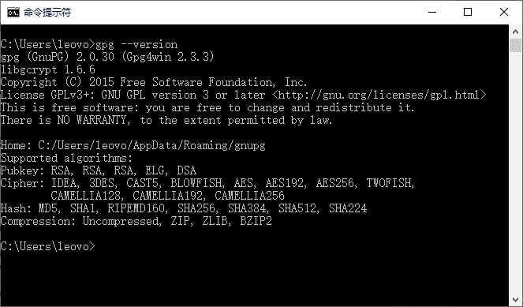
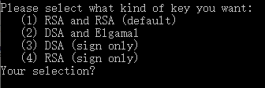
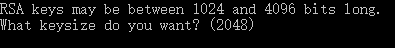
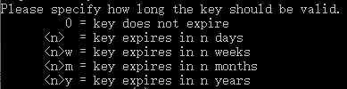
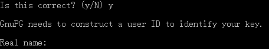
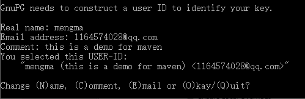
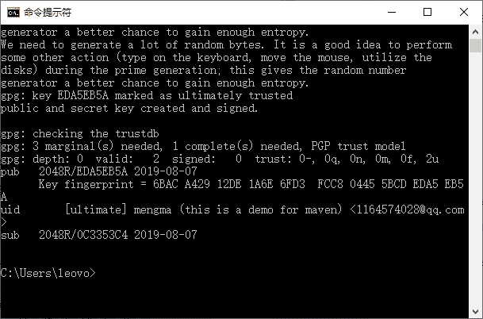
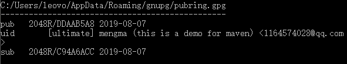
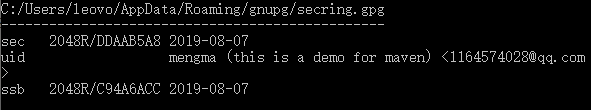

# GPG（GnuPG）的安装和使用

> 原文：[`c.biancheng.net/view/4832.html`](http://c.biancheng.net/view/4832.html)

基于网络的开源项目，能给用户带来在公共标准基础上的自由发挥，并且能很好地给每个自愿人士提供了共享贡献的机会。但是，同时也因为大众化给使用共享的程序员或团队带来了安全性问题。

当程序员从中央仓库下载第三方构件的时候，下载的文件有可能被另外一个人篡改过，从而破坏代码。为了确定下载的内容是正确的，一般在发布自己构件的同时，还会发布一个签名认证文件。

使用者在使用下载的第三方构件前，先通过签名验证后，确定没有被篡改后再安心使用。GPG 就是这样一个认证签名技术。

接下来就介绍如何使用 GPG 技术，为发布的 Maven 构件签名，从而提高项目的安全性。

GnuPG，简称 GPG，来自 [`www.gnupg.org`](http://www.gnupg.org)，是 GPG 标准的一个免费实现。不管是 Linux 还是 Windows 平台，都可以使用。GPGneng 可以为文件生成签名、管理密匙以及验证签名。

下面介绍如何使用 GPG 实现文件签名，并验证签名文件。

## 下载安装 GPG：访问 [`www.gnupg.org/download`](http://www.gnupg.org/download)，下载适合自己操作系统平台的安装程序。这里下载的是 Windows 平台的 gpg4win-2.3.3.exe。

安装完成后，打开 CMD 窗口，输入`gpg --version`，出现如图 1 信息表示安装成功：

图 1  显示结果
生成密钥对：在使用 GPG 之前，先要准备一个密钥对，即一个私钥，一个公钥。这样才能使用私钥对文件进行签名，将公钥分发到公钥服务器供其他用户下载，其他用户就可以使用公钥对签名进行验证。

在 CMD 命令行中，输入`gpg --gen-key`命令生成密钥对。

在 GPG 执行过程中会提示如下几个信息。

生成密钥类型，如图 2 所示。
图 2  生成密钥类型通过输入 1 或直接按 Enter 键（默认），选择第 1 项。

RSA keys 的大小，如图 3 所示。
图 3  RSA keys 的大小
输入一个介于 1024 到 4096 之间的整数，或直接按 Enter 键（默认 2048）。这里直接按 Enter 键，选择的是 2048。

密钥有效期，如图 4 所示。
图 4  密钥有效期
输入密钥有效时长，默认是 0，表示永不过期，输入一个数字 n，表示有效期为 n 天，当然也可以输入 nw、nm、ny，分别表示 n 周、n 月和 n 年。这里选择的是直接按 Enter 键，表示永不过期。

提示前面的选择是否正确（是否确认）。输入 y，表示确认；输入 n，表示要重新输入有效期。接下来的信息，是为了生成 GPG 唯一用户 ID 的信息。

输入开发者或团队名，如图 5 所示。
图 5  输入开发者或团队名

*   作为演示，这里输入 mengma。
*   联系邮箱地址输入 1164574028@qq.com。
*   备注输入：this is a demo for maven。

这时候会提示如下信息，显示生成的 USER-ID，如图 6 所示。

图 6  生成的 USER-ID
中间 mengma（this is a demo for maven）＜1164574028@qq.com＞为使用者 ID。

修改生成 USER-ID 的信息：

*   输入 N、C、E，分别用来修改名称、备注和邮件地址信息。
*   输入 Q 表示退出。
*   输入 O 表示进入下一步。

这里输入 O，按 Enter 键。输入私钥密码：这里输入自己的密码作为演示，输入的 12345678。接下来 GPG 会提示如图 7 信息，表示密钥对已经生成。

图 7  GPG 提示信息
查看公钥和私钥信息：在 CMD 命令行窗口中输入`gpg --list-keys`，查看本地公钥信息，列表如图 8 所示。

图 8  本地公钥信息
第一行显示公钥文件和所在的位置。

*   pub 行描述的是公钥大小（2048）／公钥 id（DDAAB5A8），公钥产生日期（2019-08-07）。
*   uid 行描述的是由名称、备注和邮件地址组成的字符串。
*   sub 行表述的是公钥的子钥（可以不用关心）。

在 CMD 命令行窗口中输入`gpg --list-secret-keys`，查看本地私钥信息，列表如下图 9 所示。

图 9  本地私钥信息
第一行显示密钥文件和所在的位置。

*   sec 行描述的是密钥大小（2048）、id（DDAAB5A8）和产生日期（2019-08-07）。
*   uid 行描述的是由名称、备注和邮件地址组成的字符串。
*   ssb 行描述的是密钥的子钥（可以不用关心）。

给文件创建签名文件：打开 CMD 命令行窗口，切换到 IMvnDemoDAO.java 文件所在的目录。输入 gpg-ab IMvnDemoDAO.java 命令，再输入前面生成密钥时输入的密码 12345678，会在当前目录下生成一个名叫 I MvnDemoDAO.java.asc 的签名文件。

分发公钥文件：为了让用户能方便地获取公钥文件，对下载的文件进行验证，需要将公钥文件发布到公共的公钥服务器上，如 hkp://pgp.mit.edu 是美国麻省理工学院提供的公钥服务器。

打开 CMD 命令行窗口，将目录切换到公钥文件所在的目录，输入如下命令将公钥文件分发到公钥服务器。

gpg --keyserver hkp://pgp.mit.edu --send-keys DDAAB5A8

“hkp://pgp.mit.edu”是公钥服务器名称。DDAAB5A8 是要发布的公钥 id（前面生成的密钥对中的公钥）。

显示如下信息，表示发布成功。

gpg: sending key DDAAB5A8 to hkp server pgp.mit.edu

有一点需要说明的是，只需往一台服务器上发布公钥就行，其他公钥服务器会自动同步。

导入公钥服务器上的公钥：为了验证下载的文件是否准确，需要先从公钥服务器上下载对应的公钥，导入本地 GPG 服务器中，才能使用 GPG 完成对下载文件的验证。

在 CMD 命令行窗口中输入`gpg--keyserver hkp://pgp.mit.edu--recv-keys DDAAB5A8` ，下载 DDAAB5A8 对应的公钥。

注：因为本地已经有这个公钥，所有下载后提示没有改变。

使用公钥验证下载的文件：打开 CMD 命令行窗口，切换到下载文件所在的目录（原始文件和签名文件），输入命令如下：

gpg --verify IMvnDemoDAO.java.asc

使用签名验证 IMvnDemoDAO.java 文件。

到现在为止，已经完成了 GPG 的安装、签名、分发和验证的流程。以后的 Maven 项目就可以直接使用现在生成的密钥对发布文件签名。

可继续阅读教程《Maven 使用 GPG 对文件进行签名加密》学习如何基于 Maven 的 GPG 插件自动完成构件签名。