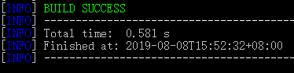
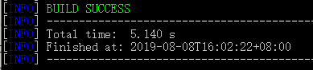
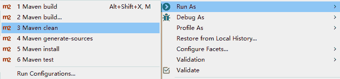
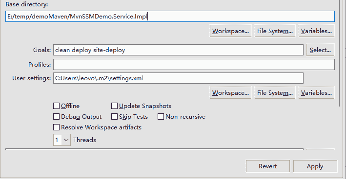

# Maven 生命周期和阶段详解

> 原文：[`c.biancheng.net/view/4899.html`](http://c.biancheng.net/view/4899.html)

在介绍 Maven 之前，项目构建的生命周期概念就已经存在了。软件开发人员每天都要对项目进行清理、编译、测试、打包以及安装部署。

虽然每个软件开发人员都做相关的事情，但公司和公司之间、项目和项目之间，往往目的一样，而实现的形式各种各样。有的项目基于 IDE 工具完成编译、打包和发布，比如 MyEclipse 和 Eclipse Java EE；有些是软件开发人员自己编写脚本，对项目进行自定义构件，比如 ant 脚本（当然，ant 脚本本身也是各写各的，都不一样）。

这些都是具有个性化和针对性的，到下一个项目后，又需要改造成新项目所需要的形式。因此就产生了一个问题：感觉是一样的，又不能重用，所以必须重写。

通过学习、分析、反思和总结以前工作中对项目的构建过程，Maven 抽象出了一个适合于所有项目的构建生命周期，并将它们统一规范。

具体步骤包括清理、初始化、编译、测试、打包、集成测试、验证、部署和生成站点。这些步骤几乎适合所有的项目，也就是说，所有项目的管理构建过程都可以对应到这个生命周期上来。

需要注意的是，Maven 中项目的构建生命周期只是 Maven 根据实际情况抽象提炼出来的一个统一标准和规范，是不能做具体事情的。也就是说，Maven 没有提供一个编译器能在编译阶段编译源代码。

既然 Maven 不做具体事情，那具体事情由谁做呢？好的思想、创意，最终都需要在做具体事情的实践中执行才有结果。

所以 Maven 只是规定了生命周期的各个阶段和步骤，具体事情，由集成到 Maven 中的插件完成。比如前面介绍的生成站点，就是由 maven-site-plugin 插件完成的。

Maven 在项目的构建过程中，只是在方向和步骤上面起到了管理和协调的作用。

Maven 在生命周期的每个阶段都设计了插件接口。用户可以在接口上根据项目的实际需要绑定第三方的插件，做该阶段应该完成的任务，从而保证所有 Maven 项目构建过程的标准化。当然，Maven 对大多数构建阶段绑定了默认的插件，通过这样的默认绑定，又简化和稳定了实际项目的构建。

## 深入生命周期

前面介绍了 Maven 生命周期的概念和思路，接下来详细介绍 Maven 生命周期的各个阶段，以及它们的意义和关系。

Maven 拥有三套独立的生命周期，它们分别是 clean、default 和 site。clean 生命周期的目的是清理项目；default 生命周期的目的是构建项目；site 生命周期的目的是建立项目站点。

每个生命周期又包含了多个阶段。这些阶段在执行的时候是有固定顺序的。后面的阶段一定要等前面的阶段执行完成后才能被执行。

比如 clean 生命周期，它就包含 pre-clean、clean 和 post-clean 三个阶段。用户调用 pre-clean 时，只有 pre-clean 阶段被执行；调用 clean 时，先执行 pre-clean，再执行 clean 阶段；同理，当调用 post-clean 时，Maven 自动先执行 pre-clean、再执行 clean，最后执行 post-clean。

下面详细介绍每套生命周期的各个阶段。

#### 1\. clean 生命周期

clean 生命周期的目的是清理项目，它包括以下三个阶段。

*   pre-clean：执行清理前需要完成的工作。
*   clean：清理上一次构建过程中生成的文件，比如编译后的 class 文件等。
*   post-clean：执行清理后需要完成的工作。

#### 2\. default 生命周期

default 生命周期定义了构建项目时所需要的执行步骤，它是所有生命周期中最核心部分，包含的阶段如下表所述，比较常用的阶段用粗体标记。

| 名称 | 说明 |
| validate | 验证项目结构是否正常，必要的配置文件是否存在 |
| initialize | 做构建前的初始化操作，比如初始化参数、创建必要的目录等 |
| generate-sources | 产生在编译过程中需要的源代码 |
| process-sources | 处理源代码，比如过滤值 |
| **generate-resources** | 产生主代码中的资源在 classpath 中的包 |
| **process-resources** | 将资源文件复制到 classpath 的对应包中 |
| **compile** | 编译项目中的源代码 |
| process-classes | 产生编译过程中生成的文件 |
| generate-test-sources | 产生编译过程中测试相关的代码 |
| process-test-sources | 处理测试代码 |
| **generate-test-resources** | 产生测试中资源在 classpath 中的包 |
| **process-test-resources** | 将测试资源复制到 classpath 中 |
| **test-compile** | 编译测试代码 |
| process-test-classes | 产生编译测试代码过程的文件 |
| **test** | 运行测试案例 |
| prepare-package | 处理打包前需要初始化的准备工作 |
| package | 将编译后的 class 和资源打包成压缩文件，比如 rar |
| pre-integration-test | 做好集成测试前的准备工作，比如集成环境的参数设置 |
| integration-test | 集成测试 |
| post-integration-test | 完成集成测试后的收尾工作，比如清理集成环境的值 |
| verify | 检测测试后的包是否完好 |
| **install** | 将打包的组件以构件的形式，安装到本地依赖仓库中，以便共享给本地的其他项目 |
| **deploy** | 运行集成和发布环境，将测试后的最终包以构件的方式发布到远程仓库中，方便所有程序员共享 |

这些阶段的详细介绍内容可以参考链接：
[`maven.apache.org/guides/introduction/introduction-to-the-lifecycle.html`](http://maven.apache.org/guides/introduction/introduction-to-the-lifecycle.html)

#### 3\. site 生命周期

site 生命周期的目的是建立和发布项目站点。Maven 可以基于 pom 所描述的信息自动生成项目的站点，同时还可以根据需要生成相关的报告文档集成在站点中，方便团队交流和发布项目信息。site 生命周期包括如下阶段。

*   pre-site：执行生成站点前的准备工作。
*   site：生成站点文档。
*   post-site：执行生成站点后需要收尾的工作。
*   site-deploy：将生成的站点发布到服务器上。

## 调用生命周期阶段

前面介绍了每套生命周期的各个阶段，那怎样通知 Maven 执行生命周期的哪个阶段呢？

有两种方式可以同 Maven 进行交互，一种是用 mvn 命令；另一种是在 M2Eclipse 中，使用对应的 Run As 菜单命令。

其实这两种方式在教程前面都介绍过，前面只是介绍的怎么操作，没有具体理论。接下来分别梳理一下这两种方式。

#### 1\. mvn 命令行指定执行周期阶段

这种方式都是在 CMD 命令行窗口中执行的，前提条件是要配置好安装的 Maven 环境变量（Path），并且将当前目录切换到 Maven 工程目录下。后面每个命令的例子都是基于 MvnSSMDemo.Service.Impl 工程进行的，它的当前目录是 E:\temp\demoMaven\MvnSSMDemo.Service.Impl。

1）mvn clean：调用 clean 生命周期的 clean 阶段，实际执行的是 clean 生命周期中的 pre-clean 和 clean 阶段，如图 1 所示。

图 1  mvn clean 提示
2）mvn test：该命令调用 default 生命周期中的 test 阶段。实际执行的阶段包括 validate、initialize、generate-sources…compile…test-compile、process-test-classes、test，也就是把 default 生命周期中从开始到 test 的所有阶段都执行完了，而且是按顺序执行。最后运行效果如图 2 所示。

图 2  mvn test 提示
3）mvn clean install：该命令调用 clean 生命周期的 clean 阶段和 default 生命周期的 install 阶段。

实际执行的是 clean 生命周期中的 pre-clean、clean 两个阶段和 default 生命周期中从开始的 validate 到 install 的所有阶段。

该命令结合了两个生命周期。在实际项目构建中，每执行一个行的构建，先清理以前构建的旧文件是一个好习惯。最后运行效果如图 3 所示。
图 3  mvn clean install 提示
4）mvn clean deploy site-deploy：该命令调用 clean 生命周期中的 pre-clean、clean 阶段，default 生命周期中从 validate 到 deploy 的所有阶段，以及 site 生命周期中的 pre-site、site、post-site 和 site-deploy 阶段。

最后的结果是把该项目编译、测试、打包好发布到远程仓库，同时还将生成好的站点发布到站点服务器。

#### 2\. M2Eclipse 指定执行周期阶段

在 MyEclipse 中，基于 M2Eclipse 执行生命周期的阶段思路，同前面基于命令操作是一样的。不同的是，M2Eclipse 用图形化界面的形式展现出来了，操作起来比较人性化。具体操作如下。

右击“工程”，选择 Run As 命令，后面就会显示常用的 Maven 执行生命周期阶段的命令，如图 4 所示。

图 4  M2Eclipse 的运行选项
其中，Maven clean 等同命令行的 mvn clean。Maven generate-sources 等同命令行的 mvn generate-sources。Maven install 等同命令行的 mvn install。Maven test 等同命令行的 mvn test。除了这些常用的命令可以直接执行外，也可以自定义 Maven 执行菜单命令。

选择 Maven build… 命令，出现如图 5 所示界面。

图 5  执行 Maven build…命令后出现配置目标
在 Goals 文本框中输入要执行的阶段名称，如图 5 所示，单击 Run 按钮，同执行 mvn clean deploy site-deploy 的效果一样。而且首次运行完成后，选择 Run As→Maven build 命令，可以选择以前输入过的生命周期阶段重复执行。