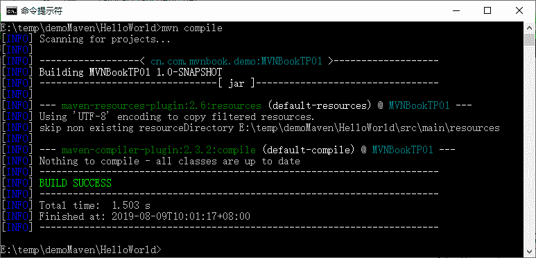

# Maven 插件的获取和配置

> 原文：[`c.biancheng.net/view/4951.html`](http://c.biancheng.net/view/4951.html)

通过《Maven 生命周期和阶段详解》教程的学习，可以知道 Maven 只是对项目的构建过程进行了统一的抽象定义和管理。至于每个阶段由谁来做，Maven 自己不去实现，而是让对应的插件去完成。这就是插件的作用。

比如 maven-compile-plugin 就可以完成在 compile 阶段 Java 源代码的编译任务。

但是从插件本身来说，一个插件可以实现生命周期多个阶段的任务，比如 maven-dependency-plugin 就可以实现十多个功能：分析项目的依赖功能；列出项目的依赖树；分析依赖的来源等。

为方便指定执行插件的某个功能，将插件的每个功能叫目标。这样就可以实现在哪个阶段，执行哪个插件，达到哪个目标。比如“dependency:analyze”，表示 maven-dependency-plugin 的分析目标；“dependency:tree”表示 maven-dependency-plugin 列出依赖的目标。

## 插件同生命周期阶段的绑定

前面介绍了插件的作用和目标，但是最终的目的是要将插件的功能集成到 Maven 生命周期的相关阶段中去，让 Maven 构建工程时自动调用插件完成指定的任务。

应如何让 Maven 的生命周期同插件实现相互绑定，来完成实际的构建任务呢？

比如 maven-compile-plugin 插件的 compile 目标能完成编译任务，而且 Maven 的 default 生命周期的 compile 阶段，定义好要实现源代码编译。

那么用户怎样将 maven-compile-plugin 插件的 compile 目标绑定到 default 生命周期的 compile 阶段，让 Maven 构建项目到 compile 阶段的时候，能自动执行插件的 compile 目标呢？

实现生命周期的阶段同插件目标的绑定，一共有两种方式：内置绑定和自定义绑定。

#### 1\. 内置绑定

为了让用户方便使用 Maven，少进行配置甚至不用配置，就需要用 Maven 构建项目。Maven 在安装好后，自动为生命周期的主要阶段绑定很多插件的目标。

当用户通过命令或图形界面执行生命周期的某个阶段时，对应的插件目标就会自动执行，从而完成任务。

maven-clean-plugin 插件有个目标叫 clean，它的作用是删除项目构建时产生的输出目录。maven-clean-plugin 的 clean 目标，默认就绑定在 clean 生命周期的 clean 阶段。也就是说，当执行 mvn clean 时，Maven 在 clean 阶段自动调用 maven-clean-plugin 的 clean 目标，删除构建的输出目录。

同样地，maven-site-plugin 插件有两个目标：site 目标，用来生成项目站点；deploy 目标，用来将生成的站点发布到站点服务器上去。Maven 默认将 site 目标绑定在 site 生命周期的 site 阶段；将 deploy 目标绑定在 site 生命周期的 site-deploy 阶段。

default 生命周期就比较复杂了，不仅仅复杂在有那么多的阶段，还复杂在 Java 可以打成不同的包（jar、war 和 ear 等）。不同的包在不同的阶段是不一样的绑定。

当然，也可以通过运行 Maven 命令，在命令提示信息中查看阶段和插件目标的绑定。比如在 CMD 命令行窗口中输入 Maven compile，可以查看到如图 1 日志。


图 1  运行日志
根据日志，可以查看出 default-resources 阶段绑定的是“maven-resources-plugin:2.6:resources”目标；default-compile 阶段绑定的是“maven-compile-plugin:2.3.2:compile”目标。

#### 2\. 自定义绑定

除了 Maven 内置的绑定外，也可以指定在某个阶段绑定某个插件的某个目标。这样就使得 Maven 在构建项目时能执行更多的任务。比如，有时用户希望在构建工程时能将源代码打成 jar 包（安装 JDK 的时候是可以选择安装 src.jar 的，这样可以学习 JDKAPI 的源代码）。

这样的任务，Maven 没有内置绑定到生命周期的阶段上。所以这就需要用户自己配置了。maven-source-plugin 中有个 jar-no-forkmub，能将项目中的主代码打成 jar 文件。这样就可以将该目标绑定到 default 生命周期的指定阶段，比如 verify 阶段。这样的配置可以加在 pom.xml 中，参考 pom.xml 配置代码如下：

```

<project>
    ...
    <build>
        <plugins>
            ...
            <plugin>
                <groupId>org.apache.maven.plugins</groupId>
                <artifactId>maven-source-plugin</artifactId>
                <version>3.0.0</version>
                <executions>
                    <execution>
                        <id>att-sources</id>
                        <phase>verify</phase>
                        <goals>
                            <goal>jar-no-fork</goal>
                        </goals>
                    </execution>
                </executions>
            </plugin>
        </plugins>
    </build>
    ...
</project>
```

在 build 下的 plugins 中配置了一个插件，名叫 maven-source-plugin。它的 groupId 为 org.apache.maven.plugins，artifactId 为 maven-source-plugin，version 为 3.0.0。这里需要说明的是，自定义插件尽量使用非快照版本，这样可以避免因为插件版本的不稳定，从而影响构件的不稳定。

除了要指定需要绑定的插件外，还要通过 executions 下的 execution 子元素配置执行任务，指定任务的 id 和任务目标，还有绑定到生命周期的哪个阶段。phase 元素配置的是绑定的阶段（verify），goals 中的 goal 描述 jar-no-fork。

在 CMD 命令行窗口中输入 mvn verify 命令，可以看到如下信息输出。

[INFO]
[INFO] --- maven-jar-plugin:2.4:jar (default-jar) @ MvnSSMDemo.Service.Impl ---
[INFO]
[INFO] --- maven-source-plugin:3.0.0:jar-no-fork (att-sources) @ MvnSSMDemo.Service.Impl 

最后表示执行了 id 为 att-sources，插件目标为 maven-source-plugin:3.0.0:jar-no-fork 的任务。在工程的 target 目录下会发现有个 MvnSSMDemo.Service.Impl-0.0.1-SNAPSHOT-sources.jar 文件，这里面就是工程中的所有主代码。

细心的话，会发现若不在 phase 中指定要绑定的生命周期阶段，也会得到同样的结果。比如，把 pom.xml 文件中的 phase 这行删除，再执行一次 mvn verify 命令，会发现同样在 verify 阶段执行 maven-source-plugin:jar-no-fork 目标。为什么呢？因为很多插件的目标在插件编写的时候，就已经指定了默认的绑定阶段。

为了了解插件绑定的默认生命周期阶段，可以运行如下命令查看。

mvn help:describe -Dplugin=org.apache.maven.plugins:maven-source-plugin:3.0.0 -Ddetail

在这些信息中，可以看到关于 jar-no-fork 的描述如下：

...
source:jar-no-fork
  Description: This goal bundles all the sources into a jar archive. This
    goal functions the same as the jar goal but does not fork the build and is
    suitable for attaching to the build lifecycle.
  Implementation: org.apache.maven.plugins.source.SourceJarNoForkMojo
  Language: java
  Bound to phase: package
...

通过 Bound to phase:package 可以了解到，jar-no-fork 默认绑定的生命周期阶段是 package。

最后需要说明的是，在给不同的生命周期阶段绑定不同的插件目标后，这些目标的执行自然是按阶段的顺序逐个执行。如果在一个阶段上绑定了多个目标，效果会如何呢？很简单，都执行，而且是按插件声明的顺序执行。

## 插件参数配置

完成插件目标同生命周期阶段的绑定后，Maven 在构建工程时会自动执行绑定插件的目标任务。但是有很多情况需要给即将执行的目标制定参数，让执行的任务更加适合当前项目的需要，而且几乎所有的 Maven 插件目标都有一些参数可以设置。

可以通过命令行和 pom 配置两种方式给这些目标设置比较合适的参数值。接下来分别介绍这两种配置参数的方式。

#### 1\. 命令行配置参数

在 Maven 命令中，使用 -D 后面接参数名称＝参数值的方式配置目标参数。

比如，maven-surefire-plugin 插件中提供了一个 maven.test.skip 参数，当它的值为 true 时，就不会执行 test 案例。具体语法是：

Mvn install -Dmaven.test.skip=true

可以从输入的 info 信息中查看到，没有测试案例部分信息，也就是没有执行测试。

#### 2\. pom 配置参数

对于有些参数在项目创建好后，目标每次执行的时候都不需要改变，这时候比较好的方式是把这些值配置到 pom.xml 中，这样就省去每次构建的时候都需要输入的麻烦。

通过在命令行中输入：Mvn help:describe-Dplugin＝org.apache.maven.plugins:maven-compiler-plugin:3.5.1-Ddetail 命令，会发现 compile 目标中有一堆参数，其中有如下内容。

source (Default: 1.5)
    User property: maven.compiler.source
    The -source argument for the Java compiler.
staleMillis (Default: 0)
    User property: lastModGranularityMs
    Sets the granularity in milliseconds of the last modification date for
    testing whether a source needs recompilation.
target (Default: 1.5)
    User property: maven.compiler.target
    The -target argument for the Java compiler.

这里有 source 和 target 两个参数的介绍，可以通过 pom.xml 做如下配置，指定这两个参数的值。

```

<project>
    ...
    <build>
        <plugins>
            <plugin>
                <groupId>org.apache.maven.plugins</groupId>
                <artifactId>maven-compiler-plugin</artifactId>
                <version>3.5.1</version>
                <configuration>
                    <source>1.5</source>
                    <target>1.5</target>
                </configuration>
            </plugin>
            ...
        </plugins>
    </build>
    ...
</project>
```

通过<source＞1.5＜/source＞与＜target＞1.5＜/target＞这两个配置指定编译 Java 1.5 的源代码，生成于 JVM 1.5 兼容的字节码文件，也就是 class 文件。

当然，前面这种配置是给 maven-compiler-plugin 插件配置的一个全局参数值，也就是说不管是使用 maven-compiler-plugin 编译工程代码，还是测试代码，都会使用 source＝1.5，target＝1.5 这两个值。

如果需要给特定的任务指定特定的值该怎么办呢？很简单，直接在配置任务的 execution 中添加 configuration 元素，内容同前面的一样。

<configuration>
    <source>1.5</source>
    <target>1.5</target>
</configuration>

这样的两个值就只对当前任务有效了。

## 获取插件信息

到现在为止，用户可以基本掌握怎么配置插件了，但还是不够完美。因为毕竟在教程中介绍的插件是有限的，而且对每个插件的使用，只是根据需要使用的有限的、有代表意义的目标。

在实际项目中可能需要使用更多更合适的插件。那到底要使用哪些插件呢？所以首先得找到用户自己认为合适的插件，再了解这些插件的配置情况及相关参数的详细情况。

由于插件非常多，而且插件的数量每天还都在增加。而大部分插件没有完善的帮助文档，用户要想找到一个正确的插件也不是一件容易的事情。下面介绍查找插件信息的方法。

#### 1\. 在线查找插件

目前，插件基本上都来源于两处，一个是 Apache；另一个是 Codehaus。因为 Maven 本身就来自 Apache 软件基金会，所有在 Apache 上有很多 Maven 的官方插件，而且每天有很多人在使用这些插件，这些插件都经过了很多项目的实际考验，所以它们比较可靠。

通过访问 [`maven.apache.org/plugins/index.html`](http://maven.apache.org/plugins/index.html) 页面可以看到所有插件的列表信息，进入后，可以进一步了解每个插件的详细信息，当然，也可以通过 [`maven.apache.org/maven2/org/apache/maven/plugins/`](http://maven.apache.org/maven2/org/apache/maven/plugins/) 下载需要的插件。

除了 Apache 官方插件外，托管在 Codehaus 上的 Mojo 项目也提供了大量的 Maven 插件，可以通过 [`mojo.codehaus.org/plugins.html`](http://mojo.codehaus.org/plugins.html) 访问详细列表。

同样，可以通过 [`repository.codehaus.org/org/codehaus/mojo`](http://repository.codehaus.org/org/codehaus/mojo) 下载插件。美中不足的是，这些插件的文档和可靠性相对不是很好，在使用过程中如果遇到问题，往往需要自己查看源代码进行修复。

#### 2\. 使用 maven-help-plugin 查看插件

除了通过访问在线文档了解某个插件的详细信息外，还可以借助 maven-help-plugin 插件来获取插件的详细信息。比如，在 CMD 命令行窗口中运行如下命令。

Mvn help:describe -Dplugin=org.apache.maven.plugins:maven-site-plugin:3.4 -Ddetail

就可以查看到 maven-site-plugin 插件 3.4 版本的详细信息，内容很多，如下列出的是开始的几个基本信息。

Name: Apache Maven Site Plugin
Description: The Maven Site Plugin is a plugin that generates a site for the
  current project.
Group Id: org.apache.maven.plugins
Artifact Id: maven-site-plugin
Version: 3.4
Goal Prefix: site
This plugin has 9 goals:
site:attach-descriptor
  Description: Adds the site descriptor (site.xml) to the list of files to be
    installed/deployed.
    For Maven-2.x this is enabled by default only when the project has pom
    packaging since it will be used by modules inheriting, but this can be
    enabled for other projects packaging if needed.
    This default execution has been removed from the built-in lifecycle of
    Maven 3.x for pom-projects. Users that actually use those projects to
    provide a common site descriptor for sub modules will need to explicitly
    define this goal execution to restore the intended behavior.
  Implementation: org.apache.maven.plugins.site.SiteDescriptorAttachMojo
  Language: java
  Bound to phase: package

当然，如果不想查看太多，只是想具体了解插件的某个目标，可以用 -Dgoal＝目标的方式查看指定目标的信息，比如运行如下命令，可以查看 site 插件的 site 目标信息。

Mvn help:describe -Dplugin=site -Dgoal=site -Ddetail

输出信息：

[INFO] Mojo: 'site:site'
site:site
  Description: Generates the site for a single project.
    Note that links between module sites in a multi module build will not work,
    since local build directory structure doesn't match deployed site.
  Implementation: org.apache.maven.plugins.site.render.SiteMojo
  Language: java

  Available parameters:

    attributes
      Additional template properties for rendering the site. See Doxia Site
      Renderer.

    generatedSiteDirectory (Default: ${project.build.directory}/generated-site)
      Directory containing generated documentation. This is used to pick up
      other source docs that might have been generated at build time.

    generateProjectInfo (Default: true)
      User property: generateProjectInfo
      Whether to generate the summary page for project reports:
      project-info.html.

    generateReports (Default: true)
      User property: generateReports
      Convenience parameter that allows you to disable report generation.

    generateSitemap (Default: false)
      User property: generateSitemap
      Generate a sitemap. The result will be a 'sitemap.html' file at the site
      root.

    inputEncoding (Default: ${project.build.sourceEncoding})
      User property: encoding
      Specifies the input encoding.

    locales (Default: en)
      User property: locales
      A comma separated list of locales to render. The first valid token will
      be the default Locale for this site.

    moduleExcludes
      Module type exclusion mappings ex: fml -> **/*-m1.fml (excludes fml files
      ending in '-m1.fml' recursively)
      The configuration looks like this:

        <moduleExcludes>
          <moduleType>filename1.ext,**/*sample.ext</moduleType>
          <!-- moduleType can be one of 'apt', 'fml' or 'xdoc'. -->
          <!-- The value is a comma separated list of           -->
          <!-- filenames or fileset patterns.                   -->
          <!-- Here's an example:                               -->
          <xdoc>changes.xml,navigation.xml</xdoc>
        </moduleExcludes>

    outputDirectory (Default: ${project.reporting.outputDirectory})
      User property: siteOutputDirectory
      Directory where the project sites and report distributions will be
      generated.

    outputEncoding (Default: ${project.reporting.outputEncoding})
      User property: outputEncoding
      Specifies the output encoding.

    relativizeDecorationLinks (Default: true)
      User property: relativizeDecorationLinks
      Make links in the site descriptor relative to the project URL. By
      default, any absolute links that appear in the site descriptor, e.g.
      banner hrefs, breadcrumbs, menu links, etc., will be made relative to
      project.url.
      Links will not be changed if this is set to false, or if the project has
      no URL defined.

    saveProcessedContent
      Whether to save Velocity processed Doxia content (*.<ext>.vm) to
      ${generatedSiteDirectory}/processed.

    siteDirectory (Default: ${basedir}/src/site)
      Directory containing the site.xml file and the source for hand written
      docs (one directory per Doxia-source-supported markup types): see Doxia
      Markup Languages References).

    skip (Default: false)
      User property: maven.site.skip
      Set this to 'true' to skip site generation and staging.

    templateFile
      User property: templateFile
      The location of a Velocity template file to use. When used, skins and the
      default templates, CSS and images are disabled. It is highly recommended
      that you package this as a skin instead.

    validate (Default: false)
      User property: validate
      Whether to validate xml input documents. If set to true, all input
      documents in xml format (in particular xdoc and fml) will be validated
      and any error will lead to a build failure.

    xdocDirectory (Default: ${basedir}/xdocs)
      Alternative directory for xdoc source, useful for m1 to m2 migration
      Deprecated. use the standard m2 directory layout

命令中的 -Dplugin＝site 通过插件的前缀来指定要查看的插件名称，与写成 -Dplugin＝org.apache.maven.plugins:maven-site-plugin:3.6 是一样的意思。

*   -Dgoal＝site，指定要查看的目标，名称是 site。
*   -Ddetail，表示要查看详细信息。