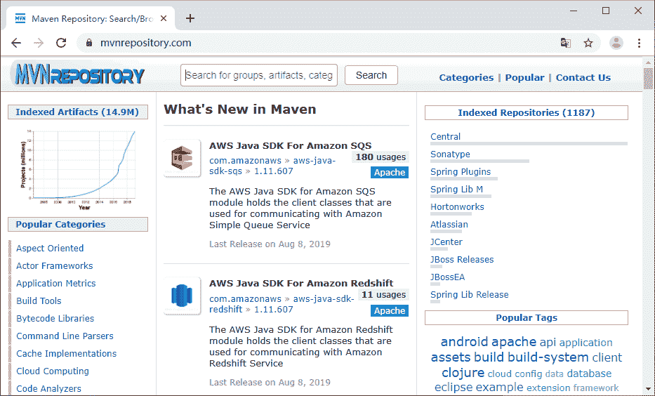

# Maven 配置镜像仓库

> 原文：[`c.biancheng.net/view/5001.html`](http://c.biancheng.net/view/5001.html)

如果仓库 A 能提供仓库 B 存储的所有服务，那么就把 A 叫作 B 的镜像。比如 [`maven.net.cn/content/groups/public`](http://maven.net.cn/content/groups/public) 就是中央仓库 [`repo1.maven.org/maven2/`](http://repo1.maven.org/maven2/) 在中国的镜像。

由于地理位置的因素，该镜像往往能够提供比中央仓库更快的服务。所以，为了提高 Maven 效率，可以通过配置文件用镜像代替。修改的 settings.xml 如下所示。

```

<settings>
    ...
    <mirrors>
        <mirror>
            <id>maven.net.cn</id>
            <name>中央仓库在中国的镜像</name>
            <url>http://maven.net.cn/content/groups/public/</url>
            <mirrorOf>central</mirrorOf>
        </mirror>
        ...
    </mirrors>
    ...
</settings>
```

上面代码中，mirrorOf 的值为 central，表示该配置为 id 为 central 仓库的镜像，也就是中央仓库的镜像。任何对中央仓库的请求都会转向到这个镜像，也可以用同样的方式配置其他仓库的镜像。

另外三个元素：id、name 和 url 同以前配置仓库信息一样，表示镜像的唯一标记、名称和地址。同样，如果镜像服务器需要认证的话，也可以根据这个 id 配置一个对应的仓库认证。

其实在实际工作中，关于镜像有一个最常见的用法，那就是结合私服使用。由于私服是用来代替所有的外部公共仓库的，包括中央仓库，所以对于团队内部的 Maven 用户来说，使用一个私服地址就等于使用了所有的外部仓库。

这样就可以将对外部远程仓库的访问配置都集成到私服上来，从而简化 Maven 本身的配置。为达到这样的目标，可以配置一个如下内容的镜像。

```

<settings>
    ...
    <mirrors>
        <mirror>
            <id>internal-repository</id>
            <name>Internal Repository Manager</name>
            <url>http://192.168.1.207:8080/repository/internal</url>
            <mirrorOf>*</mirrorOf>
        </mirror>
        ...
    </mirrors>
    ...
</settings>
```

上面配置信息中，mirrorOf 的值为 *，表示是所有 Maven 仓库的镜像。任何对远程仓库的请求都会转向到 207 这台计算机的私服上去。如果私服需要认证，统一配置一个 id 为 internal-repository 的 server 就可以了。

当然，关于 mirrorOf 还有一些特别的配置方式。

*   <mirrorOf>*</mirrorOf>：匹配所有的远程仓库。
*   <mirrorOf>external:*</mirrorOf>：匹配所有的远程仓库，使用 localhost、file:// 协议的除外。也就是说，匹配所有非本地的远程仓库。
*   <mirrorOf>r1，r2</mirrorOf>：匹配指定的几个远程仓库，每个仓库之间用逗号隔开。
*   <mirrorOf>*，! r1，r2</mirrorOf>：匹配除了指定仓库外的所有仓库，“!”后面的仓库是被排除外的。

## 仓库搜索服务

在实际开发过程中，用户可能只知道需要使用的构件项目名称，但是在 Maven 依赖配置中，一定要指定详细的坐标信息。这时候，就可以使用仓库的搜索服务，根据构件的关键字来查找 Maven 的详细坐标。所以接下来介绍一个常用的 Maven 仓库搜索服务：MVNRepository。

MVNRepository 的界面相对比较简洁清新。它提供基于关键字搜索、依赖声明代码片段、构件下载、构件所包含信息等功能。如图 1 所示是 MVNRepository 的界面。


图 1  中央仓库首页