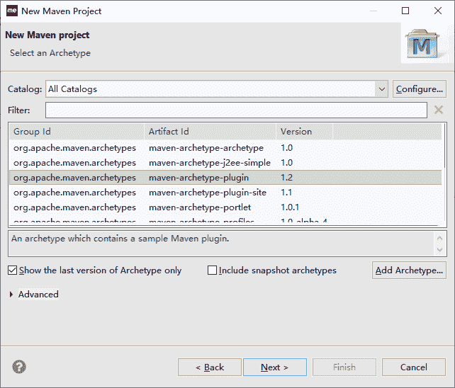
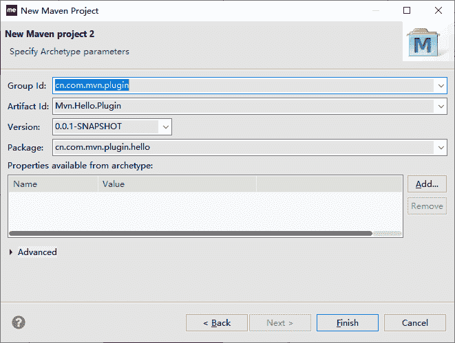

# Maven 自定义插件的实现

> 原文：[`c.biancheng.net/view/5294.html`](http://c.biancheng.net/view/5294.html)

为了快速学习自定义 Maven 插件的过程，接下来将实现一个简单的 Hello Maven 插件，功能很简单：输出 Hello World 插件。具体步骤和操作如下。

创建 Maven 新项目，选择 maven-archetype-plugin 项目向导，如图 1 所示。


图 1  选择 Archetype
单击 Next 按钮，进入设置 Maven 插件参数界面，输入要创建的插件的 groupId、artifactId 和版本，还有包名，如图 2 所示。


图 2  输入坐标
单击 Finish 按钮，Archetype 插件会自动创建好一个 Maven 插件项目。因为现在用的 Maven 是 3.x 版本的，所以有必要调整 Maven 插件项目必须依赖的 maven-plugin-api 的版本：从 2.x 改成 3.x。这里用的是 3.3.9 版本。样例项目中的 pom 配置如下，注意粗体标识部分。

```

<?xml version="1.0" encoding="UTF-8"?>
<project xmlns="http://maven.apache.org/POM/4.0.0"
    xmlns:xsi="http://www.w3.org/2001/XMLSchema-instance"
    xsi:schemaLocation="http://maven.apache.org/POM/4.0.0 http://maven.apache.org/xsd/maven-4.0.0.xsd">
    <modelVersion>4.0.0</modelVersion>

    <groupId>cn.com.mvn.plugin</groupId>
    <artifactId>Mvn.Hello.Plugin</artifactId>
    <version>0.0.1-SNAPSHOT</version>
    <packaging>maven-plugin</packaging>
    <name>Mvn.Hello.Plugin Maven Plugin</name>
    <!-- FIXME change it to the project's website -->
    <url>http://maven.apache.org</url>
    <properties>
        <project.build.sourceEncoding>UTF-8</project.build.sourceEncoding>
    </properties>

    <dependencies>
        <dependency>
            <groupId>org.apache.maven</groupId>
            <artifactId>maven-plugin-api</artifactId>
            <version>3.3.9</version>
        </dependency>
        <dependency>
            <groupId>org.apache.maven.plugin-tools</groupId>
            <artifactId>maven-plugin-annotations</artifactId>
            <version>3.2</version>
            <scope>provided</scope>
        </dependency>
        <dependency>
            <groupId>org.codehaus.plexus</groupId>
            <artifactId>plexus-utils</artifactId>
            <version>3.0.8</version>
        </dependency>
        <dependency>
            <groupId>junit</groupId>
            <artifactId>junit</artifactId>
            <version>4.7</version>
            <scope>test</scope>
        </dependency>
    </dependencies>

    <build>
        <plugins>
            <plugin>
                <groupId>org.apache.maven.plugins</groupId>
                <artifactId>maven-plugin-plugin</artifactId>
                <version>3.2</version>
                <configuration>
                    <goalPrefix>Mvn.Hello.Plugin</goalPrefix>
                    <skipErrorNoDescriptorsFound>true</skipErrorNoDescriptorsFound>
                </configuration>
                <executions>
                    <execution>
                        <id>mojo-descriptor</id>
                        <goals>
                            <goal>descriptor</goal>
                        </goals>
                    </execution>
                    <execution>
                        <id>help-goal</id>
                        <goals>
                            <goal>helpmojo</goal>
                        </goals>
                    </execution>
                </executions>
            </plugin>
        </plugins>
    </build>
    <profiles>
        <profile>
            <id>run-its</id>
            <build>
                <plugins>
                    <plugin>
                        <groupId>org.apache.maven.plugins</groupId>
                        <artifactId>maven-invoker-plugin</artifactId>
                        <version>1.7</version>
                        <configuration>
                            <debug>true</debug>
                            <cloneProjectsTo>${project.build.directory}/it</cloneProjectsTo>
                            <pomIncludes>
                                <pomInclude>*/pom.xml</pomInclude>
                            </pomIncludes>
                            <postBuildHookScript>verify</postBuildHookScript>
                            <localRepositoryPath>${project.build.directory}/local-repo
                            </localRepositoryPath>
                            <settingsFile>src/it/settings.xml</settingsFile>
                            <goals>
                                <goal>clean</goal>
                                <goal>test-compile</goal>
                            </goals>
                        </configuration>
                        <executions>
                            <execution>
                                <id>integration-test</id>
                                <goals>
                                    <goal>install</goal>
                                    <goal>integration-test</goal>
                                    <goal>verify</goal>
                                </goals>
                            </execution>
                        </executions>
                    </plugin>
                </plugins>
            </build>
        </profile>
    </profiles>
</project>
```

到现在为止，基本上创建好了 Maven 插件项目。

在 cn.com.mvn.plugin.hello 包下，创建 Java 类 HelloName，继承 AbstractMojo，并且在类上面使用 @goal 指定该 Mojo 的目标名称为 name，样例配置代码如下：

```

package cn.com.mvn.plugin.hello;

import org.apache.maven.plugin.AbstractMojo;
import org.apache.maven.plugin.MojoExecutionException;
import org.apache.maven.plugin.MojoFailureException;

/**
* @goal name
*/
public class HelloName extends AbstractMojo {
    public void execute() throws MojoExecutionException, MojoFailureException {
    }
}
```

在前面的代码基础上添加一个 name 属性，用来接收运行插件的时候传过来的 name 参数，并且使用 @parameter 将 name 属性标注成配置点，样例配置代码如下：

```

package cn.com.mvn.plugin.hello;

import org.apache.maven.plugin.AbstractMojo;
import org.apache.maven.plugin.MojoExecutionException;
import org.apache.maven.plugin.MojoFailureException;

/**
* @goal name
*/
public class HelloName extends AbstractMojo {
    /**
     * @parameter expression="${name}"
     * @required
     * @readonly
     */
    String name;

    public void execute() throws MojoExecutionException, MojoFailureException {

    }
}
```

在 HelloName 类中的 execute() 方法中添加插件要实现的逻辑代码。这里的 HelloName 的功能很简单，只是打印问候，所以样例配置代码如下：

```

package cn.com.mvn.plugin.hello;

import org.apache.maven.plugin.AbstractMojo;
import org.apache.maven.plugin.MojoExecutionException;
import org.apache.maven.plugin.MojoFailureException;

/**
* @goal name
*/
public class HelloName extends AbstractMojo {
    /**
     * @parameter expression="${name}"
     * @required
     * @readonly
     */
    String name;

    public void execute() throws MojoExecutionException, MojoFailureException {
        System.out.println("Hello" + name);
    }
}
```

这个插件的目的是打印对 name 的问候。如果 name 为空，或是空字符串，这样的问候就没什么意义了。用户就需要中止问候，并且以日志方式提示用户，样例配置代码如下：

```

package cn.com.mvn.plugin.hello;

import org.apache.maven.plugin.AbstractMojo;
import org.apache.maven.plugin.MojoExecutionException;
import org.apache.maven.plugin.MojoFailureException;

/**
* @goal name
*/
public class HelloName extends AbstractMojo {
    /**
     * @parameter expression="${name}"
     * @required
     * @readonly
     */
    String name;

    public void execute() throws MojoExecutionException, MojoFailureException {
        if (this.name == null || this.name.trim().equals("")) {
            // 异常处理
            throw new MojoExecutionException("name 参数必须设置有效的值");
        } else {
            System.out.println("Hello" + name);
            // 日志处理
            this.getLog().info("这是运行日志提示: 执行完问候");
        }
    }
}
```

到现在为止，HelloName Maven 插件的编写就完成了。要进行插件测试的话，还需要将自定义插件安装好，如果要共享给其他开发人员的话，还必须安装到私服或外面的中央仓库中。

运行 mvn install 就可以完成在本地仓库的安装，如果要安装私服或中央仓库，请参考《Apache 基金会的 Archiva 服务器的搭建步骤》和《Maven 私服的配置和使用》教程。

在命令行中输入如下命令。

Mvn cn.com.mvn.plugin:Mvn.Hello.Plugin:name -Dname=zhangsan

命令执行效果如下：

[INFO] ------------------------------------------------------------------------
[INFO]
[INFO] --- Mvn.Hello.Plugin:0.0.1-SNAPSHOT:name (default-cli) @ MvnDemoPlugin ---
Hello lisi
[INFO] 这是运行日志提示：执行完问候
[INFO] ------------------------------------------------------------------------
[INFO] BUILD SUCCESS
[INFO] ------------------------------------------------------------------------
[INFO] Total time: 1.139 s
[INFO] Finished at: 2017-01-08T11:55:48+08:00
[INFO] Final Memory: 8M/108M
[INFO] ------------------------------------------------------------------------

创建一个简单的 Maven 项目，在它的 pom 中添加 HelloName 插件如下：

```

<build>
    <plugins>
        <plugin>
            <groupId>cn.com.mvn.plugin</groupId>
            <artifactId>Mvn.Hello.Plugin</artifactId>
            <version>0.0.1-SNAPSHOT</version>
            <executions>
                <execution>
                    <goals>
                        <goal>name</goal>
                    </goals>
                    <phase>test</phase>
                </execution>
            </executions>
            <configuration>
                <name>lisi</name>
            </configuration>
        </plugin>
    </plugins>
</build>
```

执行 mvn test，可以看到如下日志。

Tests run: 1, Failures: 0, Errors: 0, Skipped: 0
[INFO]
[INFO] --- Mvn.Hello.Plugin:0.0.1-SNAPSHOT:name (default) @ MvnDemoPlugin ---
Hello lisi
[INFO] 这是运行日志提示：执行完问候
[INFO] ------------------------------------------------------------------------
[INFO] BUILD SUCCESS