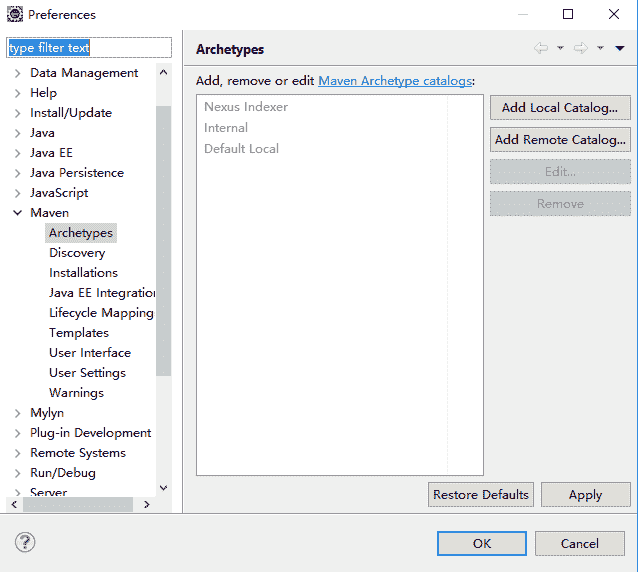
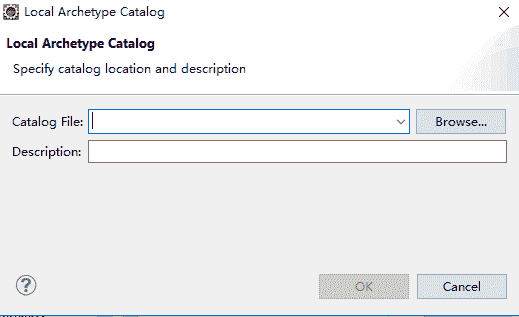

# Archetype 数据库的介绍和使用

> 原文：[`c.biancheng.net/view/5299.html`](http://c.biancheng.net/view/5299.html)

Archetype 创建项目的时候，如果没有指定具体的 Archetype 插件的坐标，maven-archetype-plugin 会提供一个 Archetype 列表选择。

在基于 M2Eclipse 插件的 MyEclipse 中创建项目的时候，也会可视化地显示所有的 Archetype 插件供选择。那这些列表 内容来源于哪里呢？这就涉及了 Archetype 数据库。

## Archetype 数据库简介

Archetype 数据库实际上就是 archetype-catalog.xml 文件，里面描述了对应 Archetype 插件的坐标。当使用 maven-archetype-plugin 创建 Maven 项目的时候，如果没有指定具体的插件坐标，maven-archetype-plugin 就会读取 archetype-catalog.xml 中的信息，形成列表供用户选择使用。

如下是一个简单的 archetype-catalog.xml 样例，包含了 webapp-jee5 和 webapp-javaee6 两个 Archetype。

```

<?xml version="1.0" encoding="UTF-8"?>
<archetype-catalog
    xsi:schemaLocation="http://maven.apache.org/plugins/maven-archetype-plugin/archetype-catalog/1.0.0 
        http://maven.apache.org/xsd/archetype-catalog-1.0.0.xsd"
    xmlns="http://maven.apache.org/plugins/maven-archetype-plugin/archetype-catalog/1.0.0"
    xmlns:xsi="http://www.w3.org/2001/XMLSchema-instance">
    <archetypes>
        <archetype>
            <groupId>org.codehaus.mojo.archetypes</groupId>
            <artifactId>webapp-jee5</artifactId>
            <version>1.3</version>
            <repository>
                https://mvnrepository.com/artifact/org.codehaus.mojo.archetypes/webapp-jee5
            </repository>
        </archetype>
        <archetype>
            <groupId>org.codehaus.mojo.archetypes</groupId>
            <artifactId>webapp-javaee6</artifactId>
            <version>1.3</version>
            <repository></repository>
        </archetype>
    </archetypes>
</archetype-catalog>
```

通过上面 archetype-catalog.xml 的了解，Archetype 也是通过坐标（groupId、artifactId、version）唯一定位的。另外，还有一个 repository 元素，指定查找 Archetype 的位置，默认是 Maven 的中央仓库。

maven-archetype-plugin 能读到的 archetype-catalog.xml 有如下几种。

#### 1）Interal

maven-archetype-plugin 内置的 Archetype Catalog，有五六十个 Archetype。

#### 2）Local

用户本地的 Archetype Catalog，目录是：用户/.m2/archetype-catalog.xml。默认情况该文件不存在，可以在对应目录下添加。

#### 3）Remote

Maven 中央仓库的 Archetype Catalog，具体位置是 [`repo1.maven.org/maven2/archetype-catalog.xml`](http://repo1.maven.org/maven2/archetype-catalog.xml)。

#### 4）File

指定本地任何位置的 archetype-catalog.xml。

#### 5）HTTP

使用 HTTP 协议，指定网络中的远程 archetype-catalog.xml。

如果执行 Maven 命令的话，可以在“mvn archetype:generate”后面使用 archetypeCatalog 参数，指定 maven-archetype-plugin 使用的 Catalog。例如：

Mvn archetype:generate -DarchetypeCatalog=file://c:/work/temp/archetype-catalog.xml

在执行“mvn archetype:generate”时，可以使用 archetypeCatalog 参数指定多个 XML 文件，中间用逗号隔开。同时，maven 的 archetypeCatalog 的默认值是“remote，local”。

## 使用本地 Archetype 数据库

用户不仅可以基于 maven-archetype-plugin 使用在 archetype-catalog.xml 中描述的插件，也可以使用 maven-archetype-plugin 中的 crawl 目标搜索指定仓库中的 Archetype，生成 archetype-catalog.xml。比如：

Mvn archetype:crawl -Drepository=e:/test/repository
                                  -Dcatalog=e:/temp/archtype-catalog.xml

Maven 会自动遍历 repository 中的 Archetype，生成 catalog 文件到 catalog 指定的位置。如果没有指定 repository 参数，Archetype 插件自动搜索 settings.xml 中定义的 localRepository 目录。

这样就可以将任意地方的 Archetype（包括网络中的）都集中本地的一个 archetype-catalog.xml 描述，形成 Archetype 列表。

## 在 M2Eclipse 中配置 Archetype Catalogs

基于项目开发的实际需要，用户可以在 M2Eclipse 开发工具中配置 Archetype Catalogs。下面介绍安装好了 M2Eclipse 的 MyEclipse 中的操作方式。

单击 MyEclipse 中的菜单，选择 Preferences 选项，展开左边的 Maven 选项，选中 Archetypes，如图 1 所示。


图 1  Maven 的 Archetypes 列表
单击 Add Local Catalog… 按钮，在如图 2 所示的界面中，选择要加入的本地 archetype-catalog.xml 文件和描述，就可以完成本地 Catalogs 的添加。


图 2  添加本地 Archetype 数据库
同样，单击 Add Remote Catalog… 按钮，在弹出的对话框中输入远程 archetype-catalogs.xml 的地址和描述，可以完成一个 Remote Catalog 的添加。