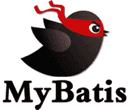

# Java Mybatis 框架入门教程

> 原文：[`c.biancheng.net/mybatis/`](http://c.biancheng.net/mybatis/)

MyBatis 的前身是 Apache 的开源项目 iBatis。MyBatis 几乎可以代替 JDBC，是一个支持普通 SQL 查询，存储过程和高级映射的基于 Java 的优秀持久层框架。

MyBatis 与 JDBC 相比，减少了 50% 以上的代码量。并且满足高并发和高响应的要求，所以它成为最流行的 Java 互联网持久框架。

这套 Java MyBatis 框架入门教程详细讲解了 MyBatis 的基础知识和使用方法。并精心设计了大量实例。可以帮助读者轻松掌握代码的内容，快速入门，持续深化，举一反三。本教程中实例使用 Mysql 作为后台数据库，不了解 MySql 的小伙伴请先学习 MySql。