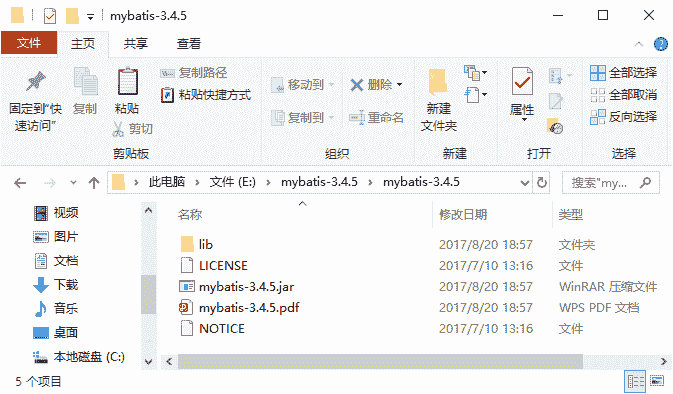
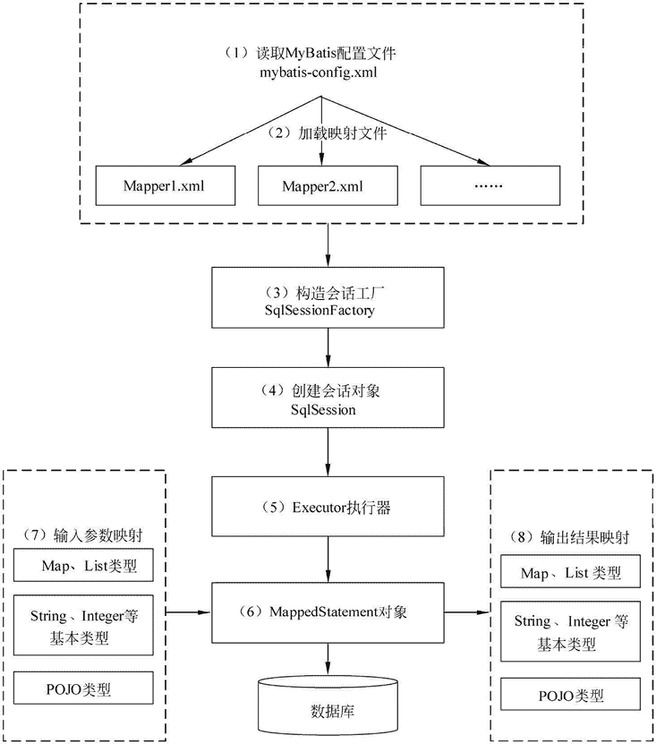

# MyBatis 的工作原理

> 原文：[`c.biancheng.net/view/4304.html`](http://c.biancheng.net/view/4304.html)

在讲解 MyBatis 工作原理之前，先来了解一下 MyBatis 的下载。教程中使用 MyBatis 3.4.5 作为本教程的实践环境，也希望读者下载该版本，以便于学习。

MyBatis 的版本可以通过“[`github.com/mybatis/mybatis-3/releases`](https://github.com/mybatis/mybatis-3/releases)”网址下载。在下载时只需选择 mybatis-3.4.5.zip 即可，解压后得到如图 1 所示的目录。

图 1  MyBatis 的目录
图 1 中的 mybatis-3.4.5.jar 是 MyBatis 的核心包，mybatis-3.4.5.pdf 是 MyBatis 的使用手册，lib 文件夹下的 JAR 是 MyBatis 的依赖包。

在使用 MyBatis 框架时需要将它的核心包和依赖包引入到应用程序中。如果是 Web 应用，只需将核心包和依赖包复制到 /WEB-INF/lib 目录中。

## MyBatis 的工作原理

在学习 MyBatis 程序之前，读者需要了解一下 MyBatis 工作原理，以便于理解程序。MyBatis 的工作原理如图 2 所示。

下面对图 2 中的每步流程进行说明。

1）读取 MyBatis 配置文件：mybatis-config.xml 为 MyBatis 的全局配置文件，配置了 MyBatis 的运行环境等信息，例如数据库连接信息。

2）加载映射文件。映射文件即 SQL 映射文件，该文件中配置了操作数据库的 SQL 语句，需要在 MyBatis 配置文件 mybatis-config.xml 中加载。mybatis-config.xml 文件可以加载多个映射文件，每个文件对应数据库中的一张表。

3）构造会话工厂：通过 MyBatis 的环境等配置信息构建会话工厂 SqlSessionFactory。
图 2  MyBatis 框架的执行流程图
4）创建会话对象：由会话工厂创建 SqlSession 对象，该对象中包含了执行 SQL 语句的所有方法。

5）Executor 执行器：MyBatis 底层定义了一个 Executor 接口来操作数据库，它将根据 SqlSession 传递的参数动态地生成需要执行的 SQL 语句，同时负责查询缓存的维护。

6）MappedStatement 对象：在 Executor 接口的执行方法中有一个 MappedStatement 类型的参数，该参数是对映射信息的封装，用于存储要映射的 SQL 语句的 id、参数等信息。

7）输入参数映射：输入参数类型可以是 Map、List 等集合类型，也可以是基本数据类型和 POJO 类型。输入参数映射过程类似于 JDBC 对 preparedStatement 对象设置参数的过程。

8）输出结果映射：输出结果类型可以是 Map、 List 等集合类型，也可以是基本数据类型和 POJO 类型。输出结果映射过程类似于 JDBC 对结果集的解析过程。

通过上面的讲解，读者对 MyBatis 框架应该有了一个初步的了解，在后续的学习中将慢慢加深理解。