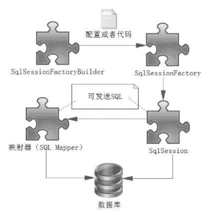

# MyBatis 的核心组件：SqlSessionFactoryBuilder、SqlSessionFactory、SqlSession 和 SQL Mapper

> 原文：[`c.biancheng.net/view/4313.html`](http://c.biancheng.net/view/4313.html)

我们先来看 MyBatis 的“表面现象”——组件，并且讨论它们的作用，然后讨论它们的实现原理。MyBatis 的核心组件分为 4 个部分。

1）SqlSessionFactoryBuilder（构造器）：它会根据配置或者代码来生成 SqlSessionFactory，采用的是分步构建的 Builder 模式。

2）SqlSessionFactory（工厂接口）：依靠它来生成 SqlSession，使用的是工厂模式。

3）SqlSession（会话）：一个既可以发送 SQL 执行返回结果，也可以获取 Mapper 的接口。在现有的技术中，一般我们会让其在业务逻辑代码中“消失”，而使用的是 MyBatis 提供的 SQL Mapper 接口编程技术，它能提高代码的可读性和可维护性。

4）SQL Mapper（映射器）:MyBatis 新设计存在的组件，它由一个 Java 接口和 XML 文件（或注解）构成，需要给出对应的 SQL 和映射规则。它负责发送 SQL 去执行，并返回结果。

用一张图来展示 MyBatis 核心组件之间的关系，如图 1 所示。
图 1  MyBatis 核心组件
注意，无论是映射器还是 SqlSession 都可以发送 SQL 到数据库执行，下面学习这些组件的用法。

由于篇幅有限，请读者点击下面链接进行学习：

*   MyBatis SqlSessionFactory 及其常见创建方式
*   MyBatis SqlSession 简介