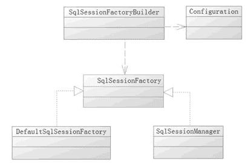

# MyBatis SqlSessionFactory 及其常见创建方式

> 原文：[`c.biancheng.net/view/4314.html`](http://c.biancheng.net/view/4314.html)

使用 MyBatis 首先是使用配置或者代码去生产 SqlSessionFactory，而 MyBatis 提供了构造器 SqlSessionFactoryBuilder。

它提供了一个类 org.apache.ibatis.session.Configuration 作为引导，采用的是 Builder 模式。具体的分步则是在 Configuration 类里面完成的，当然会有很多内容，包括你很感兴趣的插件。

在 MyBatis 中，既可以通过读取配置的 XML 文件的形式生成 SqlSessionFactory，也可以通过 Java 代码的形式去生成 SqlSessionFactory。

笔者强烈推荐采用 XML 的形式，因为代码的方式在需要修改的时候会比较麻烦。当配置了 XML 或者提供代码后，MyBatis 会读取配置文件，通过 Configuration 类对象构建整个 MyBatis 的上下文。

注意，SqlSessionFactory 是一个接口，在 MyBatis 中它存在两个实现类：SqlSessionManager 和 DefaultSqlSessionFactory。

一般而言，具体是由 DefaultSqlSessionFactory 去实现的，而 SqlSessionManager 使用在多线程的环境中，它的具体实现依靠 DefaultSqlSessionFactory，它们之间的关系如图 1 所示。

图 1  SqlSessionFactory 的生成
每个基于 MyBatis 的应用都是以一个 SqlSessionFactory 的实例为中心的，而 SqlSessionFactory 唯一的作用就是生产 MyBatis 的核心接口对象 SqlSession，所以它的责任是唯一的。我们往往会采用单例模式处理它，下面讨论使用配置文件和 Java 代码两种形式去生成 SqlSessionFactory 的方法。

## 使用 XML 构建 SqlSessionFactory

首先，在 MyBatis 中的 XML 分为两类，一类是基础配置文件，通常只有一个，主要是配置一些最基本的上下文参数和运行环境；另一类是映射文件，它可以配置映射关系、SQL、参数等信息。

先看一份简易的基础配置文件，我们把它命名为 mybatis-config.xml，放在工程类路径下，其内容如下所示。

```

<?xml version="1.0" encoding="utf-8"?>
<!DOCTYPE configuration PUBLIC "-//mybatis.org//DTD Config 3.0//EN"
"http://mybatis.org/dtd/mybatis-3-config.dtd">
<configuration>
    <typeAliases><!--别名-->
        <typeAliases alias="user" type="com.mybatis.po.User"/>
    </typeAliases>
    <!-- 数据库环境 -->
    <environments default="development">
        <environment id="development">
            <!-- 使用 JDBC 的事务管理 -->
            <transactionManager type="JDBC" />
            <dataSource type="POOLED">
                <!-- MySQL 数据库驱动 -->
                <property name="driver" value="com.mysql.jdbc.Driver" />
                <!-- 连接数据库的 URL -->
                <property name="url"
                    value="jdbc:mysql://localhost:3306/mybatis?characterEncoding=utf8" />
                <property name="username" value="root" />
                <property name="password" value="1128" />
            </dataSource>
        </environment>
    </environments>
    <!-- 将 mapper 文件加入到配置文件中 -->
    <mappers>
        <mapper resource="com/mybatis/mapper/UserMapper.xml" />
    </mappers>
</configuration>
```

我们描述一下 MyBatis 的基础配置文件：

*   <typeAlias> 元素定义了一个别名 user，它代表着 com.mybatis.po.User 这个类。这样定义后，在 MyBatis 上下文中就可以使用别名去代替全限定名了。
*   <environment> 元素的定义，这里描述的是数据库。它里面的 <transactionManager> 元素是配置事务管理器，这里采用的是 MyBatis 的 JDBC 管理器方式。
*   <dataSource> 元素配置数据库，其中属性 type="POOLED" 代表采用 MyBatis 内部提供的连接池方式，最后定义一些关于 JDBC 的属性信息。
*   <mapper> 元素代表引入的那些映射器，在谈到映射器时会详细讨论它。

有了基础配置文件，就可以用一段很简短的代码来生成 SqlSessionFactory 了，如下所示。

```

SqlSessionFactory factory = null;
String resource = "mybatis-config.xml";
InputStream is;
try {
    InputStream is = Resources.getResourceAsStream(resource);
    factory = new SqlSessionFactoryBuilder().build(is);
} catch (IOException e) {
    e.printStackTrace();
}
```

首先读取 mybatis-config.xml，然后通过 SqlSessionFactoryBuilder 的 Builder 方法去创建 SqlSessionFactory。整个过程比较简单，而里面的步骤还是比较烦琐的，只是 MyBatis 采用了 Builder 模式为开发者隐藏了这些细节。这样一个 SqlSessionFactory 就被创建出来了。

采用 XML 创建的形式，信息在配置文件中，有利于我们日后的维护和修改，避免了重新编译代码，因此笔者推荐这种方式。

## 使用代码创建 SqlSessionFactory

虽然笔者不推荐使用这种方式，但是我们还是谈谈如何使用它。通过代码来实现与使用 XML 构建 SqlSessionFactory 一样的功能——创建 SqlSessionFactory，代码如下所示。

```

// 数据库连接池信息
PooledDataSource dataSource = new PooledDataSource();
dataSource.setDriver("com.mysql.jdbc.Driver");
dataSource.setUsername("root");
dataSource.setPassword ("1128");
dataSource.setUrl("jdbc:mysql://localhost:3306/mybatis");
dataSource.setDefeultAutoCommit(false);
// 采用 MyBatis 的 JDBC 事务方式
TransactionFactory transactionFactory = new JdbcTransactionFactory();
Environment environment = new Environment ("development", transactionFactory, dataSource);
// 创建 Configuration 对象
Configuration configuration = new Configuration(environment);
// 注册一个 MyBatis 上下文别名
configuration.getTypeAliasRegistry().registerAlias("role", Role.class);
// 加入一个映射器
configuration.addMapper(RoleMapper.class);
//使用 SqlSessionFactoryBuilder 构建 SqlSessionFactory
SqlSessionFactory SqlSessionFactory =
new SqlSessionFactoryBuilder().build(configuration);
return SqlSessionFactory;
```

注意代码中的注释，它和 XML 方式实现的功能是一致的，只是方式不太一样而已。但是代码冗长，如果发生系统修改，那么有可能需要重新编译代码才能继续，所以这不是一个很好的方式。

除非有特殊的需要，比如在配置文件中，需要配置加密过的数据库用户名和密码，需要我们在生成 SqlSessionFactory 前解密为明文的时候，才会考虑使用这样的方式。