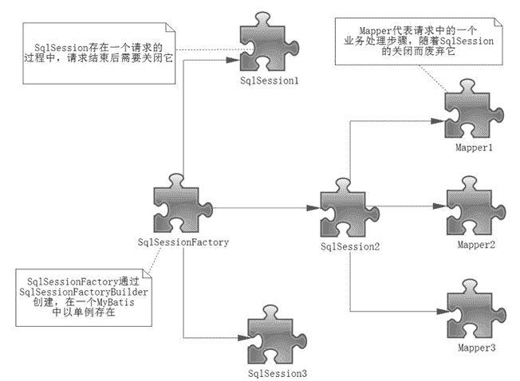

# SqlSessionFactoryBuilder、SqlSessionFactory 和 SqlSession 的作用域以及生命周期

> 原文：[`c.biancheng.net/view/4320.html`](http://c.biancheng.net/view/4320.html)

我们已经掌握了 MyBatis 组件的创建及其基本应用，但这是远远不够的，还需要讨论其生命周期。

生命周期是组件的重要问题，尤其是在多线程的环境中，比如互联网应用、Socket 请求等，而 MyBatis 也常用于多线程的环境中，错误使用会造成严重的多线程并发问题，为了正确编写 MyBatis 的应用程序，我们需要掌握 MyBatis 组件的生命周期。

所谓生命周期就是每一个对象应该存活的时间，比如一些对象一次用完后就要关闭，使它们被 Java 虚拟机（JVM）销毁，以避免继续占用资源，所以我们会根据每一个组件的作用去确定其生命周期。

## SqlSessionFactoryBuilder

SqlSessionFactoryBuilder 的作用在于创建 SqlSessionFactory，创建成功后，SqlSessionFactoryBuilder 就失去了作用，所以它只能存在于创建 SqlSessionFactory 的方法中，而不要让其长期存在。因此 SqlSessionFactoryBuilder 实例的最佳作用域是方法作用域（也就是局部方法变量）。

## SqlSessionFactory

SqlSessionFactory 可以被认为是一个数据库连接池，它的作用是创建 SqlSession 接口对象。因为 MyBatis 的本质就是 Java 对数据库的操作，所以 SqlSessionFactory 的生命周期存在于整个 MyBatis 的应用之中，所以一旦创建了 SqlSessionFactory，就要长期保存它，直至不再使用 MyBatis 应用，所以可以认为 SqlSessionFactory 的生命周期就等同于 MyBatis 的应用周期。

由于 SqlSessionFactory 是一个对数据库的连接池，所以它占据着数据库的连接资源。如果创建多个 SqlSessionFactory，那么就存在多个数据库连接池，这样不利于对数据库资源的控制，也会导致数据库连接资源被消耗光，出现系统宕机等情况，所以尽量避免发生这样的情况。

因此在一般的应用中我们往往希望 SqlSessionFactory 作为一个单例，让它在应用中被共享。所以说 SqlSessionFactory 的最佳作用域是应用作用域。

## SqlSession

如果说 SqlSessionFactory 相当于数据库连接池，那么 SqlSession 就相当于一个数据库连接（Connection 对象），你可以在一个事务里面执行多条 SQL，然后通过它的 commit、rollback 等方法，提交或者回滚事务。

所以它应该存活在一个业务请求中，处理完整个请求后，应该关闭这条连接，让它归还给 SqlSessionFactory，否则数据库资源就很快被耗费精光，系统就会瘫痪，所以用 try...catch...finally... 语句来保证其正确关闭。

所以 SqlSession 的最佳的作用域是请求或方法作用域。

## Mapper

Mapper 是一个接口，它由 SqlSession 所创建，所以它的最大生命周期至多和 SqlSession 保持一致，尽管它很好用，但是由于 SqlSession 的关闭，它的数据库连接资源也会消失，所以它的生命周期应该小于等于 SqlSession 的生命周期。Mapper 代表的是一个请求中的业务处理，所以它应该在一个请求中，一旦处理完了相关的业务，就应该废弃它。

以上，我们讨论了 MyBatis 组件的生命周期，如图 1 所示。
图 1  MyBatis 组件的生命周期