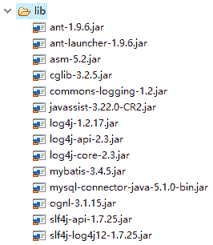
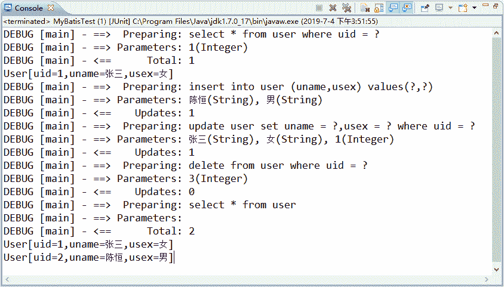

# 第一个 MyBatis 程序

> 原文：[`c.biancheng.net/view/4309.html`](http://c.biancheng.net/view/4309.html)

在创建项目之前，首先在 MySQL 数据库中创建 mybatis 数据库和 user 表，sql 语句如下所示：

```

CREATE DATABASE mybatis;
USE mybatis;
DROP TABLE IF EXISTS `user`;
CREATE TABLE `user` (
  `uid` tinyint(2) NOT NULL,
  `uname` varchar(20) DEFAULT NULL,
  `usex` varchar(10) DEFAULT NULL,
  PRIMARY KEY (`uid`)
) ENGINE=InnoDB DEFAULT CHARSET=utf8;
```

下面通过一个实例讲解如何使用 MyEclipse 开发 MyBatis 入门程序。

#### 1）创建 Web 应用，并添加相关 JAR 包

在 MyEclipse 中创建一个名为 myBatisDemo01 的 Web 应用，将 MyBatis 的核心 JAR 包、依赖 JAR 包以及 MySQL 数据库的驱动 JAR 包一起复制到 /WEB-INF/lib 目录下。添加后的 lib 目录如图 1 所示。


图 1  MyBatis 相关的 JAR 包

#### 2）创建日志文件

MyBatis 默认使用 log4j 输出日志信息，如果开发者需要查看控制台输出的 SQL 语句，那么需要在 classpath 路径下配置其日志文件。在 myBatis 应用的 src 目录下创建 log4j.properties 文件，其内容如下：

# Global logging configuration
log4j.rootLogger=ERROR,stdout
# MyBatis logging configuration...
log4j.logger.com.mybatis=DEBUG
# Console output...
log4j.appender.stdout=org.apache.log4j.ConsoleAppender
log4j.appender.stdout.layout=org.apache.log4j.PatternLayout
log4j.appender.stdout.layout.ConversionPattern=%5p [%t] - %m%n

在日志文件中配置了全局的日志配置、MyBatis 的日志配置和控制台输出，其中 MyBatis 的日志配置用于将 com.mybatis 包下所有类的日志记录级别设置为 DEBUG。该配置文件内容不需要开发者全部手写，可以从 MyBatis 使用手册中的 Logging 小节复制，然后进行简单修改。

#### 3）创建持久化类

在 src 目录下创建一个名为 com.mybatis.po 的包，在该包中创建持久化类 MyUser，注意在类中声明的属性与数据表 user 的字段一致。

MyUser 的代码如下：

```

package com.mybatis.po;

/**
* springtest 数据库中 user 表的持久类
*/
public class MyUser {
    private Integer uid; // 主键
    private String uname;
    private String usex;

    // 此处省略 setter 和 getter 方法
    @Override
    public String toString() { // 为了方便查看结果，重写了 toString 方法
        return "User[uid=" + uid + ",uname=" + uname + ",usex=" + usex + "]";
    }
}
```

#### 4）创建映射文件

在 src 目录下创建一个名为 com.mybatis.mapper 的包，在该包中创建映射文件 UserMapper.xml。

UserMapper.xml 文件的内容如下：

```

<?xml version="1.0" encoding="UTF-8"?>
<!DOCTYPE mapper
PUBLIC "-//mybatis.org//DTD Mapper 3.0//EN"
"http://mybatis.org/dtd/mybatis-3-mapper.dtd">
<mapper namespace="com.mybatis.mapper.UserMapper">
    <!-- 根据 uid 查询一个用户信息 -->
    <select id="selectUserById" parameterType="Integer"
        resultType="com.mybatis.po.MyUser">
        select * from user where uid = #{uid}
    </select>
    <!-- 查询所有用户信息 -->
    <select id="selectAllUser" resultType="com.mybatis.po.MyUser">
        select * from user
    </select>
    <!-- 添加一个用户，#{uname}为 com.mybatis.po.MyUser 的属性值 -->
    <insert id="addUser" parameterType="com.mybatis.po.MyUser">
        insert into user (uname,usex)
        values(#{uname},#{usex})
    </insert>
    <!--修改一个用户 -->
    <update id="updateUser" parameterType="com.mybatis.po.MyUser">
        update user set uname =
        #{uname},usex = #{usex} where uid = #{uid}
    </update>
    <!-- 删除一个用户 -->
    <delete id="deleteUser" parameterType="Integer">
        delete from user where uid
        = #{uid}
    </delete>
</mapper>
```

在上述映射文件中，<mapper> 元素是配置文件的根元素，它包含了一个 namespace 属性，该属性值通常设置为“包名+SQL 映射文件名”，指定了唯一的命名空间。

子元素 <select>、<insert>、<update> 以及 <delete> 中的信息是用于执行查询、添加、修改以及删除操作的配置。在定义的 SQL 语句中，“#{}”表示一个占位符，相当于“?”，而“#{uid}”表示该占位符待接收参数的名称为 uid。

#### 5）创建 MyBatis 的配置文件

在 src 目录下创建 MyBatis 的核心配置文件 mybatis-config.xml，在该文件中配置了数据库环境和映射文件的位置，具体内容如下：

```

<?xml version="1.0" encoding="utf-8"?>
<!DOCTYPE configuration PUBLIC "-//mybatis.org//DTD Config 3.0//EN"
"http://mybatis.org/dtd/mybatis-3-config.dtd">
<configuration>
    <settings>
        <setting name="logImpl" value="LOG4J" />
    </settings>
    <!-- 配置 mybatis 运行环境 -->
    <environments default="development">
        <environment id="development">
            <!-- 使用 JDBC 的事务管理 -->
            <transactionManager type="JDBC" />
            <dataSource type="POOLED">
                <!-- MySQL 数据库驱动 -->
                <property name="driver" value="com.mysql.jdbc.Driver" />
                <!-- 连接数据库的 URL -->
                <property name="url"
                    value="jdbc:mysql://localhost:3306/mybatis?characterEncoding=utf8" />
                <property name="username" value="root" />
                <property name="password" value="1128" />
            </dataSource>
        </environment>
    </environments>
    <!-- 将 mapper 文件加入到配置文件中 -->
    <mappers>
        <mapper resource="com/mybatis/mapper/UserMapper.xml" />
    </mappers>
</configuration>
```

上述映射文件和配置文件都不需要读者完全手动编写，都可以从 MyBatis 使用手册中复制，然后做简单修改。

#### 6）创建测试类

在 src 目录下创建一个名为 com.mybatis.test 的包，在该包中创建 MyBatisTest 测试类。在测试类中首先使用输入流读取配置文件，然后根据配置信息构建 SqlSessionFactory 对象。

接下来通过 SqlSessionFactory 对象创建 SqlSession 对象，并使用 SqlSession 对象的方法执行数据库操作。 MyBatisTest 测试类的代码如下：

```

package com.mybatis.test;

import java.io.IOException;
import java.io.InputStream;
import java.util.List;
import org.apache.ibatis.io.Resources;
import org.apache.ibatis.session.SqlSession;
import org.apache.ibatis.session.SqlSessionFactory;
import org.apache.ibatis.session.SqlSessionFactoryBuilder;
import com.mybatis.po.MyUser;

public class MyBatisTest {
    public static void main(String[] args) {
        try {
            // 读取配置文件 mybatis-config.xml
            InputStream config = Resources
                    .getResourceAsStream("mybatis-config.xml");
            // 根据配置文件构建 SqlSessionFactory
            SqlSessionFactory ssf = new SqlSessionFactoryBuilder()
                    .build(config);
            // 通过 SqlSessionFactory 创建 SqlSession
            SqlSession ss = ssf.openSession();
            // SqlSession 执行映射文件中定义的 SQL，并返回映射结果
            /*
             * com.mybatis.mapper.UserMapper.selectUserById 为 UserMapper.xml
             * 中的命名空间+select 的 id
             */
            // 查询一个用户
            MyUser mu = ss.selectOne(
                    "com.mybatis.mapper.UserMapper.selectUserById", 1);
            System.out.println(mu);
            // 添加一个用户
            MyUser addmu = new MyUser();
            addmu.setUname("陈恒");
            addmu.setUsex("男");
            ss.insert("com.mybatis.mapper.UserMapper.addUser", addmu);
            // 修改一个用户
            MyUser updatemu = new MyUser();
            updatemu.setUid(1);
            updatemu.setUname("张三");
            updatemu.setUsex("女");
            ss.update("com.mybatis.mapper.UserMapper.updateUser", updatemu);
            // 删除一个用户
            ss.delete("com.mybatis.mapper.UserMapper.deleteUser", 3);
            // 查询所有用户
            List<MyUser> listMu = ss
                    .selectList("com.mybatis.mapper.UserMapper.selectAllUser");
            for (MyUser myUser : listMu) {
                System.out.println(myUser);
            }
            // 提交事务
            ss.commit();
            // 关闭 SqlSession
            ss.close();
        } catch (IOException e) {
            // TODO Auto-generated catch block
            e.printStackTrace();
        }
    }
}
```

上述测试类的运行结果如图 2 所示。


图 2  MyBatis 入门程序的运行结果