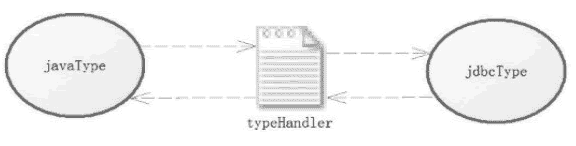

# MyBatis TypeHandler 类型转换器

> 原文：[`c.biancheng.net/view/4338.html`](http://c.biancheng.net/view/4338.html)

在 JDBC 中，需要在 PreparedStatement 对象中设置那些已经预编译过的 SQL 语句的参数。执行 SQL 后，会通过 ResultSet 对象获取得到数据库的数据，而这些 MyBatis 是根据数据的类型通过 typeHandler 来实现的。

在 typeHandler 中，分为 jdbcType 和 javaType，其中 jdbcType 用于定义数据库类型，而 javaType 用于定义 Java 类型，那么 typeHandler 的作用就是承担 jdbcType 和 javaType 之间的相互转换。

如图 1 所示。在很多情况下我们并不需要去配置 typeHandler、jdbcType、javaType，因为 MyBatis 会探测应该使用什么类型的 typeHandler 进行处理，但是有些场景无法探测到。

对于那些需要使用自定义枚举的场景，或者数据库使用特殊数据类型的场景，可以使用自定义的 typeHandler 去处理类型之间的转换问题。
图 1  typeHandler 的作用
和别名一样，在 MyBatis 中存在系统定义 typeHandler 和自定义 typeHandler。MyBatis 会根据 javaType 和数据库的 jdbcType 来决定采用哪个 typeHandler 处理这些转换规则。系统提供的 typeHandler 能覆盖大部分场景的要求，但是有些情况下是不够的，比如我们有特殊的转换规则，枚举类就是这样。

由于篇幅有限，我们分为 4 节详细讲解这 4 种 typeHandler，请读者猛击下面链接进行学习：

*   MyBatis 系统定义的 TypeHandler
*   MyBatis 自定义 TypeHandler
*   MyBatis 枚举 TypeHandler
*   MyBatis BlobTypeHandler 读取 Blob 类型字段