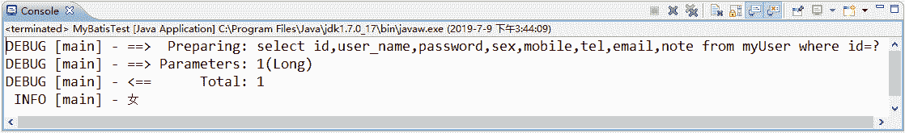

# MyBatis 自定义 TypeHandler 处理枚举

> 原文：[`c.biancheng.net/view/4343.html`](http://c.biancheng.net/view/4343.html)

在绝大多数情况下，typeHandler 因为枚举而使用，MyBatis 已经定义了两个类作为枚举类型的支持，这两个类分别是：

*   EnumOrdinalTypeHandler。
*   EnumTypeHandler。

因为它们的作用不大，所以在大部分情况下，我们都不用它们，不过我们还是要稍微了解一下它们的用法。在此之前，先来建一个性别枚举类——SexEnum，代码如下所示。

```

package com.mybatis.po;

public enum SexEnum {
    MALE(1, "男"),
    FEMALE(0, "女");

    private int id;
    private String name;

    /** stter and getter **/

    SexEnum(int id, String name) {
        this.id = id;
        this.name = name;
    }

    public SexEnum getSexById(int id) {
        for (SexEnum sex : SexEnum.values()) {
            if (sex.getId() == id) {
                return sex;
            }
        }
        return null;
    }
}
```

为了使用这个关于性别的枚举，可用以下 sql 语句创建 myUser 表。

```

CREATE TABLE `myuser` (
  `id` bigint(20) NOT NULL,
  `user_name` varchar(20) DEFAULT NULL,
  `password` varchar(20) DEFAULT NULL,
  `sex` char(1) DEFAULT NULL,
  `mobile` varchar(20) DEFAULT NULL,
  `tel` varchar(20) DEFAULT NULL,
  `email` varchar(20) DEFAULT NULL,
  `note` varchar(20) DEFAULT NULL,
  PRIMARY KEY (`id`)
) ENGINE=InnoDB DEFAULT CHARSET=utf8;
```

再创建一个用户 POJO，如下所示。

```

public class User {
    private Long id;
    private String userName;
    private String password;
    private SexWnum sex;
    private String moblie;
    private String tel;
    private String email;
    private String note;
    /**setter and getter**/
}
```

## EnumOrdinalTypeHandler

EnumOrdinalTypeHandler 是按 MyBatis 根据枚举数组下标索引的方式进行匹配的，也是枚举类型的默认转换类，它要求数据库返回一个整数作为其下标，它会根据下标找到对应的枚举类型。

根据这条规则，可以创建一个 UserMapper.xml 作为测试的例子，如下所示。

```

<?xml version="1.0" encoding="UTF-8"?>
<!DOCTYPE mapper
PUBLIC "-//mybatis.org//DTD Mapper 3.0//EN"
"http://mybatis.org/dtd/mybatis-3-mapper.dtd">
<mapper namespace="com.mybatis.mapper.UserMapper">
    <resultMap id="userMapper" type="user">
        <result property="id" column="id" />
        <result property="userName" column="user_name" />
        <result property="password" column="passsword" />
        <result property="sex" column="sex"
            typeHandler="org.apache.ibatis.type.EnumOrdinalTypeHandler" />
        <result property="mobile" column="mobile" />
        <result property="tel" column="tel" />
        <result property="email" column="email" />
        <result property="note" column="note" />
    </resultMap>
    <select id="getUser" resultMap="userMapper" parameterType="long">
        select id,user_name,password,sex,mobile,tel,email,note from myUser
        where id=#{id}
    </select>
</mapper>
```

插入一条数据，执行的 SQL 如下：

INSERT INTO `myuser` (`id`,`user_name`,`password`,`sex`,`mobile`,`tel`,`email`,`note`) VALUES(1,'zhangsan','123456','1','13675683675','0755-88888888','zhangsan@163.com','note......');

这样，sex 字段就在数据库里被设置为 1，代表女性，使用以下进行测试。

```

package com.mybatis.test;

import java.io.IOException;
import java.io.InputStream;

import org.apache.ibatis.io.Resources;
import org.apache.ibatis.session.SqlSession;
import org.apache.ibatis.session.SqlSessionFactory;
import org.apache.ibatis.session.SqlSessionFactoryBuilder;
import org.apache.log4j.Logger;

import com.mybatis.mapper.UserMapper;
import com.mybatis.po.User;

public class MyBatisTest {
    public static void main(String[] args) throws IOException {
        Logger log = Logger.getLogger(MyBatisTest.class);
        InputStream config = Resources
                .getResourceAsStream("mybatis-config.xml");
        SqlSessionFactory ssf = new SqlSessionFactoryBuilder().build(config);
        SqlSession ss = ssf.openSession();
        UserMapper userMapper = ss.getMapper(UserMapper.class);
        User user = userMapper.getUser(1L);
        log.info(user.getSex().getName());
    }
}
```

运行结果如图 1 所示：
图 1  运行结果

## EnumTypeHandler

EnumTypeHandler 会把使用的名称转化为对应的枚举，比如它会根据数据库返回的字符串“MALE”，进行 Enum.valueOf（SexEnum.class,"MALE"）；转换，所以为了测试 EnumTypeHandler 的转换，我们把数据库的 sex 字段修改为字符型（varchar（10）），并把 sex=1 的数据修改为 FEMALE，于是可以执行以下 SQL。

ALTER TABLE myUser MODIFY sex VARCHAR(10);
UPDATE myUser SET sex='FEMALE' WHERE SEX = 1;

然后使用 EnumTypeHandler 修改 UserMaperr.xml，代码如下所示。

```

<?xml version="1.0" encoding="UTF-8"?>
<!DOCTYPE mapper
PUBLIC "-//mybatis.org//DTD Mapper 3.0//EN"
"http://mybatis.org/dtd/mybatis-3-mapper.dtd">
<mapper namespace="com.mybatis.mapper.UserMapper">
    <resultMap id="userMapper" type="com.mybatis.po.User">
        <result property="id" column="id" />
        <result property="userName" column="user_name" />
        <result property="password" column="passsword" />
        <result property="sex" column="sex"
            typeHandler="org.apache.ibatis.type.EnumTypeHandler" />
        <result property="mobile" column="mobile" />
        <result property="tel" column="tel" />
        <result property="email" column="email" />
        <result property="note" column="note" />
    </resultMap>
    <select id="getUser" resultMap="userMapper" parameterType="long">
        select id,user_name,password,sex,mobile,tel,email,note from myUser
        where id=#{id}
    </select>
</mapper>
```

执行以上代码，就可以可以看到正确运行的日志。

## 自定义枚举 typeHandler

我们已经讨论了 MyBatis 内部提供的两种转换的 typeHandler，但是它们有很大的局限性，更多的时候我们希望使用自定义的 typeHandler。执行下面的 SQL，把数据库的 sex 字段修改为整数型。

UPDATE myUser SET sex='0' WHERE sex = 'FEMALE';
UPDATE myUser SET sex='1' WHERE sex = 'MALE';
ALTER TABLE myUser MODIFY sex INT(10);

此时，按 SexEnum 的定义，sex=1 为男性，sex=0 为女性。为了满足这个规则，让我们自定义一个 SexEnumTypeHandler，如下所示。

```

package com.mybatis.test;

import java.sql.CallableStatement;
import java.sql.PreparedStatement;
import java.sql.ResultSet;
import java.sql.SQLException;

import org.apache.ibatis.type.JdbcType;
import org.apache.ibatis.type.MappedJdbcTypes;
import org.apache.ibatis.type.MappedTypes;
import org.apache.ibatis.type.TypeHandler;

import com.mybatis.po.SexEnum;

@MappedTypes(SexEnum.class)
@MappedJdbcTypes(JdbcType.INTEGER)
public class SexEnumTypeHandler implements TypeHandler<SexEnum> {
    @Override
    public void setParameter(PreparedStatement ps, int i, SexEnum parameter,
            JdbcType jdbcType) throws SQLException {
        ps.setInt(i, parameter.getId());
    }

    @Override
    public SexEnum getResult(ResultSet rs, String columnName)
            throws SQLException {
        int id = rs.getInt(columnName);
        return SexEnum.getSexById(id);
    }

    @Override
    public SexEnum getResult(ResultSet rs, int columnIndex) throws SQLException {
        int id = rs.getInt(columnIndex);
        return SexEnum.getSexById(id);
    }

    @Override
    public SexEnum getResult(CallableStatement rs, int columnIndex)
            throws SQLException {
        int id = rs.getInt(columnIndex);
        return SexEnum.getSexById(id);
    }
}
```

将 UserMapper.xml 的 typeHandler 换成自定义的 SexEnumTypeHandler，运行程序就可以得到我们想要的结果。