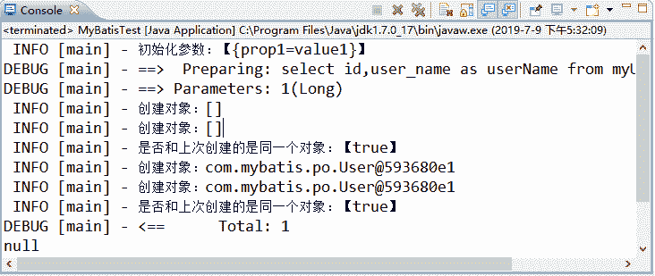

# MyBatis ObjectFactory（对象工厂）

> 原文：[`c.biancheng.net/view/4345.html`](http://c.biancheng.net/view/4345.html)

当创建结果集时，MyBatis 会使用一个对象工厂来完成创建这个结果集实例。在默认的情况下，MyBatis 会使用其定义的对象工厂——DefaultObjectFactory（org.apache.ibatis.reflection.factory.DefaultObjectFactory）来完成对应的工作。

MyBatis 允许注册自定义的 ObjectFactory。如果自定义，则需要实现接口 org.apache.ibatis.reflection.factory.ObjectFactory，并给予配置。

在大部分的情况下，我们都不需要自定义返回规则，因为这些比较复杂而且容易出错，在更多的情况下，都会考虑继承系统已经实现好的 DefaultObjectFactory ，通过一定的改写来完成我们所需要的工作，如下所示。

```

package com.mybatis.test;

import java.util.List;
import java.util.Properties;

import org.apache.ibatis.reflection.factory.DefaultObjectFactory;
import org.apache.log4j.Logger;

public class MyObjectFactory extends DefaultObjectFactory {

    private static final long serialVersionUID = -4293520460481008255L;

    Logger log = Logger.getLogger(MyObjectFactory.class);

    private Object temp = null;

    @Override
    public void setProperties(Properties properties) {
        super.setProperties(properties);
        log.info("初始化参数：【" + properties.toString() + "】");
    }

    // 方法 2
    @Override
    public <T> T create(Class<T> type) {
        T result = super.create(type);
        log.info("创建对象：" + result.toString());
        log.info("是否和上次创建的是同一个对象：【" + (temp == result) + "】");
        return result;
    }

    // 方法 1
    @Override
    public <T> T create(Class<T> type, List<Class<?>> constructorArgTypes,
            List<Object> constructorArgs) {
        T result = super.create(type, constructorArgTypes, constructorArgs);
        log.info("创建对象：" + result.toString());
        temp = result;
        return result;
    }

    @Override
    public <T> boolean isCollection(Class<T> type) {
        return super.isCollection(type);
    }
}
```

然后对它进行配置，如下所示。

<objectFactory type="com.mybatis.test.MyObjectFactory">
    <property name="prop1" value="value1" />
</objectFactory>

这样 MyBatis 就会采用配置的 MyObjectFactory 来生成结果集对象，采用下面的代码进行测试。

```

package com.mybatis.test;

import java.io.IOException;
import java.io.InputStream;

import org.apache.ibatis.io.Resources;
import org.apache.ibatis.session.SqlSession;
import org.apache.ibatis.session.SqlSessionFactory;
import org.apache.ibatis.session.SqlSessionFactoryBuilder;
import org.apache.log4j.Logger;

import com.mybatis.mapper.UserMapper;
import com.mybatis.po.User;

public class MyBatisTest {
    public static void main(String[] args) throws IOException {
        Logger log = Logger.getLogger(MyBatisTest.class);
        InputStream config = Resources
                .getResourceAsStream("mybatis-config.xml");
        SqlSessionFactory ssf = new SqlSessionFactoryBuilder().build(config);
        SqlSession ss = ssf.openSession();
        UserMapper userMapper = ss.getMapper(UserMapper.class);
        User user = userMapper.getUser(1L);
        System.out.println(user.getUserName());
    }
}
```

当配置了 log4j.properties 文件的时候，就能看到下图中的输出日志。


如果打断点调试一步步跟进，那么你会发现 MyBatis 创建了一个 List 对象和一个 User 对象。它会先调用方法 1，然后调用方法 2，只是最后生成了同一个对象，所以在写入的判断中，始终返回的是 true。因为返回的是一个 User 对象，所以它会最后适配为一个 User 对象，这就是它的工作过程。