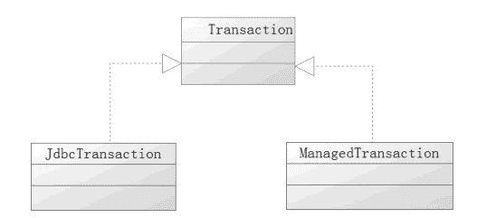

# MyBatis 配置文件 environments 和子元素 transactionManager、dataSource 解析

> 原文：[`c.biancheng.net/view/4352.html`](http://c.biancheng.net/view/4352.html)

在 MyBatis 中，运行环境主要的作用是配置数据库信息，它可以配置多个数据库，一般而言只需要配置其中的一个就可以了。

它下面又分为两个可配置的元素：事务管理器（transactionManager）、数据源（dataSource）。

在实际的工作中，大部分情况下会采用 Spring 对数据源和数据库的事务进行管理，这些我们教程后面都会进行讲解。本节我们会探讨 MyBatis 自身实现的类。

运行环境配置，代码如下所示。

```

<environments default="development">
    <environment id="development">
        <transactionManager type="JDBC" />
        <dataSource type="POOLED">
            <property name="driver" value="${database.driver}" />
            <property name="url"
                value="${database.url}" />
            <property name="username" value="${database.username}" />
            <property name="password" value="${database.password}" />
        </dataSource>
    </environment>
</environments>
```

这里用到两个元素：transactionManager 和 environment。

## transactionManager（事务管理器）

在 MyBatis 中，transactionManager 提供了两个实现类，它需要实现接口 Transaction（org.apache.ibatis.transaction.Transaction），它的定义代码如下所示。

```

public interface Transaction {
    Connection getConnection() throws SQLException;

    void commit() throws SQLException;

    void rollback() throws SQLException;

    void close() throws SQLException;

    Integer getTimeout() throws SQLException;
}
```

从方法可知，它主要的工作就是提交（commit）、回滚（rollback）和关闭（close）数据库的事务。MyBatis 为 Transaction 提供了两个实现类：JdbcTransaction 和 ManagedTransaction，如图 1 所示。
图 1  Transaction 的实现类
于是它对应着两种工厂：JdbcTransactionFactory 和 ManagedTransactionFactory，这个工厂需要实现 TransactionFactory 接口，通过它们会生成对应的 Transaction 对象。于是可以把事务管理器配置成为以下两种方式：

<transactionManager type="JDBC"/>
<transactionManager type="MANAGED"/>

这里做简要的说明。

JDBC 使用 JdbcTransactionFactory 生成的 JdbcTransaction 对象实现。它是以 JDBC 的方式对数据库的提交和回滚进行操作。

MANAGED 使用 ManagedTransactionFactory 生成的 ManagedTransaction 对象实现。它的提交和回滚方法不用任何操作，而是把事务交给容器处理。在默认情况下，它会关闭连接，然而一些容器并不希望这样，因此需要将 closeConnection 属性设置为 false 来阻止它默认的关闭行为。

不想采用 MyBatis 的规则时，我们可以这样配置：

<transactionManager type="com.mybatis.transaction.MyTransactionFactory"/>

实现一个自定义事务工厂，代码如下所示。

```

public class MyTransactionFactory implements TransactionFactory {
    @Override
    public void setProperties(Properties props) {
    }
    @Override
    public Transaction newTransaction(Connection conn) {
        return new MyTransaction(conn);
    }
    @Override
    public Transaction newTransaction(DataSource dataSource, TransactionlsolationLevel level, boolean autoCommit) {
        return new MyTransaction(dataSource, level, autoCommit);
    }
}
```

这里就实现了 TransactionFactory 所定义的工厂方法，这个时候还需要事务实现类 MyTransaction，它用于实现 Transaction 接口，代码如下所示。

```

public class MyTransaction extends JdbcTransaction implements Transaction {

    public MyTransaction(DataSource ds, TransactionIsolationLevel desiredLevel,
            boolean desiredAutoCommit) {
        super(ds, desiredLevel, desiredAutoCommit);
    }

    public MyTransaction(Connection connection) {
        super(connection);
    }

    public Connection getConnection() throws SQLException {
        return super.getConnection();
    }

    public void commit() throws SQLException {
        super.commit();
    }

    public void rollback() throws SQLException {
        super.rollback();
    }

    public void close() throws SQLException {
        super.close();
    }

    public Integer getTimeout() throws SQLException {
        return super.getTimeout();
    }
}
```

这样就能够通过自定义事务规则，满足特殊的需要了。

## environment 数据源环境

environment 的主要作用是配置数据库，在 MyBatis 中，数据库通过 PooledDataSource Factory、UnpooledDataSourceFactory 和 JndiDataSourceFactory 三个工厂类来提供，前两者对应产生 PooledDataSource、UnpooledDataSource 类对象，而 JndiDataSourceFactory 则会根据 JNDI 的信息拿到外部容器实现的数据库连接对象。

无论如何这三个工厂类，最后生成的产品都会是一个实现了 DataSource 接口的数据库连接对象。

由于存在三种数据源，所以可以按照下面的形式配置它们。

<dataSource type="UNPOOLED">
<dataSource type="POOLED">
<dataSource type="JNDI">

论述一下这三种数据源及其属性。

#### 1\. UNPOOLED

UNPOOLED 采用非数据库池的管理方式，每次请求都会打开一个新的数据库连接，所以创建会比较慢。在一些对性能没有很高要求的场合可以使用它。

对有些数据库而言，使用连接池并不重要，那么它也是一个比较理想的选择。UNPOOLED 类型的数据源可以配置以下几种属性：

*   driver 数据库驱动名，比如 MySQL 的 com.mysql.jdbc.Driver。
*   url 连接数据库的 URL。
*   username 用户名。
*   password 密码。
*   defaultTransactionIsolationLevel 默认的连接事务隔离级别，关于隔离级别，后面教程中会讨论。

传递属性给数据库驱动也是一个可选项，注意属性的前缀为“driver.”，例如 driver.encoding=UTF8。它会通过 DriverManager.getConnection（url,driverProperties）方法传递值为 UTF8 的 encoding 属性给数据库驱动。

#### 2\. POOLED

数据源 POOLED 利用“池”的概念将 JDBC 的 Connection 对象组织起来，它开始会有一些空置，并且已经连接好的数据库连接，所以请求时，无须再建立和验证，省去了创建新的连接实例时所必需的初始化和认证时间。它还控制最大连接数，避免过多的连接导致系统瓶颈。

除了 UNPOOLED 下的属性外，会有更多属性用来配置 POOLED 的数据源，如表 1 所示：

表 1 配置 POOLED 的数据源属性说明

| 名称 | 说明 |
| poolMaximumActiveConnections  | 是在任意时间都存在的活动（也就是正在使用）连接数量，默认值为 10 |
| poolMaximumIdleConnections | 是任意时间可能存在的空闲连接数 |
| poolMaximumCheckoutTime | 在被强制返回之前，池中连接被检出（checked out）的时间，默认值为 20 000 毫秒（即 20 秒） |
| poolTimeToWait | 是一个底层设置，如果获取连接花费相当长的时间，它会给连接池打印状态日志，并重新尝试获取一个连接（避免在误配置的情况下一直失败），默认值为 20 000 毫秒（即 20 秒）。 |
| poolPingQuery | 为发送到数据库的侦测查询，用来检验连接是否处在正常工作秩序中，并准备接受请求。默认是“NO PING QUERY SET”，这会导致多数数据库驱动失败时带有一个恰当的错误消息。 |
| poolPingEnabled | 为是否启用侦测查询。若开启，也必须使用一个可执行的 SQL 语句设置 poolPingQuery 属性（最好是一个非常快的 SQL），默认值为 false。 |
| poolPingConnectionsNotUsedFor | 为配置 poolPingQuery 的使用频度。这可以被设置成匹配具体的数据库连接超时时间，来避免不必要的侦测，默认值为 0（即所有连接每一时刻都被侦测——仅当 poolPingEnabled 为 true 时适用）。 |

#### 3\. JNDI

数据源 JNDI 的实现是为了能在如 EJB 或应用服务器这类容器中使用，容器可以集中或在外部配置数据源，然后放置一个 JNDI 上下文的引用。这种数据源配置只需要两个属性：

#### 1）initial_context

用来在 InitialContext 中寻找上下文（即，initialContext.lookup（initial_context））。initial_context 是个可选属性，如果忽略，那么 data_source 属性将会直接从 InitialContext 中寻找。

#### 2）data_source

是引用数据源实例位置上下文的路径。当提供 initial_context 配置时，data_source 会在其返回的上下文中进行查找；当没有提供 initial_context 时，data_source 直接在 InitialContext 中查找。

与其他数据源配置类似，它可以通过添加前缀“env.”直接把属性传递给初始上下文（InitialContext）。比如 env.encoding=UTF8，就会在初始上下文实例化时往它的构造方法传递值为 UTF8 的 encoding 属性。

MyBatis 也支持第三方数据源，例如使用 DBCP 数据源，那么需要提供一个自定义的 DataSourceFactory，代码如下所示。

```

public class DbcpDataSourceFactory implements DataSourceFactory {
    private Properties props = null;

    public void setProperties(Properties props) {
        this.props = props;
    }
    public DataSource getDataSource() {
        DataSource dataSource = null;
        dataSource = BasicDataSourceFactory.createDataSource(props);
        return dataSource;
    }
}
```

然后进行如下配置：

```

<dataSource type="com.mybatis.dataSource.DbcpDataSourceFactory">
    <property name="driver" value="${database.driver}" />
    <property name="url" value="${database.url}" />
    <property name="username" value="${database.username}" />
    <property name="password" value="${database.password}" />
</dataSource>
```

这样 MyBatis 就会采用配置的数据源工厂来生成数据源了。