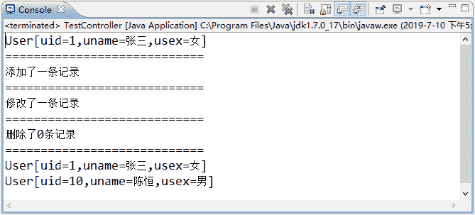

# MyBatis 与 Spring 的整合实例详解

> 原文：[`c.biancheng.net/view/4355.html`](http://c.biancheng.net/view/4355.html)

下面通过一个实例实现 MyBatis 与 Spring 的整合，具体实现过程如下：

#### 1）创建应用并导入相关 JAR 包

创建一个名为 MyBatis-Spring 的 Web 应用，并将《MyBatis 与 Spring 的整合步骤》教程的 JAR 导入 /WEB-INF/lib 目录下。

#### 2）创建持久化类

在 src 目录下创建一个名为 com.po 的包，将《第一个 MyBatis 程序》教程的持久化类复制到包中。

#### 3）创建 SQL 映射文件和 MyBatis 核心配置文件

在 src 目录下创建一个名为 com.mybatis 的包，在该包中创建 MyBatis 核心配置文件 mybatis-config.xml 和 SQL 映射文件 UserMapper.xml。

UserMapper.xml 的代码如下：

```

<?xml version="1.0" encoding="UTF-8"?>
<!DOCTYPE mapper
PUBLIC "-//mybatis.org//DTD Mapper 3.0//EN"
"http://mybatis.org/dtd/mybatis-3-mapper.dtd">
<mapper namespace="com.dao.UserDao">
    <!--根据 uid 查询一个用户信息 -->
    <select id="selectUserById" parameterType="Integer" resultType="com..po.MyUser">
        select * from user where uid = #{uid}
    </select>
    <!-- 查询所有用户信息 -->
    <select id="selectAllUser" resultType="com.po.MyUser">
        select * from user
    </select>
    <!-- 添加一个用户，#{uname}为 com.mybatis.po.MyUser 的属性值 -->
    <insert id="addUser" parameterType="com.po.MyUser">
    insert into user (uname,usex) values(#{uname},#{usex})
    </insert>
    <!--修改一个用户 -->
    <update id="updateUser" parameterType="com..po.MyUser">
        update user set uname = #{uname},usex = #{usex} where uid = #{uid}
    </update>
    <!-- 删除一个用户 -->
    <delete id="deleteUser" parameterType="Integer">
        delete from user where uid = #{uid}
    </delete>
</mapper>
```

mybatis-config.xml 的代码如下：

```

<?xml version="1.0" encoding="utf-8"?>
<!DOCTYPE configuration PUBLIC "-//mybatis.org//DTD Config 3.0//EN"
"http://mybatis.org/dtd/mybatis-3-config.dtd">
<configuration>
    <!-- 告诉 MyBatis 到哪里去找映射文件 -->
    <mappers>
        <mapper resource="com/mybatis/UserMapper.xml" />
    </mappers>
</configuration>
```

#### 4）创建数据访问接口

在 src 目录下创建一个名为 com.dao 的包，在该包中创建 UserDao 接口，并将接口使用 @Mapper 注解为 Mapper，接口中的方法与 SQL 映射文件一致。

UserDao 接口的代码如下：

```

package com.dao;
import java.util.List;
import org.apache.ibatis.annotations.Mapper;
import org.springframework.stereotype.Repository;
import com.po.MyUser;

@Repository("userDao")
@Mapper
/*
* 使用 Spring 自动扫描 MyBatis 的接口并装配 （Spring 将指定包中所有被@Mapper 注解标注的接口自动装配为 MyBatis 的映射接口
*/
public interface UserDao {
    /**
     * 接口方法对应的 SQL 映射文件 UserMapper.xml 中的 id
     */
    public MyUser selectUserById(Integer uid);

    public List<MyUser> selectAllUser();

    public int addUser(MyUser user);

    public int updateUser(MyUser user);

    public int deleteUser(Integer uid);
}
```

#### 5）创建日志文件

在 src 目录下创建日志文件 log4j.properties，文件内容如下：

# Global logging configuration
log4j.rootLogger=ERROR,stdout
# MyBatis logging configuration...
log4j.logger.com.mybatis=DEBUG
# Console output...
log4j.appender.stdout=org.apache.log4j.ConsoleAppender
log4j.appender.stdout.layout=org.apache.log4j.PatternLayout
log4j.appender.stdout.layout.ConversionPattern=%5p [%t] - %m%n

#### 6）创建控制层

在 src 目录下创建一个名为 com.controller 的包，在包中创建 UserController 类，在该类中调用数据访问接口中的方法。

UserController 类的代码如下：

```

package com.controller;

import java.util.List;

import org.springframework.beans.factory.annotation.Autowired;
import org.springframework.stereotype.Controller;

import com.dao.UserDao;
import com.po.MyUser;

@Controller("userController")
public class UserController {
    @Autowired
    private UserDao userDao;

    public void test() {
        // 查询一个用户
        MyUser auser = userDao.selectUserById(1);
        System.out.println(auser);
        System.out.println("============================");
        // 添加一个用户
        MyUser addmu = new MyUser();
        addmu.setUname("陈恒");
        addmu.setUsex("男");
        int add = userDao.addUser(addmu);
        System.out.println("添加了" + add + "条记录");
        System.out.println("============================");
        // 修改一个用户
        MyUser updatemu = new MyUser();
        updatemu.setUid(1);
        updatemu.setUname("张三");
        updatemu.setUsex("女");
        int up = userDao.updateUser(updatemu);
        System.out.println("修改了" + up + "条记录");
        System.out.println("============================");
        // 删除一个用户
        int dl = userDao.deleteUser(9);
        System.out.println("删除了" + dl + "条记录");
        System.out.println("============================");
        // 查询所有用户
        List<MyUser> list = userDao.selectAllUser();
        for (MyUser myUser : list) {
            System.out.println(myUser);
        }
    }
}
```

#### 7）创建 Spring 的配置文件

在 src 目录下创建配置文件 applicationContext.xml，在配置文件中配置数据源、MyBatis 工厂以及 Mapper 代理开发等信息。

applicationContext.xml 的代码如下：

```

<?xml version="1.0" encoding="UTF-8"?>
<beans xmlns="http://www.springframework.org/schema/beans"
    xmlns:xsi="http://www.w3.org/2001/XMLSchema-instance"
    xmlns:context="http://www.springframework.org/schema/context"
    xmlns:tx="http://www.springframework.org/schema/tx"
    xmlns:aop="http://www.springframework.org/schema/aop"
    xsi:schemaLocation="http://www.springframework.org/schema/beans
            http://www.springframework.org/schema/beans/spring-beans-2.5.xsd  
            http://www.springframework.org/schema/context
            http://www.springframework.org/schema/context/spring-context.xsd
            http://www.springframework.org/schema/tx
            http://www.springframework.org/schema/tx/spring-tx-2.5.xsd
            http://www.springframework.org/schema/aop
            http://www.springframework.org/schema/aop/spring-aop-2.5.xsd">
    <!-- 指定需要扫描的包（包括子包），使注解生效 -->
    <context:component-scan base-package="com.dao" />
    <context:component-scan base-package="com.controller" />
    <bean id="dataSource" class="org.apache.commons.dbcp.BasicDataSource">
        <property name="driverClassName" value="com.mysql.jdbc.Driver" />
        <property name="url"
            value="jdbc:mysql://127.0.0.1:3306/smbms?
                        useUnicode=true&amp;characterEncoding=utf-8" />
        <property name="username" value="root" />
        <property name="password" value="1128" />
        <!-- 最大连接数 -->
        <property name="maxTotal" value="30" />
        <!-- 最大空闲连接数 -->
        <property name="maxIdle" value="10" />
        <!-- 初始化连接数 -->
        <property name="initialSize" value="5" />
    </bean>
    <!-- 添加事务支持 -->
    <bean id="txManager"
        class="org.springframework.jdbc.datasource.DataSourceTransactionManager">
        <property name="dataSource" ref="dataSource" />
    </bean>
    <!-- 注册事务管理驱动 -->
    <tx:annotation-driven transaction-manager="txManager" />
    <!-- 配置 SqlSessionFactoryBean -->
    <bean id="sqlSessionFactory" class="org.mybatis.spring.SqlSessionFactoryBean">
        <!-- 引用数据源组件 -->
        <property name="dataSource" ref="dataSource" />
        <!-- 引用 MyBatis 配置文件中的配置 -->
        <property name="configLocation" value="classpath:com/mybatis/mybatis-config.xml" />
    </bean>
    <!-- Mapper 代理开发，使用 Spring 自动扫描 MyBatis 的接口并装配 （Sprinh 将指定包中的所有被@Mapper 注解标注的接口自动装配为 MyBatis 的映射接口） -->
    <bean class="org.mybatis.spring.mapper.MapperScannerConfigurer">
        <!-- mybatis-spring 组件的扫描器，com.dao 只需要接口（接口方法与 SQL 映射文件中的相同） -->
        <property name="basePackage" value="com.dao" />
        <property name="sqlSessionFactoryBeanName" value="sqlSessionFactory" />
    </bean>
</beans>
```

#### 8）创建测试类

在 com.controller 包中创建测试类 TestController，代码如下：

```

package com.controller;

import org.springframework.context.ApplicationContext;
import org.springframework.context.support.ClassPathXmlApplicationContext;

public class TestController {
    public static void main(String[] args) {
        String xmlPath = "applicationContext.xml";
        ApplicationContext applicationContext = new ClassPathXmlApplicationContext(
                xmlPath);
        UserController uc = (UserController) applicationContext
                .getBean("userController");
        uc.test();
    }
}
```

上述测试类的运行结果如图 1 所示。


图 1  框架整合测试结果
从第 6 步中的 UserController 类可以看出，开发者只需要进行业务处理，不需要再写 SqlSession 对象的创建、数据库事务的处理等烦琐代码。因此，MyBatis  整合 Spring 后方便了数据库访问操作，提高了开发效率。