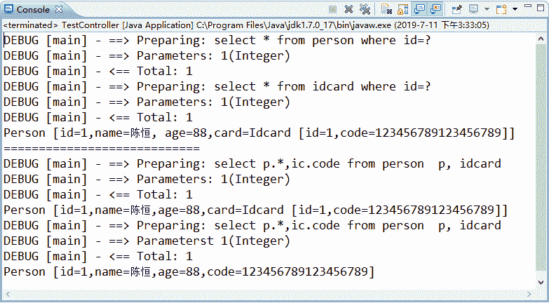

# MyBatis 一对一关联查询（级联查询）

> 原文：[`c.biancheng.net/view/4368.html`](http://c.biancheng.net/view/4368.html)

一对一级联关系在现实生活中是十分常见的，例如一个大学生只有一张一卡通，一张一卡通只属于一个学生。再如人与身份证的关系也是一对一的级联关系。

MyBatis 如何处理一对一级联查询呢？在 MyBatis 中，通过 <resultMap> 元素的子元素 <association> 处理这种一对一级联关系。

在 <association> 元素中通常使用以下属性。

*   property：指定映射到实体类的对象属性。
*   column：指定表中对应的字段（即查询返回的列名）。
*   javaType：指定映射到实体对象属性的类型。
*   select：指定引入嵌套查询的子 SQL 语句，该属性用于关联映射中的嵌套查询。

下面以个人与身份证之间的关系为例讲解一对一级联查询的处理过程，读者只需参考该实例即可学会一对一级联查询的 MyBatis 实现。

#### 1）创建数据表

```

CREATE TABLE 'idcard' (
    'id' tinyint(2) NOT NULL AUTO_INCREMENT,
    'code' varchar(18) COLLATE utf8_unicode_ci DEFAULT NULL,
    PRIMARY KEY ('id')
)；

CREATE TABLE 'person'(
    'id' tinyint(2) NOT NULL,
    'name' varchar(20) COLLATE utf8_unicode_ci DEFAULT NULL,
    'age' int(11) DEFAULT NULL,
    'idcard_id' tinyint(2) DEFAULT NULL,
    PRIMARY KEY ('id'),
    KEY 'idcard_id' ('idcard_id'),
    CONSTRAINT 'idcard_id' FOREIGN KEY ('idcard_id') REFERENCES 'idcard'('id')
);
```

#### 2）创建持久化类

在 myBatisDemo02 应用的 com.po 包中创建数据表对应的持久化类 Idcard 和 Person。

Idcard 的代码如下：

```

package com.mybatis.po;

public class Idcard {
    private Integer id;
    private String code;

    // 省略 setter 和 getter 方法
    /**
     * 为方便测试，重写了 toString 方法
     */
    @Override
    public String toString() {
        return "Idcard [id=" + id + ",code=" + code + "]";
    }
}
```

Person 的代码如下：

```

package com.mybatis.po;

public class Person {
    private Integer id;
    private String name;
    private Integer age;

    // 个人身份证关联
    private Idcard card;

    // 省略 setter 和 getter 方法
    @Override
    public String toString() {
        return "Person[id=" + id + ",name=" + name + ",age=" + age + ",card="
                + card + "]";
    }
}
```

#### 3）创建映射文件

首先，在 MyBatis 的核心配置文件 mybatis-config.xml（com.mybatis）中打开延迟加载开关，代码如下：

```

<!--在使用 MyBatis 嵌套查询方式进行关联查询时，使用 MyBatis 的延迟加载可以在一定程度上提高查询效率-->
<settings>
    <!--打开延迟加载的开关-->
    <setting name= "lazyLoadingEnabled" value= "true"/>
    <!--将积极加载改为按需加载-->
    <setting name="aggressiveLazyLoading" value="false"/>
</settings>
```

然后，在 myBatisDemo02 应用的 com.mybatis 中创建两张表对应的映射文件 IdCardMapper.xml 和 PersonMapper.xml。在 PersonMapper.xml 文件中以 3 种方式实现“根据 id 查询个人信息”的功能，详情请看代码备注。

IdCardMapper.xml 的代码如下：

```

<?xml version="1.0" encoding="UTF-8" ?>
<!DOCTYPE mapper
PUBLIC "-//mybatis.org//DTD Mapper 3.0//EN"
"http://mybatis.org/dtd/mybatis-3-mapper.dtd">
<mapper namespace="com.dao.IdCardDao">
    <select id="selectCodeById" parameterType="Integer" resultType= "com.po.Idcard">
        select * from idcard where id=#{id}
    </select>
</mapper>
```

PersonMapper.xml 的代码如下：

```

<?xml version="1.0" encoding="UTF-8" ?>
<!DOCTYPE mapper
PUBLIC "-//mybatis.org//DTD Mapper 3.0//EN"
"http://mybatis.org/dtd/mybatis-3-mapper.dtd">
<mapper namespace="com.dao.PersonDao">
    <!-- 一对一根据 id 查询个人信息：级联查询的第一种方法（嵌套查询，执行两个 SQL 语句）-->
    <resultMap type="com.po.Person" id="cardAndPerson1">
        <id property="id" column="id"/>
        <result property="name" column="name"/>
        <result property="age" column="age"/>
        <!-- 一对一级联查询-->
        <association property="card" column="idcard_id" javaType="com.po.Idcard"
        select="com.dao.IdCardDao.selectCodeByld"/>
    </resultMap>
    <select id="selectPersonById1" parameterType="Integer" resultMap=
    "cardAndPerson1">
        select * from person where id=#{id}
    </select>
    <!--对一根据 id 查询个人信息：级联查询的第二种方法（嵌套结果，执行一个 SQL 语句）-->
    <resultMap type="com.po.Person" id="cardAndPerson2">
        <id property="id" column="id"/>
        <result property="name" column="name"/>
        <result property="age" column="age"/>
        <!-- 一对一级联查询-->
        <association property="card" javaType="com.po.Idcard">
            <id property="id" column="idcard_id"/>
            <result property="code" column="code"/>
        </association>
    </resultMap>

    <select id="selectPersonById2" parameterType="Integer" resultMap= "cardAndPerson2">
        select p.*,ic.code
        from person p, idcard ic
        where p.idcard_id=ic.id and p.id=#{id}
    </select>

    <!-- 一对一根据 id 查询个人信息：连接查询（使用 POJO 存储结果）-->
    <select id="selectPersonById3" parameterType="Integer" resultType= "com.pojo.SelectPersonById">
        select p.*,ic.code
        from person p, idcard ic
        where p.idcard_id = ic.id and p.id=#{id}
    </select>
</mapper>
```

#### 4）创建 POJO 类

在 myBatisDemo02 应用的 com.pojo 包中创建在第 3 步中使用的 POJO 类 com.pojo.SelectPersonById。

SelectPersonById 的代码如下：

```

package com.pojo;
public class SelectPersonById {
    private Integer id;
    private String name;
    private Integer age;
    private String code;
    //省略 setter 和 getter 方法
    @Override
    public String toString() {
        return "Person [id=" +id+",name=" +name+ ",age=" +age+ ",code=" +code+ "]";
    }
}
```

#### 5）创建数据操作接口

在 myBatisDemo02 应用的 com.dao 包中创建第 3 步中映射文件对应的数据操作接口 IdCardDao 和 PersonDao。

IdCardDao 的代码如下：

```

@Repository("idCardDao")
@Mapper
public interface IdCardDao {
    public Idcard selectCodeById(Integer i);
}
```

PersonDao 的代码如下：

```

@Repository("PersonDao")
@Mapper
public interface PersonDao {
    public Person selectPersonById1(Integer id);
    public Person selectPersonById2(Integer id);
    public SelectPersonById selectPersonById3(Integer id);
}
```

#### 6）调用接口方法及测试

在 myBatisDemo02 应用的 com.controller 包中创建 OneToOneController 类，在该类中调用第 5 步的接口方法，同时创建测试类 TestOneToOne。

OneToOneController 的代码如下：

```

@Controller("oneToOneController")
public class OneToOneController {
    @Autowired
    private PersonDao personDao;
    public void test(){
        Person p1 = personDao.selectPersonById1(1);
        System.out.println(p1);
        System.out.println("=============================");
        Person p2 = personDao.selectPersonById2(1);
        System.out.println(p2);
        System.out.println("=============================");
        selectPersonById p3 = personDao.selectPersonById3(1);
        System.out.println(p3);
    }
}
```

TestOneToOne 的代码如下：

```

public class TestOneToOne {
    public static void main(String[] args) {
        ApplicationContext appcon = new ClassPathXmlApplicationContext("applicationContext.xml");
        OneToOneController oto = (OneToOneController)appcon.getBean("oneToOne-Controller");
        oto.test();
    }
}
```

上述测试类的运行结果如图 1 所示。

图 1  一对一级联查询结果