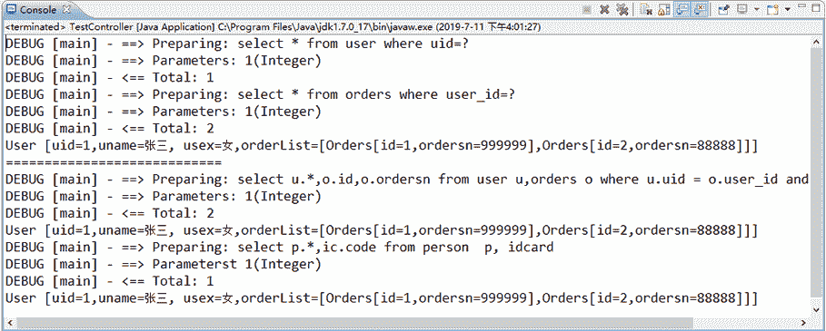

# MyBatis 一对多关联查询（级联查询）

> 原文：[`c.biancheng.net/view/4373.html`](http://c.biancheng.net/view/4373.html)

在《MyBatis 一对一关联查询》教程中学习了 MyBatis 如何处理一对一级联查询，那么 MyBatis 又是如何处理一对多级联查询的呢？在实际生活中一对多级联关系有许多，例如一个用户可以有多个订单，而一个订单只属于一个用户。

下面以用户和订单之间的关系为例讲解一对多级联查询（实现“根据 uid 查询用户及其关联的订单信息”的功能）的处理过程，读者只需参考该实例即可学会一对多级联查询的 MyBatis 实现。

#### 1）创建数据表

本实例需要两张数据表，一张是用户表 user，一张是订单表 orders，这两张表具有一对多的级联关系。user 表在前面已创建，orders 表的创建代码如下：

```

CREATE TABLE `orders` (
    `id` tinyint(2) NOT NULL AUTO_INCREMENT,
    `ordersn` varchar(10) DEFAULT NULL,
    `user_id` tinyint(2) DEFAULT NULL,
    PRIMARY KEY (`id`)
) ENGINE=InnoDB DEFAULT CHARSET=utf8;
```

#### 2）创建持久化类

在 myBatisDemo02 应用的 com.po 包中创建数据表 orders 对应的持久化类 Orders，user 表对应的持久化类 MyUser 在前面已创建，但需要为 MyUser 添加如下属性：

// 一对多级联查询，用户关联的订单
private List<Orders> ordersList;

同时，需要为该属性添加 setter 和 getter 方法。

Orders 类的代码如下：

```

package com.po;

public class Orders {
    private Integer id;
    private String ordersn;

    public Integer getId() {
        return id;
    }

    public void setId(Integer id) {
        this.id = id;
    }

    public String getOrdersn() {
        return ordersn;
    }

    public void setOrdersn(String ordersn) {
        this.ordersn = ordersn;
    }

    @Override
    public String toString() {
        return "Orders[id=" + id + ",ordersn=" + ordersn + "]";
    }
}
```

#### 3）创建映射文件

在 myBatisDemo02 应用的 com.mybatis 中创建两张表对应的映射文件 UserMapper.xml 和 OrdersMapper.xml。映射文件 UserMapper.xml 在前面已创建，但需要添加以下配置才能实现一对多级联查询（根据 uid 查询用户及其关联的订单信息）：

```

<?xml version="1.0" encoding="UTF-8"?>
<!DOCTYPE mapper
PUBLIC "-//mybatis.org//DTD Mapper 3.0//EN"
"http://mybatis.org/dtd/mybatis-3-mapper.dtd">
<mapper namespace="com.mybatis.mapper.UserMapper">
    <!-- 一对多 根据 uid 查询用户及其关联的订单信息：级联查询的第一种方法（嵌套查询） -->
    <resultMap type="com.po.MyUser" id="userAndOrders1">
        <id property="uid" column="uid" />
        <result property="uname" column="uname" />
        <result property="usex" column="usex" />
        <!-- 一对多级联查询，ofType 表示集合中的元素类型，将 uid 传递给 selectOrdersByld -->
        <collection property="ordersList" ofType="com.po.Orders"
            column="uid" select="com.dao.OrdersDao.selectOrdersByld" />
    </resultMap>
    <select id="selectUserOrdersById1" parameterType="Integer"
        resultMap="userAndOrders1">
        select * from user where uid = #{id}
    </select>
    <!--对多根据 uid 查询用户及其关联的订单信息：级联查询的第二种方法（嵌套结果） -->
    <resultMap type="com.po.MyUser" id="userAndOrders2">
        <id property="uid" column="uid" />
        <result property="uname" column="uname" />
        <result property="usex" column="usex" />
        <!-- 对多级联查询，ofType 表示集合中的元素类型 -->
        <collection property="ordersList" ofType="com.po.Orders">
            <id property="id" column="id" />
            <result property="ordersn" column="ordersn" />
        </collection>
    </resultMap>
    <select id="selectUserOrdersById2" parameterType="Integer"
        resultMap="userAndOrders2">
        select u.*,o.id, o.ordersn from user u, orders o where u.uid
        = o.user_id and
        u.uid=#{id}
    </select>
    <!-- 一对多 根据 uid 查询用户及其关联的订单信息：连接查询（使用 POJO 存储结果） -->
    <select id="selectUserOrdersById3" parameterType="Integer"
        resultType="com.pojo.SelectUserOrdersById">
        select u.*, o.id, o.ordersn from user u, orders o where
        u.uid = o.user_id
        and u.uid=#{id}
    </select>
</mapper>
```

OrdersMapper.xml 的配置代码如下：

```

<?xml version="1.0" encoding="UTF-8"?>
<!DOCTYPE mapper
PUBLIC "-//mybatis.org//DTD Mapper 3.0//EN"
"http://mybatis.org/dtd/mybatis-3-mapper.dtd">
<mapper namespace="com.dao.OrdersDao">
    <!-- 根据用户 uid 查询订单信息 -->
    <select id="selectOrdersById" resultType="com.po.Orders"
        parameterType="Integer">
        select * from orders where user_id=#{id}
    </select>
</mapper>
```

#### 4）创建 POJO 类

在 myBatisDemo02 应用的 com.pojo 包中创建在第 3 步中使用的 POJO 类 com.pojo. SelectUserOrdersById。

SelectUserOrdersById 的代码如下：

```

package com.po;

public class SelectUserOrdersById {
    private Integer uid;
    private String uname;
    private String usex;
    private Integer id;
    private String ordersn;

    // 省略 setter 和 getter 方法
    @Override
    public String toString() { // 为了方便查看结果，重写了 toString 方法
        return "User[uid=" + uid + ",uname=" + uname + ",usex=" + usex
                + ",oid=" + id + ",ordersn=" + ordersn + "]";
    }
}
```

#### 5）创建数据操作接口

在 myBatisDemo02 应用的 com.dao 包中创建第 3 步中映射文件对应的数据操作接口 OrdersDao 和 UserDao。

OrdersDao 的代码如下：

```

package com.dao;

import java.util.List;
import org.apache.ibatis.annotations.Mapper;
import org.springframework.stereotype.Repository;
import com.po.Orders;

@Repository("ordersDao")
@Mapper
public interface OrdersDao {
    public List<Orders> selectOrdersById(Integer uid);
}
```

UserDao 接口在前面已创建，这里只需添加如下接口方法：

```

package com.dao;

import java.util.List;
import java.util.Map;

import org.apache.ibatis.annotations.Mapper;
import org.springframework.stereotype.Repository;

import com.po.MyUser;
import com.po.SelectUserOrdersById;

@Repository("userDao")
@Mapper
public interface UserDao {

    public MyUser selectOrdersById1(Integer uid);

    public MyUser selectOrdersById2(Integer uid);

    public List<SelectUserOrdersById> selectOrdersById3(Integer uid);
}
```

#### 6）调用接口方法及测试

在 myBatisDemo02 应用的 com.controller 包中创建 OneToMoreController 类，在该类中调用第 5 步的接口方法，同时创建测试类 TestOneToMore。

OneToMoreController 的代码如下：

```

@Controller("oneToMoreController")
public class oneToMoreController {
    @Autowired
    private UserDao userDao;
    public void test(){
        //查询一个用户及订单信息
        MyUser auser1 = userDao.selectUserOrderById1(1);
        System.out.println(auser1);
        System.out.println("=============================");
        MyUser auser2 = userDao.selectUserOrderById2(1);
        System.out.println(auser2);
        System.out.println("=============================");
        List<SelectUserOrdersById> auser3 = userDao.selectUserOrdersById3(1);
        System.out.println(auser3);
        System.out.println("=============================");
    }
}
```

TestOneToMore 的代码如下：

```

public class TestOneToMore {
    public static void main(String[] args) {
        ApplicationContext appcon = new ClassPathXmlApplicationContext("applicationContext.xml");
        OneToMoreController otm = (OneToMoreController)appcon.getBean("oneToMoreController");
        otm.test();
    }
}
```

测试类的运行结果如图 1 所示。


图 1  一对多级联查询结果