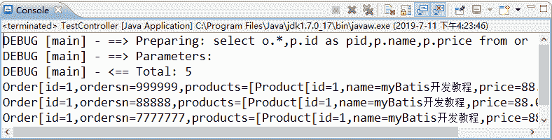

# MyBatis 多对多关联查询（级联查询）

> 原文：[`c.biancheng.net/view/4374.html`](http://c.biancheng.net/view/4374.html)

其实，MyBatis 没有实现多对多级联，这是因为多对多级联可以通过两个一对多级联进行替换。

例如，一个订单可以有多种商品，一种商品可以对应多个订单，订单与商品就是多对多的级联关系，使用一个中间表（订单记录表）就可以将多对多级联转换成两个一对多的关系。

下面以订单和商品（实现“查询所有订单以及每个订单对应的商品信息”的功能）为例讲解多对多级联查询。

#### 1）创建数据表

订单表在前面已创建，这里需要创建商品表 product 和订单记录表 orders_detail，创建代码如下：

```

CREATE TABLE 'product'(
    'id' tinyint(2) NOT NULL,
    'name' varchar(50) COLLATE utf8_unicode_ci DEFAULT NULL,
    'price' double DEFAULT NULL,
    PRIMARY KEY ('id')
)；
CREATE TABLE 'orders_detail'(
    'id' tinyint(2) NOT NULL AUTO_INCREMENT,
    'orders_id' tinyint(2) DEFAULT NULL,
    'product_id' tinyint(2) DEFAULT NULL,
    PRIMARY KEY ('id'),
    KEY 'orders_id' ('orders_id'),
    KEY 'product_id' ('product_id'),
    CONSTRAINT 'orders_id' FOREIGN KEY ('orders_id') REFERENCES 'orders' ('id'),
    CONSTRAINT 'product_id' FOREIGN KEY ('product_id') REFERENCES 'product' ('id')
);
```

#### 2）创建持久化类

在 myBatisDemo02 应用的 com.po 包中创建数据表 product 对应的持久化类 Product，而中间表 orders_detail 不需要持久化类，但需要在订单表 orders 对应的持久化类 Orders 中添加关联属性。

Product 的代码如下：

```

package com.po;

import java.util.List;

public class Product {
    private Integer id;
    private String name;
    private Double price;
    // 多对多中的一个一对多
    private List<Orders> orders;

    // 省略 setter 和 getter 方法
    @Override
    public String toString() { // 为了方便查看结果，重写了 toString 方法
        return "Product[id=" + id + ",name=" + name + ",price=" + price + "]";
    }
}
```

Orders 的代码如下：

```

package com.po;
import java.util.List;
public class Orders {
    private Integer id;
    private String ordersn;
    // 多对多中的另一个一对多
    private List<Product> products;

    // 省略 setter 和 getter 方法
    @Override
    public String toString() {
        return "Orders[id=" + id + ",ordersn=" + ordersn + ",products="
                + products + "]";
    }
}
```

#### 3）创建映射文件

本实例只需在 com.mybatis 的 OrdersMapper.xml 文件中追加以下配置即可实现多对多级联查询。

#### 4）创建 POJO 类

该实例不需要创建 POJO 类。

#### 5）添加数据操作接口方法

在 Orders 接口中添加以下接口方法：

public List<Orders> selectallOrdersAndProducts();

#### 6）调用接口方法及测试

在 myBatisDemo02 应用的 com.controller 包中创建 MoreToMoreController 类，在该类中调用第 5 步的接口方法，同时创建测试类 TestMoreToMore。

MoreToMoreController 的代码如下：

```

package com.controller;

import java.util.List;

import org.springframework.beans.factory.annotation.Autowired;
import org.springframework.stereotype.Controller;

import com.dao.OrdersDao;
import com.po.Orders;

@Controller("moreToMoreController")
public class MoreToMoreController {
    @Autowired
    private OrdersDao ordersDao;

    public void test() {
        List<Orders> os = ordersDao.selectallOrdersAndProducts();
        for (Orders orders : os) {
            System.out.println(orders);
        }
    }
}
```

TestMoreToMore 的代码如下：

```

package com.controller;

import org.springframework.context.ApplicationContext;
import org.springframework.context.support.ClassPathXmlApplicationContext;

public class TestMoreToMore {
    public static void main(String[] args) {
        ApplicationContext appcon = new ClassPathXmlApplicationContext(
                "applicationContext.xml");
        MoreToMoreController otm = (MoreToMoreController) appcon
                .getBean("moreToMoreController");
        otm.test();
    }
}
```

上述测试类的运行结果如图 1 所示。


图 1  多对多级联查询结果