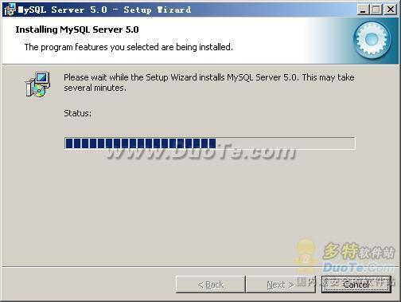

# Windows 平台下安装 Mysql|Windows 下 Mysql 安装教程

打开下载的 mysql 安装文件 mysql-5.0.27-win32.zip，双击解压缩，运行“setup.exe”，出现如下界面

mysql 安装向导启动，按“Next”继续

选择安装类型，有“Typical（默认）”、“Complete（完全）”、“Custom（用户自定义）”三个选项，我们选择“Custom”，有更多的选项，也方便熟悉安装过程

在“Developer Components（开发者部分）”上左键单击，选择“This feature, and all subfeatures, will be installed on local hard drive.”，即“此部分，及下属子部分内容，全部安装在本地硬盘上”。在上面的“MySQL Server（mysql 服务器）”、“Client Programs（mysql 客户端程序）”、“Documentation（文档）”也如此操作，以保证安装所有文件。点选“Change...”，手动指定安装目录。

填上安装目录，我的是“F:ServerMySQLMySQL Server 5.0”，也建议不要放在与操作系统同一分区，这样可以防止系统备份还原的时候，数据被清空。按“OK”继续。

返回刚才的界面，按“Next”继续

确认一下先前的设置，如果有误，按“Back”返回重做。按“Install”开始安装。

正在安装中，请稍候，直到出现下面的界面

这里是询问你是否要注册一个 mysql.com 的账号，或是使用已有的账号登陆 mysql.com，一般不需要了，点选“Skip Sign-Up”，按“Next”略过此步骤。

如果不需要配置 Mysql，将去除对勾即可，软件安装完毕，即可使用。

如果你希望在安装的时候对 Mysql 进行配置，请接着查看下文：[Windows 平台下配置 Mysql](http://c.biancheng.net/cpp/html/1463.html)