# Windows 平台下配置 Mysql|Windows 下 mysql 配置教程

这里说的配置 Mysql，是在安装时进行的，请先查看：[Windows 平台下安装 Mysql](http://c.biancheng.net/cpp/html/1462.html)

紧接上文，安装完成后将配置选项打上对勾，按下“Finish”，出现下面的界面，这里有一个很好的功能，mysql 配置向导，不用向以前一样，自己手动乱七八糟的配置 my.ini 了，将 “Configure the Mysql Server now”前面的勾打上，点“Finish”结束软件的安装并启动 mysql 配置向导。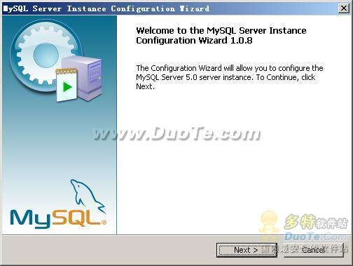

mysql 配置向导启动界面，按“Next”继续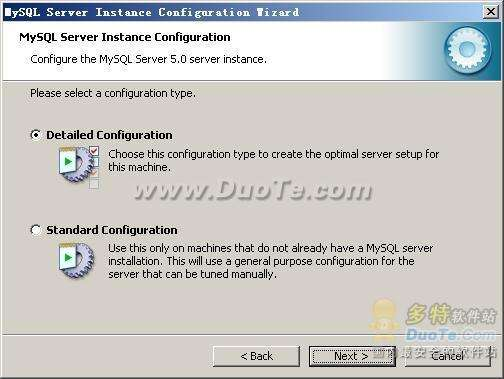

选择配置方式，“Detailed Configuration（手动精确配置）”、“Standard Configuration（标准配置）”，我们选择“Detailed Configuration”，方便熟悉配置过程。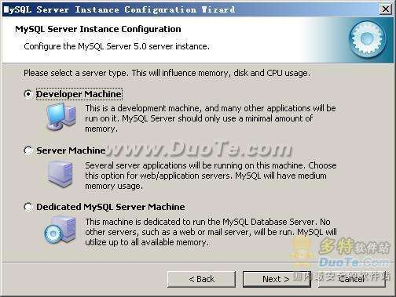

选择服务器类型，“Developer Machine（开发测试类，mysql 占用很少资源）”、“Server Machine（服务器类型，mysql 占用较多资源）”、“Dedicated MySQL Server Machine（专门的数据库服务器，mysql 占用所有可用资源）”，大家根据自己的类型选择了，一般选“Server Machine”，不会太少，也不会占满。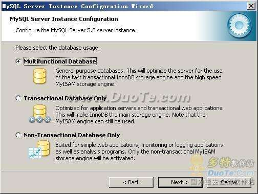

选择 mysql 数据库的大致用途，“Multifunctional Database（通用多功能型，好）”、“Transactional Database Only（服务器类型，专注于事务处理，一般）”、“Non-Transactional Database Only（非事务处理型，较简单，主要做一些监控、记数用，对 MyISAM 数据类型的支持仅限于 non-transactional），随自己的用途而选择了，我这里选择“Transactional Database Only”，按“Next”继续。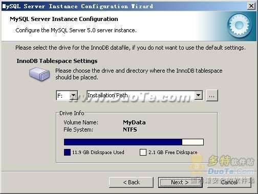

对 InnoDB Tablespace 进行配置，就是为 InnoDB 数据库文件选择一个存储空间，如果修改了，要记住位置，重装的时候要选择一样的地方，否则可能会造成数据库损坏，当然，对数据库做个备份就没问题了，这里不详述。我这里没有修改，使用用默认位置，直接按“Next”继续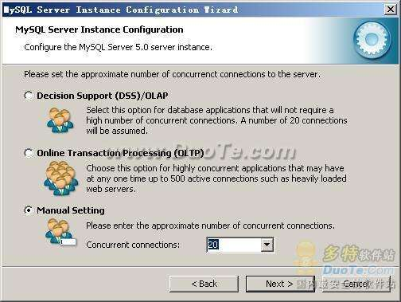

选择您的网站的一般 mysql 访问量，同时连接的数目，“Decision Support(DSS)/OLAP（20 个左右）”、“Online Transaction Processing(OLTP)（500 个左右）”、“Manual Setting（手动设置，自己输一个数）”，我这里选“Online Transaction Processing(OLTP)”，自己的服务器，应该够用了，按“Next”继续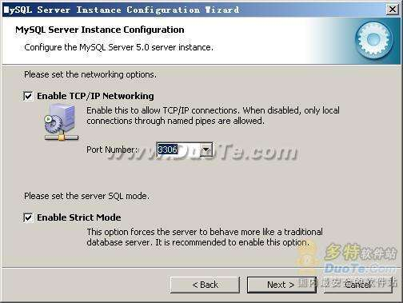

是否启用 TCP/IP 连接，设定端口，如果不启用，就只能在自己的机器上访问 mysql 数据库了，我这里启用，把前面的勾打上，Port Number：3306，在这个页面上，您还可以选择“启用标准模式”（Enable Strict Mode），这样 MySQL 就不会允许细小的语法错误。如果您还是个新手，我建议您取消标准模式以减少麻烦。但熟悉 MySQL 以后，尽量使用标准模式，因为它可以降低有害数据进入数据库的可能性。按“Next”继续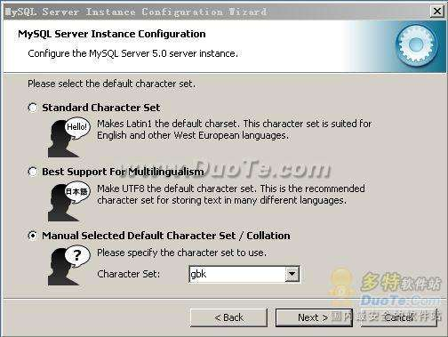

这个比较重要，就是对 mysql 默认数据库语言编码进行设置，第一个是西文编码，第二个是多字节的通用 utf8 编码，都不是我们通用的编码，这里选择第三个，然后在 Character Set 那里选择或填入“gbk”，当然也可以用“gb2312”，区别就是 gbk 的字库容量大，包括了 gb2312 的所有汉字，并且加上了繁体字、和其它乱七八糟的字——使用 mysql 的时候，在执行数据操作命令之前运行一次“SET NAMES GBK;”（运行一次就行了，GBK 可以替换为其它值，视这里的设置而定），就可以正常的使用汉字（或其它文字）了，否则不能正常显示汉字。按 “Next”继续。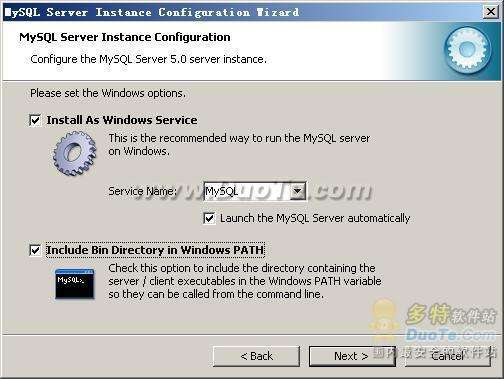

选择是否将 mysql 安装为 windows 服务，还可以指定 Service Name（服务标识名称），是否将 mysql 的 bin 目录加入到 Windows PATH（加入后，就可以直接使用 bin 下的文件，而不用指出目录名，比如连接，“mysql.exe -uusername -ppassword;”就可以了，不用指出 mysql.exe 的完整地址，很方便），我这里全部打上了勾，Service Name 不变。按“Next”继续。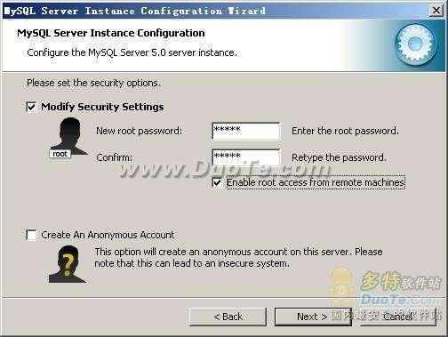

这一步询问是否要修改默认 root 用户（超级管理）的密码（默认为空），“New root password”如果要修改，就在此填入新密码（如果是重装，并且之前已经设置了密码，在这里更改密码可能会出错，请留空，并将“Modify Security Settings”前面的勾去掉，安装配置完成后另行修改密码），“Confirm（再输一遍）”内再填一次，防止输错。
　　“Enable root access from remote machines（是否允许 root 用户在其它的机器上登陆，如果要安全，就不要勾上，如果要方便，就勾上它）”。

最后“Create An Anonymous Account（新建一个匿名用户，匿名用户可以连接数据库，不能操作数据，包括查询）”，一般就不用勾了，设置完毕，按“Next”继续。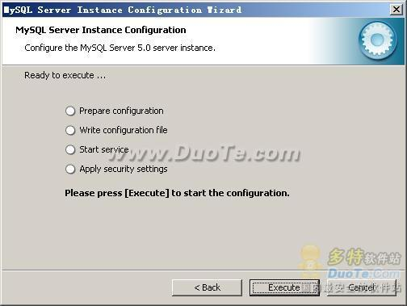

确认设置无误，如果有误，按“Back”返回检查。按“Execute”使设置生效。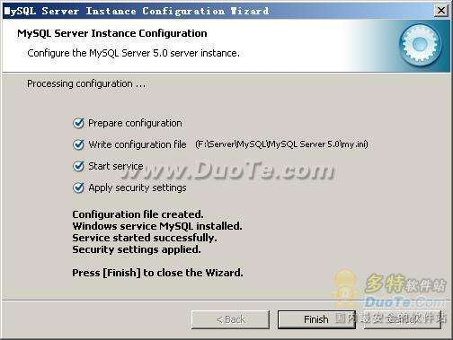设置完毕，按“Finish”结束 mysql 的安装与配置——这里有一个比较常见的错误，就是不能“Start service”，一般出现在以前有安装 mysql 的服务器上，解决的办法，先保证以前安装的 mysql 服务器彻底卸载掉了；不行的话，检查是否按上面一步所说，之前的密码是否有修改，照上面的操作；如果依然不行，将 mysql 安装目录下的 data 文件夹备份，然后删除，在安装完成后，将安装生成的 data 文件夹删除，备份的 data 文件夹移回来，再重启 mysql 服务就可以了，这种情况下，可能需要将数据库检查一下，然后修复一次，防止数据出错。