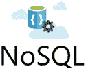

# NoSQL 数据库（非关系型数据库）入门教程

> 原文：[`c.biancheng.net/nosql/`](http://c.biancheng.net/nosql/)

NoSQL 是 Not Only SQL 的缩写，意思是“不仅仅有 SQL”，而不是大家通常理解的“不使用 SQL”。

NoSQL 数据库也即非关系型数据库，它是在大数据的时代背景下产生的，它可以处理分布式、规模庞大、类型不确定、完整性没有保证的“杂乱”数据，这是传统的关系型数据库远远不能胜任的。

NoSQL 数据库并没有一个统一的模型，两种不同的 NoSQL 数据库之间的差异程度，远远超过两种关系型数据库之间的不同。可以说，NoSQL 数据库各有所长，一个优秀的 NoSQL 数据库必然特别适用于某些场合，在这些场合中会远远胜过关系型数据库或者其它 NoSQL 数据库。

这套 NoSQL 入门教程除了会介绍数据库相关的概念，还会对比各种 NoSQL 数据库，以及它们和关系型数据库之间的区别。