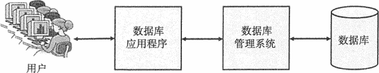
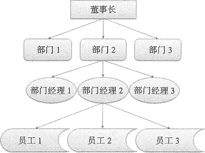
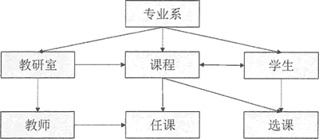
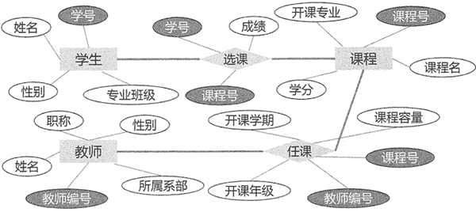

# 数据库是什么？

> 原文：[`c.biancheng.net/view/6489.html`](http://c.biancheng.net/view/6489.html)

数据管理经历了人工管理、文件系统、数据库系统三个阶段。人工管理阶段和文件系统阶段的数据共享性差，冗余度较髙，数据库系统的出现解决了这两方面的问题。

但是随着互联网技术的发展，数据库系统管理的数据及其应用环境发生了很大的变化，主要表现为应用领域越来越广泛，数据种类越来越复杂和多样，而且数据量剧增。

在大数据时代的场景下，传统的关系型数据库已无法满足用户需求，NoSQL 数据库应运而生。

在信息化社会，充分有效地管理和利用各类信息资源，是进行科学研究和决策管理的前提条件。数据库技术是管理信息系统、办公自动化系统、决策支持系统等各类信息系统的核心部分，是进行科学研究和决策管理的重要技术手段。

数据库技术是研究数据库的结构、存储、设计、管理和使用的一门科学。数据库系统（Database System，DBS）是采用数据库技术的计算机系统，它是由计算机硬件、软件和数据资源组成的系统，能实现有组织的、动态的存储大量关联数据，并方便多用户访问。

数据库系统由用户、数据库应用程序、数据库管理系统（DataBase Management System，DBMS）和数据库（DataBase，DB）组成。 如图所示。

## 数据库

数据库是长期存储在计算机内的、有组织的、统一管理的、可以变现为多种形式的、可共享的数据集合。在这里：

*   “共享”是指数据库中的数据，可为多个不同的用户、使用多种不同的语言、为了不同的目的而同时存取，甚至同一数据也可以同时存取；
*   “集合”是指某特定应用环境中的各种应用的数据及其之间的联系全部集中按照一定的结构形式进行存储。

数据库中的数据按一定的数据模型组织、描述和存储，具有较小的冗余度、较高的数据独立性和易扩展性，并可为各种用户所共享。

在数据库技术中，用数据模型（Data Model）的概念描述数据库的结构和语义，对现实世界的数据进行抽象。数据库根据不同的逻辑模型可分成三种：层次型、网状型和关系型。

#### 层次型数据模型

早期的数据库多采用层次型数据模型，称为层次型数据库，如图所示，它用树形（层次）结构表示实体类型及实体间的联系。

在这种树形结构中，数据按自然的层次关系组织起来，以反映数据之间的隶属关系，树中的节点是记录类型，每个非根节点都只有一个父节点，而父节点可同时拥有多个子节点，父节点和子节点的联系是 1:N 的联系。

正因为层次型数据模型的构造简单，在多数的实际问题中，数据间关系如果简单地通过树形结构表示，则会造成数据冗余度过高， 所以层次型数据模型逐渐被淘汰。

#### 网状型数据模型

采用网状型数据模型的数据库称为网状型数据库，通过网络结构表示数据间联系，如图所示。

图中的节点代表数据记录，连线描述不同节点数据间的联系。这种数据模型的基本特征是, 节点数据之间没有明确的从属关系，一个节点可与其他多个节点建立联系，即节点之间的联系是任意的；任何两个节点之间都能发生联系，可表示多对多的关系。

在网状型数据模型中，数据节点之间的关系比较复杂，而且随着应用范围的扩展，数据库的结构变得越来越复杂，不利于用户掌握。

#### 关系型数据模型

关系型数据模型开发较晚。1970 年，IBM 公司的研究员埃德加·弗兰克·科德（Edgar Frank Codd）在 Communication of the ACM 上发表了一篇名为 A Relational Model of Data for Large Shared Data Banks 的论文，提出了关系型数据模型的概念，奠定了关系型数据模型的理论基础。

关系型数据库通过满足一定条件的二维表格来表示实体集合以及数据间联系的一种模型，如下图所示， 学生、课程和教师是实体集合，选课和任课是实体间的联系，实体和实体间的联系均通过二维表格来描述。

关系型数据模型具有坚实的数学基础与理论基础，使用灵活方便，适应面广，因此发展十分迅速。目前流行的一些数据库系统，如 Oracle、Sybase、Ingress、Informix 等都属于关系型数据库。

## 数据库管理系统

数据库管理系统（DBMS）是一种操纵和管理数据库的大型软件，用于建立、使用和维护数据库。DBMS 是一个庞大且复杂的产品，几乎都是由软件供应商授权提供的，如 Oracle 公司的 Oracle 和 MySQL、IBM 公司的 DB2、Microsoft 公司的 Access 和 SQL Server，这些 DBMS 占据了大部分的市场份额。

DBMS 对数据库进行统一管理和控制，以保证数据库的安全性和完整性。用户通过 DBMS 访问数据库中的数据，数据库管理员也通过 DBMS 进行数据库的维护工作。DBMS 允许多个应用程序或多个用户使用不同的方法，在同一时刻或不同时刻去建立、修改和询问数据库。

DBMS 的主要功能如下。

#### 数据定义

DBMS 提供数据定义语言（Data Definition Language, DDL），供用户定义、创建和修改数据库的结构。DDL 所描述的数据库结构仅仅给出了数据库的框架，数据库的框架信息被存放在系统目录中。

#### 数据操纵

DBMS 提供数据操纵语言（Data Manipulation Language, DML），实现用户对数据的操纵功能，包括对数据库数据的插入、删除、更新等操作。

#### 数据库的运行管理

DBMS 提供数据库的运行控制和管理功能，包括多用户环境下的事务的管理和自动恢复、并发控制和死锁检测、安全性检查和存取控制、完整性检查和执行、运行日志的组织管理等。这些功能保证了数据库系统的正常运行。

#### 数据组织、存储与管理

DBMS 要分类组织、存储和管理各种数据，就需要确定以何种文件结构和存取方式来组织这些数据，实现数据之间的联系。数据组织和存储的基本目标是提高存储空间的利用率，选择合适的存取方法提高存取效率。

#### 数据库的维护

数据库的维护包括数据库的数据载入、转换、转储、恢复，数据库的重组织和重构，以及性能监控分析等功能，这些功能分别由各个应用程序来完成。

#### 通信

DBMS 有接口负责处理数据的传送。这些接口与操作系统的联机处理以及分时系统和远程作业输入相关。网络环境下的数据库系统还应该包括 DBMS 与网络中其他软件系统的通信功能以及数据库之间的互操作功能。

DBMS 是数据库系统的核心，是管理数据库的软件。DBMS 是实现把用户视角下的、抽象的逻辑数据处理，转换成为计算机中具体的物理数据处理的软件。有了 DBMS，用户可以在抽象意义下处理数据，而不必考虑这些数据在计算机中的布局和物理位置。

## 应用程序

数据库系统还包括数据库应用程序。应用程序最终是面向用户的，用户可以通过应用程序输入和处理数据库中的数据。

例如，在学校选课系统中，管理员用户可以创建课程信息，学生用户可以修改课程信息，应用程序将这些操作提交给 DBMS，由 DBMS 将这种用户级别的操作转化成数据库能识别的 DDL。

应用程序还能够处理用户的查询，比如学生查询星期一有哪些课程，应用程序首先生成一个课程查询请求，并发送给 DBMS，DBMS 从数据库中查询结果并格式化后返回给用户。