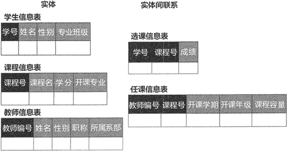
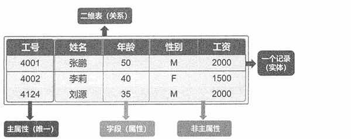

# 关系型数据库是什么？

> 原文：[`c.biancheng.net/view/6490.html`](http://c.biancheng.net/view/6490.html)

关系型数据库建立在关系型数据模型的基础上，是借助于集合代数等数学概念和方法来处理数据的数据库。现实世界中的各种实体以及实体之间的各种联系均可用关系模型来表示，市场上占很大份额的 Oracle、MySQL、DB2 等都是面向关系模型的 DBMS。

## 关系型数据库基本概念

在关系型数据库中，实体以及实体间的联系均由单一的结构类型来表示，这种逻辑结构是一张二维表。图 1 所示的学生选课系统中，实体和实体间联系在数据库中的逻辑结构可通过图 2 所示。

图 1：关系型数据库
 
图 2：学生选课系统数据库逻辑结构
关系型数据库以行和列的形式存储数据，这一系列的行和列被称为表，一组表组成了数据库。图 3 所示的员工信息表就是关系型数据库。

图 3：员工信息表属性说明：

*   二维表：也称为关系，它是一系列二维数组的集合，用来代表与存储数据对象之间的关系。它由纵向的列和横向的行组成。
*   行：也叫元组或记录，在表中是一条横向的数据集合，代表一个实体。
*   列：也叫字段或属性，在表中是一条纵行的数据集合。列也定义了表中的数据结构。
*   主属性：关系中的某一属性组，若它们的值唯一地标识一个记录，则称该属性组为主属性或主键。主属性可以是一个属性，也可以由多个属性共同组成。在图 1-5 中，学号是学生信息表的主属性，但是课程信息表中，学号和课程号共同唯一地标识了一条记录，所以学号和课程号一起组成了课程信息表的主属性。

## 结构化查询语言

关系型数据库的核心是其结构化的查询语言（Structured Query Language, SQL），SQL 涵盖了数据的查询、操纵、定义和控制，是一个综合的、通用的且简单易懂的数据库管理语言。同时 SQL 又是一种高度非过程化的语言，数据库管理者只需要指出做什么，而不需要指出该怎么做即可完成对数据库的管理。

SQL 可以实现数据库全生命周期的所有操作，所以 SQL 自产生之日起就成了检验关系型数据库管理能力的“试金石”，SQL 标准的每一次变更和完善都引导着关系型数据库产品的发展方向。

SQL 包含以下四个部分。

#### 数据定义语言（DDL）

DDL 包括 CREATE、DROP、ALTER 等动作。在数据库中使用 CREATE 来创建新表，DROP 来删除表，ALTER 负责数据库对象的修改。

例如，创建学生信息表使用以下命令：

CREATE TABLE StuInfo(id int(10) NOT NULL,PRIMARY KEY(id),name varchar(20), female bool,class varchar(20));

#### 数据查询语言（Data Query Language, DQL）

DQL 负责进行数据查询，但是不会对数据本身进行修改。

DQL 的语法结构如下：

SELECT FROM 表名 1,表 2
where 查询条件    #可以组合 and、or、 not、 =、between、and、in、like 等；
group by 分组字段
having (分组后的过滤条件)
order by 排序字段和规则;

#### 数据操纵语言（Data Manipulation Language, DML）

DML 负责对数据库对象运行数据访问工作的指令集，以 INSERT、UPDATE、DELETE 三种指令为核心，分别代表插入、更新与删除。

向表中插入数据命令如下：

INSERT 表名 (字段 1,字段 2,......，字段 n,) VALUES (字段 1 值，字段 2 值，......，字段 n 值) where 查询条件；

#### 数据控制语言（Data Control Language, DCL）

DCL 是一种可对数据访问权进行控制的指令。它可以控制特定用户账户对查看表、预存程序、用户自定义函数等数据库操作的权限，由 GRANT 和 REVOKE 两个指令组成。

DCL 以控制用户的访问权限为主，GRANT 为授权语句，对应的 REVOKE 是撤销授权语句。

## 关系型数据库的优缺点

关系型数据库已经发展了数十年，其理论知识、相关技术和产品都趋于完善，是目前世界上应用最广泛的数据库系统。

#### 关系型数据库的优点

*   容易理解：二维表结构非常贴近逻辑世界的概念，关系型数据模型相对层次型数据模型和网状型数据模型等其他模型来说更容易理解。
*   使用方便：通用的 SQL 使用户操作关系型数据库非常方便。
*   易于维护：丰富的完整性大大减少了数据冗余和数据不一致的问题。关系型数据库提供对事务的支持，能保证系统中事务的正确执行，同时提供事务的恢复、回滚、并发控制和死锁问题的解决。

#### 关系型数据库的缺点

随着各类互联网业务的发展，关系型数据库难以满足对海量数据的处理需求，存在以下不足。

*   高并发读写能力差：网站类用户的并发性访问非常高，而一台数据库的最大连接数有限，且硬盘 I/O 有限，不能满足很多人同时连接。
*   对海量数据的读写效率低：若表中数据量太大，则每次的读写速率都将非常缓慢。
*   扩展性差：在一般的关系型数据库系统中，通过升级数据库服务器的硬件配置可提高数据处理的能力，即纵向扩展。但纵向扩展终会达到硬件性能的瓶颈，无法应对互联网数据爆炸式增长的需求。还有一种扩展方式是横向扩展，即采用多台计算机组成集群，共同完成对数据的存储、管理和处理。这种横向扩展的集群对数据进行分散存储和统一管理，可满足对海量数据的存储和处理的需求。但是由于关系型数据库具有数据模型、完整性约束和事务的强一致性等特点，导致其难以实现高效率的、易横向扩展的分布式架构。