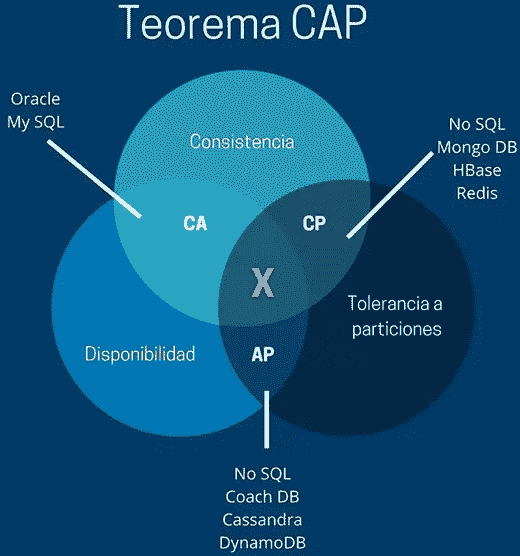

# CAP 理论是什么？

> 原文：[`c.biancheng.net/view/6493.html`](http://c.biancheng.net/view/6493.html)

CAP 理论是针对分布式数据库而言的，它是指在一个分布式系统中，一致性（Consistency, C）、可用性（Availability, A）、分区容错性（Partition Tolerance, P）三者不可兼得。

## 一致性（C）

一致性是指“all nodes see the same data at the same time”，即更新操作成功后，所有节点在同一时间的数据完全一致。

一致性可以分为客户端和服务端两个不同的视角：

*   从客户端角度来看，一致性主要指多个用户并发访问时更新的数据如何被其他用户获取的问题；
*   从服务端来看，一致性则是用户进行数据更新时如何将数据复制到整个系统，以保证数据的一致。

一致性是在并发读写时才会出现的问题，因此在理解一致性的问题时，一定要注意结合考虑并发读写的场景。

## 可用性（A）

可用性是指“reads and writes always succeed”，即用户访问数据时，系统是否能在正常响应时间返回结果。

好的可用性主要是指系统能够很好地为用户服务，不出现用户操作失败或者访问超时等用户体验不好的情况。在通常情况下，可用性与分布式数据冗余、负载均衡等有着很大的关联。

## 分区容错性（P）

分区容错性是指“the system continues to operate despite arbitrary message loss or failure of part of the system”，即分布式系统在遇到某节点或网络分区故障的时候，仍然能够对外提供满足一致性和可用性的服务。

分区容错性和扩展性紧密相关。在分布式应用中，可能因为一些分布式的原因导致系统无法正常运转。分区容错性高指在部分节点故障或出现丢包的情况下，集群系统仍然能提供服务，完成数据的访问。分区容错可视为在系统中采用多副本策略。

## 相互关系

CAP 理论认为分布式系统只能兼顾其中的两个特性，即出现 CA、CP、AP 三种情况，如图所示。

#### CA without P

如果不要求 Partition Tolerance，即不允许分区，则强一致性和可用性是可以保证的。其实分区是始终存在的问题，因此 CA 的分布式系统更多的是允许分区后各子系统依然保持 CA。

#### CP without A

如果不要求可用性，相当于每个请求都需要在各服务器之间强一致，而分区容错性会导致同步时间无限延长，如此 CP 也是可以保证的。很多传统的数据库分布式事务都属于这种模式。

#### AP without C

如果要可用性高并允许分区，则需放弃一致性。一旦分区发生，节点之间可能会失去联系，为了实现高可用，每个节点只能用本地数据提供服务，而这样会导致全局数据的不一致性。

## 总结

在实践中，可根据实际情况进行权衡，或者在软件层面提供配置方式，由用户决定如何选择 CAP 策略。

CAP 理论可用在不同的层面，可以根据 CAP 原理定制局部的设计策略，例如，在分布式系统中，每个节点自身的数据是能保证 CA 的，但在整体上又要兼顾 AP 或 CP。