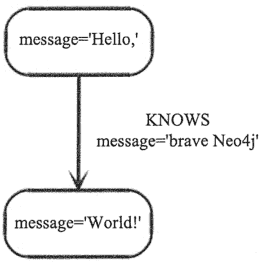

# Java 操作 Neo4j 数据库（附带源码）

> 原文：[`c.biancheng.net/view/6581.html`](http://c.biancheng.net/view/6581.html)

在 Java 应用中使用 Neo4j 是非常容易的，用户能找到需要的一切 —— 从开发环境的建立到使用数据做一些有用的事情。

利用 Java 语言访问 Neo4j 有两种模式，一种是服务端的方式，另一种是嵌入式的方式。

本节介绍嵌入式的方式，即通过 Java 语言和驱动包（neo4j.x.jar）直接新建数据库文件或访问已有的数据库文件。嵌入式方式的工作效率更高。

## 将 Neo4j 引入项目工程中

在 Neo4j 的官方网站上下载合适的版本，并解压到合适的位置，解压后的文件中包含 lib 目录，在 Java 中使用 Neo4j 需要用到此 lib 目录中的 jar 文件。

本节以 Eclipse 为例，将 Neo4j 的库文件增加到构造路径当中。用鼠标右键单击“工程”按钮，然后选择“Build Path -> Configure Build Path”。在对话框中选择 Add External JARs，找到 Neo4j 的 lib 目录，并选择所有的 jar 文件。

引入 jar 包后，同时需要在代码中导入所需的类库：

```

import org.neo4j.graphdb.*;
import org.neo4j.graphdb.factory.GraphDatabaseFactory;
import org.neo4j.graphdb.index.Index;
import org.neo4j.graphdb.traversal.Evaluators;
import org.neo4j.graphdb.traversal.TraversalDescription;
```

## 在 Java 中启动和停止 Neo4j

创建一个新的数据库或者打开一个已经存在的数据库，需要先实例化一个 EmbeddedGraphDatabase 对象。代码如下：

```

graphDb = new GraphDatabaseFactory().newEmbeddedDatabase( DB_PATH );
registerShutdownHook ( graphDb );
```

注意：EmbeddedGraphDatabase 实例可以在多个线程中共享，但不能创建多个实例来指向同一个数据库。

停止数据库，需要调用方法 shutdown()：

```

graphDb.shutdown();
```

为了确保 Neo4j 被正确关闭，用户可以为它增加一个关闭钩子的方法，代码如下：

```

private static void registerShutdownHook( final GraphDatabaseService graphDb ) {
    //Registers a shutdown hook for the Neo4j instance so that it
    //shuts down nicely when the VM exits (even if you "Ctrl-C" the
    //running example before it's completed)
    Runtime.ge().addShutdownHook(new Thread(){
        @Override
        public void run(){
            graphDb.shutdown();
        }
    });
}
```

如果用户只想通过只读方式浏览数据库，需使用 EmbeddedReadOnlyGraphDatabase。

如果用户想通过配置设置来启动 Neo4j，可以加载一个 Neo4j 属性文件，代码如下：

```

GraphDatabaseService graphDb = new GraphDatabaseFactory().
    newEmbeddedDatabaseBuilder("target/database/location").
    loadPropertiesFromFile( pathToConfig + "neo4j.properties"). newGraphDatabase();
```

或者用户可以编程创建自己的 Map<String, String> 来代替属性文件。

## Java 操作 Neo4j 的几个例子

所有的关系都有一个类型。例如，若一个图形数据库实例表示一个社会网络，则一个关系的类型可能叫 KNOWS。

如果该关系（KNOWS）连接了两个节点，那么可能表示这两个人互相认识。一个图形数据库中大量的语义都被编码成关系的类型来使用。虽然关系是直接相连的，但它们也可以不用考虑它们遍历的方向而互相遍历对方。

#### 1) 准备图形数据库

关系类型可以通过 enum 创建。这个范例需要一个单独的关系类型。下面是定义代码：

```

private static enum RelTypes implements RelationshipType{
    KNOWS
}
```

准备一些需要用到的参数：

```

GraphDatabaseService graphDb;
Node firstNode;
Node secondNode;
Relationship relationship;
```

下一步将启动数据库服务器。如果给定的保持数据库的目录不存在，它会自动创建目录，代码如下：

```

graphDb = new GraphDatabaseFactory().newEmbeddedDatabase( DB_PATH );
registerShutdownHook( graphDb );
```

这样就可以与数据库进行交互了。

注意：启动一个图形数据库是一个非常耗费资源的操作，所以不要每次需要与数据库进行交互操作时都去启动一个新的实例。这个实例可以被多个线程共享。事务是线程安全的。

就像上面所看到的一样，注册一个关闭数据库的钩子来确保在 JVM 退岀时数据库已经被关闭。

#### 2) 在一个事务中完成多次写数据库操作

所有的写操作（创建、删除以及更新）都是在一个事务中完成的，这是因为事务是一个企业级数据库中非常重要的一部分。

在 Neo4j 中进行事务处理是非常容易的：

```

Transaction tx = graphDb.beginTx();
try{
    //Updating operations go here
    tx.success();
}
finally{
    tx.finish();
}
```

#### 3) 创建一个小型图形数据库

下面展示了如何创建一个小型图形数据库，数据库中包括两个节点，并且这两个节点之间通过一个关系相连，节点和关系还包括以下属性：

```

firstNode = graphDb.createNode();
firstNode.setProperty( "message", "Hello, ");
secondNode = graphDb.createNode();
secondNode.setProperty( "message", "World!");
relationship = firstNode.createRelationshipTo( secondNode, Re1Types.KNOWS );
relationship.setProperty( "message", nbrave Neo4j");
```

下图所示为图形数据库实例。



#### 4) 打印结果

在创建完成图形数据库后，用户就可以从中读取数据并打印结果，代码如下:

```

System.out.print( firstNode.getProperty("message"));
Systom.out.print( relationship.getProperty("message"));
System.out.print( secondNode.getProperty("message"));
```

输出结果如下图所示


#### 5) 移除数据

若出现下面这种情况，则将在提交之前移除数据。

```

//let's remove the data
firstNode.getSingleRelationship(RelTypes.KNOWS, Direction.OUTGOING).delete();
firstNode.delete();
secondNode.delete();
```

注意，若删除一个仍然有关系的节点，则事务提交时会失败。这是为了确保关系始终存在开始节点和结束节点。

#### 6) 关闭图形数据库

最后，当应用完成后，关闭数据库:

```

graphDb.shutdown();
```