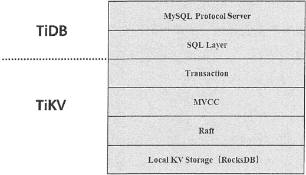
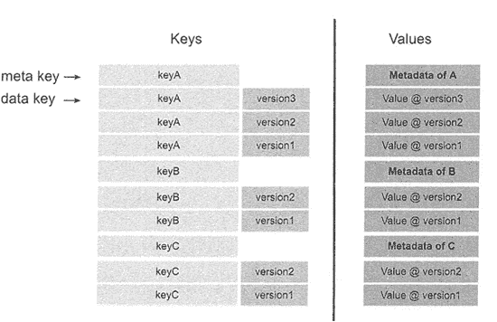
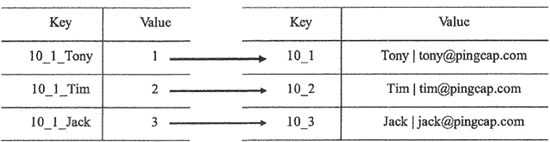
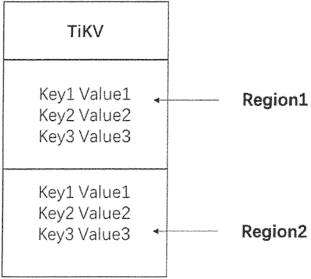
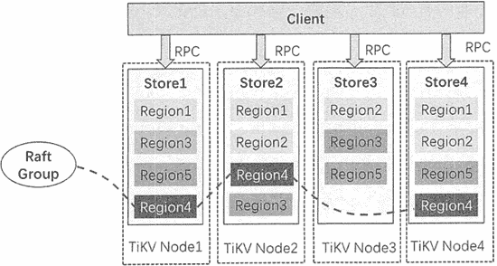

# TiDB 数据库的存储原理（非常详细）

> 原文：[`c.biancheng.net/view/6583.html`](http://c.biancheng.net/view/6583.html)

由前述可知，TiDB 架构是 SQL 层和 TiKV 存储层分离的，SQL 层完成用户 SQL 请求的解析、验证等工作，并执行 SQL 的查询优化。

TiKV 作为 Key-Value 数据库，可完成实际数据的存储，支持分布式事务，并提供对上层透明的水平扩展。

本节主要介绍 TiDB 的存储原理，包括 TiDB 的设计思想、基本概念及实现原理。

## 设计思想

TiDB 的设计是分层的，它的逻辑结构如下图所示，最底层选用了当前比较流行的存储引擎 RocksDB。

RocksDB 性能很强，但它是单机的，为了保证高可用性，因此使用副本的机制。

上层使用 Raft 协议来保证单机失效后数据不会出现丢失和出错，即用 Raft 协议把数据复制到多台 TiKV 节点上，保证在一台机器失效时还有其他机器的副本可以使用。

在安全可靠的 TiKV 存储的基础上再去实现多版本控制（MVCC），提高分布式场景下数据库的性能以及避免死锁。最后再去构建分布式事务，以上这些功能就构成了存储层 TiKV。然后由 TiDB 层实现 SQL 层，并解析 MySQL 网络协议即可。

## 基本概念

#### Key-Value 模型

作为保存数据的系统，首先要决定数据的存储模型，即数据是以何种形式保存下来的。

在 TiKV 中，数据以 Key-Value 模型的形式存储，TiKV 可以比作一个巨大的 Map，里面有序地存储大量的键值对（Key-Value pair），其中 Key 和 Value 均是原始的 Byte 数组，且在 Map 中这些键值对是按照 Key 的二进制顺序排列的，即可以通过 Key 进行顺序查找。

#### RocksDB

TiKV 是参考 Google 的 Spanner 设计实现的，但是 Spanner 是使用 Goolge 文件系统（GFS）作为它的分布式文件系统来存储真实数据的。

TiKV 不依赖任何分布式文件系统，它将键值对保存在 RocksDB 中，具体向磁盘上写数据则由 RocksDB 完成。

RocksDB 是一个开源的、高性能的单机存储引擎，由 Facebook 团队在做持续优化，可以很容易地调整读写和放大空间，以满足 TiKV 的要求。

#### Raft

Raft 是一个管理复制日志的一致性算法，提供了与 Paxos 算法相同的容错功能和性能。但是它的算法结构与 Paxos 不同，使用 Raft 算法用户能够更加容易理解，并且更容易构建一个分布式系统。

Raft 协议将一致性算法分成了几个关键模块，主要提供以下功能。

1.  领导者选举，Raft 算法使用一个随机计时器来选举领导者，日志条目只从领导者发送给其他的服务器。
2.  成员变更，Raft 算法为了调整集群中的成员关系使用了新的联合一致性的方法，这种方法中的大多数不同配置的机器在转换关系的时候会重叠。这就使得配置改变的时候，集群仍能够继续操作。
3.  日志复制，领导者必须从客户端接收日志，然后复制到集群中的其他节点，并且强制要求其他节点的日志与自己保持相同。

TiKV 使用 Rah 来实现数据的复制，每条数据的变更都会被记录成一条 Raft 日志。

通过 Raft 的日志复制功能，可将数据安全、可靠地同步到集群的多个节点上，这样，Raft 可以保证在单机失效时，数据不会出现丢失和出错。

#### MVCC

多版本并发控制（Multi-Version Concurrency Control, MVCC）是一种并发控制方法，在数据库系统当中实现对数据库的并发访问。

在 TiKV 中，如果两个 Client 同时去修改一个键值对，而且没有使用多版本控制，则需要对访问的键值对上锁，保证在同一时刻只有一个 Client 对这个数据进行操作。

在分布式场景下，采用这种上锁机制可能会带来性能以及死锁的问题，因此，TiKV 采用 MVCC 来完成这种多用户的并发访问。

MVCC 的实现是通过在 Key 后面添加 Version 来实现的，如下图所示，多个用户可以同时对数据进行写操作，同时也可以提供旧版本给其他用户读取访问。这样就可以保证多个用户在并发访问时都可以访问数据，并形成这种带版本号的键值对。当然，如果不删除对这种带版本的键值对，数据库系统的数据会非常庞大，MVCC 提供垃圾收集器对无效版本的键值对进行回收和删除。

## 实现原理

#### 关系模型与 Key-Value 模型的映射

在关系模型里，数据是使用二维表的逻辑结构进行存储的，每张表由多个元组（即二维表中的行）组成，而每个元组由多个属性组成，即二维表中的列。

例如，定义如下的表结构：

```

CREATE TABLE User {
    User ID int,
    Name varchar(20),
    Email varchar(20),
    PRIMARY KEY (User ID)
};
```

同时，User 表中数据如下表所示。

User 表

| User ID | Name | Email |
| 1 | Tony | tony@pingcap.com |
| 2 | Tim | tim@pingcap.com |
| 3 | Jack | jack@pingcap.com |

可以看到，关系模型中的 Table 结构与 TiKV 的 Key-Value 结构是有巨大差异的。那么，如何将 Table 结构映射成 Key-Value 结构是 TiDB 的重点工作。

TiDB 为每个表分配一个 TablelD，每个索引分配一个 IndexID，同样每一行也对应一个 RowID，但如果表的主键是整型，则会将主键作为 RowID，例如，User 表的主键为 User ID 且是整型的， 那么，在 TiDB 中 UserID 就作为 RowID 使用。

同时，TablelD 在整个 TiDB 集群中是唯一的， IndexID 和 RowID 在表内唯一。定义好这些 ID 以后，TiDB 将 User 表中的一行数据映射为一个键值对，Key 为 TablelD+RowID 的格式，整行数据为 Value 值。

同样地，索引也需要建立键值对，一条索引可映射为一个键值对，Key 以 TablelD+IndexID 构造前缀，以索引值构造后缀， 即 TablelD+IndexID+IndexColumnsValue 格式，Value 指向行 key。

对于上表中的 User 表，假设 TablelD 为 10，RowID 为 User 表的关键字，则 User 表的数据映射成键值对的格式，如下表所示。

Table 表的 Key-Value 映射

| Key | Value |
| 10_1 | Tony &#124; tony@pingcap.com |
| 10_2 | Tim &#124; tim@pingcap.com |
| 10_3 | Jack &#124; jack@pingcap.com |

如果以 Name 属性构建索引，IndexID 为 1，则索引表可以映射为下图所示的格式。

从这个例子中可以看到，一个表中的数据或索引会具有相同的前缀，因此，在 TiKV 的 Key-Value 空间内，一个表的数据会出现在相邻的位置，便于 SQL 的查找。

#### Region 的分散与复制

在 TiKV 中，数据以键值对的形式存储在 RocksDB 中，再由 RocksDB 存储到磁盘中。为了实现存储的水平扩展，需要将数据分散在集群的多个节点上，即把整个巨大、有序的键值对按照某种规则分割成许多段，再将每段分散存储在不同机器上。

在 TiKV 中，分割的每一段称为 Region，每个 Region 里是一系列连续的 Key，且每个 Region 中保存的数据不超过一定的大小，默认为 64MB，当存储的数据超过一个 Region 的域值后，将重新产生新的 Region。因为每个 Region 中的 Key 是有序的，所以每个 Region 都可以用 StartKey 到 EndKey 的左闭右开区间来描述。

TiKV 中 Region 的逻辑结构如下图所示。

数据按照 Key 拆分成很多 Region，每个 Region 的数据保存在一个节点上面。

整个系统再由 PD Server 负责将 Region 尽可能地均匀分布在集群中所有节点上，这样可以通过增加新的节点来实现存储容量的水平扩展，只要增加新节点，PD Server 就会自动地将其他节点上的 Region 调度过来。

这种调度策略同时实现了数据的负载均衡，不会出现一个节点数据满负荷，而其他节点是空载的情况。

实现了数据的负载均衡以后，就要考虑数据的容灾，即如果每个 Region 只有单独的一份存储在一个节点上，那么，当这个节点宕机时，数据会丢失。

TiKV 以 Region 为单位实现数据的复制，每个 Region 的数据在集群中以多个副本的形式存储在多个节点上。在 TiKV 中，每一个副本叫作 Replica，Replica 之间通过 Raft 来保持数据的一致。

每个 Region 中的多个 Replica 构成一个 Raft Group，如下图所示。

每个 Raft Group 由一个 Replica 作为 Group 的 Leader，其他的 Replica 作为 Follower。

例如， 在上图中，Region4 的三个副本分别存储于 TiKV 的 Node1、Node2 和 Node4 上，Node1 上的 Region4 作为 Leader，Node2 和 Node4 上的 Region4 作为 Follower。

当对 Region4 中的数据进行读写时，Client 都是与 Node1 的 Region4 即 Leader 进行操作的，操作完成后，再由 Leader 复制给其他的 Follower。

Region 的分散与复制满足了 TiKV 的负载均衡及容灾，用户不用再担心单机故障造成数据丢失的问题，同时也提高了系统的水平扩展性。

#### SQL 运算

了解了关系模型的表结构与 Key-Value 的映射及 Region 的分散与复制以后，接着来学习如何用 SQL 的查询语句来操作底层存储的数据。

主要分成三个步骤：首先将 SQL 查询映射为对 Key-Value 的查询，然后通过 Key-Value 接口获取对应的数据，最后执行各种计算。

1) 构造 Key，找出 Key 的范围，根据 SQL 语句找到所需要查找的表，而表的 TablelD 在整个集群中是唯一的，RowID 定义的是 int64 类型的，范围也在 0,MaxInt64) 内。因此，根据 Key 的编码规则 一一 TablelD+RowID，可以找到 [StartKey,EndKey) 这样的左闭右开的区间范围。

2) 扫描 Key 的范围，根据上一步构造出的 Key 的区间范围，读取 TiKV 中的数据，这里从 TiKV 获取数据是通过 RPC 的方式获取的。

3) 过滤数据并计算，对于读取到的 Value 值要判断是否满足 SQL 语句的条件，过滤出符合 SQL 要求的 Value 值。同时，SQL 查询语句通常需要返回计算结果，如 count、sum 等聚合函数，因此，这一步也需要对满足条件的 Value 值进行各种计算。

以上 SQL 查询过程看似简单，但试想一下，在数据量比较大的情况下，一张表的数据会按照 Region 的方式存储在多个 TiKV Server 上，这时就需要采用分布式 SQL 运算。

首先，需要将计算尽量靠近存储节点，以避免大量的 RPC 调用；其次，需要将 SQL 语句的过滤条件也下推到存储节点进行计算，只需要返回有效的行，避免一些无意义的数据在网络中传输；最后，可以将 count().sum() 等聚合函数也下推到存储节点，进行预聚合，每个节点只需要返回一个聚合结果即可，最终再由 TiDB Server 来进行合并。

例如，一个 SQL 语句 Select count(*) from user where name="Jack"，它的执行过程如下图所示。

![执行时，先根据 SQL 语句构造出 Key 的区间范围后，获取这个区间的键值对的分布，然后通过 DistSQLAPI 发送 RPC 请求来访问 TiKV Server，每个 TiKV Server 对本节点上存储的数据进行过滤和计算，并返回结果给 DistSQLAPI，最终由 TiDB 对结果进行汇聚。