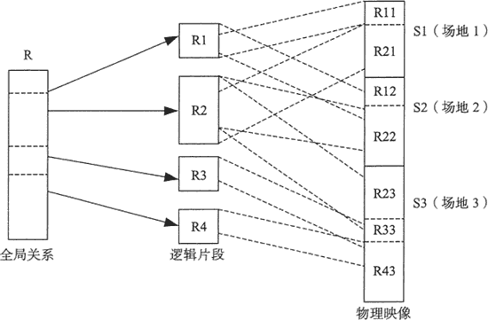

# 分布式数据库有哪些特点？

> 原文：[`c.biancheng.net/view/6492.html`](http://c.biancheng.net/view/6492.html)

大数据需要通过分布式的集群方式来解决存储和访问的问题。分布式系统的核心理念是让多台服务器协同工作，完成单台服务器无法处理的任务，尤其是高并发或者大数据量的任务。

分布式数据库是数据库技术与网络技术相结合的产物，它通过网络技术将物理上分开的数据库连接在一起，进行逻辑层面上的集中管理。

在分布式数据库系统中，一个应用程序可以对数据库进行透明操作，数据库中的数据分别存储在不同的局部数据库中，由不同机器上不同的 DBMS 进行管理，其的体系结构如下图所示。

分布式数据处理使用分而治之的办法来解决大规模数据管理问题，它处理数据的基本特点如下。

## 分布的透明管理

在分布式系统中，数据不是存储在一个场地上，而是存储在计算机网络的多个场地上。但逻辑上是一个整体，它们被所有用户共享，并由一个 DBMS 统一管理。用户访问数据时无须指出数据存放在哪里，也不需要知道由分布式系统中的哪台服务器来完成。

## 复制数据的透明管理

分布式数据的复制有助于提高性能，更易于协调不同而又冲突的用户需求。同时，当某台服务器出现故障时，此服务器上的数据在其他服务器上还有备份，提高了系统的可用性。

这种多副本的方式对用户来说是透明的，即用户不需要知道副本的存在，由系统统一管理、协调副本的调用。

## 事务的可靠性

分布式数据处理具有重复的构成，因此消除了单点故障的问题，即系统中一个或多个服务器发送故障不会使整个系统瘫痪，从而提高了系统的可靠性。

但是在分布式系统中，事务是并发的， 即不同用户可能在同一时间对同一数据源进行访问，这就要求系统支持分布式的并发控制，保证系统中数据的一致。

分布式系统可以解决海量数据的存储和访问，但是在分布式环境下，数据库会遇到更为复杂的问题，举例如下。

*   数据在分布式环境下以多副本方式进行存储，那么，在为用户提供数据访问时如何选择一个副本，或者用户修改了某一副本的数据，如何让系统中每个副本都得到更新。
*   如果正在更新系统所有副本信息时，某个服务器由于网络或硬、软件功能出现问题导致其发生故障。在这种情况下，如何确保故障恢复时，此服务器上的副本与其他副本一致。

这些问题给分布式数据库管理系统带来了挑战，它们是分布式系统固有的复杂性，但更重要的是对分布数据的管理，控制数据之间的一致性以及数据访问的安全性。