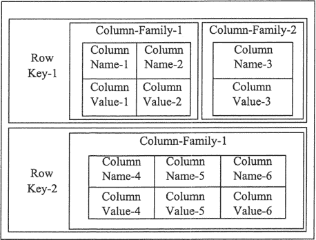
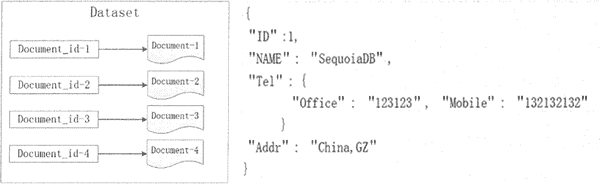
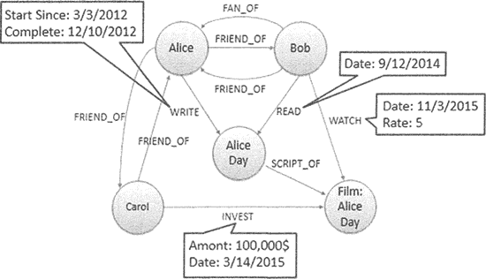

# NoSQL 数据库有哪些？

> 原文：[`c.biancheng.net/view/6498.html`](http://c.biancheng.net/view/6498.html)

关系型数据库产品很多，如 MySQL、Oracle、Microsoft SQL Sever 等，但它们的基本模型都是关系型数据模型。NoSQL 并没有统一的模型，而且是非关系型的。

常见的 NoSQL 数据库包括键值数据库、列族数据库、文档数据库和图形数据库，其具体分类和特点如表所示。

NoSQL 数据库分类和特点

| 分类 | 相关产品 | 应用场景 | 数据模型 | 优点 | 缺点 |
| 键值数据库 | Redis、Memcached、Riak | 内容缓存，如会话、配置文件、参数等； 频繁读写、拥有简单数据模型的应用 | <key,value> 键值对，通过散列表来实现 | 扩展性好，灵活性好，大量操作时性能高 | 数据无结构化，通常只被当做字符串或者二进制数据，只能通过键来查询值 |
| 列族数据库 | Bigtable、HBase、Cassandra | 分布式数据存储与管理 | 以列族式存储，将同一列数据存在一起 | 可扩展性强，查找速度快，复杂性低 | 功能局限，不支持事务的强一致性 |
| 文档数据库 | MongoDB、CouchDB | Web 应用，存储面向文档或类似半结构化的数据 | <key,value>  value 是 JSON 结构的文档 | 数据结构灵活，可以根据 value 构建索引 | 缺乏统一查询语法 |
| 图形数据库 | Neo4j、InfoGrid | 社交网络、推荐系统，专注构建关系图谱 | 图结构 | 支持复杂的图形算法 | 复杂性高，只能支持一定的数据规模 |

NoSQL 数据库并没有一个统一的架构，两种不同的 NoSQL 数据库之间的差异程度，远远超过两种关系型数据库之间的不同。

可以说，NoSQL 数据库各有所长，一个优秀的 NoSQL 数据库必然特别适用于某些场合或者某些应用，在这些场合中会远远胜过关系型数据库和其他的 NoSQL 数据库。

常见的 NoSQL 数据库分为以下几种。

#### 1) 键值数据库

这一类数据库主要会使用到一个散列表，这个表中有一个特定的键和一个指针指向特定的数据。

键值模型对于 IT 系统来说，其优势在于简单、易部署。键值数据库可以按照键对数据进行定位，还可以通过对键进行排序和分区，以实现更快速的数据定位。

#### 2) 列族数据库

列族数据库通常用来应对分布式存储的海量数据。键仍然存在，但是它们的特点是指向了多个列，如图所示。

此列族数据库表中由两行组成，每一行都有关键字 Row Key，每一行由多个列族组成，即 Column-Family-1 和 Column-Family-2，而每个列族由多个列组成。

#### 3) 文档数据库

文档数据库的灵感来自 Lotus Notes 办公软件，它与键值数据库类似。该类型的数据模型是版本化的文档，文档以特定的格式存储，如 JSON。

文档数据库可以看作键值数据库的升级版，允许之间嵌套键值，如图所示。

文档数据库比键值数据库的查询效率更高， 因为文档数据库不仅可以根据键创建索引，同时还可以根据文档内容创建索引。

#### 4) 图形数据库

图形数据库来源于图论中的拓扑学，以节点、边及节点之间的关系来存储复杂网络中的数据，如图所示。

这种拓扑结构类似 E-R 图，但在图形模式中，关系和节点本身就是数据，而在 E-R 图中，关系描述的是一种结构。