# Memcached 入门教程

> 原文：[`c.biancheng.net/view/6574.html`](http://c.biancheng.net/view/6574.html)

Memcached 是 LiveJournal 旗下 Danga Interactive 公司的布拉德•菲茨帕特里克（BradFitzpatric）开发的一款内存数据库，现在已被应用于 Facebook、LiveJournal 等公司用于提高 Web 服务质量。

目前这款软件流行于全球各地，经常被用来建立缓存项目，并以此分担来自传统数据库的并发负载压力。

Memcached 可以轻松应对大量同时出现的数据请求，而且它拥有独特的网络结构，在工作机制方面，它还可以在内存中单独开辟新的空间，建立 HashTable，并对 HashTable 进行有效的管理。

我们有时会见到 Memcache 和 Memcached 两种不同的说法，为什么会有两种名称？

其实 Memcache 是这个项目的名称，而 Memcached 是它服务器端的主程序文件名。一个是项目名称，另一个是主程序文件名。

## 为什么要使用 Memcached

由于网站的高并发读写和对海量数据的处理需求，传统的关系型数据库开始出现瓶颈。

#### 对数据库的高并发读写

关系型数据库本身就是个庞然大物，处理过程非常耗时（如解析 SQL 语句、事务处理等）。如果对关系型数据库进行高并发读写（每秒上万次的访问），数据库系统是无法承受的。

#### 对海量数据的处理

对于大型的 SNS 网站（如 Twitter、新浪微博），每天有上千万条的数据产生。对关系型数据库而言，如果在一个有上亿条数据的数据表中查找某条记录，效率将非常低。

使用 Memcached 就能很好地解决以上问题。

多数 Web 应用都将数据保存到关系型数据库中（如 MySQL ），Web 服务器从中读取数据并在浏览器中显示。但随着数据量的增大，访问的集中，关系型数据库的负担就会加重，岀现响应缓慢、网站打开延迟时间长等问题。

因此，使用 Memcached 的主要目的是通过自身内存中缓存关系型数据库的查询结果，减少数据库自身被访问的次数，以提高动态 Web 应用的速度，增强网站架构的并发能力和可扩展性。

通过在事先规划好的系统内存空间中临时缓存数据库中的各类数据，以达到减少前端业务服务对关系型数据库的直接高并发访问，从而达到提升大规模网站集群中动态服务的并发访问能力。

Web 服务器读取数据时先读 Memcached 服务器，若 Memcached 没有所需的数据，则向数据库请求数据，然后 Web 再把请求到的数据发送到 Memcached，如下图所示。

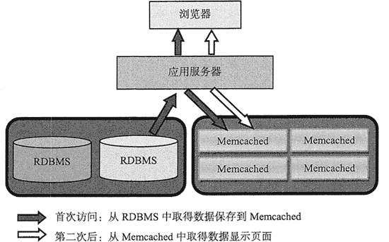

## Memcached 的特征

Memcached 作为高速运行的分布式缓存服务器，具有以下特点。

#### 协议简单

Memcached 的服务器客户端通信并不使用复杂的`.xml`等格式，而是使用简单的基于文本行的协议。

因此，通过 telnet 也能在 Memcached 上保存数据、取得数据。以下为示例代码:

```

$ telnet localhost 11211
Trying 127.0.0.1...
Connected to localhost.localdomain(127.0.0.1).
Escape character is '^]'.
set foo 0 0 3    (保存命令)
bar    (数据)
STORED    (结果)
get foo    (取得命令)
VALUE foo 0 3    (数据）
bar    (数据)
```

#### 基于 libevent 的事件处理

libevent 是个程序库，它将 Linux 的 epoll、BSD 类操作系统的 kqueue 等事件处理功能封装成统一的接口，即使对服务器的连接数增加，也能发挥 O(1) 的性能。Memcached 使用这个 libevent 库，因此可以在 Linux、BSD、Solaris 等操作系统上发挥其高性能。

#### 内置内存存储方式

为了提高性能，Memcached 中保存的数据都存储在 Memcached 内置的内存存储空间中。由于数据仅存在于内存中，所以重启 Memcached 或操作系统都会导致全部数据消失。

另外，内存容量达到指定值之后，就会基于 LRU（Least Recently Used）算法自动删除不使用的缓存。Memcached 本身是为缓存而设计的服务器，因此并没有过多考虑数据的永久性问题。

#### 不互相通信的分布式

Memcached 尽管是“分布式”缓存服务器，但服务器端并没有分布式功能。各个 Memcached 不会互相通信以共享信息。那么，如何配置分布式呢？这完全取决于客户端的实现。

下图所示为 Memcached 的分布式。

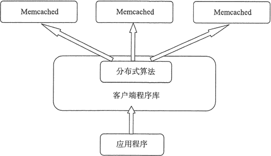

## Memcached 的内存存储

#### Slab Allocation 机制：整理内存以便重复使用

在默认情况下 Memcached 采用了名为 Slab Allocator 的机制分配、管理内存。在该机制出现以前，内存的分配是通过对所有记录简单地进行 malloc 和来进行的。

但是，这种方式会导致内存碎片的产生，加重操作系统内存管理器的负担，在最坏的情况下，甚至会导致操作系统比 Memcached 进程本身还慢。Slab Allocator 就是为解决该问题而诞生的。

Slab Allocator 的基本原理是按照预先规定的大小，将分配的内存分割成特定长度的块，以完全解决内存碎片问题。

Slab Allocation 的原理很简单，就是将分配的内存分割成各种尺寸的块（Chunk）、并把尺寸相同的块分成组（块的集合）。如下图所示。

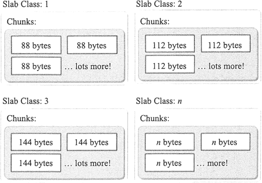
而且，Slab Allocator 还有重复使用已分配的内存的目的。也就是说，分配到的内存不会释放， 而是重复利用。

Slab Allocation 的主要术语如下。

*   Page：分配给 Slab 的内存空间，默认是 1MB。分配给 Slab 之后根据 Slab 的大小拆分成 Chunk。
*   Chunk：用于缓存记录的内存空间。
*   Slab Class：特定大小的 Chunk 的组。

#### 在 Slab 中缓存记录的原理

下面介绍 Memcached 如何针对客户端发送的数据选择 Slab 并缓存到 Chunk 中。

Memcached 根据收到的数据的大小，选择最适合数据大小的 Slab。如下图所示。

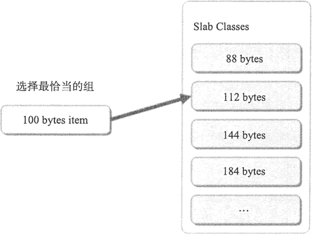Memcached 中保存着 Slab 内空闲 Chunk 的列表，根据该列表选择 Chunk，然后将数据缓存于其中。

#### Slab Allocator 的缺点

实际上，Slab Allocator 也是有利有弊的。下面介绍它的缺点。

Slab Allocator 解决了内存碎片方面的问题，但新的机制也给 Memcached 带来了新的问题。

这个问题就是，由于分配的是特定长度的内存，因此无法有效利用分配的内存。

例如，将 100 字节的数据缓存到 128 字节的 Chunk 中，剩余的 28 字节就浪费了。如下图所示。

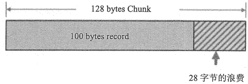该问题目前还没有完美的解决方案，官方文档提供了比较有效的解决方案：如果预先知道客户端发送的数据大小，或者在仅缓存大小相同的数据的情况下，只要使用适合数据大小的组的列表，就可以减少浪费。

虽然目前的版本还无法进行调优，但是可以调节 Slab Class 的大小来减少差别。

#### 使用 Growth Factor 选项进行调优

Memcached 在启动时指定 Growth Factor 因子（通过 -f 选项），就可以在某种程度上控制 Slab 之间的差异。默认值为 1.25。但是，在该选项出现之前，这个因子曾经固定为 2，称为“powers of 2”策略。

使用以前的设置，以 verbose 模式启动 Memcached：

$ memcached -f 2 -vv

下图是启动后的 verbose 输出。

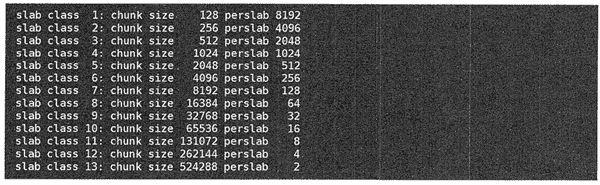可见，从 128 字节的组开始，组的大小依次增大为原来的 2 倍。这样设置的问题是，Slab 之间的差别比较大，在有些情况下内存浪费严重。因此，为尽量减少内存浪费，后来就追加了 Growth Factor 这个选项。

下图是默认设置（f=1.25）时的输出。

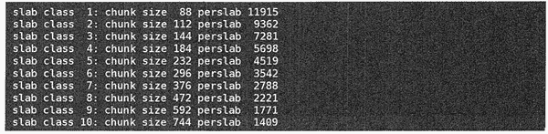可见，组间差距比因子为 2 时小得多，更适合缓存几百字节长度的记录。从上面的输出结果来看，可能会有些计算误差，这些误差是为了使字节数对齐而故意设置的。

将 Memcached 引入产品，或是直接使用默认值进行部署时，最好是重新计算数据的预期平均长度，调整 Growth Factor，以获得最恰当的设置。

#### 查看 Memcached 的内部状态

Memcached 中包含 stats 命令，使用它可以获得各种各样的信息。

执行命令的方法很多，用 telnet 最简单：

$ telnet 主机名 端口号

连接 Memcached 之后，输入 stats 再按回车键，即可获得包括资源利用率在内的各种信息； 输入“stats slabs”或“stats items”可以获得关于缓存记录的信息；输入“quit”结束程序，如下图所示。

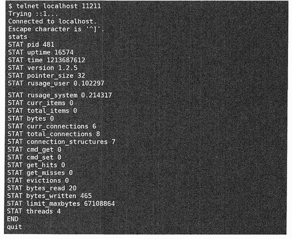这些命令的详细信息可以参考 Memcached 软件包内的 protocol.txt 文档。

另外，如果安装了 libmemcached 这个面向 C/C++ 语言的客户端库，就会安装 memstat 这个命令。

使用方法很简单，可以用更少的步骤获得与 telnet 相同的信息，还能一次性从多台服务器获得信息。

$ memstat -servers=server1, server2, server3, ...

#### 查看 Slab 的使用状况

使用 Memcached 的创造者布拉德（Brad）写的名为 memcached-tool 的 Perl 脚本，可以方便地获得 Slab 的使用情况，它将 Memcached 的返回值整理成易于阅读的格式，使用方法也极其简单：

$ memcached-tool 主机名: 端口 选项

查看 Slab 使用状况时无须指定选项，因此使用下面的命令即可：

$ memcached-tool 主机名: 端口

获取的信息如下图所示。

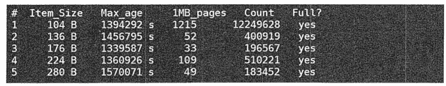各列的含义如下表所示。

memcached-tool 的参数含义

| 列 | 含义 |
| # | Slab Class 编号 |
| Item_Size | Chunk 大小 |
| Max_age | LRU 内最旧的记录的生存时间 |
| 1MB_pages | 分配给 Slab 的页数 |
| Count | Slab 内的记录数 |
| Full? | Slab 内是否含有空闲 Chunk |

从这个脚本获得的信息可极大地方便用户的调优。

#### Memcached 的分布式

现在简单地介绍分布式的原理，它在各个客户端的实现基本相同。

假设 Memcached 服务器有 node1、node2 和 node3 三台，应用程序要保存键名为“tokyo”、“kanagawa”、“chiba”、“saitama”、“gunma”的数据，如下图所示。

首先向 Memcached 中添加“tokyo”。将“tokyo”传给客户端程序库后，客户端就会根据“键”来决定保存数据的 Memcached 服务器。

选定服务器后，即可命令它保存“tokyo”及其值，如下图所示。

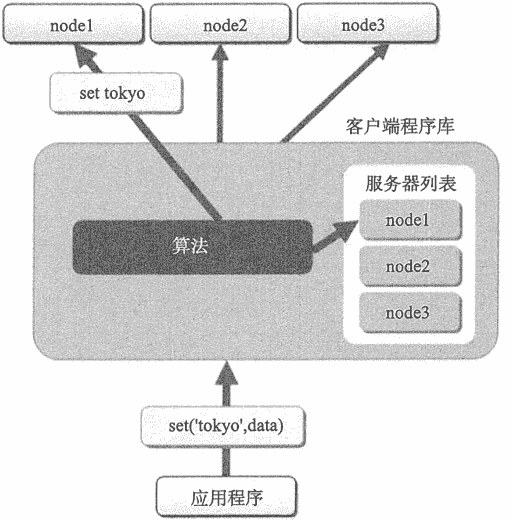同样地，“kanagawa” “chiba” “saitama” “gunma”等数据的处理都是先选择服务器再保存。

接下来获取保存的数据。获取时也要将要获取的键“tokyo”传递给函数库，函数库通过与数据保存时相同的算法，根据“键”选择服务器。使用的算法相同，就能选中与保存时相同的服务器，然后发送 get 命令。

只要数据没有因为某些原因被删除，就能获得保存的值，如下图所示。

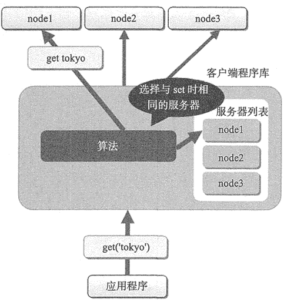这样，将不同的键保存到不同的服务器上，就实现了 Memcached 的分布式配置。Memcached 服务器增多后，键就会分散，即使一台 Memcached 服务器发生故障无法连接，也不会影响其他的缓存，系统依然能继续运行。