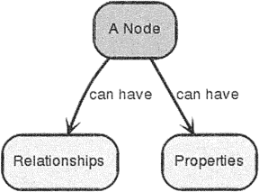
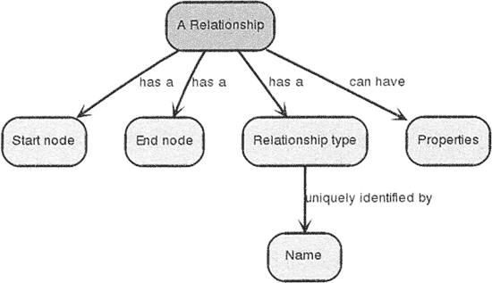
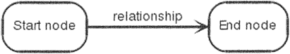
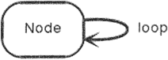
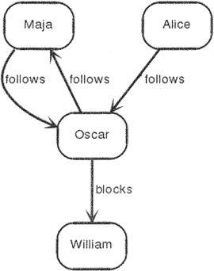
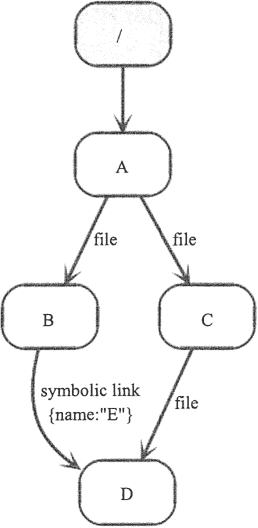
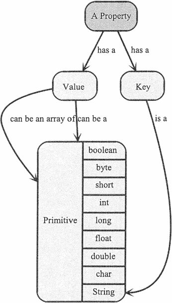
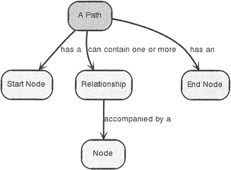
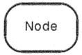
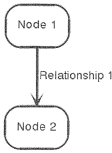

# Neo4j 数据库入门教程

> 原文：[`c.biancheng.net/view/6579.html`](http://c.biancheng.net/view/6579.html)

Neo4j 是一个高性能的 NoSQL 图形数据库，它将结构化数据存储在网络上而不是表中。它是一个嵌入式的、基于磁盘的、具备完全的事务特性的 Java 持久化引擎。

Neo4j 也可以被看作是一个高性能的图引擎，该引擎具有成熟数据库的所有特性。

使用 Neo4j 时，程序员工作在一个面向对象的、灵活的网络结构下，而不是严格、静态的表中，但是他们可以享受到具备完全的事务特性、企业级的数据库的所有好处。

Neo4j 因其具备的嵌入式、高性能、轻量级等优势，越来越受到人们的关注。

## Neo4j 的优点

作为一款稳健的、可伸缩的高性能数据库，Neo4j 最适合完整的企业部署或者作为一个轻量级项目中完整服务器的子集存在。它包括如下几个显著特点。

#### 1) 完整的 ACID 支持

适当的 ACID 操作是保证数据一致性的基础。Neo4j 确保了在一个事务里的多个操作同时发生，保证数据的一致性。

无论是采用嵌入模式还是多服务器集群部署，Neo4j 都支持这一特性。

#### 2) 高可用性和高可扩展性

可靠的图形存储可以非常轻松地集成到任何一个应用中。随着开发的应用在运营中不断发展， 性能问题肯定会逐步凸显出来，而无论应用如何变化，Neo4j 只会受到计算机硬件性能的影响， 而不受业务本身的约束。

部署一个 Neo4j 服务器可以承载亿级的节点和关系。当然，当单节点无法承载数据需求时，可以部署分布式集群。

#### 3) 通过遍历工具高速检索数据

图形数据库最大的优势是可以存储关系复杂的数据。通过 Neo4j 提供的遍历工具，可以非常高效地进行数据检索，每秒可以达到亿级的检索量。一个检索操作类似 RDBMS 里的连接 join 操作。

## Neo4j 的结构

#### 1) 节点 

构成一张图的基本元素是节点和关系。在 Neo4j 中，节点和关系都可以包含属性，如下图所示。

节点经常被用于表示一些实体，依赖关系也同样可以表示实体。下面介绍一个最简单的节点，只有一个属性，属性名是 name，属性值是 Marko，如下图所示。

#### 2) 关系

节点之间的关系是图数据库很重要的一部分。通过关系可以找到很多关联的数据，如节点集合、关系集合以及它们的属性集合，如下图所示。

一个关系连接两个节点，必须包含开始节点和结束节点，如下图所示。

因为关系总是直接相连的，所以对于一个节点来说，与它关联的关系看起来有输入/输出两个方向，这个特性对于遍历图非常有帮助，如下图所示。

关系在任意方向都会被遍历访问，这意味着并不需要在不同方向都新增关系。而关系总是会有一个方向，所以当这个方向对应用没有意义时，可以忽略。

需要特别注意的是，一个节点可以有一个关系是指向自己的，如下图所示。

为了便于在将来增强遍历图中所有的关系，需要为关系设置类型。注意，关键字 type 在这里可能会被误解，其实可以把它简单地理解为一个标签。

下图展示的是一个有两种关系的最简单的社会化网络图。

从上图中可以看到 Maja、Alice、Oscar 和 William 四个人之间的关系，Alice 是服从 Oscar 管理的，Oscar 与 Maja 之间是互相 follows 的平等关系，而 Oacar 则阻碍了 William 的发展。

图下展示的是一个简单的 Linux 文件系统，在此图中表示的关系为根目录`/`下有一个子目录 A，而 A 目录里有目录文件 B 和目录文件 C，B 是 D 的符号链接，即可指向 D，而目录 C 里包含文件 D。

从上图中可以顺着关系得到根目录下的所有文件信息。

#### 3) 属性

节点和关系都可以设置自己的属性。

在上图所示的属性组成关系图中，一个 Property 包含 Key 和 Value 两个部分，表示属性是由 Key-Value 组成的；Key 指向 String，表示 Key 是字符串类型；Value 的类型可以是多样的，例如，可以是 String、int 或 boolean 等，也可以是 int[] 这种类型的数据。

#### 4) 路径

路径由至少一个节点通过各种关系连接组成，经常是作为一个查询或者遍历的结果，如下图所示。

下图中展示的是一个单独节点，它的路径长度为 0。

下图展示的是长度为 1 的路径。

#### 5) 遍历

遍历一张图就是按照一定的规则，跟随它们的关系，访问关联的节点集合。最常见的情况是只有一部分子图被访问到，因为用户知道自己关注哪一部分节点或者关系。

Neo4j 提供了遍历的 API，可以让用户指定遍历规则。最简单的遍历规则就是设置遍历为宽度优先或深度优先。

接下来的一节，我们将讲解如何使用 Java 操作 Eno4j 数据库。