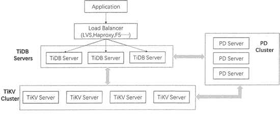
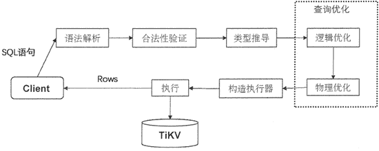

# TiDB 数据库是什么？

> 原文：[`c.biancheng.net/view/6582.html`](http://c.biancheng.net/view/6582.html)

TiDB 是一款结合了传统的关系型数据库和 NoSQL 数据库特性的新型分布式数据库。

TiDB 是基于 Google 公司的 Google Spanner / F1 论文设计的开源分布式数据库，而 Spanner/F1 是 Google 公司研发的可扩展的、多版本、全球分布式、可同步复制的数据库。

TiDB 是第一个把数据分布在全球范围内的系统，并且支持外部一致性的分布式事务。因此，TiDB 在设计时也追求无限的水平扩展，具备强一致性和高可用性，支持分布式事务的处理。

同时，TiDE 的目标是为在线交易处理（OnlineTransactional Processing, OLTP）和在线分析处理（Online Analytical Processing, OLAP）场景提供一站式的解决方案，支持 MySQL 数据库的数据轻松地向 TiDB 迁移，包括分库、分表后的 MySQL 集群也可通过工具进行实时迁移。

## TiDB 架构

TiDB 具有无限水平扩展和高可用性的特点，通过简单地增加新节点即可实现计算和存储能力的扩展，轻松地应对高并发、海量数据的应用场景。

TiDB 的整体架构参考 Google Spanner/F1 的设计，也分为 TiDB 和 TiKV 上下两层。

TiDB 对应的是 Google F1，是一层无状态的 SQL 层，负责与客户端交互，对客户端体现的是 MySQL 网络协议，且客户端需要通过一个本地负载均衡器将 SQL 请求转发到本地或最近的数据中心中的 TiDB 服务器。

TiDB 服务器负责解析用户的 SQL 语句，生成分布式的查询计划，并翻译成底层 Key-Value 操作发送给 TiKV，而 TiKV 则是真正存储数据的地方，对应的是 Google Spanner，是一个分布式 Key-Value 数据库，支持弹性水平扩展、 自动的灾难恢复和故障转移，以及 ACID 跨行事务。

另外，TiDB 架构采用 PD 集群来管理整个分布式数据库，PD 服务器在 TiKV 节点之间以 Region 作为单位进行调度，将部分数据迁移到新添加的节点上，完成集群调度和负载均衡。

TiDB 的集群架构如下图所示。

从上图中可以看出，TiDB 集群架构主要由 TiDB 节点、PD（Placement Driver）节点和 TiKV 节点 3 个组件构成。通常 TiDB 集群架构推荐至少部署 3 个 TiKV 节点、3 个 PD 节点和 2 个 TiDB 节点，随着业务量的增长，可按照需求相应地添加 TiKV 或者 TiDB 节点。

接下来具体介绍每个组件完成的功能。

#### TiDB Server

TiDB Server 完成与客户端的交互，兼容绝大多数的 MySQL 语法，属于 SQL 层。

在集群当中，首先多个客户端通过负载均衡组件将 SQL 请求转送至不同的 TiDB Server，TiDB Server 负责解析 SQL 请求，获取请求内容；然后进行合法性验证和类型推导；接着进行查询优化，包括逻辑优化和物理优化，优化完成后构建执行器；最后，把数据从 TiKV 中取出来进行计算，将最终结果反馈给客户端。

TiDB 处理用户请求的流程如下图所示。

TiDB Server 是无状态的，每个 TiDB Server 都是平等的，其本身并不存储数据，只负责计算，并可以进行无限水平扩展。

当集群中单个 TiDB Server 实例失效时，可以重启这个实例或部署一个新的实例来提高集群的可用性。

#### TiKV Server

TiKV Server 主要负责数据的存储，是一个分布式的提供事务的键值（Key-Value）存储引擎，存储的是键值对（Key-Value pair），并按照 Key 的二进制顺序进行有序存储。

TiKV Server 将整个 Key-Value 空间分成很多段，每一段都是一系列连续的 Key，这一段称为 Region。

TiKV Server 将 Region 作为存储数据的基本单元，每个 Region 负责存储一定大小的数据。每个 TiKV Server 负责多个 Region，并使用 Raft 协议来为每个 Region 做备份，可用于保持数据的一致性和数据容灾， 通过 PD Server 进行负载均衡调度。

#### PD Server

PD Server 是 TiDB 中的全局中心总控节点，它是以集群的方式部署的，负责整个集群的调度，如数据的迁移及负载均衡等，也负责全局 ID 的生成，以及全局时间戳 TSO 的生成等。

PD 还保存着整个集群 TiKV 的元信息，即某个 Key 存储在哪个 TiKV 节点上，负责为 TiDB Server 提供路由功能。

如果你想继续了解 TiDB 数据库，请猛击下面的链接：

*   TiDB 数据库的存储原理（非常详细）
*   TiDB 数据库的管理机制
*   TiDB 数据库的应用场景