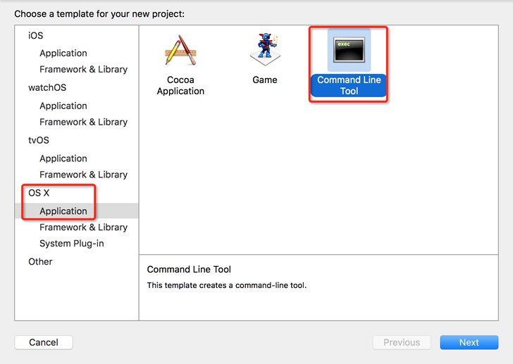

# 通过 Xcode 运行 OC 程序

本节我们来编写一个简单的 OC 小程序，并在 Xcode 下编译，让大家了解 OC 程序的基本结构和运行过程。

## 在 Xcode 中运行 OC 程序

启动 Xcode，创建一个新的工程，如下图所示：

接下来，选择要创建的工程类型，如下图所示：



选择“OS X --> Application --> Command Line Tool”，点击“Next”。Command Line Tool 是“命令行工具”的意思，也就是控制台程序。


这里需要填写和工程相关的一些信息：

*   Product Name：产品名称，即工程名称。
*   Organization Name：组织名称，即公司、个人、协会、团队等的名称。
*   Organization Identifier：组织标识符，即有别于其他组织的一个标记，例如身份证号、公司网址、组织机构代码证等。
*   Bundle Identifier：程序标识符，即有别于其他程序的一个标记，由 Organization Identifier + Product Name 组成。
*   Language：工程所用的编程语言，这里选择 Objective-C。

点击“Next”，保存文件后即可进入当前工程。将下面的代码复制到源文件中：

```
#import <Foundation/Foundation.h>

int main() {
    NSLog(@"Hello, World!");
    return 0;
}
```

点击运行按钮，即可看到输出结果，如下图所示：

左侧是工程目录，主要包含了工程所用到的文件和资源，main.m 是 OC 的源代码，Products 是 Xcode 自动生成的配置文件，暂时无需理会。OC 源代码文件的后缀是`.m`，头文件的后缀是`.h`；C 语言源文件的后缀是`.c`，头文件的后缀也是`.h`。

OC 程序也有“预处理 --> 编译 --> 链接”的过程，最终生成的可执行文件是 Test.out。`.out`是 Mac OS X 下的可执行文件，`.exe`是 Windows 下的可执行文件。

## 找到.o 和.out

我们知道，编译会产生目标文件`.o`，链接会产生可执行文件`.out`，但是，在当前的工程目录下我们并没有看到 .o 和 .out 文件，这是为什么呢？

为了保证数据的安全性，Xcode 创建的每个工程都有自己的存储空间，而且相互之间禁止访问，OC 编译链接过程中产生的所有中间文件都在工程对应的存储空间中，并不在当前工程目录下。如果你希望找到它们，可以使用下面的方法。

1) 通过`Xcode -->Preferences…`，会弹出如下的对话框：


2) 选择`Advanced`选项，弹出如下对话框：


选择 Custom，可以看到两个文件夹，Products 是`.out`所在的目录，Intermediates 是`.o`所在的目录（该目录下还有其他临时文件），点击即可进入相应的目录，找到想要的文件。