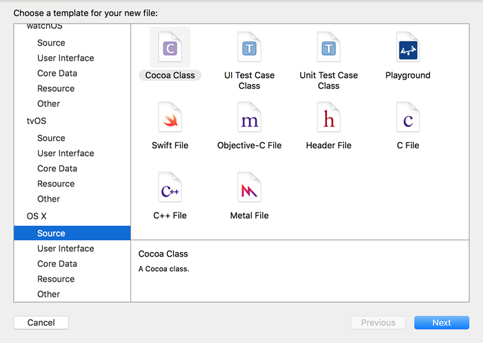

# OC 工程中添加文件

在 OC 编程中，不可避免地要向工程中添加不同类型的文件，例如：建立类要添加.h 和.m 文件。

使用 Xcode 向某个工程中添加文件时，有两种方式：

方式一：“command”＋“n”，弹出添加文件对话框。

方式二：在需要添加文件的工程目录下右键，选择“New File…”。

以上方式 Xcode 会弹出下面的对话框：

左侧是使用 Xcode 做的工程类别的分类，我们选择“OS X“，在这个目录下，是所有可以添加的文件的分类，

在“Source”中，右侧会显示一下几个文件，这里说明几个常用的文件：

Cocoa Class        ——向工程建立一个类文件，包含.h 和.m 文件

Objecive－C file   ——向工程中添加一个.m 文件

Header File          ——向工程中添加一个.h 文件

C File                   ——向工程中添加 C 语言的.c 和.h 文件

C++ File               ——向工程中添加 C++语言的.cpp 和.hpp 文件

在“Resource”中：

Property List        ——向工程中添加 Plist 文件（以后会介绍文件的使用方法）

在“Other”中：

PCH File              ——向工程中添加 pch 文件（以后介绍）

在选择好文件类型后，选择“Next”，又出来一个对话框，让你填写添加文件的具体信息，或者存储位置，一般是默认，直接创建。