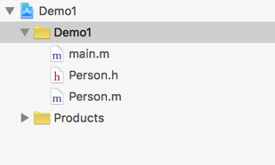
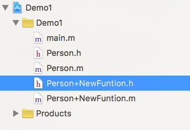

# OC 中的类别

类别，别名：扩展类、类目。意思是：在现有类的基础上为该类增添一些新的方法(注意：只能是方法，不能添加属性)，如果类别中的方法和现有类中的方法相同，就覆盖原有方法。

**类别的用途**

简单的说，就是如果我们想在一个类中增加一些可供外界调用的方法，但是又不想影响它的子类，我们就要用类别。类别能够在原有类的基础上添加新的方法，而且还不会让子类继承。这也是类别的优点所在。

类别和类扩展的区别：

同：（类扩展和类别都可以为原有类添加新的方法）。

异：（通过类扩展添加的方法外界无法调用。而类别可以；类扩展能添加属性，而类别只能添加方法）。

**类别的创建**

1、首先，我们要创建一个工程，命名 Demo1；

2、在 Demo1 工程中，创建一个 Person 类；

3、在 Person 类，我们声明几个本类应该具备的属性和方法。例如：每一个人都应该有姓名和年龄，每个人都会跑，代码如下；

Person.h 文件中:

```
#import <Foundation/Foundation.h>
@interface Person : NSObject
@property (nonatomic,copy)NSString * name;
@property (nonatomic,assign)int age;
-(void)run;
@end
```

Person.m 文件中:

```
#import "Person.h"
@implementation Person
-(void)run{
       NSLog(@"the person is running!");
}
@end
```

4、为 Person 类添加类别。

右键点击 Demo1 文件名，选择“New File”：



弹出新建文件菜单，选择：


点击“next”，进入下面菜单：


在这一步骤中，File Type 选择类别，Class 表示你要对哪个类做类别，填写完成后，直接 next，然后默认创建，完成的标志是：



可以看到，在 Demo1 中新增加了两个文件，文件名采用“类名+类别名”的方式，这样看起来更清楚，同时也是类别文件的显著特征(改变类别的名字并不会出错，只是没必要)。

**类别框架分析**

**Person+NewFuntion.h 文件：**

```
#import "Person.h"
@interface Person (NewFuntion)
//添加方法
@end
```

类别的创建和类的创建类似。不同的是：

1、在创建类的时候，我们会引入 Foundation 框架，而类别是引入原有类的头文件。

2、在创建类的时候，父类的地方被“(类别名)”替代了。

（创建类别的过程，就是为 Person 类添加一些方法，这些方法在 NewFuntion 文件中，所以实现了类别能够为某一个类添加方法而不会影响子类的功能）

**Person+NewFuntion.m 文件：**

```
#import "Person+NewFuntion.h"
@implementation Person (NewFuntion)
//实现方法
@end
```

类别.m 文件中在@implementation+原有类名的后面，还添加了一个“(类别名)”.

**使用类别的方法**

了解了类别的具体编写规则，下面用类别添加一个功能，例如：每个人除了跑步，还必须要吃饭：

1、在类别.h 文件中声明一个方法。如：

```
-(void)eat;
```

2、在类别.m 文件对方法进行实现：

```
-(void)eat{
    NSLog(@"the person is eating!");
}
```

3、main.m 文件中编写以下代码:

```
#import <Foundation/Foundation.h>
#import "Person.h"
//一定要引入类别的接口文件，否则无法使用类别中添加的方法
#import "Person+NewFuntion.h"
int main(int argc, const char * argv[]) {
    Person * person=[[Person alloc] init];
    person.name=@"张三";
    person.age=10;
    [person run];
    //调用类别中增加的 eat 方法
    [person eat];
    return 0;
}
```

输出结果：

**the person is running!**

**the person is eating!**

从例子来看，我们的确是为 Person 类新增加了一个方法。这个方法虽然是通过类别的方法添加的，但调用还是通过使用 Person 类的对象。