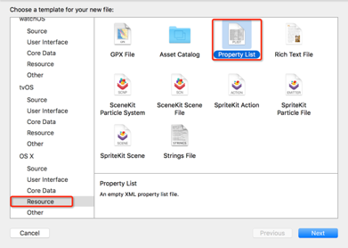
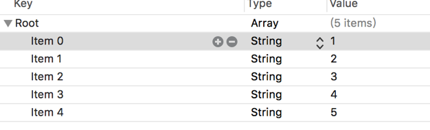

# OC 中 Plist 文件的使用

在实际开发过程中，对于存取小的数据而言，最常用的就是 plist 文件，它的全称是：Property List。这种文件保存数据的特点就是只能保存：NSString、NSArray、NSData、NSDate、NSDictionary、BOOL、NSNumber 这几种数据类型。

**plist****文件特点和优势**

plist 文件经常用作保存用户的登录注册信息，或者程序的配置信息，总体来说保存的是一些小数据。

plist 文件中的数据还有一个特点，那就是里边的数据都要用字典或者是数组包裹起来。

**创建****plist****文件**

首先我们来创建一个 plist 文件：

1、右键点击 Demo 文件夹，选择“New File”，弹出创建文件的对话框：



2、按上图选择后，“Next”，给新创建的 plist 文件起一个名字，例如 test。

做完上述步骤后，你会发现功能框架中多了一个 test.plist 文件。

通过本章对数据本地存储的学习，完全可以通过代码向 test.plst 文件中添加数据，前提是这个数据本身必须是一个数组或者是字典(通过观察新创建的 plist 文件，就会发现它是以字典或数组开头)。

下面举一个例子，在 main.m 文件中编写以下代码：

```
#import <Foundation/Foundation.h>

int main(int argc, const char * argv[]) {
        NSArray * array=[NSArray arrayWithObjects:@"1",@"2",@"3",@"4",@"5", nil];
        NSString * path=@"/Users/xieyang/Documents/Demo/Demo/test.plist";
        [array writeToFile:path atomically:YES];
    return 0;
}
```

结果你会发现新创建的 plist 文件中出现了数组中的数据：



同样，还可以通过代码将 plist 文件中的数据获取到一个数组中。

**编写代码创建并使用****plist****文件**

以上是我们自己创建 plist 文件的方法，同样，还可以通过代码的方式，添加 plist 文件，由于添加文件有很多方式，所以这里只给大家介绍一种最方便且常用的方法，看下面的例子：

```
#import <Foundation/Foundation.h>
int main(int argc, const char * argv[]) {
    NSString * path=@"/Users/xieyang/Documents/Demo/Demo";
    NSString * filePath=[path stringByAppendingPathComponent:@"data.plist"];
    NSLog(@"%@",filePath);
    NSArray * array=[NSArray arrayWithObjects:@"1",@"2",@"3",@"4", nil];
    [array writeToFile:filePath atomically:YES];
    return 0;
}
```

（这段代码的大概流程是：首先要知道创建 plist 文件的父目录，然后通过在父目录添加 plist 文件名（使用的方法是添加路径的方法，不是添加字符串）的方式创建这个文件，最后向这个 plist 文件添加数据）

注意

1、在父目录下通过上面的方法添加 plist 文件名，如果这个文件没有找到，会生成 plist 文件，如果存在，会直接拿来用。

2、还有一点，如果是用代码方法新创建的 plist 文件，如果不存入数据，plist 文件不会显示。