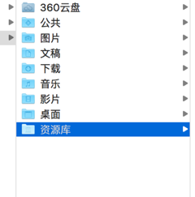
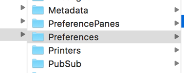
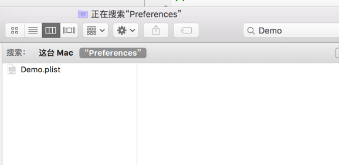

# OC 中用户默认设置

在实际开发过程中，有一种能够自行保存数据的方式，通过深入地了解，我们会发现这种保存数据的方式同样是将数据保存到 plist 文件中，通常管这种存储小型数据的方式：用户默认设置。

举一个例子，我们通常使用软件，第一次使用的时候，它会让我们输入登录信息。而以后使用的时候，它直接就帮我们登陆上了，不用每次使用都输入登录信息。这个功能，开发人员是怎么实现的呢？

通过下面的例子，模拟一下：

```
#import <Foundation/Foundation.h>
int main(int argc, const char * argv[]) {
    if ([[[NSUserDefaults standardUserDefaults] objectForKey:@"logined"] isEqualToString:@"OK"]) {
        NSLog(@"您登陆过");
    }else{
        NSLog(@"你第一次登陆");
        NSUserDefaults * userDefaults=[NSUserDefaults standardUserDefaults];
        [userDefaults setObject:@"OK" forKey:@"logined"];
    }
       return 0;
}
```

第一次运行，输出结果：**你第一次登陆**

第二次运行，输出结果：**您登陆过**

第 n 次运行，输出结果：**您登陆过**

可以看到，问题很容易地就被解决了。我们来分析一下，这几行代码是怎么实现的：

首先，要学会几个知识点：

1、NSUserDefaults，这个类是专门用作存储用户默认设置的(从名字就可以了解到)，这个类，我们只需要知道有数的几个方法就可以。

2、standardUserDefaults 是一个类方法，通过查询它，可以看到，他返回的本类的一个对象，这是一个单例(上一章讲过)。通过这个方法，我们能过获得唯一的一个对象。

3、此外，我们只需要知道这个类的两个方法，就能实现登录的功能：

      setObject:@"OK" forKey:@"logined":可以看到，用户默认设置是通过键值对的方式存储数据(和字典的使用类似)

      objectForKey:@"logined":通过键，得到相应的值

通过上面的讲解，模拟登录的例子应该就能看懂了，我给大家简单地梳理一下编程思路，大家可以跟着编程思路独立实现一下登录的功能：

1、判断用户是否登录过(使用 NSUserDefaults 类通过键查找对应的登陆信息，由于是自己设计的软件，所以登录信息的键值对是提前设计好的)

2、如果登录过，就跳过登录界面，直接进入软件主界面。

3、如果没登过，跳转到登陆界面，如果用户输入的登录信息正确，通过 NSUserDefaults 类提供的方法将信息进行保存

通过上面的学习，可能你会有疑问，NSUserDefaults 类将登陆信息保存到哪了呢？

其实，当你通过这种方式存储数据的时候，代码底层帮你在某个地方创建了一个 plist 文件，对于你现在这台机器来说，每次当你运行这个程序时，都会去调取文件中的数据。

下面带着大家一起来将 NSUserDefaults 创建的 plist 文件找出来：

首先，请大家先在 main.m 文件中原有代码下面拷贝一下这段代码：

NSString * path=[NSSearchPathForDirectoriesInDomains(NSLibraryDirectory, NSUserDomainMask, YES) lastObject];

NSLog(@"%@",path);

这段代码是获取 Library 文件夹路径的代码，运行程序，看到 path 输出一个路径，我们通过这个路径找到响应的文件夹：



找到资源库之后，我们找到 Preferences 文件夹：



进入这个文件夹之后，我们通过搜索我们的工程名就能找到创建的 plist 文件：



进入 plist 文件就能看到我们存储的相关数据，例如，这个例子中的数据就储存在这个文件中：


通过亲身查找这个隐藏创建的 plist 文件，相信大家通过 NSUserDefaults 类保存用户数据有了更深入的认识。对于 NSUserDefaults 类来讲，只需要大家记住：

1、运用类中提供的单例，来获取唯一的 NSUserDefaults 类对象。

2、学会通过键值对的方式存取数据。