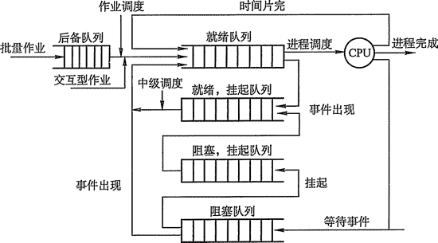

# 处理机调度：调度的概念、时机、切换、过程以及调度方式和基本准则

## 调度的概念

#### 1\. 调度的基本概念

在多道程序系统中，进程的数量往往多于处理机的个数，进程争用处理机的情况就在所难免。处理机调度是对处理机进行分配，就是从就绪队列中，按照一定的算法（公平、髙效）选择一个进程并将处理机分配给它运行，以实现进程并发地执行。

处理机调度是多道程序操作系统的基础，它是操作系统设计的核心问题。

#### 2\. 调度的层次

一个作业从提交开始直到完成，往往要经历以下三级调度，如图 2-4 所示。

1) 作业调度。又称高级调度，.其主要任务是按一定的原则从外存上处于后备状态的作业中挑选一个（或多个）作业，给它（们）分配内存、输入/输出设备等必要的资源，并建立相应的进程，以使它（们）获得竞争处理机的权利。简言之，就是内存与辅存之间的调度。对于每个作业只调入一次、调出一次。

多道批处理系统中大多配有作业调度，而其他系统中通常不需要配置作业调度。作业调度的执行频率较低，通常为几分钟一次。

2) 中级调度。又称内存调度。引入中级调度是为了提高内存利用率和系统吞吐量。为此，应使那些暂时不能运行的进程，调至外存等待，把此时的进程状态称为挂起状态。当它们已具备运行条件且内存又稍有空闲时，由中级调度来决定，把外存上的那些已具备运行条件的就绪进程，再重新调入内存，并修改其状态为就绪状态，挂在就绪队列上等待。

3) 进程调度。又称为低级调度，其主要任务是按照某种方法和策略从就绪队列中选取一个进程，将处理机分配给它。进程调度是操作系统中最基本的一种调度，在一般操作系统中都必须配置进程调度。进程调度的频率很高，一般几十毫秒一次。

图 2-4  处理机的三级调度

#### 3\. 三级调度的联系

作业调度从外存的后备队列中选择一批作业进入内存，为它们建立进程，这些进程被送入就绪队列，进程调度从就绪队列中选出一个进程，并把其状态改为运行状态，把 CPU 分配给它。中级调度是为了提高内存的利用率，系统将那些暂时不能运行的进程挂起来。当内存空间宽松时，通过中级调度选择具备运行条件的进程，将其唤醒。

1) 作业调度为进程活动做准备，进程调度使进程正常活动起来，中级调度将暂时不能运行的进程挂起，中级调度处于作业调度和进程调度之间。

2) 作业调度次数少，中级调度次数略多，进程调度频率最高。

3) 进程调度是最基本的，不可或缺。

## 调度的时机、切换与过程

进程调度和切换程序是操作系统内核程序。当请求调度的事件发生后，才可能会运行进程调度程序，当调度了新的就绪进程后，才会去进行进程间的切换。理论上这三件事情应该顺序执行，但在实际设计中，在操作系统内核程序运行时，如果某时发生了引起进程调度的因素，并不一定能够马上进行调度与切换。

现代操作系统中，不能进行进程的调度与切换的情况有以下几种情况。

1) 在处理中断的过程中：中断处理过程复杂，在实现上很难做到进程切换，而且中断处理是系统工作的一部分，逻辑上不属于某一进程，不应被剥夺处理机资源。

2) 进程在操作系统内核程序临界区中：进入临界区后，需要独占式地访问共享数据，理论上必须加锁，以防止其他并行程序进入，在解锁前不应切换到其他进程运行，以加快该共享数据的释放。

3) 其他需要完全屏蔽中断的原子操作过程中：如加锁、解锁、中断现场保护、恢复等原子操作。在原子过程中，连中断都要屏蔽，更不应该进行进程调度与切换。

如果在上述过程中发生了引起调度的条件，并不能马上进行调度和切换，应置系统的请求调度标志，直到上述过程结束后才进行相应的调度与切换。

应该进行进程调度与切换的情况有：

1) 当发生引起调度条件，且当前进程无法继续运行下去时，可以马上进行调度与切换。如果操作系统只在这种情况下进行进程调度，就是非剥夺调度。 

2) 当中断处理结束或自陷处理结束后，返回被中断进程的用户态程序执行现场前，若置上请求调度标志，即可马上进行进程调度与切换。如果操作系统支持这种情况下的运行调度程序，就实现了剥夺方式的调度。

进程切换往往在调度完成后立刻发生，它要求保存原进程当前切换点的现场信息，恢复被调度进程的现场信息。现场切换时，操作系统内核将原进程的现场信息推入到当前进程的内核堆栈来保存它们，并更新堆栈指针。内核完成从新进程的内核栈中装入新进程的现场信息、更新当前运行进程空间指针、重设 PC 寄存器等相关工作之后，开始运行新的进程。

## 进程调度方式

所谓进程调度方式是指当某一个进程正在处理机上执行时，若有某个更为重要或紧迫的进程需要处理，即有优先权更髙的进程进入就绪队列，此时应如何分配处理机。

通常有以下两种进程调度方式：

1) 非剥夺调度方式，又称非抢占方式。是指当一个进程正在处理机上执行时，即使有某个更为重要或紧迫的进程进入就绪队列，仍然让正在执行的进程继续执行，直到该进程完成或发生某种事件而进入阻塞状态时，才把处理机分配给更为重要或紧迫的进程。

在非剥夺调度方式下，一旦把 CPU 分配给一个进程，那么该进程就会保持 CPU 直到终止或转换到等待状态。这种方式的优点是实现简单、系统开销小，适用于大多数的批处理系统，但它不能用于分时系统和大多数的实时系统。

2) 剥夺调度方式，又称抢占方式。是指当一个进程正在处理机上执行时，若有某个更为重要或紧迫的进程需要使用处理机，则立即暂停正在执行的进程，将处理机分配给这个更为重要或紧迫的进程。.

釆用剥夺式的调度，对提高系统吞吐率和响应效率都有明显的好处。但“剥夺”不是一种任意性行为，必须遵循一定的原则，主要有：优先权、短进程优先和时间片原则等。

## 调度的基本准则

不同的调度算法具有不同的特性，在选择调度算法时，必须考虑算法所具有的特性。为了比较处理机调度算法的性能，人们提出很多评价准则，下面介绍主要的几种：

1) CPU 利用率。CPU 是计算机系统中最重要和昂贵的资源之一，所以应尽可能使 CPU 保持“忙”状态，使这一资源利用率最髙。

2) 系统吞吐量。表示单位时间内 CPU 完成作业的数量。长作业需要消耗较长的处理机时间，因此会降低系统的吞吐量。而对于短作业，它们所需要消耗的处理机时间较短，因此能提高系统的吞吐量。调度算法和方式的不同，也会对系统的吞吐量产生较大的影响。

3) 周转时间。是指从作业提交到作业完成所经历的时间，包括作业等待、在就绪队列中排队、在处迤机上运行以及进行输入/输出操作所花费时间的总和。

作业的周转时间可用公式表示如下：

周转时间 = 作业完成时间 - 作业提交时间

平均周转时间是指多个作业周转时间的平均值：

平均周转时间 = (作业 1 的周转时间 + … + 作业 n 的周转时间) / n

带权周转时间是指作业周转时间与作业实际运行时间的比值：

平均带权周转时间是指多个作业带权周转时间的平均值：

平均带权周转时间 = (作业 1 的带权周转时间 + … + 作业 n 的带权周转时间) / n

4) 等待时间。是指进程处于等处理机状态时间之和，等待时间越长，用户满意度越低。处理机调度算法实际上并不影响作业执行或输入/输出操作的时间，只影响作业在就绪队列中等待所花的时间。因此，衡量一个调度算法优劣常常只需简单地考察等待时间。

5) 响应时间。是指从用户提交请求到系统首次产生响应所用的时间。在交互式系统中，周转时间不可能是最好的评价准则，一般釆用响应时间作为衡量调度算法的重要准则之一。从用户角度看，调度策略应尽量降低响应时间，使响应时间处在用户能接受的范围之内。

要想得到一个满足所有用户和系统要求的算法几乎是不可能的。设计调度程序，一方面要满足特定系统用户的要求（如某些实时和交互进程快速响应要求)，另一方面要考虑系统整体效率（如减少整个系统进程平均周转时间），同时还要考虑调度算法的开销。