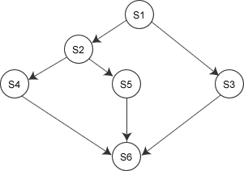

# 信号量：整型、记录型信号量以及利用信号量实现进程互斥和前驱关系

信号量机构是一种功能较强的机制，可用来解决互斥与同步的问题，它只能被两个标准的原语 wait(S)和 signal(S)来访问，也可以记为“P 操作”和“V 操作”。

原语是指完成某种功能且不被分割不被中断执行的操作序列，通常可由硬件来实现完成不被分割执行特性的功能。如前述的“Test-and-Set”和“Swap”指令，就是由硬件实现的原子操作。原语功能的不被中断执行特性在单处理机时可由软件通过屏蔽中断方法实现。

原语之所以不能被中断执行，是因为原语对变量的操作过程如果被打断，可能会去运行另一个对同一变量的操作过程，从而出现临界段问题。如果能够找到一种解决临界段问题的元方法，就可以实现对共享变量操作的原子性。

## 整型信号量

整型信号量被定义为一个用于表示资源数目的整型量 S，wait 和 signal 操作可描述为：

```
wait(S){
    while (S<=0);
    S=S-1;
}
signal(S){
    S=S+1;
}
```

wait 操作中，只要信号量 S<=0，就会不断地测试。因此，该机制并未遵循“让权等待” 的准则，而是使进程处于“忙等”的状态。

## 记录型信号量

记录型信号量是不存在“忙等”现象的进程同步机制。除了需要一个用于代表资源数目的整型变量 value 外，再增加一个进程链表 L，用于链接所有等待该资源的进程，记录型信号量是由于釆用了记录型的数据结构得名。记录型信号量可描述为：

```
typedef struct{
    int value;
    struct process *L;
} semaphore;
```

相应的 wait(S)和 signal(S)的操作如下：

```
void wait (semaphore S) { //相当于申请资源
    S.value--;
    if(S.value<0) {
        add this process to S.L;
        block(S.L);
    }
}
```

wait 操作，S.value--，表示进程请求一个该类资源，当 S.value<0 时，表示该类资源已分配完毕，因此进程应调用 block 原语，进行自我阻塞，放弃处理机，并插入到该类资源的等待队列 S.L 中，可见该机制遵循了“让权等待”的准则。

```
void signal (semaphore S) {  //相当于释放资源
    S.value++;
    if(S.value<=0){
        remove a process P from S.L;
        wakeup(P);
    }
}
```

signal 操作，表示进程释放一个资源，使系统中可供分配的该类资源数增 1，故 S.value++。若加 1 后仍是 S.value<=0，则表示在 S.L 中仍有等待该资源的进程被阻塞，故还应调用 wakeup 原语，将 S.L 中的第一个等待进程唤醒。

## 利用信号量实现同步

信号量机构能用于解决进程间各种同步问题。设 S 为实现进程 P1、P2 同步的公共信号量，初值为 0。进程 P2 中的语句 y 要使用进程 P1 中语句 x 的运行结果，所以只有当语句 x 执行完成之后语句 y 才可以执行。其实现进程同步的算法如下：

```
semaphore S = 0;  //初始化信号量
P1 ( ) {
    // …
    x;  //语句 x
    V(S);  //告诉进程 P2,语句乂已经完成
}
P2()）{
    // …
    P(S) ;  //检查语句 x 是否运行完成
    y;  // 检查无误，运行 y 语句
    // …
}
```

## 利用信号量实现进程互斥

信号量机构也能很方便地解决进程互斥问题。设 S 为实现进程 Pl、P2 互斥的信号量，由于每次只允许一个进程进入临界区，所以 S 的初值应为 1（即可用资源数为 1)。只需把临界区置于 P(S)和 V(S)之间，即可实现两进程对临界资源的互斥访问。其算法如下：

```
semaphore S = 1;  //初化信号量
P1 ( ) {
    // …
    P(S);  // 准备开始访问临界资源，加锁
    // 进程 P1 的临界区
    V(S);  // 访问结束，解锁
    // …
}
P2() {
    // …
    P(S); //准备开始访问临界资源，加锁
    // 进程 P2 的临界区；
    V(S);  // 访问结束，解锁
    // …
}
```

互斥的实现是不同进程对同一信号量进行 P、V 操作，一个进程在成功地对信号量执行了 P 操作后进入临界区，并在退出临界区后，由该进程本身对该信号量执行 V 操作,表示当前没有进程进入临界区，可以让其他进程进入。

## 利用信号量实现前驱关系

信号量也可以用来描述程序之间或者语句之间的前驱关系。图 2-8 给出了一个前驱图，其中 S1, S2, S3, …, S6 是最简单的程序段（只有一条语句）。为使各程序段能正确执行，应设置若干个初始值为“0”的信号量。例如，为保证 S1 -> S2、 S1 -> S3 的前驱关系，应分别设置信号量 a1、a2。同样，为了保证 S2 -> S4、S2 ->S5、S3 -> S6、S4 -> S6、S5 -> S6,应设置信号量 bl、b2、c、d、e。 

图 2-8 前驱图举例

实现算法如下：

```
semaphore  al=a2=bl=b2=c=d=e=0;  //初始化信号量
S1() {
    // …
    V(al);  V(a2) ;  //S1 已经运行完成
}
S2() {
    P(a1);  //检查 S1 是否运行完成
    // …
    V(bl); V(b2); // S2 已经运行完成
}
S3() {
    P(a2);  //检查 S1 是否已经运行完成
    // …
    V(c);  //S3 已经运行完成
}
S4() {
    P(b1);  //检查 S2 是否已经运行完成
    // …
    V(d);  //S4 已经运行完成
}
S5() {
    P(b2);  //检查 S2 是否已经运行完成
    // …
    V(e);  // S5 已经运行完成
}
S6() {
    P(c);  //检查 S3 是否已经运行完成
    P(d);  //检查 S4 是否已经运行完成
    P(e);  //检查 S5 是否已经运行完成
    // …;
}
```

## 分析进程同步和互斥问题的方法步骤

1) 关系分析。找出问题中的进程数，并且分析它们之间的同步和互斥关系。同步、互斥、前驱关系直接按照上面例子中的经典范式改写。

2) 整理思路。找出解决问题的关键点，并且根据做过的题目找出解决的思路。根据进程的操作流程确定 P 操作、V 操作的大致顺序。

3) 设置信号量。根据上面两步，设置需要的信号量，确定初值，完善整理。