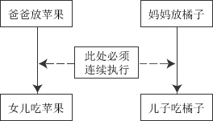

# 经典进程同步问题 1：生产者-消费者问题

## 问题描述

一组生产者进程和一组消费者进程共享一个初始为空、大小为 n 的缓冲区，只有缓冲区没满时，生产者才能把消息放入到缓冲区，否则必须等待；只有缓冲区不空时，消费者才能从中取出消息，否则必须等待。由于缓冲区是临界资源，它只允许一个生产者放入消息，或者一个消费者从中取出消息。

## 问题分析

1) 关系分析。生产者和消费者对缓冲区互斥访问是互斥关系，同时生产者和消费者又是一个相互协作的关系，只有生产者生产之后，消费者才能消费，他们也是同步关系。

2) 整理思路。这里比较简单，只有生产者和消费者两个进程，正好是这两个进程存在着互斥关系和同步关系。那么需要解决的是互斥和同步 PV 操作的位置。

3) 信号量设置。信号量 mutex 作为互斥信号量，它用于控制互斥访问缓冲池，互斥信号量初值为 1；信号量 full 用于记录当前缓冲池中“满”缓冲区数，初值为 0。信号量 empty 用于记录当前缓冲池中“空”缓冲区数，初值为 n。

生产者-消费者进程的描述如下：

```
semaphore mutex=1; //临界区互斥信号量
semaphore empty=n;  //空闲缓冲区
semaphore full=0;  //缓冲区初始化为空
producer () { //生产者进程
    while(1){
        produce an item in nextp;  //生产数据
        P(empty);  //获取空缓冲区单元
        P(mutex);  //进入临界区.
        add nextp to buffer;  //将数据放入缓冲区
        V(mutex);  //离开临界区,释放互斥信号量
        V(full);  //满缓冲区数加 1
    }
}
consumer () {  //消费者进程
    while(1){
        P(full);  //获取满缓冲区单元
        P(mutex);  // 进入临界区
        remove an item from buffer;  //从缓冲区中取出数据
        V (mutex);  //离开临界区，释放互斥信号量
        V (empty) ;  //空缓冲区数加 1
        consume the item;  //消费数据
    }
}
```

该类问题要注意对缓冲区大小为 n 的处理，当缓冲区中有空时便可对 empty 变量执行 P 操作，一旦取走一个产品便要执行 V 操作以释放空闲区。对 empty 和 full 变量的 P 操作必须放在对 mutex 的 P 操作之前。如果生产者进程先执行 P(mutex)，然后执行 P(empty)，消费者执行 P(mutex),然后执行 P(fall),这样可不可以？答案是否定的。设想生产者进程已经将缓冲区放满，消费者进程并没有取产品，即 empty = 0，当下次仍然是生产者进程运行时，它先执行 P(mutex)封锁信号量，再执行 P(empty)时将被阻塞，希望消费者取出产品后将其唤醒。轮到消费者进程运行时，它先执行 P(mutex)，然而由于生产者进程已经封锁 mutex 信号量，消费者进程也会被阻塞，这样一来生产者、消费者进程都将阻塞，都指望对方唤醒自己，陷入了无休止的等待。同理，如果消费者进程已经将缓冲区取空，即 full = 0,下次如果还是消费者先运行，也会出现类似的死锁。不过生产者释放信号量时，mutex、full 先释放哪一个无所谓，消费者先释放 mutex 还是 empty 都可以。

下面再看一个较为复杂的生产者-消费者问题:

## 问题描述

桌子上有一只盘子，每次只能向其中放入一个水果。爸爸专向盘子中放苹果，妈妈专向盘子中放橘子，儿子专等吃盘子中的橘子，女儿专等吃盘子中的苹果。只有盘子为空时，爸爸或妈妈就可向盘子中放一个水果；仅当盘子中有自己需要的水果时，儿子或女儿

可以从盘子中取出。

## 问题分析

1) 关系分析。这里的关系稍复杂一些，首先由每次只能向其中放入一只水果可知爸爸和妈妈是互斥关系。爸爸和女儿、妈妈和儿子是同步关系，而且这两对进程必须连起来，儿子和女儿之间没有互斥和同步关系，因为他们是选择条件执行，不可能并发，如图 2-8 所示。

2) 整理思路。这里有 4 个进程，实际上可以抽象为两个生产者和两个消费者被连接到大小为 1 的缓冲区上。



图 2-9  进程之间的关系

3) 信号量设置。首先设置信号量 plate 为互斥信号量，表示是否允许向盘子放入水果，初值为 1，表示允许放入，且只允许放入一个。信号量 apple 表示盘子中是否有苹果，初值为 0，表示盘子为空，不许取，若 apple=l 可以取。信号量 orange 表示盘子中是否有橘子，初值为 0，表示盘子为空，不许取，若 orange=l 可以取。解决该问题的代码如下：

```
semaphore plate=l, apple=0, orange=0;
dad() {  //父亲进程
    while (1) {
        prepare an apple;
        P(plate) ;  //互斥向盘中取、放水果
        put the apple on the plate;  //向盘中放苹果
        V(apple);  //允许取苹果
    }
}
mom() {  // 母亲进程
    while(1) {
        prepare an orange;
        P(plate);  //互斥向盘中取、放水果
        put the orange on the plate;  //向盘中放橘子
        V(orange); //允许取橘子
    }
}
son(){  //儿子进程
    while(1){
        P(orange) ;  //互斥向盘中取橘子
        take an orange from the plate;
        V(plate);  //允许向盘中取、放水果
        eat the orange;
    }
}
daughter () {  //女儿进程
    while(1) {
        P(apple);  // 互斥向盘中取苹果
        take an apple from the plate;
        V(plate);  //运行向盘中取、放水果
        eat the apple;
    }
}
```

进程间的关系如图 2-9 所示。dad()和 daughter()、mam()和 son()必须连续执行，正因为如此，也只能在女儿拿走苹果后，或儿子拿走橘子后才能释放盘子，即 V(plate)操作。