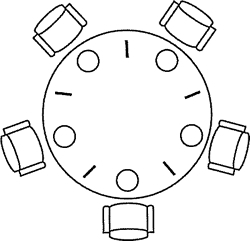

# 经典进程同步问题 3：哲学家进餐问题

## 问题描述

一张圆桌上坐着 5 名哲学家，每两个哲学家之间的桌上摆一根筷子，桌子的中间是一碗米饭，如图 2-10 所示。哲学家们倾注毕生精力用于思考和进餐，哲学家在思考时，并不影响他人。只有当哲学家饥饿的时候，才试图拿起左、 右两根筷子（一根一根地拿起）。如果筷子已在他人手上，则需等待。饥饿的哲学家只有同时拿到了两根筷子才可以开始进餐，当进餐完毕后，放下筷子继续思考。

## 问题分析

1) 关系分析。5 名哲学家与左右邻居对其中间筷子的访问是互斥关系。

2) 整理思路。显然这里有五个进程。本题的关键是如何让一个哲学家拿到左右两个筷子而不造成死锁或者饥饿现象。那么解决方法有两个，一个是让他们同时拿两个筷子；二是对每个哲学家的动作制定规则，避免饥饿或者死锁现象的发生。



图 2-10 5 名哲学家进餐

3) 信号量设置。定义互斥信号量数组 Ch0PstiCk[5] = {l, 1, 1, 1, 1}用于对 5 个筷子的互斥访问。

对哲学家按顺序从 0～4 编号，哲学家 i 左边的筷子的编号为 i，哲学家右边的筷子的编号为(i+l)%5。

```
semaphore chopstick[5] = {1,1,1,1,1}; //定义信号量数组 chopstick[5],并初始化
Pi(){  //i 号哲学家的进程
    do{
        P (chopstick[i] ) ; //取左边筷子
        P (chopstick[(i+1) %5] ) ；  //取右边篌子
        eat;  //进餐
        V(chopstick[i]) ; //放回左边筷子
        V(chopstick[(i+l)%5]);  //放回右边筷子
        think;  //思考
    } while (1);
}
```

该算法存在以下问题：当五个哲学家都想要进餐，分别拿起他们左边筷子的时候（都恰好执行完 wait(chopstick[i]);)筷子已经被拿光了，等到他们再想拿右边的筷子的时候（执行 wait(chopstick[(i+l)%5]);)就全被阻塞了，这就出现了死锁。

为了防止死锁的发生，可以对哲学家进程施加一些限制条件，比如至多允许四个哲学家同时进餐;仅当一个哲学家左右两边的筷子都可用时才允许他抓起筷子;对哲学家顺序编号，要求奇数号哲学家先抓左边的筷子，然后再转他右边的筷子，而偶数号哲学家刚好相反。正解制定规则如下：假设釆用第二种方法，当一个哲学家左右两边的筷子都可用时，才允许他抓起筷子。

```
semaphore chopstick[5] = {1,1,1,1,1}; //初始化信号量
semaphore mutex=l;  //设置取筷子的信号量
Pi(){ //i 号哲学家的进程
    do{
        P (mutex) ; //在取筷子前获得互斥量
        P (chopstick [i]) ; //取左边筷子
        P (chopstick[ (i+1) %5]) ;  //取右边筷子
        V (mutex) ; //释放取筷子的信号量
        eat;  //进餐
        V(chopstick[i] ) ;  //放回左边筷子
        V(chopstick[ (i+l)%5]) ;  //放回右边筷子
        think;  // 思考
    }while(1);
}
```

此外还可以釆用 AND 型信号量机制来解决哲学家进餐问题，有兴趣的读者可以查阅相关资料，自行思考。